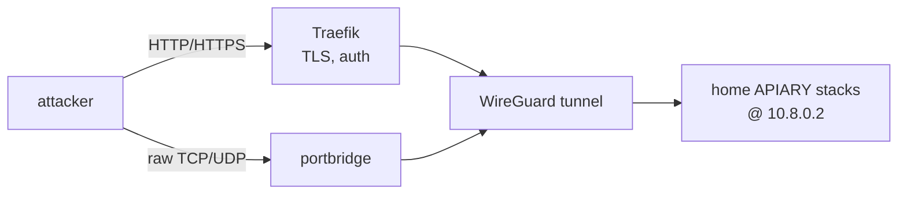

  <picture>
    <source media="(prefers-color-scheme: dark)" srcset="branding/assets/logo/apiary-lockup-for-dark.png">
    <source media="(prefers-color-scheme: light)" srcset="branding/assets/logo/apiary-lockup-for-light.png">
    
  </picture>

# A multi-service honeypot and automated malware-analysis stack

A full honeypot deployment that follows this repo's CGNAT pattern: the sensors
run at **home under Arcane**, publish only on the WireGuard interface, and are
exposed to the internet **through the VPS** — HTTP via Traefik, everything else
raw-tunnelled with a port bridge.

This is a public repository: copy the example environment files locally and
never commit real addresses, credentials, captures, payloads, or sandbox images.

**All core sensors run without compose profiles.** The only profile is the
optional on-demand `geoip-update` maintenance job. 33 deployment pieces —
33 independent Arcane-managed stacks at home plus the VPS (see
[docs/ARCANE-GIT-SYNC.md](docs/ARCANE-GIT-SYNC.md) for how a repo commit
reaches the live host, and [docs/ARCHITECTURE.md](docs/ARCHITECTURE.md) for
why the home side split into this many Compose stacks):

| Piece | Runs on | What |
|---|---|---|
| `honeypot-keycloak` ([arcane/home/honeypot-keycloak/compose.yml](arcane/home/honeypot-keycloak/compose.yml)) | **home** | Arcane-managed Keycloak/PostgreSQL identity stack; only Keycloak is reachable from VPS Traefik over WireGuard |
| `honeypot-init` ([arcane/home/honeypot-init/compose.yml](arcane/home/honeypot-init/compose.yml)) | **home** | one-shot bootstrap jobs: log paths, Elasticsearch templates, Arkime schema, persona validation |
| `honeypot-cowrie`, `honeypot-dionaea`, `honeypot-conpot`, `honeypot-dnp3`, `honeypot-http`, `honeypot-multipot` (`arcane/home/honeypot-<name>/compose.yml`, one directory each) | **home** | the sensors: Cowrie, Dionaea (+ TFTP relay), Conpot personas, DNP3, HTTP/API honeypots, multipot |
| `honeypot-dicompot`, `honeypot-dns-honeypot`, `honeypot-citrix`, `honeypot-cisco-asa`, `honeypot-rdp`, `honeypot-endlessh`, `honeypot-beelzebub`, `honeypot-hellpot`, `honeypot-elasticpot`, `honeypot-galah`, `honeypot-sentrypeer`, `honeypot-wordpot`, `honeypot-mailoney` (`arcane/home/honeypot-<name>/compose.yml`, one directory each) | **home** | more sensors: DICOM medical-imaging decoy, DNS UDP reflection bait (response-capped, never a real amplification vector), Citrix ADC/NetScaler Gateway decoy (CVE-2019-19781), Cisco ASA WebVPN+IKE decoy (CVE-2018-0101), RDP decoy, SSH pre-auth tarpit, vendored multi-protocol deception runtime (SSH/LDAP/MCP/HTTP, #1418), vendored HTTP bot tarpit (#1419), vendored Elasticsearch decoy distinct from multipot's own (#1423), vendored LLM-powered HTTP honeypot behind its own broker-guarded bridge onto the shared Ollama instance (#1420), vendored SIP/VoIP fraud-detection honeypot (#1424), vendored WordPress/CMS decoy (#1421), vendored SMTP honeypot taking over port 25 from multipot's own retired handler (#1422) |
| `honeypot-canarytokens` ([arcane/home/honeypot-canarytokens/compose.yml](arcane/home/honeypot-canarytokens/compose.yml)) | **home** | self-hosted honeytoken platform (#1426) -- planted-artifact deception, not a listening protocol decoy; `canarytokens-adapter` translates its webhook alerts into this repo's shared JSON event shape. The dashboard's Settings > Canarytokens pane (#1487) creates PDF/Word/Excel/custom-image/Windows-Folder/QR tokens on demand for use *outside* this honeypot; see [docs/dashboard-canarytoken-creation-design.md](docs/dashboard-canarytoken-creation-design.md) |
| `honeypot-tanner` ([arcane/home/honeypot-tanner/compose.yml](arcane/home/honeypot-tanner/compose.yml)) | **home** | SNARE + TANNER application-emulation boundary |
| `honeypot-elk` ([arcane/home/honeypot-elk/compose.yml](arcane/home/honeypot-elk/compose.yml)) | **home** | Filebeat, Elasticsearch, Kibana, EveBox, Arkime |
| `honeypot-ip-enrichment-worker` ([arcane/home/honeypot-ip-enrichment-worker/compose.yml](arcane/home/honeypot-ip-enrichment-worker/compose.yml)) | **home** | networkless worker that moves the portbridge `via_port` → real attacker IP join from dashboard read-time to ingest-time, writing `logs/enriched/*.json` for Filebeat |
| `honeypot-agent-intrusion-worker` ([arcane/home/honeypot-agent-intrusion-worker/compose.yml](arcane/home/honeypot-agent-intrusion-worker/compose.yml)) | **home** | correlates sensor/Suricata events into campaigns, scores them against deterministic criticality rules, writes the `agent-intrusion-campaigns` index the dashboard's `/agent-campaigns` route reads |
| `honeypot-attacker-identity-worker`, `honeypot-correlator-worker`, `honeypot-payload-inventory-worker` (`arcane/home/honeypot-<name>/compose.yml`, one directory each) | **home** | three more workers that had their own top-level compose file but had drifted out of the deploy/installer inventory before #1502's audit caught it (same class of gap #560 and #891 each fixed once before) -- attacker-identity correlation, cross-sensor campaign correlation, and payload inventory tracking |
| `honeypot-dashboard` ([arcane/home/honeypot-dashboard/compose.yml](arcane/home/honeypot-dashboard/compose.yml)) | **home** | the live investigation dashboard (Go), plus its in-progress TanStack Start/Rust replacement (`dashboard-next`/`backend-worker`/`backend-service-mounted`, #1608) -- feature-complete but still `next`-profile-gated, not yet live; see [#1628](https://github.com/Xore/APIARY/issues/1628) and [docs/DASHBOARD-CUTOVER.md](docs/DASHBOARD-CUTOVER.md) |
| `honeypot-dashboard-backend` ([arcane/home/honeypot-dashboard-backend/compose.yml](arcane/home/honeypot-dashboard-backend/compose.yml)) | **home** | `backend-service`, the modernization port's single-instance request/response tier, split out from `honeypot-dashboard` by #1622 -- same `next`-profile/not-yet-live status |
| `honeypot-payload-analysis` ([arcane/home/honeypot-payload-analysis/compose.yml](arcane/home/honeypot-payload-analysis/compose.yml)) | **home** | payload dedup + YARA scanning |
| `honeypot-utilities` ([arcane/home/honeypot-utilities/compose.yml](arcane/home/honeypot-utilities/compose.yml)) | **home** | autoheal, log rotation, disk-space monitoring, reporting |
| [`vps/`](vps/) | **VPS** | Traefik, portbridge raw tunnels, Suricata, WireGuard HTTP bridges, and isolated Keycloak OIDC gateways |

Every stack above is a directory-aware Arcane Git sync driven by
[`arcane/manifests/home-production.json`](arcane/manifests/home-production.json)
-- see [docs/ARCANE-GIT-SYNC.md](docs/ARCANE-GIT-SYNC.md) for the sync
model, cutover procedure, and confirmed platform limitations.
`honeypot-arcane` itself (the manager these syncs run inside) stays
installer/`deploy.yml`-managed rather than becoming a self-referential sync
-- syncing the thing that has to already be running before any sync can
happen would be a bootstrap loop.

Six more home-hosted stacks are Arcane-managed the same way but keep their
existing repository-root path instead of moving under `arcane/home/`, since
they were already self-contained and are cross-referenced by CI/the
installer at those paths:
[`auth-events-worker/`](auth-events-worker/),
[`llm-worker/`](llm-worker/), [`ml-worker/`](ml-worker/),
[`analysis/ghidra/`](analysis/ghidra/), [`sandbox/ghosts/`](sandbox/ghosts/),
[`pihole/`](pihole/).

The root [`docker-compose.yml`](docker-compose.yml) is an empty marker kept
only so `docker compose config` has something to validate against in this
directory — it is not itself an Arcane-managed stack and isn't counted
above. [`docker-compose.sandbox.yml`](docker-compose.sandbox.yml) is a
per-detonation Windows gateway/capture Compose file the sandbox brings up
and tears down around a single run; it's likewise not a standing stack.
ML, LLM, the Windows sandbox, and CAPE run their own independently managed
services outside this count — see [docs/ARCHITECTURE.md](docs/ARCHITECTURE.md)
for where those fit.

## Read next

| Guide | Covers |
|---|---|
| [branding/](branding/) / [live specimen](https://xore.github.io/APIARY/) | Canonical logos, favicons, social assets, web theme starter, design tokens, and printable brand guide |
| [docs/CGNAT-DEPLOYMENT.md](docs/CGNAT-DEPLOYMENT.md) | **Start here to deploy.** Home + VPS setup, Arcane, firewall, DNS, boot-safe networking |
| [docs/ARCANE-GIT-SYNC.md](docs/ARCANE-GIT-SYNC.md) | How a repo commit reaches a live home stack: the directory-aware Git sync model, cutover procedure, and confirmed Arcane v2.8.0 platform limitations |
| [docs/KEYCLOAK-OPERATIONS.md](docs/KEYCLOAK-OPERATIONS.md) | Complete Keycloak/Arcane deployment, secret provisioning, administrator/MFA bootstrap, VPS gateways, validation, backup, rebuild, and troubleshooting runbook |
| [docs/HOMESERVER-DISK-LAYOUT.md](docs/HOMESERVER-DISK-LAYOUT.md) | Physical disk layout of the homeserver and an Ubuntu autoinstall template to reproduce it |
| [docs/BACKUP-ESSENTIALS.md](docs/BACKUP-ESSENTIALS.md) | What is backed up so the stack can be rebuilt, where the three copies go, and the full restore procedure |
| [scripts/install-homeserver.sh](scripts/install-homeserver.sh) | Unattended provisioning script (Docker, GPU/NVIDIA, WireGuard, Arcane, the stacks themselves) for a manually-installed base Ubuntu system — fill in [scripts/install-homeserver.conf.example](scripts/install-homeserver.conf.example) first, same idea as a Windows `autounattend.xml` answer file. First cut, see [#518](https://github.com/Xore/APIARY/issues/518) |
| [docs/ARCHITECTURE.md](docs/ARCHITECTURE.md) | System architecture and data flow — trust boundaries, container map, event ingestion, correlation/enrichment (p0f, HASSH/JA3/JA4, GeoIP), payload lifecycle, sandbox detonation, evidence types (6 diagrams) |
| [docs/SENSORS.md](docs/SENSORS.md) | The sensor table, resource budgets, investigation UIs, SNARE+TANNER, Suricata, Arkime, and how real attacker IPs survive the tunnel |
| [docs/OPERATIONS.md](docs/OPERATIONS.md) | Persona inventory, the seeded cowrie filesystem, GeoIP, and how to actually read the data (dashboard, Kibana, Arkime, backups) |
| [docs/ip-reporting-plan.md](docs/ip-reporting-plan.md) | Defensive IP-blocklist reporting (AbuseIPDB/Blocklist.de), dry-run by default |
| [docs/community-threat-intel-sharing.md](docs/community-threat-intel-sharing.md) | Decision: community threat-intel sharing (T-Pot's `ewsposter`/`hpfeeds`) declined, and why |
| [docs/persona-design.md](docs/persona-design.md) | Outbound network policy per honeypot, and host-naming/banner/placement guidance |
| [docs/analysis/ghidra/README.md](docs/analysis/ghidra/README.md) | Static analysis pipeline: headless Ghidra, local AI triage, fuzzy hashing/structural parsing |
| [docs/payload-analysis-workbench.md](docs/payload-analysis-workbench.md) | Unified payload workbench: typed analyzer registry, immutable recipes, fan-out, status, security, deployment and rollback |
| [docs/sandbox/README.md](docs/sandbox/README.md) | The Linux KVM/libvirt detonation sandbox |
| [docs/CI-CD.md](docs/CI-CD.md) | Repository automation, deployment environments, runner setup |
| [docs/CONTAINER-UPDATES.md](docs/CONTAINER-UPDATES.md) | How to check pinned images for updates, assess compatibility, verify empirically, and pin by digest |
| [docs/TESTING.md](docs/TESTING.md) | The three testing tiers -- CI, live feature smoke tests, and the full clean-reinstall release gate -- and how to repeat each one |
| [docs/STACK-REBUILD.md](docs/STACK-REBUILD.md) | Runbook for a full deliberate reset — stop order, what's preserved vs wiped, and the ordering/permission pitfalls to avoid |
| [deploy-profiles/](deploy-profiles/) | Named deployment shapes (full / ICS-only / web-only) — which of the 20 split home stacks run for a given deployment, plus a validator catching cross-stack drift before deploy |
| [docs/RECOVERY.md](docs/RECOVERY.md) | `factory-reset.sh` — one entry point for "back up, optionally wipe/reset, restart" on the same host |
| [docs/ROADMAP.md](docs/ROADMAP.md) / [docs/WORK-LEDGER.md](docs/WORK-LEDGER.md) | What order work happens in, and how issues are claimed/reviewed |
| [docs/ml-worker-plan.md](docs/ml-worker-plan.md), [docs/gpu-llm-analysis-worker.md](docs/gpu-llm-analysis-worker.md), [docs/gpu-ml-worker-acceleration.md](docs/gpu-ml-worker-acceleration.md) | The homeserver's NVIDIA GPU running local LLM log/payload analysis and CUDA-accelerated anomaly detection — no data leaves the machine |

## Screenshots

The live production dashboard, real captured attack telemetry, not fixture
data. Full gallery (desktop/UHQ/4K and iPhone) in
[docs/screenshots/README.md](docs/screenshots/README.md).

Work is tracked in [GitHub issues](https://github.com/Xore/APIARY/issues).

## Containment & safety — read this

The honeypot now runs **on your home network**. Higher-interaction sensors
(Dionaea captures live malware; SNARE/TANNER evaluate payloads) are genuinely
hostile-adjacent. Protect your LAN:

- Keep `HP_BIND=10.8.0.2` — sensors bind the WireGuard interface only, never the
  home LAN.
- The `honeynet` / `tanner_local` bridges have no route to your other stacks;
  **do not** attach them to anything real. Never mount the Docker socket.
- Ideally run this on a **dedicated host or VLAN** that can only reach the VPS
  over WireGuard, not the rest of your LAN. Firewall the honeypot host off from
  internal subnets.
- All third-party images (Dionaea, Conpot, SNARE/TANNER, ELK) need a live
  `docker compose pull`/`build` to confirm tags — verify against upstream before
  trusting them.
- Attacker IPs are personal data (GDPR) — keep logs access-controlled and
  short-lived.

> Prefer to keep attackers off your LAN entirely? Run this whole stack **on the
> VPS** instead: set `HP_BIND=0.0.0.0`, skip the `vps/` tunnel stack, and expose
> the ports directly. You lose nothing but the tunnel.
