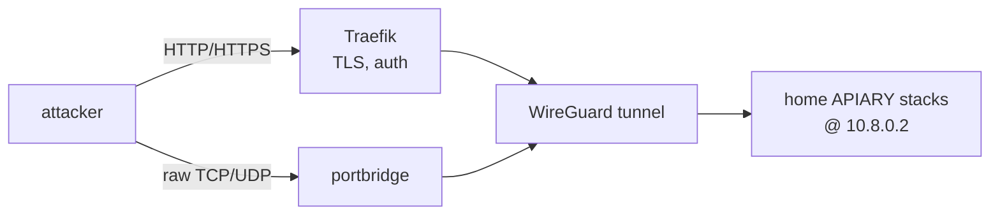
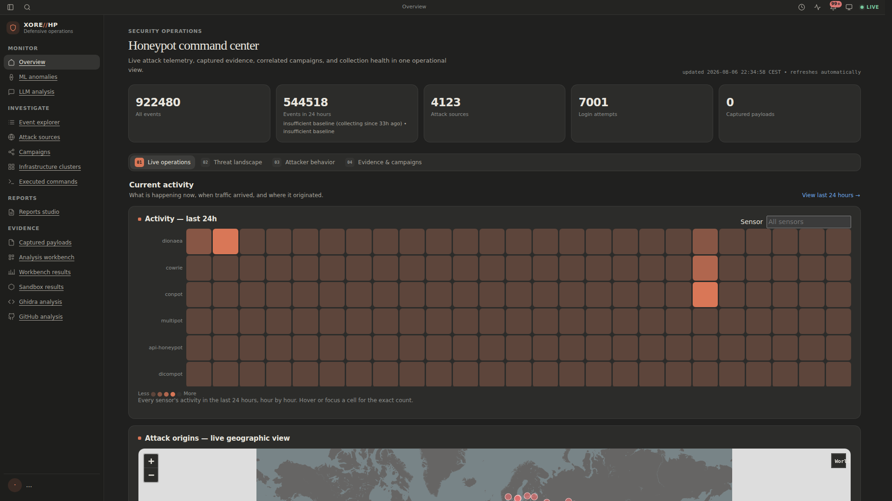

  <picture>
    <source media="(prefers-color-scheme: dark)" srcset="branding/assets/logo/apiary-lockup-for-dark.png">
    <source media="(prefers-color-scheme: light)" srcset="branding/assets/logo/apiary-lockup-for-light.png">
    
  </picture>

# A multi-service honeypot and automated malware-analysis stack

A full honeypot deployment that follows this repo's CGNAT pattern: the sensors
run at **home under Arcane**, publish only on the WireGuard interface, and are
exposed to the internet **through the VPS** — HTTP via Traefik, everything else
raw-tunnelled with a port bridge.

This is a public repository: copy the example environment files locally and
never commit real addresses, credentials, captures, payloads, or sandbox images.

**All core sensors run without compose profiles.** The only profile is the
optional on-demand `geoip-update` maintenance job. 24 deployment pieces —
23 independent Arcane-managed stacks at home plus the VPS (see
[docs/ARCHITECTURE.md](docs/ARCHITECTURE.md) for why the home side split into
21 separate Compose stacks):

| Piece | Runs on | What |
|---|---|---|
| `honeypot-keycloak` ([docker-compose.keycloak.yml](docker-compose.keycloak.yml)) | **home** | Arcane-managed Keycloak/PostgreSQL identity stack; only Keycloak is reachable from VPS Traefik over WireGuard |
| `honeypot-init` ([docker-compose.init.yml](docker-compose.init.yml)) | **home** | one-shot bootstrap jobs: log paths, Elasticsearch templates, Arkime schema, persona validation |
| `honeypot-cowrie`, `honeypot-dionaea`, `honeypot-conpot`, `honeypot-dnp3`, `honeypot-http`, `honeypot-multipot` (this repository, one compose file each) | **home** | the sensors: Cowrie, Dionaea (+ TFTP relay), Conpot personas, DNP3, HTTP/API honeypots, multipot |
| `honeypot-dicompot`, `honeypot-dns-honeypot`, `honeypot-citrix`, `honeypot-cisco-asa`, `honeypot-rdp`, `honeypot-endlessh`, `honeypot-beelzebub`, `honeypot-hellpot` (this repository, one compose file each) | **home** | more sensors: DICOM medical-imaging decoy, DNS UDP reflection bait (response-capped, never a real amplification vector), Citrix ADC/NetScaler Gateway decoy (CVE-2019-19781), Cisco ASA WebVPN+IKE decoy (CVE-2018-0101), RDP decoy, SSH pre-auth tarpit, vendored multi-protocol deception runtime (SSH/LDAP/MCP/HTTP, #1418), vendored HTTP bot tarpit (#1419) |
| `honeypot-tanner` ([docker-compose.tanner.yml](docker-compose.tanner.yml)) | **home** | SNARE + TANNER application-emulation boundary |
| `honeypot-elk` ([docker-compose.elk.yml](docker-compose.elk.yml)) | **home** | Filebeat, Elasticsearch, Kibana, EveBox, Arkime |
| `honeypot-ip-enrichment-worker` ([docker-compose.ip-enrichment-worker.yml](docker-compose.ip-enrichment-worker.yml)) | **home** | networkless worker that moves the portbridge `via_port` → real attacker IP join from dashboard read-time to ingest-time, writing `logs/enriched/*.json` for Filebeat |
| `honeypot-agent-intrusion-worker` ([docker-compose.agent-intrusion-worker.yml](docker-compose.agent-intrusion-worker.yml)) | **home** | correlates sensor/Suricata events into campaigns, scores them against deterministic criticality rules, writes the `agent-intrusion-campaigns` index the dashboard's `/agent-campaigns` route reads |
| `honeypot-dashboard` ([docker-compose.dashboard.yml](docker-compose.dashboard.yml)) | **home** | the live investigation dashboard |
| `honeypot-payload-analysis` ([docker-compose.payload-analysis.yml](docker-compose.payload-analysis.yml)) | **home** | payload dedup + YARA scanning |
| `honeypot-utilities` ([docker-compose.utilities.yml](docker-compose.utilities.yml)) | **home** | autoheal, log rotation, disk-space monitoring, reporting |
| [`vps/`](vps/) | **VPS** | Traefik, portbridge raw tunnels, Suricata, WireGuard HTTP bridges, and isolated Keycloak OIDC gateways |

The root [`docker-compose.yml`](docker-compose.yml) is an empty marker kept
only so `docker compose config` has something to validate against in this
directory — it is not itself an Arcane-managed stack and isn't counted above.
[`docker-compose.sandbox.yml`](docker-compose.sandbox.yml) is a
per-detonation Windows gateway/capture Compose file the sandbox brings up
and tears down around a single run; it's likewise not a standing stack.
Ghidra, ML, LLM, the Windows sandbox, GHOSTS, and CAPE run their own
independently managed services outside this count — see
[docs/ARCHITECTURE.md](docs/ARCHITECTURE.md) for where those fit.

## Read next

| Guide | Covers |
|---|---|
| [branding/](branding/) / [live specimen](https://xore.github.io/APIARY/) | Canonical logos, favicons, social assets, web theme starter, design tokens, and printable brand guide |
| [docs/CGNAT-DEPLOYMENT.md](docs/CGNAT-DEPLOYMENT.md) | **Start here to deploy.** Home + VPS setup, Arcane, firewall, DNS, boot-safe networking |
| [docs/KEYCLOAK-OPERATIONS.md](docs/KEYCLOAK-OPERATIONS.md) | Complete Keycloak/Arcane deployment, secret provisioning, administrator/MFA bootstrap, VPS gateways, validation, backup, rebuild, and troubleshooting runbook |
| [docs/HOMESERVER-DISK-LAYOUT.md](docs/HOMESERVER-DISK-LAYOUT.md) | Physical disk layout of the homeserver and an Ubuntu autoinstall template to reproduce it |
| [scripts/install-homeserver.sh](scripts/install-homeserver.sh) | Unattended provisioning script (Docker, GPU/NVIDIA, WireGuard, Arcane, the stacks themselves) for a manually-installed base Ubuntu system — fill in [scripts/install-homeserver.conf.example](scripts/install-homeserver.conf.example) first, same idea as a Windows `autounattend.xml` answer file. First cut, see [#518](https://github.com/Xore/APIARY/issues/518) |
| [docs/ARCHITECTURE.md](docs/ARCHITECTURE.md) | System architecture and data flow — trust boundaries, container map, event ingestion, correlation/enrichment (p0f, HASSH/JA3/JA4, GeoIP), payload lifecycle, sandbox detonation, evidence types (6 diagrams) |
| [docs/SENSORS.md](docs/SENSORS.md) | The sensor table, resource budgets, investigation UIs, SNARE+TANNER, Suricata, Arkime, and how real attacker IPs survive the tunnel |
| [docs/OPERATIONS.md](docs/OPERATIONS.md) | Persona inventory, the seeded cowrie filesystem, GeoIP, and how to actually read the data (dashboard, Kibana, Arkime, backups) |
| [docs/ip-reporting-plan.md](docs/ip-reporting-plan.md) | Defensive IP-blocklist reporting (AbuseIPDB/Blocklist.de), dry-run by default |
| [docs/community-threat-intel-sharing.md](docs/community-threat-intel-sharing.md) | Decision: community threat-intel sharing (T-Pot's `ewsposter`/`hpfeeds`) declined, and why |
| [docs/persona-design.md](docs/persona-design.md) | Outbound network policy per honeypot, and host-naming/banner/placement guidance |
| [docs/analysis/ghidra/README.md](docs/analysis/ghidra/README.md) | Static analysis pipeline: headless Ghidra, local AI triage, fuzzy hashing/structural parsing |
| [docs/payload-analysis-workbench.md](docs/payload-analysis-workbench.md) | Unified payload workbench: typed analyzer registry, immutable recipes, fan-out, status, security, deployment and rollback |
| [docs/sandbox/README.md](docs/sandbox/README.md) | The Linux KVM/libvirt detonation sandbox |
| [docs/CI-CD.md](docs/CI-CD.md) | Repository automation, deployment environments, runner setup |
| [docs/CONTAINER-UPDATES.md](docs/CONTAINER-UPDATES.md) | How to check pinned images for updates, assess compatibility, verify empirically, and pin by digest |
| [docs/TESTING.md](docs/TESTING.md) | The three testing tiers -- CI, live feature smoke tests, and the full clean-reinstall release gate -- and how to repeat each one |
| [docs/STACK-REBUILD.md](docs/STACK-REBUILD.md) | Runbook for a full deliberate reset — stop order, what's preserved vs wiped, and the ordering/permission pitfalls to avoid |
| [deploy-profiles/](deploy-profiles/) | Named deployment shapes (full / ICS-only / web-only) — which of the 20 split home stacks run for a given deployment, plus a validator catching cross-stack drift before deploy |
| [docs/RECOVERY.md](docs/RECOVERY.md) | `factory-reset.sh` — one entry point for "back up, optionally wipe/reset, restart" on the same host |
| [docs/ROADMAP.md](docs/ROADMAP.md) / [docs/WORK-LEDGER.md](docs/WORK-LEDGER.md) | What order work happens in, and how issues are claimed/reviewed |
| [docs/ml-worker-plan.md](docs/ml-worker-plan.md), [docs/gpu-llm-analysis-worker.md](docs/gpu-llm-analysis-worker.md), [docs/gpu-ml-worker-acceleration.md](docs/gpu-ml-worker-acceleration.md) | The homeserver's NVIDIA GPU running local LLM log/payload analysis and CUDA-accelerated anomaly detection — no data leaves the machine |

## Screenshots

The live production dashboard, real captured attack telemetry, not fixture
data. Full gallery (desktop/UHQ/4K and iPhone) in
[docs/screenshots/README.md](docs/screenshots/README.md).

Work is tracked in [GitHub issues](https://github.com/Xore/APIARY/issues).

## Containment & safety — read this

The honeypot now runs **on your home network**. Higher-interaction sensors
(Dionaea captures live malware; SNARE/TANNER evaluate payloads) are genuinely
hostile-adjacent. Protect your LAN:

- Keep `HP_BIND=10.8.0.2` — sensors bind the WireGuard interface only, never the
  home LAN.
- The `honeynet` / `tanner_local` bridges have no route to your other stacks;
  **do not** attach them to anything real. Never mount the Docker socket.
- Ideally run this on a **dedicated host or VLAN** that can only reach the VPS
  over WireGuard, not the rest of your LAN. Firewall the honeypot host off from
  internal subnets.
- All third-party images (Dionaea, Conpot, SNARE/TANNER, ELK) need a live
  `docker compose pull`/`build` to confirm tags — verify against upstream before
  trusting them.
- Attacker IPs are personal data (GDPR) — keep logs access-controlled and
  short-lived.

> Prefer to keep attackers off your LAN entirely? Run this whole stack **on the
> VPS** instead: set `HP_BIND=0.0.0.0`, skip the `vps/` tunnel stack, and expose
> the ports directly. You lose nothing but the tunnel.
