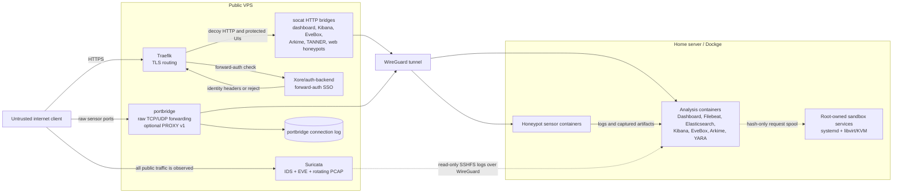
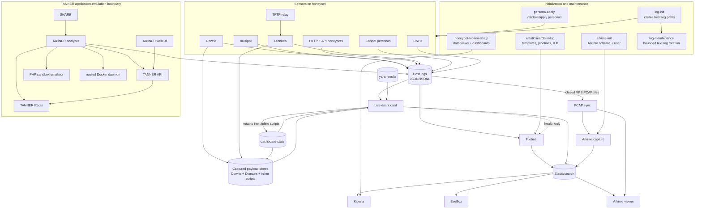
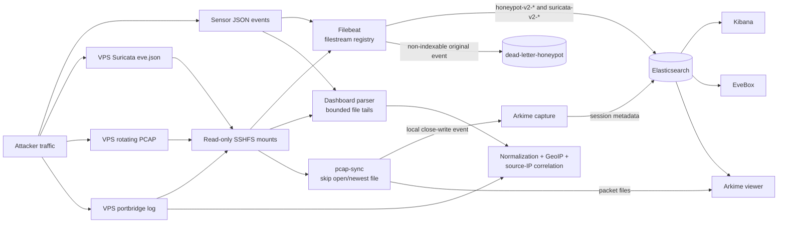
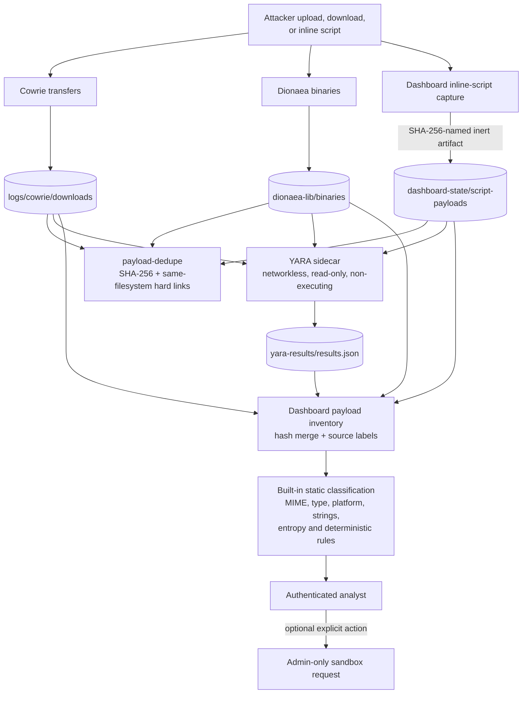
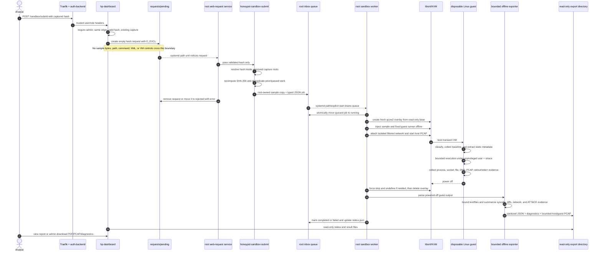

# honeypot-stack — big multi-service honeypot (Dockge, home → VPS)

A full honeypot deployment that follows this repo's CGNAT pattern: the sensors
run at **home under Dockge**, publish only on the WireGuard interface, and are
exposed to the internet **through the VPS** — HTTP via Traefik, everything else
raw-tunnelled with a port bridge.

Start with the self-contained [CGNAT deployment guide](docs/CGNAT-DEPLOYMENT.md).
Repository automation, deployment environments, and runner setup are documented
in the [CI/CD guide](docs/CI-CD.md).
Work is tracked in [GitHub issues](https://github.com/Xore/honeypot-stack/issues).
The [roadmap](docs/ROADMAP.md) says what order it happens in, and the
[working agreement](docs/WORK-LEDGER.md) says how issues are claimed and
reviewed.
Analysis and GPU guides: [ML worker plan](docs/ml-worker-plan.md),
[GPU LLM analysis worker](docs/gpu-llm-analysis-worker.md), and
[GPU acceleration for the ML worker](docs/gpu-ml-worker-acceleration.md)
(the homeserver's NVIDIA GPU runs local LLM log/payload analysis and
CUDA-accelerated anomaly detection — no data leaves the machine).
This is a public repository: copy the example environment files locally and
never commit real addresses, credentials, captures, payloads, or sandbox images.

```
attacker ─▶ VPS public port
              ├─ HTTP/HTTPS ─▶ Traefik (TLS, auth) ─┐
              └─ raw TCP/UDP ─▶ portbridge ──────────┤ WireGuard tunnel
                                                      ▼
                                        home honeypot-stack @ 10.8.0.2
```

**All core sensors run without compose profiles.** The only profile is the
optional on-demand `geoip-update` maintenance job. Two deployment pieces:

| Piece | Runs on | What |
|---|---|---|
| this repository ([home stack](.)) | **home** | every home sensor (Cowrie, multipot, Dionaea, Conpot, HTTP/API, SNARE/TANNER), dashboard, ELK, EveBox, and Arkime |
| [`vps/`](vps/) | **VPS** | Traefik, portbridge raw tunnels, Suricata, and HTTP bridges (SSO via [Xore/auth-backend](https://github.com/Xore/auth-backend)) |

## System architecture and data flow

This section describes the active implementation in the root and VPS Compose
files. Plans under `docs/`, `analysis/ghidra/`, and `sandbox/windows/` may
describe future components that are not part of the running Compose topology.
In particular, the active sandbox path is the root-owned host worker and
disposable Linux KVM guest described below; TANNER containers are web-request
emulators, not malware detonation sandboxes.

### Deployment and trust boundaries



The VPS is the only internet-facing layer. Suricata sees traffic before it
enters WireGuard, so IDS records and PCAPs retain the original network view.
Traefik handles HTTPS routes and delegates authentication for investigation
UIs to the separately deployed `Xore/auth-backend`. Raw protocols pass through
`portbridge`; targets that understand HAProxy PROXY v1 receive the original
client address in-band, while the connection log lets the dashboard recover
source attribution for PROXY-unaware sensors.

Home container ports bind to `HP_BIND` (normally the home WireGuard address),
not to every host interface. The root Compose network `honeynet` is for
container-to-container communication. TANNER additionally uses
`tanner_local`, which contains its Redis, API, PHP emulator, and disposable
nested Docker daemon. That daemon is deliberately not the homeserver Docker
socket.

### Home container interaction map



Most sensors write append-only JSON logs under the host `logs/` tree. The
dashboard reads bounded tails of those files for low-latency live operations,
while Filebeat maintains durable offsets and ships the same evidence to
Elasticsearch for historical search. These are complementary paths: the live
dashboard can remain useful during an Elasticsearch interruption, and the
Elasticsearch archive outlives the dashboard's bounded in-memory window.

One-shot setup containers establish mappings and saved objects before the
dependent shippers or UIs start. They do not remain running. `log-init` also
prepares host paths before sensors start, and `log-maintenance` rotates only
the human-readable logs that are safe to copy-truncate; structured streams
tailed by Filebeat are preserved.

### Event ingestion and network analysis



The analysis layers serve different purposes:

| Layer | Input | Output | Primary use |
|---|---|---|---|
| Dashboard live parser | recent sensor/EVE/portbridge file tails | normalized in-memory snapshot, alerts, campaigns, exports | immediate operations and cross-sensor pivots |
| Filebeat | durable JSON filestreams | versioned Elasticsearch indices/data streams | complete historical indexing with restart-safe offsets |
| Elasticsearch setup | templates and pipelines | flattened heterogeneous sensor fields, GeoIP, ILM, dead-letter fallback | mapping safety and retention |
| Kibana | Elasticsearch | saved searches, visualizations, archive investigations | long-range analysis |
| Suricata | public-interface packets | signatures, protocol events, flows, rotating PCAP | IDS and network evidence |
| EveBox | the `suricata-v2-*` indices | alert-focused UI over Elasticsearch | fast Suricata triage |
| Arkime | closed PCAP files | indexed sessions plus retained packet files | full-packet search and payload inspection |
| Dashboard correlation | normalized events and portbridge metadata | attacker profiles, sessions, clusters, campaigns, ATT&CK context | evidence-led behavioral investigation |

`pcap-sync` exists because remote SSHFS writes do not produce usable local
inotify events: it skips the newest file because Suricata may still be writing
it, then copies closed files locally so Arkime receives the `IN_CLOSE_WRITE`
event it expects.

EveBox needs no such sidecar. It queries the `suricata-v2-*` indices Filebeat
already writes, so it holds no copy of the event data and nothing to outgrow.

### Captured payload lifecycle and static analysis



Captured samples are content, never configuration. Cowrie stores uploaded and
downloaded files, Dionaea stores malware captures, and the dashboard turns
recognized inline scripts into inert SHA-256-named artifacts. The dashboard
walks all configured stores, accepts only hash-shaped regular filenames, and
merges identical hashes into one inventory row while retaining every source
label.

`payload-dedupe` hashes payloads and replaces duplicate files on the same
filesystem with hard links. It preserves all existing paths and does not merge
across devices. The YARA container has read-only payload mounts, no network,
and no execution path; it writes a bounded JSON result file that the dashboard
joins by hash. Static dashboard analysis adds file classification, platform and
execution-policy hints, strings/IOC observations, deterministic rules, and
YARA matches. These are triage signals, not proof of behavior or attribution.

### Sandbox submission, detonation, and result return



The submission endpoint accepts only `POST`, requires the configured admin
role, verifies a same-origin browser request, validates the hash, and confirms
that the captured payload exists. It creates an empty request file with
exclusive-create semantics, making double submission idempotent at the
dashboard boundary.

The host's root-owned handoff service accepts only filenames matching the hash
contract. `honeypot-sandbox-submit` searches fixed Cowrie, Dionaea, and inline
script roots, recomputes SHA-256, copies the selected sample into a root-only
staging area, and creates a typed queue record. Neither attacker input nor the
dashboard can supply an arbitrary host path, command line, libvirt definition,
or result location.

For each job, the worker creates a fresh qcow2 overlay backed by the prepared
Ubuntu base, injects a fixed runner and sample while the guest is offline, and
boots a transient VM on the `honeypot-sandbox` libvirt network. A strict
libvirt network filter is applied. The normal mode is isolated; the optional
controlled-egress mode uses the separately installed DNS and allowlist proxy
described in [`sandbox/README.md`](sandbox/README.md). Host `tcpdump` captures
traffic for the job without granting packet-capture privileges to the guest.

Inside the guest, the runner records before/after processes, sockets, and
filesystem state; classifies the payload; extracts static metadata and PE
forensics where relevant; and runs supported Linux/script payloads for a
bounded time as an unprivileged user under `no-new-privs` and `strace`. The
configured Windows compatibility policy is either static-only or bounded Wine
execution inside this Linux guest. It is not the future native Windows 11
sandbox design.

After shutdown—or a forced deadline—the host destroys the transient domain and
overlay before exporting results. The offline exporter treats every guest file
as untrusted, applies size/line/count limits, summarizes host and guest PCAP,
DNS queries, network syscalls, process/socket/file differences, PE imports,
ATT&CK evidence, run status, timeout reason, and a heuristic risk score. It
publishes only bounded artifacts to the dashboard's read-only export mount.
Raw result trees, oversized captures, samples, libvirt, systemd, and the
worker's queue remain unavailable to the dashboard container.

### Analysis result interpretation

The stack deliberately keeps observation types separate:

- **Static evidence** says what bytes, structure, strings, imports, or YARA
  signatures are present. It does not prove execution.
- **Dynamic evidence** says what the bounded guest run observed: syscalls,
  created/changed files, process/socket differences, DNS, and packets.
- **Network IDS evidence** says what Suricata matched on public traffic.
- **Full-packet evidence** preserves the traffic Arkime can reconstruct.
- **Correlation evidence** links shared infrastructure, credentials, payload
  hashes, sessions, fingerprints, and timing without claiming actor identity.
- **Failure/timeout evidence** is not a clean verdict. `guest-no-result`,
  `host-timeout`, unsupported/static-only execution, and incomplete PCAP must
  remain visibly distinct from “no malicious behavior observed.”

The dashboard-generated risk score and ATT&CK mappings are conservative triage
aids. They remain linked to their underlying evidence and must not trigger
automatic firewall changes, public reporting, or sample execution.

## Sensors

| Sensor | Ports | Exposed via | Notes |
|---|---|---|---|
| **cowrie** | SSH 22, Telnet 23 | raw tunnel | seeded NexusAI Ubuntu GPU node ([cowrie/README-fs.md](cowrie/README-fs.md)) |
| **multipot** | SMTP 25, Postgres 5432, VNC 5900, Redis 6379, ES 9200, Docker 2375 | raw tunnel | light Go multi-protocol sensor |
| **dionaea** | FTP 21, TFTP 69/udp, MSRPC 135, SMB 445, MSSQL 1433, PPTP 1723, MQTT 1883, UPnP 1900/udp, MySQL 3306, SIP 5060 tcp/udp, printer 9100, Memcached 11211, Mongo 27017 | raw tunnel | broad legacy/IoT attack surface + **malware capture** |
| **conpot** | S7 102, Modbus 502, SNMP 161/udp, BACnet 47808/udp, IPMI 623/udp, ENIP 44818 | raw tunnel | **ICS/SCADA** (Siemens S7-200) |
| **conpot-s7-1200** | S7 1102, Modbus 1502 | raw tunnel | S7-1215C water-treatment persona |
| **conpot-s7-1500** | S7 2102, Modbus 2502 | raw tunnel | S7-1516 chemical-process persona |
| **conpot-iec104** | IEC-104 2404 | raw tunnel | S7-300 substation / IEC-60870-5-104 |
| **conpot-guardian** | Guardian AST 10001 | raw tunnel | fuel and tank-monitor attack surface |
| **conpot-kamstrup** | Kamstrup 1025, 50100 | raw tunnel | smart-meter data and management protocols |
| **dnp3** | DNP3 20000 | raw tunnel | ElbeGrid substation RTU with frame/function telemetry |
| **http-honeypot** | `decoy.<domain>` (+ catch-all, + raw :8081) | Traefik | fake nginx / login pages |
| **api-honeypot** | raw 8888 | raw tunnel + PROXY | cloud metadata, Kubernetes, registry, DevOps and LLM API probes |
| **snare + tanner** | `www-portal.<domain>` | Traefik | fictional Meridian portal → payload analysis |
| **suricata** | (sniffs all traffic, runs on the **VPS**) | — | IDS over every honeypot packet → eve.json → ELK, pcap → Arkime |

multipot cedes FTP/MySQL/MSSQL/Mongo to Dionaea automatically
(`MULTIPOT_DISABLE`), so ports never clash.

Dionaea enables `log_json`, `log_incident`, and `store` at startup. Connection
summaries go to `logs/dionaea/dionaea.json`, complete incident records go to
`logs/dionaea/dionaea_incident.json`, and captured payloads are stored by hash
in the persistent `dionaea-lib` volume for the dashboard's `/payloads` page.
Cowrie's hash-addressed upload/download directory is persisted under
`logs/cowrie/downloads`, so script payloads (shell, PowerShell, VBS, Python,
JavaScript, PHP, Perl, and arbitrary binaries) survive container recreation.
Inline script commands are additionally retained as inert SHA-256 artifacts in
the dashboard state volume. The dashboard `/payloads` page inventories all
three stores recursively, identifies each contributing source, and offers
per-source filters while deduplicating identical hash-addressed artifacts.
Captured content is never executed.
The `payload-dedupe` service scans these stores hourly and atomically replaces
same-filesystem duplicates with hard links. Existing event/download URLs remain
valid while duplicate disk blocks are reclaimed; its last-run report is stored
at `state/dedupe/payload-dedupe.json`.
Its diagnostic logger is limited to `info,warning,error` so debug chatter cannot
consume the data disk. The `log-maintenance` sidecar copy-truncates and gzips
human-readable Dionaea, Conpot, and Cowrie logs at 256 MiB (four archives).
Structured JSON event streams are deliberately never rotated by that sidecar,
which preserves Filebeat offsets and dashboard ingestion.
Because RFC 1350 TFTP switches to a dynamic transfer-ID port, the internal
`tftp-relay` keeps public UDP 69 stable while forwarding that exchange to
Dionaea inside `honeynet`; it is infrastructure and is not shown as a sensor.

Filebeat writes sensor events to versioned `honeypot-v2-*` data streams. The
`elasticsearch-setup` one-shot maps each original `honeypot` object as
`flattened`, so heterogeneous Dionaea/Conpot/Cowrie fields cannot reject one
another due to type conflicts. Non-indexable events also fall back to
`dead-letter-honeypot` instead of being silently discarded.
GeoIP enrichment is best-effort: empty or malformed addresses are skipped, but
the original event is always retained.
ILM keeps raw Suricata indices for 7 days, honeypot data streams for 30 days,
and dead-letter records for 60 days so high-volume scans cannot fill the disk.

### Runtime resource budgets

Every service has a CPU, memory, and Docker `json-file` log budget. The
limits are intentionally generous relative to the host (16 logical CPUs and
91 GiB RAM): Elasticsearch gets 8 GiB with a 4 GiB heap; Arkime capture 6 GiB;
Kibana, Filebeat, and the TANNER analyzer receive 2 GiB; EveBox, Dionaea, Arkime
viewer, and the live dashboard receive 1 GiB (the dashboard also has one CPU). The
remaining lightweight sensors receive 128-512 MiB. Docker console logs rotate
at 25 MiB with three files, independently from sensor event files under
`./logs`.

### HTTPS investigation UIs (each its own subdomain, all forward-auth protected)

| Dashboard | Subdomain | Container |
|---|---|---|
| Live sensor view (ours) | `honeypot.<domain>` | `dashboard` :8090 |
| Kibana (ELK + Suricata) | `kibana.<domain>` | `kibana` :5601 |
| TANNER web-attack analysis | `tanner.<domain>` | `tanner_web` :8091 |
| EveBox (Suricata events) | `evebox.<domain>` | `evebox` :5636 |
| Arkime (packet sessions) | `arkime.<domain>` | `arkime-viewer` :8005 |

Each is bridged to the VPS by its own `socat-hp-*` service (one socat per
service, the reliable/consistent way) and routed by
[Traefik](vps/traefik/) with the shared `forward-auth` middleware. The auth portal is NOT part
of this stack anymore — deploy the standalone
[Xore/auth-backend](https://github.com/Xore/auth-backend) stack onto the VPS's
`proxy` network (it provides the `auth-portal` container the middleware
resolves by name), then point proxied Cloudflare records at the VPS for each
subdomain.

### SNARE + TANNER

SNARE serves the repository-owned fictional Meridian customer portal and feeds every request to
TANNER, which emulates the vulnerabilities attackers probe for (SQLi, LFI/RFI,
XSS, command execution, PHP code/object injection, XXE, CRLF and template
injection) and stores sessions in Redis. TANNER's emulation containers are
isolated from the homeserver Docker socket and are not a malware detonation
environment. Suspicious payload detonation belongs in the separate KVM/libvirt
sandbox described in [`sandbox/README.md`](sandbox/README.md). Containers: `tanner_redis`,
`tanner_phpox`, `tanner_api`, `tanner` (analyzer, `:8090`), `tanner_web`
(dashboard, `:8091`), `snare_clone` (one-shot deterministic persona installer),
`snare` (`:8080`). The page source lives under [snare/persona](snare/persona)
and is transformed into SNARE's content-addressed store during the image build;
no third-party site is cloned. All `mushorg/*` images are third-party
— verify tags/args upstream (needs a live build/pull).

### Suricata — analysing all the traffic

`suricata` runs **on the VPS** (host networking, sniffing the public interface
`SURICATA_IFACE`, default `ens6`) so it sees real attacker source IPs before the
tunnel. It writes to `/opt/stacks/honeypot-stack/logs/suricata/` on the VPS:

- `eve.json` (alerts, http, dns, tls, flow) — Filebeat on the home server ships
  it to the `suricata-*` Elasticsearch index (stats events are dropped, see
  [analysis/filebeat.yml](analysis/filebeat.yml)).
- `pcap/log.pcap.<epoch>` — full packet capture, rotated at **4mb**
  (Suricata's hard minimum; smaller values crash pcap-log) with
  `max-files: 12500` ≈ 50 GB retention. Consumed by Arkime, see below.

**BPF filter (important):** the af-packet section of
[`vps/suricata/suricata.yaml`](vps/suricata/suricata.yaml) sets
`bpf-filter: "not udp port 51820"` to exclude the WireGuard tunnel. Without it
Suricata captures its own log-shipping traffic (sshfs reads of pcap/eve.json
ride the tunnel on the same interface) — a feedback loop that inflates
pcap-log to 100 MB every few seconds. A positional BPF arg on the suricata
command line is silently ignored; it must live in the yaml.

The home server mounts the VPS log dir read-only via sshfs/fstab. Use
`setup-home-network.sh` to select the required uplink and
`setup-suricata-logs-home.sh` to install WireGuard-aware mount ordering and
retries. Rule updates: `suricata-update` runs as a one-shot container before
each suricata start.

### Arkime — full packet capture search

Arkime capture **cannot watch the sshfs mount directly**: its `--monitor` uses
kernel inotify, and inotify never fires for writes done on another machine.
The `pcap-sync` sidecar bridges that: every 30 s it copies **closed** pcap
files (skipping the newest, still being written by Suricata) from the sshfs
mount to the local `logs/arkime-raw/`, where inotify works and
`arkime-capture -R file:///opt/arkime/raw --monitor --skip` imports each file
seconds after it lands. It deliberately uses plain `cp` to the final name —
Arkime reacts to `IN_CLOSE_WRITE` only, so a rename would be invisible.

End-to-end latency is one Suricata rotation (~1–5 min depending on traffic)
plus a few seconds. A pcap file only becomes visible to Arkime once Suricata
*closes* it — there is no time-based rotation in Suricata 7, so quiet periods
mean longer latency. Local copies are pruned after 50 days (~50 GB, matching
the VPS ring); the viewer serves packet payloads from these files.

Web UI: `http://<HP_BIND>:19080` (`arkime.<domain>` via Traefik).

> **Source IPs & the tunnel.** socat/portbridge terminate the attacker's TCP
> connection on the VPS and re-dial over WireGuard, so without help the sensors
> would see the **VPS WireGuard IP** (`10.8.0.1`) as the source. This stack
> recovers the real attacker IP three ways:
>
> - **PROXY protocol.** portbridge rules tagged `:pp` prepend a HAProxy PROXY v1
>   header carrying the real client address. **multipot** and the
>   **http/api-honeypots** (`PROXY_PROTOCOL=1`), **dnp3** (`PROXY_PROTOCOL=1`)
>   and **all conpot sensors** (`CONPOT_PROXY_PROTOCOL=1`, gevent shim baked in
>   by `conpot/proxy_patch.py`) parse it, so those events log the true IP and
>   port. The http listener sniffs the header, so Traefik-routed requests (no
>   header) keep working too.
> - **X-Forwarded-For.** Traefik-routed **HTTP** requests arrive from the tunnel
>   peer with Traefik's XFF; the http-honeypot trusts XFF only from that peer.
> - **portbridge connection log.** For sensors that can't parse PROXY
>   (**cowrie** — Twisted's `haproxy:` endpoint parses but does not apply the
>   address — and **dionaea**), and for **every UDP port**, where PROXY protocol
>   has no meaning at all, portbridge's `CONN_LOG` records the real IP per
>   connection along with the upstream source port it will arrive on; ship that
>   dir to the home stack (same mount pattern as Suricata, but **without
>   `x-systemd.automount`** — autofs triggers return EPERM to container
>   processes) and the dashboard joins it by source port. The join reaches back
>   one log rotation; connections older than that are reported as
>   **Unattributed** on `/source-health` rather than blamed on the tunnel peer.
>
> Suricata already sees real IPs (it sniffs the public interface on the VPS).
> Net result: the live dashboard can pivot on a single attacker IP across every
> sensor. Running the whole stack **on the VPS** (`HP_BIND=0.0.0.0`, skip the
> tunnel) remains an option if you'd rather avoid PROXY protocol entirely.

## Running under Dockge

Each stack is a folder under your Dockge stacks dir (default `/opt/stacks/`).
Upload the whole home folder (compose **and** the build sub-folders — `cowrie/`,
`multipot/`, `http-honeypot/`, `dashboard/`) via SFTP; Dockge's editor only edits
the compose file. The public-side bridge implementation lives in [`vps/portbridge/`](vps/portbridge/).
On this homeserver the Dockge compose file is explicitly
`/opt/stacks/honeypot-stack/compose.yml`; deployment commands should use
`docker compose -f compose.yml ...` from that directory.
The repository source is named `docker-compose.yml`; copy or rename it to
`compose.yml` when synchronizing the stack to Dockge.

**Home stack:**
```
/opt/stacks/honeypot-stack/          ← this folder
cp .env.example .env                 # set HP_BIND and optional integration secrets
# Dockge → this stack → "Deploy" (builds images; everything runs, no profiles)
```
`.env`:
```
HP_BIND=10.8.0.2      # WireGuard interface the sensors bind to
```
> After editing Go source or honeyfs, rebuild from the stack's Dockge **terminal**:
> `docker compose -f compose.yml up -d --build`.
> Normal Compose deployment first runs the idempotent `persona-apply` gate;
> a validation failure prevents sensor startup. `payload-dedupe` then remains
> active and rescans captured artifacts at the configured interval.

**VPS side:** the honeypot's `portbridge` + `socat-hp-*` bridges live in the main
Traefik stack at [`vps/`](vps/). It is deployed with plain Compose at
`/root/vps/docker-compose.yml`;
the VPS does not use Dockge. Just redeploy that stack — no separate honeypot VPS stack. WireGuard
must be up and the `portbridge/` build folder present.

## Configure the VPS

### 1. Free port 22 first
Move real admin SSH to 2222 so cowrie can own 22 — confirm 2222 works before
continuing. There is no script for this step; do it by hand and keep the old
session open until the new port answers.

### 2. Firewall
```bash
sudo ufw allow 2222/tcp comment 'REAL admin SSH'
for p in 21 22 23 25 102 135 445 502 1025 1102 1433 1502 1723 1883 2102 2375 2404 2502 3306 5060 5432 5900 6379 8081 8888 9100 9200 10001 11211 20000 27017 44818 50100; do
  sudo ufw allow $p/tcp comment 'honeypot'; done
for u in 69 161 623 1900 5060 47808; do sudo ufw allow $u/udp comment 'honeypot'; done
sudo ufw allow 80,443/tcp comment 'Traefik'
```

### 3. Deploy the VPS stack
`portbridge` binds every raw port on the public interface and forwards it over
WireGuard to `10.8.0.2`; the `socat-hp-*` services put the HTTP honeypots on the
`proxy` network for Traefik.

The reusable Traefik router template is in [`vps/traefik/dynamic.yml`](vps/traefik/dynamic.yml):
`honeypot-http` (`decoy.<domain>`) + `honeypot-web` (catch-all) → fake nginx,
`honeypot-snare` (`www-portal.<domain>` and `snare.<domain>`) → SNARE, and five
forward-auth-protected investigation routes for the dashboard, Kibana, TANNER,
EveBox, and Arkime. Each has a matching `socat-hp-*` bridge in
[`vps/docker-compose.yml`](vps/docker-compose.yml).

### Why HTTP through Traefik but not the rest
Traefik is an HTTP(S) reverse proxy — it adds TLS, per-subdomain routing and auth
to the web honeypots and dashboards. The other protocols (SSH, SMB, MySQL,
Modbus, …) aren't HTTP, so Traefik can't route them; `portbridge` forwards them
raw. Both paths terminate on the VPS public IP.

> **Source IP:** the HTTP honeypots recover the real client IP from
> `X-Forwarded-For` (Traefik/Cloudflare). Some raw sensor logs initially contain
> the **VPS WireGuard IP**, but the dashboard correlates those connections with
> the portbridge connection log and attributes the real attacker. Portbridge is
> correlation infrastructure, not a standalone dashboard sensor. The HTTPS
> catch-all only catches requests with a valid SNI/`Host`; raw-IP scanners are
> caught by the direct `:8081` tunnel instead.

## Persona inventory

Every sensor belongs to a stable fictional organization/site/asset identity in
[personas/personas.json](personas/personas.json). Native sensors include these
fields in JSON; Filebeat enriches upstream logs that cannot. The dashboard makes
persona, site, and asset labels clickable so investigations can span protocols
without confusing defender-side identity with the attacker's ASN organization.
See [personas/README.md](personas/README.md) for the complete matrix and validator.

## Seeded filesystem (cowrie)

The fake shell is a believable in-use NexusAI GPU inference node, not an empty
box — realistic `/etc/passwd`, inference services, a credential-laden `.env`,
`.bash_history`, nginx/cron configs and logs (all fictional). Baked at build time; details in
[cowrie/README-fs.md](cowrie/README-fs.md).

## GeoIP

The custom dashboard and Elasticsearch share the same local GeoLite2 City/ASN
MMDB files. Dashboard lookups happen after portbridge real-IP correlation,
support IPv4/IPv6, and add country, city, coordinates, accuracy radius, ASN,
organization, and cloud/hosting/scanner classification without sending attacker
IPs to an external lookup API. For official automatic updates, set
`MAXMIND_ACCOUNT_ID` and `MAXMIND_LICENSE_KEY` only in Dockge's `.env`, then run
`docker compose -f compose.yml --profile geoip-update up -d geoipupdate`.

Two independent geo integrations (the home server has **no internet egress** —
all database downloads must be fetched on the VPS and copied over):

- **Arkime** reads free [db-ip.com](https://db-ip.com) lite databases from
  `arkime/geo/{country,asn}.mmdb` (mounted into capture + viewer, configured
  via `geoLite2Country`/`geoLite2ASN` in [arkime/config.ini](arkime/config.ini)).
  Sessions get country + ASN. No MaxMind account needed.
- **Elasticsearch** enriches every `suricata-*` and `honeypot-*` event through
  the `geoip-honeypot` ingest pipeline (set as `index.default_pipeline` on both
  index templates), writing ECS `source.geo` / `source.as` / `destination.geo`
  with city-level lat/lon — this is what powers Kibana maps
  (`source.geo.location` is mapped as `geo_point`). ES 8.13 rejects db-ip-typed
  mmdb files, so it uses **GeoLite2** files (P3TERX GitHub mirror) mounted at
  `analysis/geoip/ → /usr/share/elasticsearch/config/ingest-geoip`, with
  `ingest.geoip.downloader.enabled=false` (the auto-downloader can never work
  without egress).

The `.mmdb` files are static and not in git — refresh every month or two:

```bash
# on the VPS (has egress), then scp to the home server:
curl -fLo /tmp/country.mmdb.gz https://download.db-ip.com/free/dbip-country-lite-$(date +%Y-%m).mmdb.gz
curl -fLo /tmp/asn.mmdb.gz     https://download.db-ip.com/free/dbip-asn-lite-$(date +%Y-%m).mmdb.gz
curl -fLo /tmp/GeoLite2-City.mmdb https://github.com/P3TERX/GeoLite.mmdb/releases/latest/download/GeoLite2-City.mmdb
curl -fLo /tmp/GeoLite2-ASN.mmdb  https://github.com/P3TERX/GeoLite.mmdb/releases/latest/download/GeoLite2-ASN.mmdb
# gunzip the db-ip files → arkime/geo/{country,asn}.mmdb   (restart arkime-capture/viewer)
# GeoLite2 files        → analysis/geoip/                  (ES reloads automatically)
```

> **Elasticsearch field limits:** Suricata's EVE output creates so many
> dynamic fields that the default 1000-field index cap breaks ingest — every
> event is 400-rejected and filebeat silently drops it (this bit us on
> 2026-07-19: Kibana "froze" while eve.json was fine). The `suricata-*`
> template raises the limit to 5000; stats live in their own event-type index.
> Honeypot source objects use a bounded `flattened` mapping.

## Analyse the data

The one-shot `honeypot-kibana-setup` job installs normalized honeypot,
Suricata, and dead-letter data views plus the **XORE Honeypot — enriched
investigation** dashboard. Panels cover recent attacks, OT personas,
commands/credentials, payloads, enriched IDS alerts, and ingest failures.

- **Dashboard** (built in) → `https://honeypot.<domain>` behind the shared
  forward-auth portal. Live
  KPIs, feed-freshness states, per-sensor/protocol counts, top IPs/creds/commands,
  payload downloads, attack chains, and 7-day `/24`/`/64` campaign correlation
  scored across sensors, credentials, ports, IDS alerts, and payload hashes.
  The interface is organized as an operations console rather than a shortcut
  collection: task-based navigation separates monitoring, investigation, and the
  Elasticsearch archive. Four top-level overview tabs group live operations,
  the threat landscape, attacker behavior, and evidence/campaigns so only one
  workflow is visible at a time; the selected tab survives live refreshes.
  Every KPI and ranked value pivots directly into the relevant
  investigation, while explanatory labels make states and metrics usable
  without a separate legend. The responsive navigation becomes an accessible
  menu on narrow displays, and light, dark, and automatic themes remain
  available.
  The frontend follows the shared [**Xore/theme**](https://github.com/Xore/theme)
  design system (migration guide:
  [MIGRATE-HONEYPOT-STACK.md](https://github.com/Xore/theme/blob/main/docs/MIGRATE-HONEYPOT-STACK.md)):
  a semantic, server-rendered application shell (toolbar, sidebar, main
  canvas, command bar) styled by the vendored `theme.css` plus a small
  compiled Tailwind utility layer. It is fully self-contained: the theme,
  the dashboard-specific layer, and Leaflet are served from the dashboard
  binary rather than a CDN.
  The fixed desktop sidebar becomes a compact rail and then an off-canvas
  navigation panel on narrow screens, while the 32px application toolbar keeps
  activity, health, and theme controls (dark, light, system) available across
  every investigation page.
  The command bar also routes IP addresses, payload hashes, session IDs, ASNs,
  HTTP paths, and free-text input directly to the appropriate investigation.
  Event results use server-side pagination (25 rows by default; `per_page`
  accepts 25–500).
  Every longer table and API-fed list initially displays 25 entries, then
  reveals the next 25 near the end of the page or through an accessible
  **Load 25 more** control. This also covers payloads, alerts, sandbox results,
  commands, source lists, and Elasticsearch dead letters. Payload, event, and
  attack-source rows are fetched from the server in 25-row chunks, avoiding
  large initial HTML responses even when an inventory contains thousands of
  records.
  Attacker profiles combine network enrichment, behavior aggregates, and a
  chronological progression view. `/sessions/<id>` provides an oldest-to-newest
  session replay, and both views add conservative MITRE ATT&CK Enterprise/ICS
  behavior mappings with links and explicit evidence (behavior context, never
  actor attribution). `/clusters` finds fingerprints, payloads, ASNs, and
  provider classes shared by multiple source IPs. Campaign rows now explain
  exactly which cross-sensor, credential, payload, alert, or fingerprint factors
  produced their correlation score. The navbar alert badge shows unacknowledged
  alert state, while source health uses neutral metric tiles for feeds,
  Elasticsearch, Filebeat, and dead letters.
  `/api/campaigns` exposes the same correlation data. A balanced recent feed
  prevents one noisy sensor from hiding lower-volume sensors. The
  portbridge connection log is used only to recover real source IPs; it is not
  counted as a sensor or displayed as an event.
  The overview attack map uses the vendored Leaflet 1.9.4 client with a
  configurable OpenStreetMap raster basemap and GeoLite2 City/ASN coordinates
  from `/api/map-points`. Attack origins are geographic circles whose physical
  radius is weighted by event count, so their displayed size changes naturally
  with zoom. Hover shows IP/city/ASN/provider details and selecting a circle
  opens every event for that attacker. Live refreshes retain the Leaflet map DOM
  and update only its GeoJSON layer, preserving pan and zoom. If the map library
  or tiles fail, the generated Natural Earth map remains available as an offline
  fallback. `HONEYPOT_MAP_TILE_URL` and `HONEYPOT_MAP_ATTRIBUTION` can be set in
  Dockge's `.env`; when using the default public OSM tiles, keep attribution
  visible and follow the [tile usage policy](https://operations.osmfoundation.org/policies/tiles/).
  The hourly activity chart also exposes exact counts on hover/focus. The 24-hour
  KPI compares activity with the preceding 24 hours and labels large changes;
  source health reports dashboard heap, reserved and cgroup memory, uptime, and
  goroutine count through the same `/api/runtime` contract.
  Event metadata is directly pivotable: sessions, HASSH/JA3/JA4/User-Agent
  fingerprints, exact commands and credentials, HTTP paths, IDS signatures and
  categories, payload hashes, ASNs, organizations, and provider classes all
  open their related events. Source-health tail counts open normalized events;
  Elasticsearch source totals open a pre-populated historical query.
  Management-ready A4 PDF reports are available from the overview, alert
  center, campaign view, attacker profiles, sessions, and every filtered Event
  Explorer result. `/export/report.pdf` applies the same filters as Event
  Explorer, including source IP/CIDR, ASN, organization/provider, country,
  sensor, signature/category, payload, session, protocol/port, HTTP path,
  fingerprint, and time window. Reports contain an executive risk summary,
  ranked sources and indicators, operational alert state, recommendations, and
  a bounded representative-evidence appendix. Report downloads require the
  forward-auth `admin` role because they contain hostile-source telemetry.
  The overview also ranks fingerprints, ASNs, and provider classes with the
  same one-click pivots.
  ASN/provider pivots,
  `/commands` session-aware command analysis, and `/payload-analysis/<hash>`
  with bounded hashes, entropy, hex, strings, PE/ELF and script classification,
  behavior indicators, packing likelihood, extracted URL/domain/IP indicators,
  real YARA rule matches from a networkless, read-only scanner, risk scoring, and
  Base64/hex/URL/PowerShell UTF-16 decoding. Payload inventory scans run in the
  background and refresh every two minutes, so walking large capture volumes
  cannot block `/payloads`; source filters and duplicate provenance are
  preserved. Download event rows link directly to the matching static report. `/history` adds
  Elasticsearch search/export; `/source-health` shows Filebeat/Elasticsearch
  diagnostics. Alerts have persistent cooldown/acknowledgment, live refresh uses
  SSE, and events pivot directly to Kibana, EveBox, Arkime, and VirusTotal.
  Event tables support keyboard-accessible sorting, selectable columns, and an
  expandable normalized-row JSON view; live events on investigation pages raise
  a transient notification. Browser API contracts live in `dashboard/frontend`
  as strict TypeScript and compile to the committed, dependency-free production
  bundle, so Node.js is only a development tool and never part of the container.
- **Operational APIs** — `/metrics` exposes Prometheus text metrics for event,
  sensor, ingestion, Filebeat, runtime, dead-letter, and YARA health.
  `/dead-letters` investigates rejected Elasticsearch documents and
  `/api/intelligence/archive` exposes durable campaign/cluster snapshots.
  Alert acknowledgements and captured-malware downloads require the
  forward-auth `admin` role.
- **Safe payload triage** — `yara-scanner` inventories all mounted Dionaea,
  Cowrie, and script captures without network access or execution. Its results
  enrich `/payloads`, static-analysis reports, risk scores, alerts, and health.
- **Backups** — run `sudo analysis/backup-honeypot.sh`; Elasticsearch uses its
  snapshot API and other named volumes are archived separately. Test and restore
  procedures are in [`analysis/RECOVERY.md`](analysis/RECOVERY.md).
- **Hard-isolated sandbox** — the optional [`sandbox/`](sandbox/) host setup
  installs KVM/libvirt beside Docker, defines a non-forwarding network, disables
  libvirt's default NAT network, and uses disposable qcow2 overlays. It never
  mounts the Docker socket, host folders, or payloads into a running guest.
  The root-only hash resolver and serial systemd queue accept existing captures,
  deduplicate them by SHA-256, enforce guest/host deadlines, and export only
  bounded escaped JSON summaries to the dashboard's `/sandbox` investigation
  page. The view includes queue health, search, risk, timeout/duration, static
  versus dynamic evidence, ATT&CK behavior, Windows PE forensics, DNS
  query/response evidence, host and guest packet summaries, and sanitized JSON
  export. Content-based routing distinguishes PE executables, DLLs, VBS,
  JScript, batch, PowerShell, shell, Python, PHP, Node.js, ELF, documents,
  archives, and unknown data before selecting a static-only or type-specific
  detonation path. Optional headless Wine execution and allowlisted real-DNS/HTTP(S)
  forensic retrieval remain inside a freshly recreated VM and a host-enforced
  proxy boundary. Authenticated administrators can queue an existing
  captured hash with the payload **Analyze** button through a narrow host-owned
  request spool. Bounded host/guest PCAPs can be downloaded by administrators
  for Wireshark; complete traces, oversize captures, and direct queue control
  remain outside Docker. A libvirt NIC filter prevents MAC spoofing and
  unwanted L2 traffic.
- **analyze.py** — summarize the bind-mounted logs directly on the home server:
  ```bash
  python3 analysis/analyze.py /opt/stacks/honeypot-stack/logs --top 20
  ```
- **Kibana** → `https://kibana.<domain>` (forward-auth). Data views already exist:
  `honeypot-*` and `suricata-*` (time field `@timestamp`) plus **Arkime
  Sessions** (`arkime_sessions3-*`, time field `lastPacket`). All suricata and
  honeypot events carry `source.geo` / `source.as` — build maps on
  `source.geo.location`. Arkime sessions have country + ASN only (the db-ip
  country database has no coordinates).
- **Arkime** → `http://<HP_BIND>:19080` — full-packet session search over
  everything Suricata captured on the VPS.
- **TANNER dashboard** → `https://tanner.<domain>` (forward-auth) — web-attack analysis.
- Dionaea/Conpot write their own JSON into the shared volume for jq/ELK; the
  live dashboard ingests them alongside Cowrie, multipot, HTTP, and Suricata.

## Containment & safety — read this

The honeypot now runs **on your home network**. Higher-interaction sensors
(Dionaea captures live malware; SNARE/TANNER evaluate payloads) are genuinely
hostile-adjacent. Protect your LAN:

- Keep `HP_BIND=10.8.0.2` — sensors bind the WireGuard interface only, never the
  home LAN.
- The `honeynet` / `tanner_local` bridges have no route to your other stacks;
  **do not** attach them to anything real. Never mount the Docker socket.
- Ideally run this on a **dedicated host or VLAN** that can only reach the VPS
  over WireGuard, not the rest of your LAN. Firewall the honeypot host off from
  internal subnets.
- All third-party images (Dionaea, Conpot, SNARE/TANNER, ELK) need a live
  `docker compose pull`/`build` to confirm tags — verify against upstream before
  trusting them.
- Attacker IPs are personal data (GDPR) — keep logs access-controlled and
  short-lived.

> Prefer to keep attackers off your LAN entirely? Run this whole stack **on the
> VPS** instead: set `HP_BIND=0.0.0.0`, skip the `vps/` tunnel stack, and expose
> the ports directly. You lose nothing but the tunnel.
