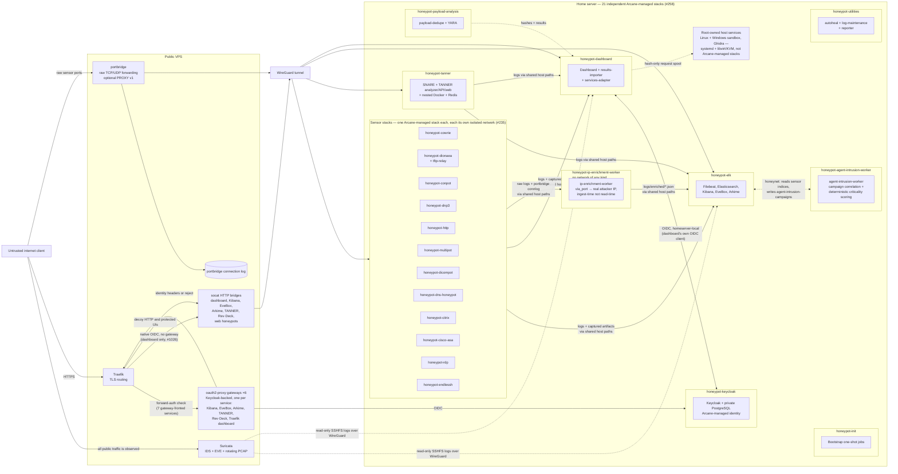
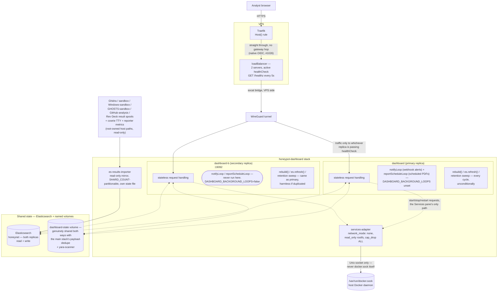
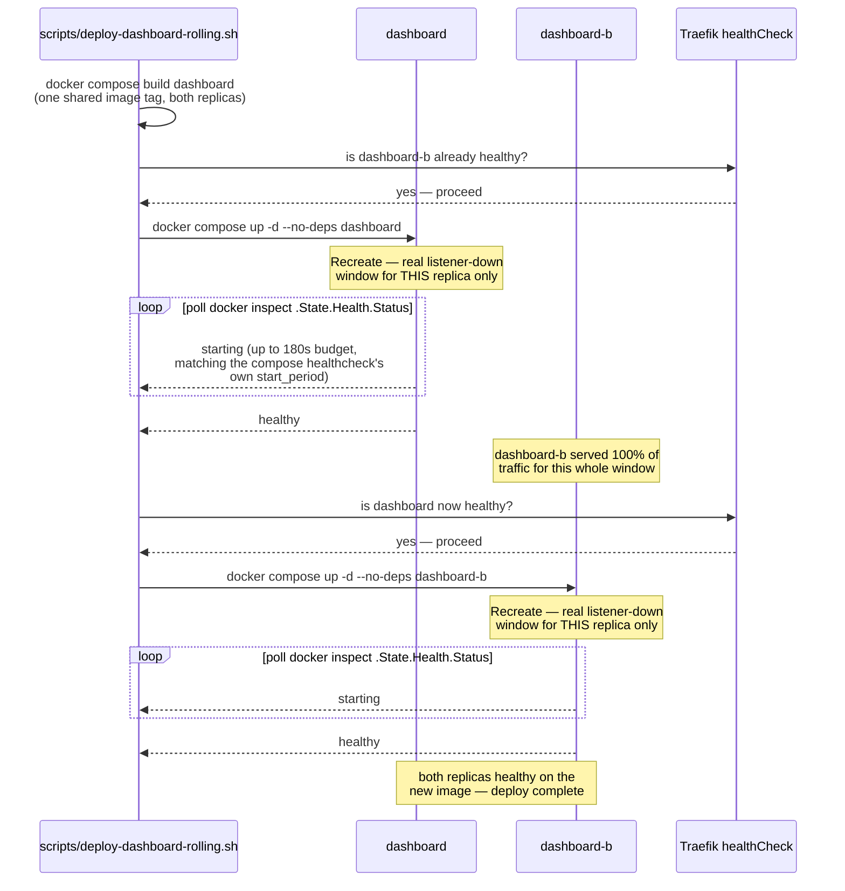
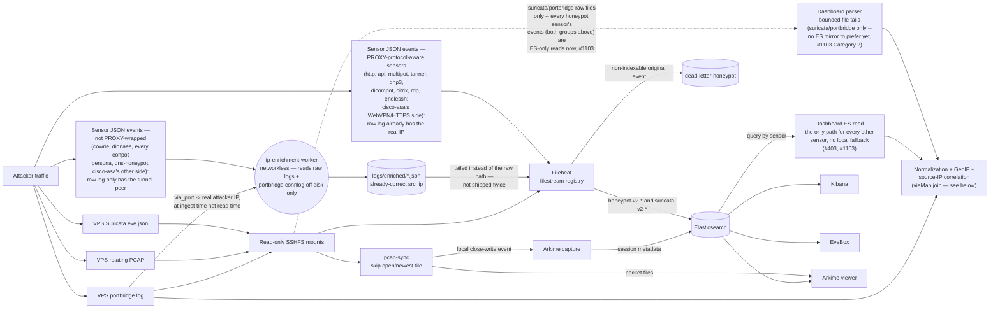
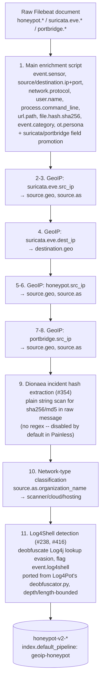
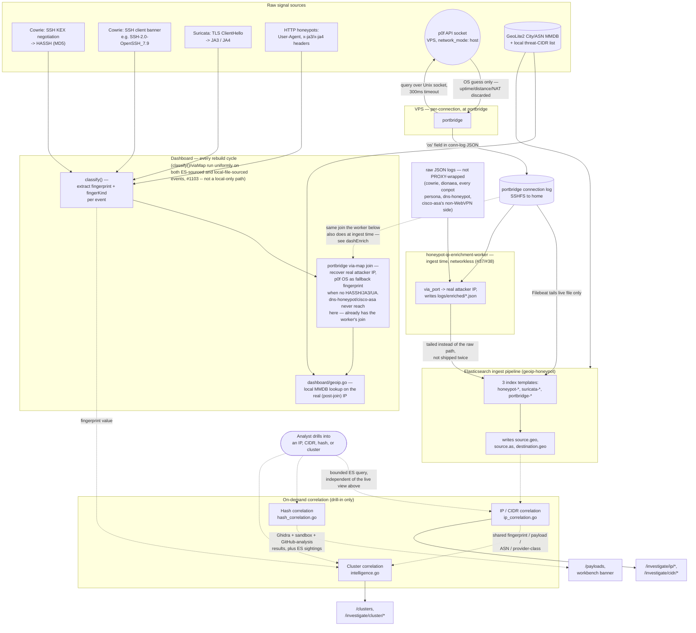
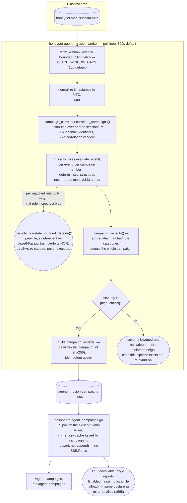
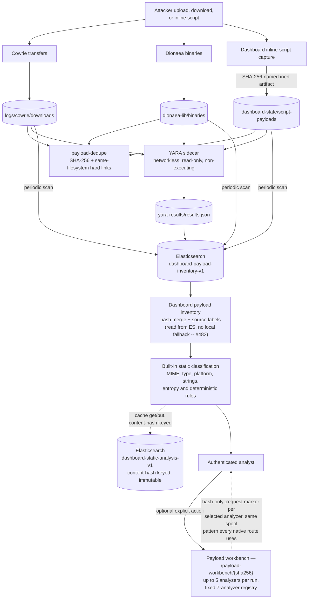
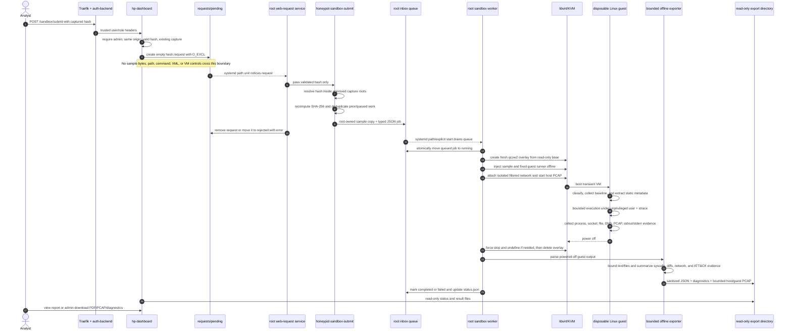

# System architecture and data flow

[← back to README](../README.md)

This section describes the active implementation across the home server's
Arcane-managed stacks and the VPS Compose file, plus pieces that are real but live
outside ordinary Compose services: the Ghidra static analysis pipeline
(`analysis/ghidra/`, its own Arcane-managed stack plus a host systemd worker —
genuinely deployed, see "Captured payload lifecycle and static analysis"
below) and the Linux KVM sandbox (root-owned host worker described below).

`sandbox/windows/` now has both halves of its automated intake path built:
per `IMPLEMENTATION_PLAN.md`'s own dated Phase 7 status note (2026-07-30),
the dashboard side (`determineSandboxTarget`, per-target spool writes,
`WINDOWS_SANDBOX_REQUEST_DIR`/`WINDOWS_SANDBOX_RESULTS_DIR`) and the host
side (`run_pending.sh`, `honeypot-windows-sandbox-worker.{path,service}`,
`orchestrate/run_sample.py` driving real libvirt via `virsh`, not the VMware
commands it was originally written against) both landed — this is what the
workbench's `windows-sandbox` analyzer route (see "Payload analysis
workbench" and `dashboard/workbench_domain.go`) dispatches into. Whether the
backend is actually *switched on* for a given deployment depends on
`WINDOWS_SANDBOX_REQUEST_DIR`/`WINDOWS_SANDBOX_RESULTS_DIR` being set at
all — both are empty by default, and an unset pair means Windows submissions
are refused with a message naming the missing backend, not silently
misrouted into the Linux spool.

**A real inconsistency worth flagging rather than silently resolving one
way:** that same Phase 7 status note also says "Still ahead: Phases 1-3
(Packer golden image, VM lifecycle, guest hardening) and Phase 4 (gateway
Compose)" as of its own 2026-07-30 date, while this document elsewhere
(and #47/#290/#358) describes the golden image building and booting
successfully with Sysmon, PowerShell logging, FakeNet, Regshot, and the
living-persona daemon all confirmed against a live guest. Both can't be
current at once — resolving exactly which phases are actually done on a
given deployment needs someone with live host state, not a repo-only
audit; see `IMPLEMENTATION_PLAN.md` for the phase-by-phase detail either
way. See ["Sandbox submission, detonation, and result return"](#sandbox-submission-detonation-and-result-return)
below for how this route compares to the Linux, WAN-permitted GHOSTS, and
CAPE routes side by side. TANNER containers are web-request emulators, not
malware detonation sandboxes.

**The home side is not one deployment unit.** [#258](https://github.com/Xore/APIARY/issues/258)
split what used to be a single `docker-compose.yml` into independently
deployed Arcane-managed stacks, and [#1502](https://github.com/Xore/APIARY/issues/1502)
moved every one of them onto Arcane's own directory-aware Git sync — each
stack has its own self-contained directory (`arcane/home/<name>/compose.yml`
for the 32 that needed relocating, or their existing repository-root path
for 6 more that were already self-contained) and its own start/stop/update
lifecycle. That first #258 split produced 12 stacks; new sensors and
workers have each landed as their own stack since, and the home side now
runs **32** Arcane-managed stacks via that Git sync, plus 6 more — see
[`arcane/manifests/home-production.json`](../arcane/manifests/home-production.json)
for the authoritative list (not `.github/workflows/deploy.yml`, which no
longer deploys any of them — see `docs/ARCANE-GIT-SYNC.md`). The root
`docker-compose.yml` is a deliberate empty marker; nothing runs
`docker compose up` against it any more, and it is not counted among the
32. `docker-compose.sandbox.yml` is a per-detonation gateway/capture
Compose file the Windows sandbox brings up and tears down around a single
run — also not a standing stack. Host-owned systemd/libvirt services
(Ghidra's own worker process, the Linux/Windows KVM sandboxes) and CAPE run
outside Arcane entirely and outside this count — but as of #1502, the
Ghidra/ML worker/LLM worker/GHOSTS **Compose stacks themselves** (not
those host-level services) are Arcane-managed too, at their own existing
repository paths (`analysis/ghidra/`, `ml-worker/`, `llm-worker/`,
`sandbox/ghosts/`), same as `auth-events-worker/` and `pihole/`.
The diagrams below draw the 32 stack boundaries explicitly rather
than one "home server" box, because that boundary is where independent
deployment, restart, and failure actually happen.

## Deployment and trust boundaries

Stacks are deployed independently, but not network- or filesystem-isolated
from each other the way the VPS/home boundary is: most share the `honeynet`
Docker network by name and the same host bind-mounted `logs/`/state
directories, which is how a sensor stack's events reach `honeypot-elk` and
`honeypot-dashboard` without a direct network call between them. Independent
deployment means each stack can be updated, restarted, or fail without
taking the others down — not that they can't see each other's data.

The VPS is the only internet-facing layer. Suricata sees traffic before it
enters WireGuard, so IDS records and PCAPs retain the original network view.
Traefik handles HTTPS routes and delegates authentication for six
investigation UIs to per-service `oauth2-proxy` gateways, all backed by the
same Keycloak realm running at home (`honeypot-keycloak`). `Xore/auth-backend`
is retired as a runtime service; it now supplies only the read-only Keycloak
login theme (`themes/apiary`), not a forward-auth check. The dashboard is the
one exception: since #1026 it speaks OIDC to Keycloak directly (its own Go
client, PKCE S256), so Traefik passes its traffic straight through with no
gateway hop, and that OIDC exchange happens homeserver-local between
`honeypot-dashboard` and `honeypot-keycloak` -- it never crosses the VPS.
Raw protocols pass through `portbridge`; targets that understand HAProxy
PROXY v1 receive the original client address in-band, while the connection
log lets the dashboard recover source attribution for PROXY-unaware sensors.

The `httpBridges` box above collapses six otherwise-identical
Cloudflare → Traefik → forward-auth (`oauth2-proxy`) → `socat-hp-*` →
WireGuard chains, plus the dashboard's own gateway-free native-OIDC chain,
into one node — see
["The forward-auth bridge, generically"](CGNAT-DEPLOYMENT.md#the-forward-auth-bridge-generically)
in the deployment guide for the per-request sequence the six gateway-fronted
services (Kibana, TANNER, EveBox, Arkime, Rev·Deck, Traefik dashboard)
share, and how the honeypot dashboard's own request differs.

Home container ports bind to `HP_BIND` (normally the home WireGuard address),
not to every host interface. The root Compose network `honeynet` carries the
trusted analysis/management plane (Elasticsearch, Kibana, Filebeat, the
dashboard, EveBox, Arkime) — not the honeypots themselves. Each honeypot has
its own single-member network instead ([#235](https://github.com/Xore/APIARY/issues/235)),
so a compromise of one has no network path to another; `tftp-relay` shares
`dionaea_net` with `dionaea` since it actually depends on and forwards
traffic to it, the one real exception. TANNER additionally uses
`tanner_local`, which contains its Redis, API, PHP emulator, and disposable
nested Docker daemon. That daemon is deliberately not the homeserver Docker
socket.

## Home container interaction map

```mermaid
flowchart TB
  subgraph honeypotInit["honeypot-init — separate Arcane-managed stack (#111, #258)"]
    direction TB
    persona["persona-apply<br/>validate/apply personas"]
    loginit["log-init<br/>create host log paths"]
    esinit["elasticsearch-setup<br/>templates, pipelines, ILM"]
    kibanainit["honeypot-kibana-setup<br/>data views + dashboards"]
    arkinit["arkime-init<br/>Arkime schema + user"]
    snareclone["snare-clone<br/>persona pages onto snare-pages"]
    persona --> loginit
  end

  initMarkers[("state/init-markers/<br/>*.done completion files")]
  loginit --> initMarkers
  esinit --> initMarkers
  arkinit --> initMarkers
  snareclone --> initMarkers

  subgraph sensorGroup["Sensor stacks — one Arcane-managed stack each (#258), each its own isolated network (#235)"]
    direction LR
    subgraph cowrieStackG["honeypot-cowrie"]
      cowrie["Cowrie"]
    end
    subgraph multipotStackG["honeypot-multipot"]
      multipot["multipot"]
    end
    subgraph httpStackG["honeypot-http"]
      http["HTTP + API honeypots"]
    end
    subgraph dionaeaStackG["honeypot-dionaea"]
      dionaea["Dionaea"]
      tftp["TFTP relay"]
    end
    subgraph conpotStackG["honeypot-conpot"]
      conpot["Conpot personas"]
    end
    subgraph dnp3StackG["honeypot-dnp3"]
      dnp3["DNP3"]
    end
    subgraph dicompotStackG["honeypot-dicompot"]
      dicompot["DICOMpot"]
    end
    subgraph dnsHoneypotStackG["honeypot-dns-honeypot"]
      dnsHoneypot["DNS honeypot"]
    end
    subgraph citrixStackG["honeypot-citrix"]
      citrix["Citrix honeypot"]
    end
    subgraph ciscoAsaStackG["honeypot-cisco-asa"]
      ciscoAsa["Cisco ASA honeypot"]
    end
    subgraph rdpStackG["honeypot-rdp"]
      rdp["RDP honeypot"]
    end
    subgraph endlesshStackG["honeypot-endlessh"]
      endlessh["Endlessh"]
    end
  end

  subgraph ipEnrichStackG["honeypot-ip-enrichment-worker —<br/>networkless, no isolated-sensor-network<br/>membership at all (#37/#38)"]
    ipEnrich["via_port -> real attacker IP,<br/>ingest time not read time.<br/>Only for sensors not PROXY-wrapped:<br/>Cowrie, Dionaea, every Conpot persona,<br/>DNS honeypot, Cisco ASA (non-WebVPN side)"]
  end
  enrichedLogs[("logs/enriched/*.json")]

  subgraph tannerGroup["honeypot-tanner — TANNER application-emulation boundary"]
    snare["SNARE"]
    tanner["TANNER analyzer"]
    tannerapi["TANNER API"]
    tannerweb["TANNER web UI"]
    phpox["PHP sandbox emulator"]
    tannerdocker["nested Docker daemon"]
    redis["TANNER Redis"]
  end

  logs[("Host logs<br/>JSON/JSONL")]
  payloads[("Captured payload stores<br/>Cowrie + Dionaea + inline scripts")]
  dashboardState[("dashboard-state")]
  yaraResults[("yara-results")]

  subgraph elkStackG["honeypot-elk"]
    es[("Elasticsearch")]
    filebeat["Filebeat"]
    kibana["Kibana"]
    evebox["EveBox"]
    pcapSync["PCAP sync"]
    arkCapture["Arkime capture"]
    arkViewer["Arkime viewer"]
  end

  subgraph dashboardStackG["honeypot-dashboard"]
    dashboard["Live dashboard"]
  end

  subgraph utilStackG["honeypot-utilities"]
    maintenance["log-maintenance<br/>bounded text-log rotation"]
  end

  initMarkers -.->|"entrypoint polls log-init.done"| sensorGroup
  initMarkers -.->|"entrypoint polls log-init.done"| maintenance
  initMarkers -.->|"entrypoint polls snare-clone.done<br/>+ log-init.done"| snare
  tftp --> dionaea

  cowrie --> logs
  multipot --> logs
  http --> logs
  dionaea --> logs
  conpot --> logs
  dnp3 --> logs
  tanner --> logs
  dicompot --> logs
  dnsHoneypot --> logs
  citrix --> logs
  ciscoAsa --> logs
  rdp --> logs
  endlessh --> logs

  cowrie --> payloads
  dionaea --> payloads
  dashboard -->|"retains inert inline scripts"| dashboardState
  dashboardState --> payloads

  snare --> tanner
  tanner --> tannerapi
  tanner --> phpox
  tanner --> tannerdocker
  tanner --> redis
  tannerweb --> tannerapi
  tannerapi --> redis

  logs -->|"raw JSON -- cowrie, dionaea,<br/>every conpot persona, DNS honeypot,<br/>Cisco ASA (non-WebVPN side)"| ipEnrichStackG
  ipEnrichStackG --> enrichedLogs
  enrichedLogs -->|"tailed instead of the raw<br/>path for these five -- not<br/>shipped twice"| filebeat
  logs -->|"raw path for every other<br/>sensor + TANNER (already<br/>PROXY-protocol-aware,<br/>no join needed)"| filebeat
  initMarkers -.->|"entrypoint polls elasticsearch-setup.done"| filebeat
  filebeat --> es
  es --> kibana
  kibanainit -.->|"configures via API,<br/>no ordering dependency"| kibana

  logs -->|"local-file tail --<br/>suricata and portbridge only,<br/>no ES mirror to read yet<br/>(#1103 Category 2)"| dashboard
  payloads --> dashboard
  dashboardState --> dashboard
  yaraResults --> dashboard
  dashboard --> es
  es -.->|"ES-only, no local-file path at<br/>all: every other sensor<br/>(events_es.go, #1103)"| dashboard
  dashboard -.->|"health only"| filebeat

  es --> evebox
  initMarkers -.->|"entrypoint polls arkime-init.done<br/>+ log-init.done"| evebox

  logs -->|"closed VPS PCAP files"| pcapSync
  pcapSync --> arkCapture
  initMarkers -.->|"entrypoint polls arkime-init.done"| arkCapture
  arkCapture --> es
  es --> arkViewer
  pcapSync --> arkViewer
```

Most sensors write append-only JSON logs under the host `logs/` tree. The
dashboard reads bounded tails of those files for low-latency live operations,
while Filebeat maintains durable offsets and ships the same evidence to
Elasticsearch for historical search. These are complementary paths: the live
dashboard can remain useful during an Elasticsearch interruption, and the
Elasticsearch archive outlives the dashboard's bounded in-memory window.

multipot was the original exception (#403): the dashboard never reads its
log file directly, only Elasticsearch (`events_es.go`'s
`loadSensorEventsES`, queried by `sensor` against `honeypot-v2-*` on every
rebuild cycle, merged into the same `s.events` pipeline every sensor's
events go through). This was made a prerequisite for #238's new protocol
handlers (POP3, IMAP, SOCKS5, HL7/MLLP, ADB — all added directly to
multipot rather than vendoring five separate third-party images) so they
show up in the normal Event Explorer without the dashboard reading their
log file at all. Five more sensors (DICOMpot, DNS honeypot, Citrix, Cisco
ASA, RDP) joined the same `esOnlySensors` list (`events_es.go`) the same
way, and #1103 finished the job: every remaining sensor with its own
`honeypot-v2-*` mirror (Cowrie, Dionaea, Conpot and its personas, DNP3,
HTTP, api-honeypot, Endlessh, TANNER) reads Elasticsearch exclusively now
too — an ES query failure means "no data this cycle," not a fallback to
the local file. Only suricata and portbridge still read local files at
all: both ship to their own index families (`suricata-*`,
`portbridge-v2-*`), not `honeypot-v2-*`, so there is no ES mirror for the
dashboard to prefer yet (tracked as #1103's own Category 2). Every sensor
still writes its log file exactly as before regardless, purely for
Filebeat to pick up — only the dashboard's own read path differs.
http-honeypot's deepened WordPress bait (readme.html version
fingerprinting, xmlrpc.php, vulnerable-plugin readme.txt endpoints — also
#238) is one of the ES-only sensors and unaffected by any of this.

**Two consumers not drawn above read every sensor's events uniformly, once
they reach Elasticsearch, regardless of raw-vs-enriched routing or
ES-only-vs-file-based dashboard reads:** `honeypot-agent-intrusion-worker`
and the ML worker both poll `honeypot-v2-*`/`suricata-v2-*` directly and
don't distinguish sensors the way the dashboard's own read path does — see
"Agent-intrusion campaign detection" later in this document and
`docs/ml-worker-plan.md` for their own dedicated diagrams rather than
duplicating that detail here.

`honeypot-init` runs first among the 20 stacks, and every other one depends
on its output without a Compose-level dependency — Compose's
`depends_on: condition: service_completed_successfully` can't reach across a
stack boundary, [#258](https://github.com/Xore/APIARY/issues/258)'s
split notwithstanding. Its one-shot jobs write a `<job>.done` marker file to
a shared `state/init-markers/` directory on success; every dependent
container across every other stack polls for that file at container
entrypoint (`until [ -f /markers/<job>.done ]; do sleep 3; done`) instead.
`log-init` also prepares host log paths before sensors start, and
`log-maintenance` (in `honeypot-utilities`, one of the marker-waiting
services, not a bootstrap job itself) rotates only the human-readable logs
that are safe to copy-truncate; structured streams tailed by Filebeat are
preserved. `honeypot-kibana-setup` is the one job with no dependents
anywhere: nothing waits on its marker because nothing needs to.

## Dashboard request, state, import, and control flows

[#266](https://github.com/Xore/APIARY/issues/266): `honeypot-dashboard` runs
two identical replicas, `dashboard` and `dashboard-b`, not one collapsed
"live dashboard" node. Same image, same volumes, same Elasticsearch — a
redeploy restarts one replica at a time while the other keeps serving every
request, instead of the earlier blind `Recreate` that left a real
listener-down window on every push.

**Both replicas answer requests identically; only one runs the loops that
must never double-fire.** `main.go`'s `backgroundLoopsEnabled()` is a fixed
two-replica pick (`DASHBOARD_BACKGROUND_LOOPS != "false"`), not real leader
election — `notifyLoop` and `reportScheduleLoop` pause during the primary's
own restart window rather than failing over to the secondary. `rebuild()`,
`es.refresh()`, and the retention sweep are deliberately **not** gated the
same way: each replica just recomputes its own in-memory snapshot or
idempotently deletes already-expired rows, so running both unconditionally
is harmless where the webhook/PDF loops would not be.

**`services-adapter` is the Services pane's only path to the Docker
daemon, and the dashboard never touches `docker.sock` directly.**
`services-adapter` mounts `docker.sock` itself and exposes only a private
Unix-socket volume (`services-adapter-socket`) for the dashboard to send
start/stop/restart requests over — no TCP/HTTP listener, no network at all
(`network_mode: none`), read-only root filesystem, every Linux capability
dropped. The dashboard's own `cap_add: [DAC_READ_SEARCH]` (needed to read
root-owned result directories written by other UIDs) is unrelated and
carries no Docker access of its own.

**`es-results-importer` is a one-way mirror, not a live read path.**
Ghidra, sandbox (Linux/Windows/GHOSTS), GitHub-analysis, and Rev·Deck each
write results to their own root-owned host spool; `es-results-importer`
reads those read-only, ships them into
`ghidra-analysis-v1`/`sandbox-analysis-v1`/`github-analysis-v1`/
`workbench-runs-v1`, and never writes back — local JSON on disk stays
authoritative. It scales horizontally by `sha256(path)` file sharding
(`SHARD_COUNT`/`SHARD_INDEX`), independent of the two dashboard replicas.

### Rolling update sequence

The 180s wait budget is not arbitrary: `arcane/home/honeypot-dashboard/compose.yml`'s own
healthcheck already declares `start_period: 180s`, because `/healthz`
reports 503 until the first `rebuild()` has real ES-derived data — measured
at 60-120s against this host's actual event volume. If a replica fails its
post-restart healthcheck, the script stops immediately rather than touching
the other one: the still-healthy replica keeps serving all traffic while an
operator investigates, exactly the same "never take down the one thing
serving live traffic" posture as every step before it. Separately, the
`autoheal` sidecar (main stack) restarts either replica on an unhealthy
Docker label independent of this script entirely — it watches
`/var/run/docker.sock` daemon-wide and isn't affected by the dashboard's
own stack split.

## Event ingestion and network analysis

The analysis layers serve different purposes:

| Layer | Input | Output | Primary use |
|---|---|---|---|
| Dashboard live parser | recent EVE/portbridge file tails — the only path for suricata and portbridge, which have no `honeypot-v2-*` mirror to read yet (#1103 Category 2) | normalized in-memory snapshot, alerts, campaigns, exports | immediate operations and cross-sensor pivots |
| Dashboard ES read (#403, #1103) | `honeypot-v2-*`, queried by sensor — the *only* read for every sensor except suricata/portbridge (`dashboard/events_es.go`) | same normalized snapshot as the file parser, merged in | every ES-backed sensor's events, and an already-correct source IP for the two the ingest-time enrichment worker covers (dns-honeypot, cisco-asa-honeypot) |
| Filebeat | durable JSON filestreams | versioned Elasticsearch indices/data streams | complete historical indexing with restart-safe offsets |
| Elasticsearch setup | templates and pipelines | flattened heterogeneous sensor fields, GeoIP, ILM, dead-letter fallback | mapping safety and retention |
| Kibana | Elasticsearch | saved searches, visualizations, archive investigations | long-range analysis |
| Suricata | public-interface packets | signatures, protocol events, flows, rotating PCAP | IDS and network evidence |
| EveBox | the `suricata-v2-*` indices | alert-focused UI over Elasticsearch | fast Suricata triage |
| Arkime | closed PCAP files | indexed sessions plus retained packet files | full-packet search and payload inspection |
| Dashboard correlation (see "Correlation and enrichment" below) | normalized events and portbridge metadata | attacker profiles, sessions, clusters, campaigns, ATT&CK context | evidence-led behavioral investigation |

`pcap-sync` exists because remote SSHFS writes do not produce usable local
inotify events: it skips the newest file because Suricata may still be writing
it, then copies closed files locally so Arkime receives the `IN_CLOSE_WRITE`
event it expects.

EveBox needs no such sidecar. It queries the `suricata-v2-*` indices Filebeat
already writes, so it holds no copy of the event data and nothing to outgrow.

## Elasticsearch ingest pipeline

`geoip-honeypot` (`analysis/elasticsearch-setup.sh`, set as `honeypot-v2-*`'s
`index.default_pipeline`) is the one ingest pipeline every honeypot/Suricata/
portbridge document passes through before it's indexed. It runs as an ordered
list of processors — each one reads/writes `ctx` in place, and every
processor is `ignore_failure: true` so one enrichment failing (a missing
GeoIP database, a malformed field) never blocks indexing the underlying
event.

Each numbered step corresponds directly to one processor in
`geoip-honeypot`'s `processors` array (same order, same file) — this diagram
is not an approximation of the pipeline, it's a 1:1 map of it. Notably:

- Steps 2-8 run unconditionally on every document; each is a no-op
  (`ignore_missing: true`) when its source field isn't present, so a
  Suricata document only ever gets steps 2-4 populated and a honeypot/
  portbridge document only ever gets steps 5-8.
- No processor here performs geoip lookups against `source.as`/`destination`
  fields that don't apply to it (dead branches are `ignore_missing`, not
  `ignore_failure`-masked errors).
- Step 11 (Log4Shell) runs last and reads whichever `honeypot.*` fields step
  1 already normalized in, not the raw pre-enrichment document — it doesn't
  need its own copy of field-name knowledge per sensor, just the same
  `honeypot.*` flattened map every sensor already writes into.
- None of these processors make outbound network calls (the geoip ones read
  local `GeoLite2-*.mmdb` files, not a lookup service) — enrichment happens
  entirely on data already inside the document.

## Correlation and enrichment

Enrichment adds signal to a single event as it's ingested — GeoIP, an OS
guess, a protocol fingerprint. Correlation is a separate, later step: given
one IP, hash, or shared attribute, find every other record that shares it.
Nothing here is eager. Enrichment happens once per event at ingest time;
correlation only runs when an analyst drills into a specific IP, CIDR, hash,
or cluster — the dashboard's list views never pay for a correlation query
just to render a row.

**The `via_port` → real attacker IP join now happens at ingest time, not
dashboard read time.** `honeypot-ip-enrichment-worker` ([#37](https://github.com/Xore/APIARY/issues/37)/[#38](https://github.com/Xore/APIARY/issues/38))
reads the same portbridge connection log and each affected sensor's raw JSON
off disk — no network access of any kind, matching the dashboard's own
Docker-socket-exclusion posture — and writes an already-joined copy to
`logs/enriched/*.json`. Filebeat tails that instead of the raw path for the
five sensors that need it (cowrie, dionaea, every conpot persona,
dns-honeypot, and cisco-asa-honeypot's non-WebVPN side; see the ingestion
diagram above for why every other sensor never needed this join at all —
they get the real IP directly via PROXY protocol), so `honeypot-v2-*`
already carries correct source attribution before the dashboard ever reads
it. This closes the roughly one-second staleness window a dashboard rebuild
cycle used to see between a fresh connection and its correct source IP
becoming visible.

**`viaMap` — the dashboard's own join — didn't go away, its scope just
changed shape.** It's still the only join mechanism for every sensor the
worker never covered (all PROXY-aware sensors, which never needed a join,
don't reach it at all; that's unrelated). Of the five worker-covered
sensors, cowrie/dionaea/conpot read Elasticsearch exclusively now (#1103)
— there is no local-file path left at all for them, fallback or otherwise
— so `viaMap` runs unconditionally on their ES-sourced events every
rebuild cycle, re-joining freshly each time rather than trusting a cached
result (see `TestRebuildRejoinsCachedEventOnceViaMapCatchesUp` in
`dashboard/log_cache_test.go`). dns-honeypot and cisco-asa-honeypot are
also ES-only reads (`esOnlySensors`, `dashboard/events_es.go`), but for
those two `viaMap` never runs at all: the worker's ingest-time join is the
*only* place their source IP is ever corrected.

**p0f runs on the VPS, not at home, and only an OS guess survives.** It has
to run there: `portbridge` terminates every TCP connection and re-establishes
its own toward the sensor, so a p0f instance running at home would only ever
fingerprint portbridge's own outbound connections, never the attacker's.
Suricata and p0f both open raw sockets on the VPS's public interface and the
kernel copies packets to each independently. p0f runs in **API mode** — there
is no p0f log file anywhere — and `portbridge` queries its Unix socket once
per connection with a 300ms timeout. The full p0f response carries uptime,
NAT detection, link type, and distance in hops, but `portbridge` keeps only
the OS name/flavor string (e.g. `"Linux 3.11 and newer"`) and discards the
rest; a failed or inconclusive query is silently an empty string, never an
error that could block the connection. That OS guess becomes the `"os"`
field of the portbridge connection-log record traveling home over SSHFS —
the only place p0f data exists once it leaves the VPS.

**Protocol fingerprints are read, not computed, by this stack.** HASSH (an
MD5 of the SSH client's offered key-exchange/encryption/MAC/compression
algorithms, in order) is computed by Cowrie itself from the `cowrie.client.kex`
event and just read into `ev.fingerprint`; the SSH client version banner
(`cowrie.client.version`, e.g. `SSH-2.0-OpenSSH_7.9`) is a second, independent
SSH-side signal. JA3/JA4 (hashes of a TLS ClientHello's version, cipher list,
extensions, and curves) come from Suricata's `eve.json` `tls.ja3`/`tls.ja4`
fields, or from `x-ja3`/`x-ja4` HTTP headers where an upstream proxy already
computed them. All four fingerprint kinds — HASSH, SSH client banner, JA3/JA4,
and HTTP User-Agent — are normalized into the same `(fingerprint, fingerKind)`
pair by the dashboard's `classify()`, which is what lets cluster correlation
group "these 6 source IPs all presented the identical HASSH" the same way it
groups shared payload hashes or shared ASNs. p0f's OS string is deliberately
a **fallback fingerprint**, used only when a connection produced none of the
above (a scanner that never completes a real protocol handshake still gets a
fingerprint-shaped signal to correlate on).

**GeoIP runs twice, independently, against the same MMDB files** — not one
feeding the other. The Elasticsearch `geoip-honeypot` ingest pipeline enriches
every document across all three index templates (`honeypot-*`, `suricata-*`,
`portbridge-*`) as it's indexed, writing ECS `source.geo`/`source.as`/
`destination.geo`; this is what backs Kibana's maps. The dashboard's live
parser does its own local lookup (`dashboard/geoip.go`, no external API —
the home server has no egress) against the same `GeoLite2-City`/`GeoLite2-ASN`
MMDBs, plus a locally-refreshed threat-CIDR list for provider/scanner
classification. The dashboard's lookup happens **after** the portbridge
real-IP join, so it enriches the actual attacker address, never the tunnel
peer.

**Correlation is three separate, purpose-built queries, not one engine:**

- **IP/CIDR correlation** (`dashboard/ip_correlation.go`) answers "what else
  has this address (or CIDR) done": one bounded Elasticsearch query
  (≤200-500 records) across `honeypot-*`, `suricata-*`, and `portbridge-*`
  on drill-in, summarized into a sensor breakdown, tunnel-OS guesses, and a
  record list. Never run for list-page rows — only `/investigate/ip/{ip}`
  and `/investigate/cidr/{cidr}`.
- **Hash correlation** (`dashboard/hash_correlation.go`) answers "is this
  payload already known": checks Ghidra results, sandbox results, GitHub
  code-search results, and an Elasticsearch sighting count, all keyed by
  SHA-256 — plus MD5 as a second identifier, because Dionaea's own on-disk
  naming is MD5, not SHA-256, and a SHA-256-only search would silently miss
  every Dionaea capture. Purely advisory: surfaced as a "known elsewhere"
  card on `/payloads` and the workbench, never blocks a submission.
- **Cluster correlation** (`dashboard/intelligence.go`) answers "what
  connects these attacks": groups source IPs that share one of four
  attribute kinds — fingerprint (HASSH/JA3/JA4/UA/p0f-OS), payload hash,
  ASN, or threat-intel provider class — keeping only groups with 2 or more
  distinct source IPs. `/clusters` lists them; drilling into one re-runs IP
  correlation across every member IP, deliberately unfiltered by the list
  view's date/sensor bounds.

None of this claims attacker identity. A shared HASSH means two connections
used the same SSH client software, not the same operator; a shared ASN means
the same network, not the same actor. Correlation output is meant to compress
investigation effort, not to be the verdict itself — see "Analysis result
interpretation" below for how this stack keeps that distinction explicit
throughout.

## Agent-intrusion campaign detection

[#154](https://github.com/Xore/APIARY/issues/154) phase 5: a deployed,
standalone `honeypot-agent-intrusion-worker` stack that groups isolated,
individually-low-signal events into campaigns and escalates the ones that
actually cross a trust boundary — the gap #154 opens with is that nothing
grouped related events together in the first place, so real campaigns
stayed under any single-event alert threshold.

**Fragment reassembly (`decode_correlate.ChunkCorrelator`) is a real,
tested module — but it is not wired into this live pipeline.** Its own
docstring is explicit about the distinction: `ChunkCorrelator` reassembles
one multi-part *message* (several sensor events that are fragments of a
single payload, keyed by channel/sequence) before it's even decodable;
`campaign_correlator.py` above correlates separate, already-complete
events into one *campaign*. `worker.py`'s live `run_cycle()` only calls
`campaign_correlator.correlate_campaigns()` — `ChunkCorrelator` is
exercised by `tests/test_decode_correlate.py` and referenced in
`criticality_rules.py`'s own comments as a documented boundary, not
invoked from anywhere in the deployed worker. What *is* live and running
per matched rule is `bounded_decode()` — a single-blob decoder (not a
multi-event reassembler) that a criticality rule calls when it needs to
inspect what a suspicious base64/compressed/XOR-obfuscated field actually
contains, still never executing or evaluating the decoded content itself.

**Deterministic rules, not the LLM, own escalation.** `criticality_rules.py`
inspects each event's raw sensor-shaped structure directly — command text,
alert fields, audit-event shape — and is proven against `corpus.jsonl`'s
`expected_findings.should_escalate` only as a *test oracle*, never as a
live input. Nothing in this pipeline reads model/LLM output as a
precondition for escalation; that keeps the critical-alert gate immune to
the class of problem "treat model output as advisory" exists to prevent
(see "Analysis result interpretation" below for the same distinction
applied dashboard-wide). A campaign's `matched_categories` — the set of
*distinct* rule categories it tripped, not just whether escalation
happened — is itself part of the signal `campaign_severity()` scores on.

**Idempotent by construction.** Because every poll cycle re-fetches a
rolling `FETCH_WINDOW_DAYS` window rather than tracking an incremental
checkpoint, the same still-active campaign reappears on every cycle —
`build_campaign_verdict()`'s deterministic `campaign_id` (a sha256 of the
sorted member event-ID list) makes that an upsert of the same document,
not a growing pile of duplicates.

## Captured payload lifecycle and static analysis

Captured samples are content, never configuration. Cowrie stores uploaded and
downloaded files, Dionaea stores malware captures, and the dashboard turns
recognized inline scripts into inert SHA-256-named artifacts. The dashboard's
own periodic disk scan walks all configured stores, accepts only hash-shaped
regular filenames, and indexes identical hashes into one inventory document
per hash in Elasticsearch (`dashboard-payload-inventory-v1`) while retaining
every source label — every dashboard instance's own scan feeds the same
index, so mount-path differences between instances don't affect what any
instance serves. `/payloads` itself reads only from that index, never
directly from the disk scan (#483) — Elasticsearch unreachable means the page
reports unavailable, not a stale or partial local view.

`payload-dedupe` hashes payloads and replaces duplicate files on the same
filesystem with hard links. It preserves all existing paths and does not merge
across devices. The YARA container has read-only payload mounts, no network,
and no execution path; it writes a bounded JSON result file that the dashboard
joins by hash. Static dashboard analysis adds file classification, platform and
execution-policy hints, strings/IOC observations, deterministic rules, and
YARA matches, cached in Elasticsearch (`dashboard-static-analysis-v1`) keyed
by content hash — content-addressed and immutable, so a cache hit never needs
invalidating, only a get-or-create write on first computation. These are
triage signals, not proof of behavior or attribution.

**The analyst's dispatch point is the payload workbench, not two standalone
"sandbox request"/"Ghidra request" buttons.** `/payload-workbench/{sha256}`
selects up to 5 analyzers per run from a fixed, server-computed registry of
7: deterministic local analysis, Ghidra, the Linux sandbox, the isolated
Windows sandbox, the WAN-permitted Windows/GHOSTS sandbox, Rev·Deck, and
CAPE — see [`docs/payload-analysis-workbench.md`](payload-analysis-workbench.md)
for the full registry table, orchestration sequence, and idempotency model.
Every analyzer still resolves to the same hash-only `.request` marker
handoff — no sample bytes, path, or command ever crosses — a Ghidra request
in particular runs unconditionally on anything with code in it, including
the PE DLLs and documents the sandbox routes correctly refuse to detonate.
The host-owned Ghidra worker drains its request spool, talks to a headless
Ghidra REST service and a local-only fuzzy-hashing/structural-parsing
sidecar (`analysis/ghidra/statictools/`), and optionally an on-host
language model for a first-pass triage opinion — never a hosted one, and
never given anything but what Ghidra already extracted. See
[`analysis/ghidra/README.md`](analysis/ghidra/README.md) for the full Ghidra
pipeline, and ["Sandbox submission, detonation, and result return"](#sandbox-submission-detonation-and-result-return)
below for the dynamic-detonation routes.

## Sandbox submission, detonation, and result return

Four dynamic-detonation routes exist today, each its own guest, network, and
spool — not four variations on one sandbox. The workbench (see "Payload
analysis workbench") is what an analyst actually picks a route from; this
section is what each route does once picked. See
[`docs/sandbox/README.md`](sandbox/README.md#route-selection-and-evidence-return-across-four-dynamic-detonation-routes)
for the canonical side-by-side diagram covering all four routes'
network posture, spool paths, and shared-lock behavior; what follows below
is the Linux route's own detailed submission-through-result sequence, kept
here because it's the oldest and most heavily cross-referenced of the four.

The submission endpoint accepts only `POST`, requires the configured admin
role, verifies a same-origin browser request, validates the hash, and confirms
that the captured payload exists. It creates an empty request file with
exclusive-create semantics, making double submission idempotent at the
dashboard boundary.

The host's root-owned handoff service accepts only filenames matching the hash
contract. `honeypot-sandbox-submit` searches fixed Cowrie, Dionaea, and inline
script roots, recomputes SHA-256, copies the selected sample into a root-only
staging area, and creates a typed queue record. Neither attacker input nor the
dashboard can supply an arbitrary host path, command line, libvirt definition,
or result location.

For each job, the worker creates a fresh qcow2 overlay backed by the prepared
Ubuntu base, injects a fixed runner and sample while the guest is offline, and
boots a transient VM on the `honeypot-sandbox` libvirt network. A strict
libvirt network filter is applied. The normal mode is isolated; the optional
controlled-egress mode uses the separately installed DNS and allowlist proxy
described in [`sandbox/README.md`](sandbox/README.md). Host `tcpdump`
captures traffic for the job without granting packet-capture privileges to
the guest.

Inside the guest, the runner records before/after processes, sockets, and
filesystem state; classifies the payload; extracts static metadata and PE
forensics where relevant; and runs supported Linux/script payloads for a
bounded time as an unprivileged user under `no-new-privs` and `strace`. The
configured Windows compatibility policy is either static-only or bounded Wine
execution inside this Linux guest. It is not the future native Windows 11
sandbox design.

After shutdown—or a forced deadline—the host destroys the transient domain and
overlay before exporting results. The offline exporter treats every guest file
as untrusted, applies size/line/count limits, summarizes host and guest PCAP,
DNS queries, network syscalls, process/socket/file differences, PE imports,
ATT&CK evidence, run status, timeout reason, and a heuristic risk score. It
publishes only bounded artifacts to the dashboard's read-only export mount.
Raw result trees, oversized captures, samples, libvirt, systemd, and the
worker's queue remain unavailable to the dashboard container.

## Analysis result interpretation

The stack deliberately keeps observation types separate:

- **Static evidence** says what bytes, structure, strings, imports, or YARA
  signatures are present. It does not prove execution.
- **Dynamic evidence** says what the bounded guest run observed: syscalls,
  created/changed files, process/socket differences, DNS, and packets.
- **Network IDS evidence** says what Suricata matched on public traffic.
- **Full-packet evidence** preserves the traffic Arkime can reconstruct.
- **Correlation evidence** links shared infrastructure, credentials, payload
  hashes, sessions, fingerprints, and timing without claiming actor identity.
- **Failure/timeout evidence** is not a clean verdict. `guest-no-result`,
  `host-timeout`, unsupported/static-only execution, and incomplete PCAP must
  remain visibly distinct from "no malicious behavior observed."

The dashboard-generated risk score and ATT&CK mappings are conservative triage
aids. They remain linked to their underlying evidence and must not trigger
automatic firewall changes, public reporting, or sample execution.
