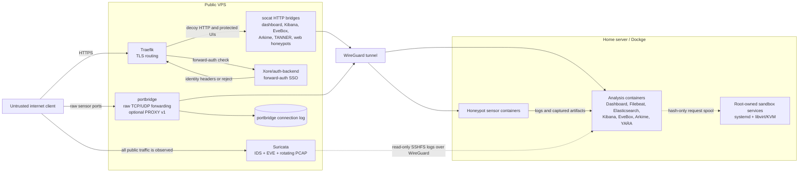
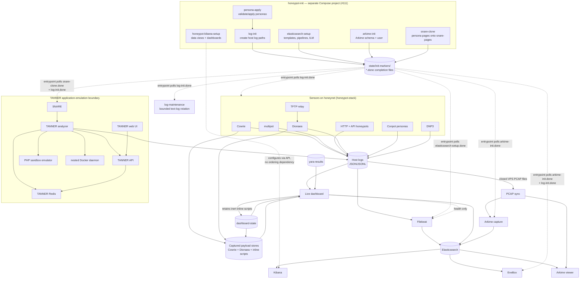
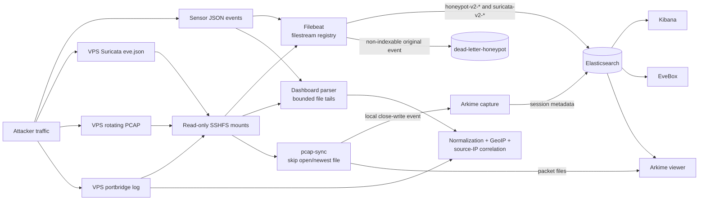
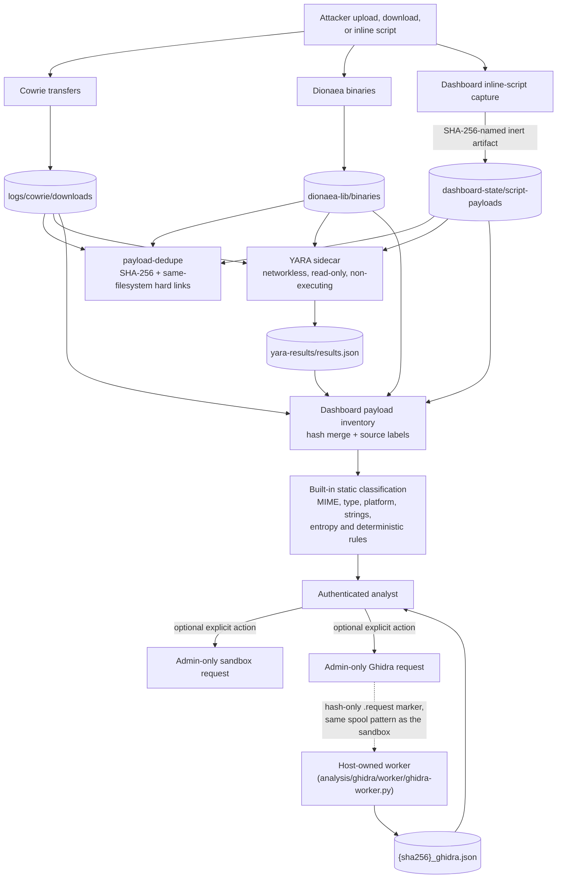
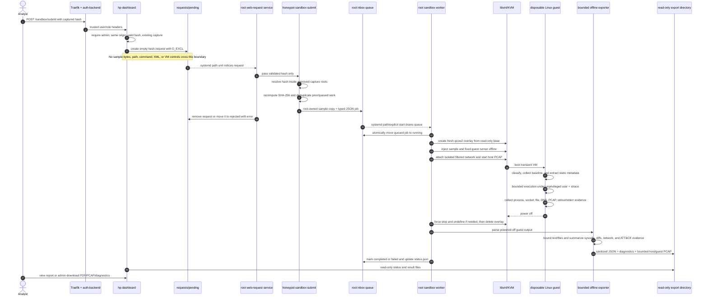

# System architecture and data flow

[← back to README](../README.md)

This section describes the active implementation in the root and VPS Compose
files, plus two pieces that are real but live outside them: the Ghidra static
analysis pipeline (`analysis/ghidra/`, its own Compose file plus a host
systemd worker — genuinely deployed, see "Captured payload lifecycle and
static analysis" below) and the Linux KVM sandbox (root-owned host worker
described below). `sandbox/windows/` is still a plan, not yet deployed — see
that directory's own `IMPLEMENTATION_PLAN.md` and #47 for status; until its
golden image exists, Windows samples take the static-only/Wine-in-Linux-guest
path the sandbox section below describes, not a native Windows 11 guest.
TANNER containers are web-request emulators, not malware detonation sandboxes.

## Deployment and trust boundaries

The VPS is the only internet-facing layer. Suricata sees traffic before it
enters WireGuard, so IDS records and PCAPs retain the original network view.
Traefik handles HTTPS routes and delegates authentication for investigation
UIs to the separately deployed `Xore/auth-backend`. Raw protocols pass through
`portbridge`; targets that understand HAProxy PROXY v1 receive the original
client address in-band, while the connection log lets the dashboard recover
source attribution for PROXY-unaware sensors.

Home container ports bind to `HP_BIND` (normally the home WireGuard address),
not to every host interface. The root Compose network `honeynet` is for
container-to-container communication. TANNER additionally uses
`tanner_local`, which contains its Redis, API, PHP emulator, and disposable
nested Docker daemon. That daemon is deliberately not the homeserver Docker
socket.

## Home container interaction map

Most sensors write append-only JSON logs under the host `logs/` tree. The
dashboard reads bounded tails of those files for low-latency live operations,
while Filebeat maintains durable offsets and ships the same evidence to
Elasticsearch for historical search. These are complementary paths: the live
dashboard can remain useful during an Elasticsearch interruption, and the
Elasticsearch archive outlives the dashboard's bounded in-memory window.

`honeypot-init` is a **separate Dockge stack**, deployed independently of
`honeypot-stack` (see [`CGNAT-DEPLOYMENT.md`](CGNAT-DEPLOYMENT.md)) — it
exists because Compose's `depends_on: condition: service_completed_successfully`
cannot reach across a project boundary. Its one-shot jobs write a `<job>.done`
marker file to a shared `state/init-markers/` directory on success; every
dependent in `honeypot-stack` polls for that file at container entrypoint
(`until [ -f /markers/<job>.done ]; do sleep 3; done`) instead of using a
Compose-level dependency. `log-init` also prepares host log paths before
sensors start, and `log-maintenance` — itself one of the marker-waiting
services, not a bootstrap job — rotates only the human-readable logs that are
safe to copy-truncate; structured streams tailed by Filebeat are preserved.
`honeypot-kibana-setup` is the one job with no dependents anywhere: nothing
waits on its marker because nothing needs to.

## Event ingestion and network analysis

The analysis layers serve different purposes:

| Layer | Input | Output | Primary use |
|---|---|---|---|
| Dashboard live parser | recent sensor/EVE/portbridge file tails | normalized in-memory snapshot, alerts, campaigns, exports | immediate operations and cross-sensor pivots |
| Filebeat | durable JSON filestreams | versioned Elasticsearch indices/data streams | complete historical indexing with restart-safe offsets |
| Elasticsearch setup | templates and pipelines | flattened heterogeneous sensor fields, GeoIP, ILM, dead-letter fallback | mapping safety and retention |
| Kibana | Elasticsearch | saved searches, visualizations, archive investigations | long-range analysis |
| Suricata | public-interface packets | signatures, protocol events, flows, rotating PCAP | IDS and network evidence |
| EveBox | the `suricata-v2-*` indices | alert-focused UI over Elasticsearch | fast Suricata triage |
| Arkime | closed PCAP files | indexed sessions plus retained packet files | full-packet search and payload inspection |
| Dashboard correlation | normalized events and portbridge metadata | attacker profiles, sessions, clusters, campaigns, ATT&CK context | evidence-led behavioral investigation |

`pcap-sync` exists because remote SSHFS writes do not produce usable local
inotify events: it skips the newest file because Suricata may still be writing
it, then copies closed files locally so Arkime receives the `IN_CLOSE_WRITE`
event it expects.

EveBox needs no such sidecar. It queries the `suricata-v2-*` indices Filebeat
already writes, so it holds no copy of the event data and nothing to outgrow.

## Captured payload lifecycle and static analysis

Captured samples are content, never configuration. Cowrie stores uploaded and
downloaded files, Dionaea stores malware captures, and the dashboard turns
recognized inline scripts into inert SHA-256-named artifacts. The dashboard
walks all configured stores, accepts only hash-shaped regular filenames, and
merges identical hashes into one inventory row while retaining every source
label.

`payload-dedupe` hashes payloads and replaces duplicate files on the same
filesystem with hard links. It preserves all existing paths and does not merge
across devices. The YARA container has read-only payload mounts, no network,
and no execution path; it writes a bounded JSON result file that the dashboard
joins by hash. Static dashboard analysis adds file classification, platform and
execution-policy hints, strings/IOC observations, deterministic rules, and
YARA matches. These are triage signals, not proof of behavior or attribution.

A Ghidra request is the same idempotent hash-only handoff as a sandbox
request — no sample bytes, path, or command crosses the dashboard/host
boundary — but it runs unconditionally on anything with code in it, including
the PE DLLs and documents the sandbox correctly refuses to detonate. The
host-owned worker drains the request spool, talks to a headless Ghidra REST
service and a local-only fuzzy-hashing/structural-parsing sidecar
(`analysis/ghidra/statictools/`), and optionally an on-host language model for
a first-pass triage opinion — never a hosted one, and never given anything but
what Ghidra already extracted. See [`../analysis/ghidra/README.md`](../analysis/ghidra/README.md)
for the full pipeline.

## Sandbox submission, detonation, and result return

The submission endpoint accepts only `POST`, requires the configured admin
role, verifies a same-origin browser request, validates the hash, and confirms
that the captured payload exists. It creates an empty request file with
exclusive-create semantics, making double submission idempotent at the
dashboard boundary.

The host's root-owned handoff service accepts only filenames matching the hash
contract. `honeypot-sandbox-submit` searches fixed Cowrie, Dionaea, and inline
script roots, recomputes SHA-256, copies the selected sample into a root-only
staging area, and creates a typed queue record. Neither attacker input nor the
dashboard can supply an arbitrary host path, command line, libvirt definition,
or result location.

For each job, the worker creates a fresh qcow2 overlay backed by the prepared
Ubuntu base, injects a fixed runner and sample while the guest is offline, and
boots a transient VM on the `honeypot-sandbox` libvirt network. A strict
libvirt network filter is applied. The normal mode is isolated; the optional
controlled-egress mode uses the separately installed DNS and allowlist proxy
described in [`../sandbox/README.md`](../sandbox/README.md). Host `tcpdump`
captures traffic for the job without granting packet-capture privileges to
the guest.

Inside the guest, the runner records before/after processes, sockets, and
filesystem state; classifies the payload; extracts static metadata and PE
forensics where relevant; and runs supported Linux/script payloads for a
bounded time as an unprivileged user under `no-new-privs` and `strace`. The
configured Windows compatibility policy is either static-only or bounded Wine
execution inside this Linux guest. It is not the future native Windows 11
sandbox design.

After shutdown—or a forced deadline—the host destroys the transient domain and
overlay before exporting results. The offline exporter treats every guest file
as untrusted, applies size/line/count limits, summarizes host and guest PCAP,
DNS queries, network syscalls, process/socket/file differences, PE imports,
ATT&CK evidence, run status, timeout reason, and a heuristic risk score. It
publishes only bounded artifacts to the dashboard's read-only export mount.
Raw result trees, oversized captures, samples, libvirt, systemd, and the
worker's queue remain unavailable to the dashboard container.

## Analysis result interpretation

The stack deliberately keeps observation types separate:

- **Static evidence** says what bytes, structure, strings, imports, or YARA
  signatures are present. It does not prove execution.
- **Dynamic evidence** says what the bounded guest run observed: syscalls,
  created/changed files, process/socket differences, DNS, and packets.
- **Network IDS evidence** says what Suricata matched on public traffic.
- **Full-packet evidence** preserves the traffic Arkime can reconstruct.
- **Correlation evidence** links shared infrastructure, credentials, payload
  hashes, sessions, fingerprints, and timing without claiming actor identity.
- **Failure/timeout evidence** is not a clean verdict. `guest-no-result`,
  `host-timeout`, unsupported/static-only execution, and incomplete PCAP must
  remain visibly distinct from "no malicious behavior observed."

The dashboard-generated risk score and ATT&CK mappings are conservative triage
aids. They remain linked to their underlying evidence and must not trigger
automatic firewall changes, public reporting, or sample execution.
