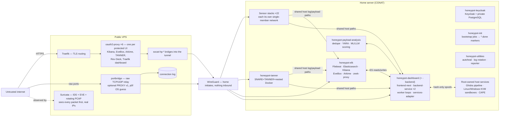
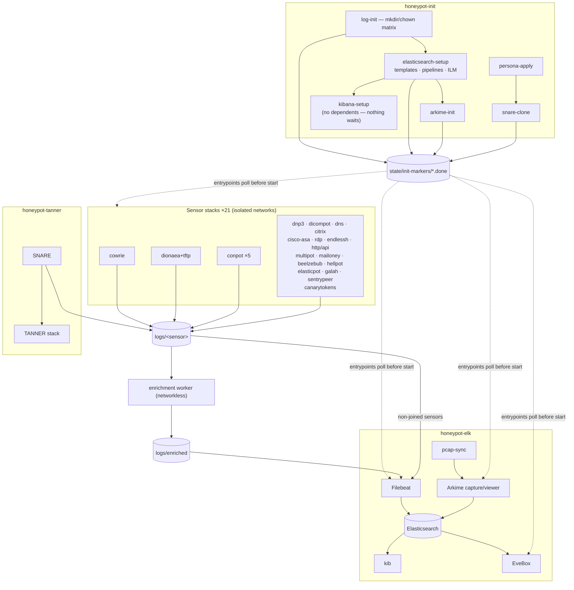
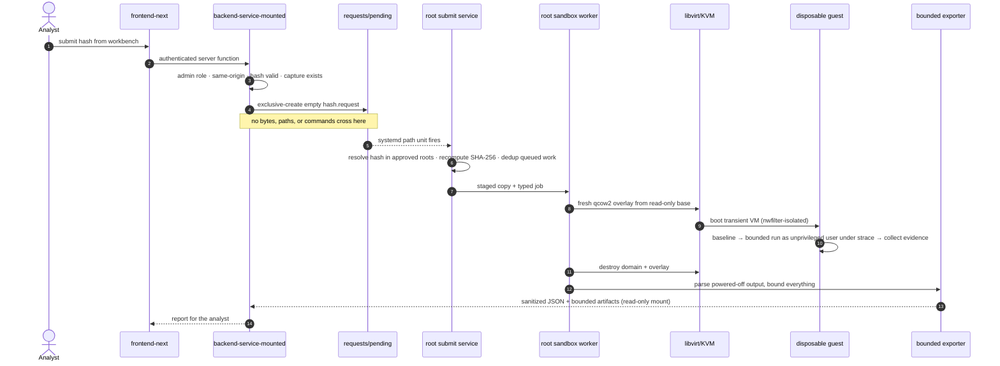

# System architecture

[← back to README](../README.md) · [Pipelines](PIPELINES.md) · [Network](NETWORK.md) · [Storage](STORAGE.md)

What runs where, what trusts what, and why the fleet is shaped this way.
Companion pages carry the detail this page summarizes: data flow in
[PIPELINES.md](PIPELINES.md), isolation and ingress in
[NETWORK.md](NETWORK.md), disk and index layout in
[STORAGE.md](STORAGE.md).

**Status basis:** everything here describes the live deployment as of the
dashboard cutover (#1628, completed 2026-08-22) — the Go dashboard is
deleted from compose, and the TanStack Start + Rust tiers serve traffic.
There is no runtime fallback and no profile gating left on any core stack;
the only compose profile in the repo is the optional on-demand
`geoip-update` maintenance job.

## The ten-second version

A public VPS terminates attacker traffic — Suricata sniffs it, Traefik
routes HTTP through Keycloak-backed auth, portbridge relays raw protocol
ports — and forwards everything over a home-initiated WireGuard tunnel to
a homeserver running **32 Arcane-managed sensor/worker/utility stacks**
(plus 6 more at repository-root paths; 38 sync entries in
[`arcane/manifests/home-production.json`](../arcane/manifests/home-production.json),
which is authoritative — not `.github/workflows/deploy.yml`). Sensors
write JSON logs to shared host directories; Filebeat ships them into
Elasticsearch through one normalizing/enriching ingest pipeline; worker
loops aggregate raw events into durable entities (attackers, campaigns,
clusters, anomaly scores); and the dashboard tier serves it all to
analysts. Nothing captured is ever executed inside the fleet, and no
component's failure takes the analysis plane down with it.

## Deployment and trust boundaries

The home side is deliberately **not** one deployment unit. #258 split the
original monolith; #1502 moved every piece onto Arcane's directory-aware
Git sync ([ARCANE-GIT-SYNC.md](ARCANE-GIT-SYNC.md)). Each stack deploys,
restarts, and fails independently — but they are *not* network-isolated
from each other the way the VPS/home boundary is: most share the
`honeynet` Docker network by name and the same bind-mounted `logs/`/
`state/` trees, which is exactly how sensor bytes reach Elasticsearch
without any direct socket between sensor and analyzer
([NETWORK.md](NETWORK.md) carries the isolation rules).

Trust boundaries, strongest first:

1. **Internet ↔ VPS**: only Suricata/p0f raw sockets, Traefik :443, and
   portbridge's relayed ports are reachable; ufw seeds the rest.
2. **VPS ↔ home**: WireGuard, home-initiated. The home server has no
   inbound exposure at all (CGNAT); every published container port binds
   `${HP_BIND}` = the tunnel IP.
3. **Sensor ↔ analysis plane**: filesystem handoff across isolated Docker
   networks (#235) — a compromised sensor has no lateral network path.
4. **Dashboard ↔ Docker daemon**: services-adapter's allowlisted unix
   socket, never docker.sock directly.
5. **Analyst ↔ detonation**: hash-only `.request` markers; sample bytes,
   paths, and commands never cross a privilege boundary.

## The dashboard tier (post-cutover)

One logical app, five containers plus its split-out sibling stack:

```mermaid
flowchart TB
  analyst["Analyst browser"]

  subgraph vps2["VPS"]
    t["Traefik — native OIDC pass-through (#1026)"]
  end

  subgraph stack["honeypot-dashboard"]
    fe["frontend-next :19090<br/>TanStack Start (Node cluster)<br/>server functions · SSE hub · BFF cookie"]
    bs["backend-service :8081<br/>Rust axum — the API surface<br/>100+ routes under /api/v1"]
    bsm["backend-service-mounted :8082<br/>same route table + host spool mounts<br/>write-capable instance"]
    loops["backend-worker loops<br/>role picked by WORKER_LOOPS:<br/>alert-notifier · attacker-identity ·<br/>agent-intrusion · correlator · dashboard-rollups ·<br/>threat-intel · zeek-proxy-attribution"]
    imp["backend-worker importer<br/>es-results-importer, shard-partitionable"]
    enr["backend-worker-enrichment<br/>network_mode: none — via_port join"]
    redis[("oidc-sessions<br/>valkey")]
    adapter["services-adapter<br/>unix socket · allowlist · cap_drop ALL"]
    sock[("/var/run/docker.sock")]
  end

  es[("Elasticsearch")]

  analyst -->|"HTTPS"| t --> fe
  fe -->|"serviceFetch/serviceJSON<br/>15s TTL cache + Redis share<br/>ConcurrencyLimiter"| bs
  fe -->|"{mounted:true} callers"| bsm
  fe --- redis
  bs & bsm & loops & imp --> es
  enr -->|"logs/enriched/*.json"| fb2["Filebeat"] --> es
  fe -->|"start/stop/logs requests"| adapter --> sock
```

Division of labor:

- **frontend-next** owns sessions: OIDC against home-local Keycloak,
  `__Host-apiary_bff` cookie, session state in the valkey sidecar. All
  backend access flows through typed server functions — the browser never
  speaks to Elasticsearch or sees service tokens. Live updates ride one
  shared SSE stream whose frames match the Rust emitter's `event` naming.
- **backend-service (:8081)** is the unprivileged API tier: constant-time
  service-token middleware, 30s ES timeouts, PIT + `search_after`
  pagination everywhere, CAS writes. It also hosts the embedded worker
  loops — the same image plays each role selected by `WORKER_LOOPS`.
- **backend-service-mounted (:8082)** is the same code with the host-side
  request-spool mounts (CAPE/Ghidra/GitHub-analysis/GHOSTS/sandbox/
  Windows-sandbox/Rev·Deck). Only this instance can dispatch analysis
  jobs; frontend callers resolve it explicitly via `{mounted: true}`, so
  capability follows configuration, not URL guessing.
- **Worker containers**: importer mirrors root-owned result spools into
  `*-analysis-v1` indices (read-only, never writes back — local JSON stays
  authoritative); enrichment does the ingest-time source-IP join with no
  network at all; the loop container runs the seven aggregation workers
  (cadences and outputs in [PIPELINES.md](PIPELINES.md#2-derived-intelligence-the-worker-loops)).
- **services-adapter** remains the Services pane's only path to Docker:
  frozenset allowlist checked before any Engine call, three actions plus
  logs, demuxed frames, socket `0600`.

Single replica per component; a redeploy accepts the brief recreate
window and Traefik's active `/healthz` check turns it into clean 502s.
Background loops must not double-fire, which is why they are pinned to
one loop container rather than leader-elected.

## Home container interaction map

`honeypot-init` runs first among peers; because Compose
`depends_on` cannot span stacks, dependents poll marker files at
entrypoint instead — the cross-stack readiness contract documented in
[STORAGE.md](STORAGE.md#host-tree).

## Event ingestion (summary)

The full pipeline — PROXY-aware vs tunnel-blind sensor split, the
ingest-time `via_port` join, the 12-step `geoip-honeypot` processor chain,
and the dashboard's four read paths — is
[PIPELINES.md §1](PIPELINES.md#1-event-ingestion). Facts that shape
everything else:

- Every document passes one ES ingest pipeline; processors are
  `ignore_failure`, so enrichment never blocks indexing.
- Source attribution happens once, at ingest, for the five sensors that
  need it; an unattributable flow stays honestly tunnel-tagged and is
  counted (`unattributed_24h`) rather than guessed.
- Suricata and portbridge are the only local-file live reads left; every
  honeypot sensor is ES-only by design (#1103).

## Correlation and analysis surfaces

Enrichment adds signal to one event at ingest; correlation links records
on demand — drill-in only, never paid for list-page rows:

- **IP/CIDR correlation** (`investigate.rs`): bounded ES query across all
  three index families → sensor breakdown, tunnel OS guesses, records.
- **Hash correlation** (`ioc_correlation.rs`, `payload_static_analysis.rs`):
  known-elsewhere checks keyed by SHA-256 **and MD5** (Dionaea names
  captures by MD5 — a SHA-256-only search would silently miss them).
- **Cluster/campaign correlation** (`correlator.rs`, `campaign_correlator.rs`,
  `fusion.rs`): groups ≥2 source IPs sharing a fingerprint (HASSH /
  SSH banner / JA3-JA4 / UA / p0f OS), payload hash, ASN, or provider
  class; agent-intrusion builds escalated campaigns with deterministic
  ids (upsert-safe).
- **Kill-chain view** (`kill_chain.rs`): ATT&CK-mapped progression over
  the correlated entities.

Fingerprints are read, not computed, by this fleet: Cowrie emits HASSH +
client banner itself, Suricata provides JA3/JA4, proxies provide x-ja3/x-ja4
headers, p0f contributes a fallback OS guess when no handshake happened.
Since #1970 each of those lands as a typed `fingerprint.kind` /
`fingerprint.value` pair at ingest (one collapse per document, mirroring
`pivots_from_source`'s precedence), so the clustering above is reproducible
from pure ES terms aggregations — Kibana and ml-worker pivot on it without
the dashboard running. None of these claims identity — shared software or
shared networks compress investigation effort; they are not verdicts.

## Agent-intrusion escalation (summary)

Ported from the standalone Python worker to the Rust loop
(`agent_intrusion.rs` + `criticality_rules.rs` + `campaign_correlator.rs`
+ `decode_correlate.rs`); the original stack
(`honeypot-agent-intrusion-worker/`) now hosts the labelled corpus and the
Tier 1 contract benchmark that pins rule behavior. Design unchanged and
load-bearing:

- **Deterministic rules escalate; models never gate alerts.** Rules read
  raw event structure; bounded decode inspects suspicious blobs without
  executing anything.
- **Rolling-window recompute + deterministic campaign_id ⇒ idempotent
  upserts**, no checkpoint state to corrupt.
- Low/medium severity campaigns are not written — the silence is the point.

## Captured payload lifecycle and static analysis

Full flow in [PIPELINES.md §3](PIPELINES.md#3-payload-lifecycle).
Invariants: captures are content never configuration; dedupe preserves
every source path via hard links; YARA is networkless/read-only; static
analysis is cached content-addressed and immutable; the workbench
(`workbench_domain.rs`, `workbench_orchestrator.rs`) is the single
dispatch surface — up to 5 analyzers per run from a fixed registry of 7,
each resolving to hash-only spool markers.

## Sandbox submission, detonation, and result return

Four dynamic-detonation routes (Linux KVM, Windows KVM, GHOSTS, CAPE),
each its own guest, network, and spool; the canonical side-by-side is
[sandbox/README.md](sandbox/README.md). The Linux sequence below is kept
as the reference walk-through — submission arrives at
`sandbox_submit.rs` behind the mounted instance, and every arrow after
the first is root-owned infrastructure the dashboard container cannot
touch:

Failure modes stay visible: `guest-no-result`, `host-timeout`, and
static-only refusals are distinct outcomes, never folded into "clean".

## Analysis result interpretation

The stack deliberately keeps observation types separate:

- **Static evidence** — bytes, structure, strings, imports, signatures.
  Never proves execution.
- **Dynamic evidence** — what the bounded guest run observed.
- **Network IDS evidence** — what Suricata matched on public traffic.
- **Full-packet evidence** — what Arkime can reconstruct.
- **Correlation evidence** — shared infrastructure/hashes/fingerprints;
  never claims actor identity.
- **Failure/timeout evidence** — visibly distinct from "no malicious
  behavior observed".

Risk scores and ATT&CK mappings are conservative triage aids linked to
their evidence. They must never trigger automatic firewall changes,
public reporting, or sample execution.
