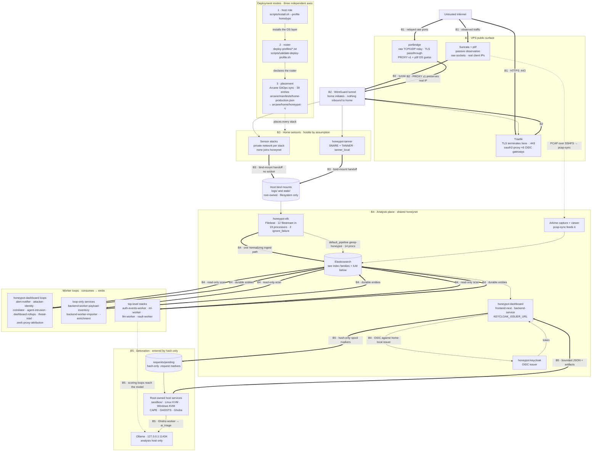
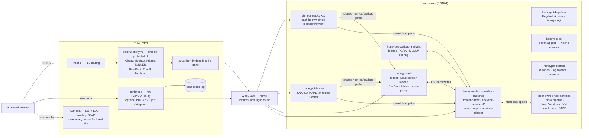
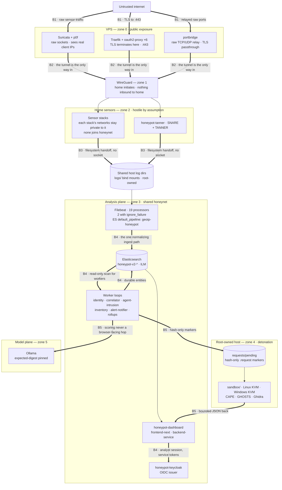
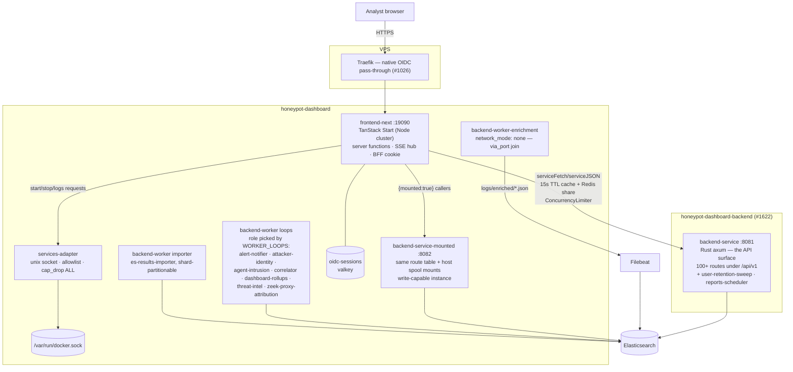
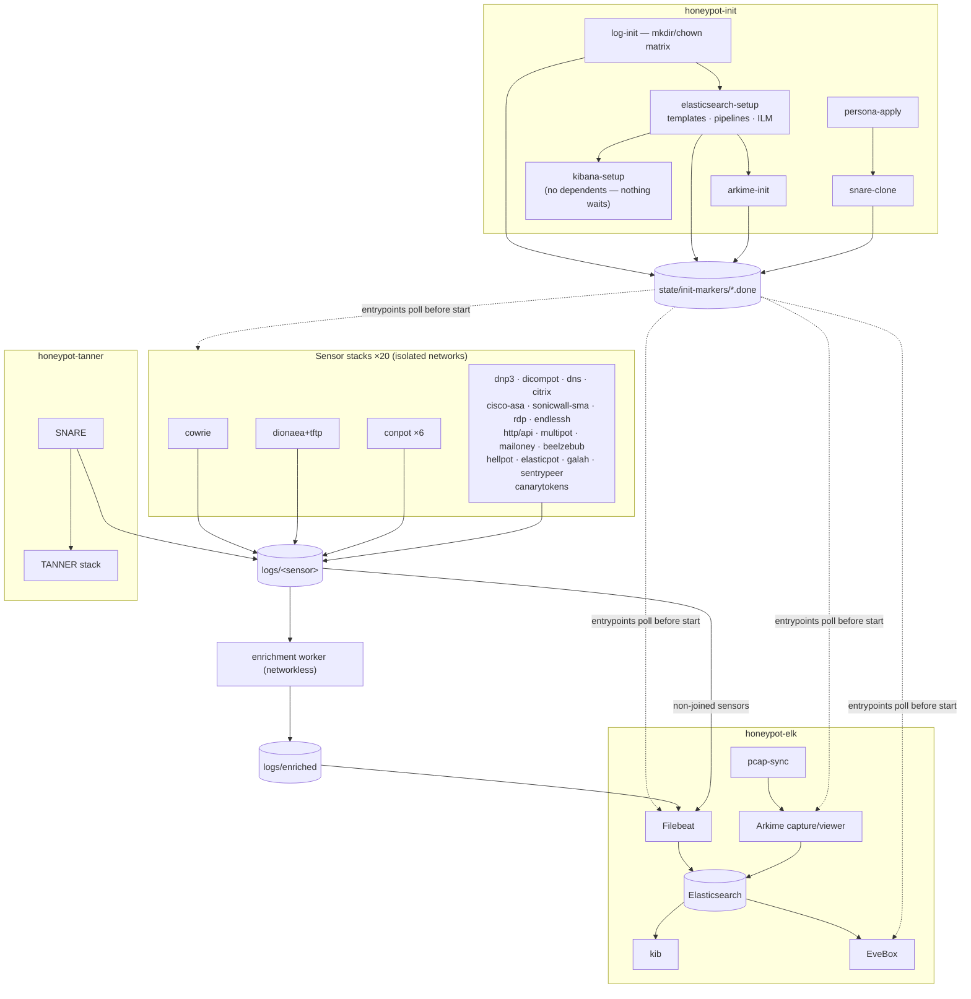
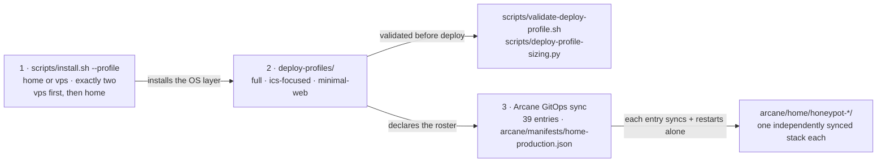
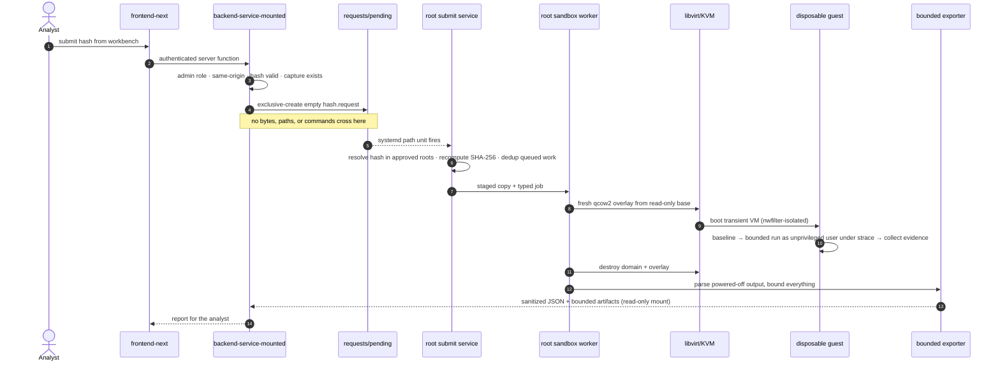

# System architecture

[← back to README](../README.md) · [Pipelines](PIPELINES.md) · [Network](NETWORK.md) · [Storage](STORAGE.md)

What runs where, what trusts what, and why the fleet is shaped this way.
Companion pages carry the detail this page summarizes: data flow in
[PIPELINES.md](PIPELINES.md), isolation and ingress in
[NETWORK.md](NETWORK.md), disk and index layout in
[STORAGE.md](STORAGE.md).

**Status basis:** everything here describes the live deployment as of the
dashboard cutover (#1628, completed 2026-08-22) — the Go dashboard is
deleted from compose, and the TanStack Start + Rust tiers serve traffic.
There is no runtime fallback and no profile gating left on the dashboard
serving path (`dashboard-next` runs unconditionally). Other compose
profiles still exist for optional/on-demand jobs and deprecated services
elsewhere in the repo — `grep -rn 'profiles:' --include='*.yml'` finds
all of them rather than this sentence trying to enumerate them and
rotting again; as of this writing that turns up eight distinct groups
(`geoip-update`, `threat-intel`, `mitm`, `test`, `blackhole`,
`file-extract`, `revdeck`, `legacy`).

## The ten-second version

A public VPS terminates attacker traffic — Suricata sniffs it, Traefik
routes HTTP through Keycloak-backed auth, portbridge relays raw protocol
ports — and forwards everything over a home-initiated WireGuard tunnel to
a homeserver running **33 Arcane-managed sensor/worker/utility stacks**
(plus 6 more at repository-root paths; 39 sync entries in
[`arcane/manifests/home-production.json`](../arcane/manifests/home-production.json),
which is authoritative — not `.github/workflows/deploy.yml`). Sensors
write JSON logs to shared host directories; Filebeat ships them into
Elasticsearch through one normalizing/enriching ingest pipeline; worker
loops aggregate raw events into durable entities (attackers, campaigns,
clusters, anomaly scores); and the dashboard tier serves it all to
analysts. Nothing captured is ever executed inside the fleet, and no
component's failure takes the analysis plane down with it.

## The self-contained map (#3497)

Everything #3497 asks for — event flow, trust boundaries, data stores,
worker loops, deployment modes — in one view, readable without opening a
second file. It is deliberately lossy: the three diagrams below and
[PIPELINES.md](PIPELINES.md) stay the readable detail view, and this one
exists so a reader never has to cross-reference a file to answer "where
does trust change hands, and what writes what".

Thick edges (`==>`) are **boundary crossings**, labelled `B1`…`B5`. Thin
edges are hops **within** a zone, where no privilege changes hands.

```mermaid
flowchart TB
  attacker["Untrusted internet"]

  subgraph z0["B1 · VPS public surface"]
    direction TB
    suri["Suricata + p0f<br/>passive observation<br/>raw sockets · real client IPs"]
    traefik["Traefik<br/>TLS terminates here · :443<br/>oauth2-proxy ×6 OIDC gateways"]
    pb["portbridge<br/>raw TCP/UDP relay · TLS passthrough<br/>PROXY v1 + p0f OS guess"]
  end

  wg["B2 · WireGuard tunnel<br/>home initiates · nothing inbound to home"]

  subgraph z2["B3 · Home sensors · hostile by assumption"]
    direction TB
    sensors["Sensor stacks<br/>private network per stack<br/>none joins honeynet"]
    tanner["honeypot-tanner<br/>SNARE + TANNER · tanner_local"]
  end

  logsT[("Host bind mounts<br/>logs/ and state/<br/>root-owned · filesystem only")]

  subgraph z3["B4 · Analysis plane · shared honeynet"]
    direction TB
    fb["honeypot-elk<br/>Filebeat · 12 filestream in<br/>19 processors · 2 ignore_failure"]
    es[("Elasticsearch<br/>see index families + ILM below")]
    ark["Arkime capture + viewer<br/>pcap-sync feeds it"]
    kc["honeypot-keycloak<br/>OIDC issuer"]
    dw["honeypot-dashboard<br/>frontend-next · backend-service<br/>KEYCLOAK_ISSUER_URL"]
  end

  subgraph zw["Worker loops · consumes → emits"]
    direction TB
    wdash["honeypot-dashboard loops<br/>alert-notifier · attacker-identity ·<br/>correlator · agent-intrusion ·<br/>dashboard-rollups · threat-intel ·<br/>zeek-proxy-attribution"]
    wded["loop-only services<br/>backend-worker-payload-inventory<br/>backend-worker-importer · -enrichment"]
    wtop["top-level stacks<br/>auth-events-worker · ml-worker ·<br/>llm-worker · vault-worker"]
  end

  subgraph z4["B5 · Detonation · entered by hash only"]
    direction TB
    spool[("requests/pending<br/>hash-only .request markers")]
    sand["Root-owned host services<br/>sandbox/ · Linux KVM · Windows KVM<br/>CAPE · GHOSTS · Ghidra"]
    ollama["Ollama · 127.0.0.1:11434<br/>analysis host only"]
  end

  subgraph z5["Deployment modes · three independent axes"]
    direction LR
    dm1["1 · host role<br/>scripts/install.sh --profile home|vps"]
    dm2["2 · roster<br/>deploy-profiles/*.txt<br/>scripts/validate-deploy-profile.sh"]
    dm3["3 · placement<br/>Arcane GitOps sync · 39 entries<br/>arcane/manifests/home-production.json<br/>→ arcane/home/honeypot-*/"]
  end

  attacker ==>|"B1 · observed traffic"| suri
  attacker ==>|"B1 · HTTPS :443"| traefik
  attacker ==>|"B1 · relayed raw ports"| pb

  suri ==>|"B2 · tunnel only way in"| wg
  traefik ==>|"B2"| wg
  pb ==>|"B2 · PROXY v1 preserves real IP"| wg

  wg --> sensors
  wg --> tanner
  wg --> traefik

  sensors ==>|"B3 · bind-mount handoff · no socket"| logsT
  tanner ==>|"B3 · bind-mount handoff"| logsT
  logsT --> fb
  suri -.->|"PCAP over SSHFS → pcap-sync"| ark

  fb ==>|"B4 · one normalizing ingest path"| es
  fb -->|"default_pipeline geoip-honeypot · 14 procs"| es
  ark --> es

  es ==>|"B4 · read-only scan"| wdash
  es ==>|"B4 · read-only scan"| wded
  es ==>|"B4 · read-only scan"| wtop
  wdash ==>|"B4 · durable entities"| es
  wded ==>|"B4 · durable entities"| es
  wtop ==>|"B4 · durable entities"| es

  es --> dw
  dw -->|"B4 · OIDC against home-local issuer"| kc
  kc -->|"token"| dw

  dw ==>|"B5 · hash-only spool markers"| spool
  spool --> sand
  sand ==>|"B5 · bounded JSON + artifacts"| dw
  wtop -.->|"B5 · scoring loops reach the model"| ollama
  sand -->|"B5 · Ghidra worker → ai_triage"| ollama

  dm1 -->|"installs the OS layer"| dm2
  dm2 -->|"declares the roster"| dm3
  dm3 -.->|"places every stack"| z2
```

As a standalone file this diagram is also explorable — hover any node for
its stores and loops, follow a route, toggle themes:
[`diagrams/apiary-trust-boundaries.html`](diagrams/apiary-trust-boundaries.html)
(interactive) and [`diagrams/apiary-trust-boundaries.svg`](diagrams/apiary-trust-boundaries.svg)
(static, for embedding). Open the HTML from the filesystem or any static
host; GitHub will not render it inline.

Reading it: zone 2 is the only zone that *expects* to be attacked, so
nothing in it is trusted downstream — bytes leave by bind mount, never by
socket. Zone 4 holds the only code that executes captured samples, and the
only thing crossing into it is a hash. Ollama publishes on
`127.0.0.1` only, on the analysis host that also holds the captured
malware, and is reached by the scoring loops — never by a browser.

### Data stores — what writes, what reads

| Store | Written by | Read by |
|---|---|---|
| `honeypot-v2-*` (data stream), ILM `honeypot-30d` | Filebeat + `geoip-honeypot` | all workers, dashboard, Kibana |
| `suricata-*`, ILM `suricata-7d` | Filebeat | dashboard, workers, EveBox |
| `portbridge-v2-*`, ILM `portbridge-30d` | Filebeat | dashboard, zeek-proxy-attribution |
| `zeek-v1-*` / `zeek-proxy-v1-*`, ILM `zeek-60d` / `zeek-proxy-60d` | Filebeat | dashboard, attribution loop |
| `traefik-v1-*`, ILM `traefik-30d` | Filebeat | dashboard |
| `dead-letter-honeypot*`, ILM `dead-letter-60d` | Elasticsearch itself (rejected docs) | dead-letters page, source-health |
| `*-analysis-v1` (ghidra/sandbox/cape/revdeck/github), ILM `analysis-results-180d` | `backend-worker-importer` (read-only mirror) | identity worker, workbench |
| `attackers-v1`, `campaigns-v1`, `attacker-clusters-v1`, `agent-intrusion-campaigns` | the corresponding loops | dashboard pages |
| `dashboard-alert-state-v1`, `overview/geo/attack-rollup-v1` | alert-notifier, dashboard-rollups | alerts, overview, map, kill-chain |
| `dashboard-payload-inventory-v1`, `dashboard-payload-bytes-v1` | backend-worker-payload-inventory | payloads page, charts |
| `ml-anomalies`, `dashboard-ml-anomaly-ack-v1` | ml-worker, llm-worker | ml-anomalies page, composite score |
| `auth-failure-events`, `auth-events-worker-state` | auth-events-worker | dashboard auth panes |
| `knowledge-vault-search-v1`, `knowledge-vault-state-v1` | vault-worker | vault search |
| `reporter-metrics-v1` | `honeypot-utilities` reporter | settings stats pane |
| Arkime index + `arkime-pcap` volume | `pcap-sync` → arkime-capture | arkime-viewer |
| host `logs/` + `state/` bind mounts | sensors, tanner, `honeypot-init` | Filebeat, workers, payload path |
| generated-report store | `reports-scheduler`, reporter | analyst downloads |
| `requests/pending` spool (hash-only) | backend-service-mounted | root submit service, sandbox workers |

The three ILM names are policy *names*, not durations: `suricata-7d`,
`honeypot-30d` and `dead-letter-60d` derive their `delete.min_age` from
`HONEYPOT_RETENTION_DAYS` at setup time, so shrinking the knob shrinks
retention for all of them
([STORAGE.md](STORAGE.md#retention-and-lifecycle) has the full set).

### Worker loops — consumes → emits

| Loop | Where it runs | Consumes | Emits |
|---|---|---|---|
| alert-notifier | `honeypot-dashboard` `WORKER_LOOPS` | `attackers-v1`, `campaigns-v1`, `agent-intrusion-campaigns` | `dashboard-alert-state-v1` + webhook |
| attacker-identity | `honeypot-dashboard` `WORKER_LOOPS` | `honeypot-v2-*`, `*-analysis-v1` | `attackers-v1` |
| correlator | `honeypot-dashboard` `WORKER_LOOPS` | raw events | `campaigns-v1`, `attacker-clusters-v1` |
| agent-intrusion | `honeypot-dashboard` `WORKER_LOOPS` | raw events | `agent-intrusion-campaigns` |
| dashboard-rollups | `honeypot-dashboard` `WORKER_LOOPS` | raw event indices | `overview/geo/attack-rollup-v1` |
| threat-intel | `honeypot-dashboard` `WORKER_LOOPS` | raw events, `threat-cidrs.csv` | `source.as.type` in place |
| zeek-proxy-attribution | `honeypot-dashboard` `WORKER_LOOPS` | zeek flows + portbridge log | flow documents |
| payload-inventory | `backend-worker-payload-inventory` | payload dirs on disk | `dashboard-payload-{inventory,bytes}-v1` |
| es-results-importer | `backend-worker-importer` | root-owned result spools | `*-analysis-v1` |
| ip-enrichment | `backend-worker-enrichment` (`network_mode: none`) | raw sensor logs | `logs/enriched/*.json` |
| auth-events-worker | top-level `auth-events-worker/` | Keycloak realm events | `auth-failure-events` |
| ml-worker | top-level `ml-worker/` | payloads + events | `ml-anomalies` |
| llm-worker | top-level `llm-worker/` | payloads + sessions | `llm-analysis`, `ml-anomalies` |
| vault-worker | top-level `vault-worker/` | `*-analysis-v1`, `llm-analysis` | vault markdown + `knowledge-vault-search-v1` |

Two structural facts the diagram encodes deliberately, because both were
got wrong in an earlier draft:

- Only `auth-events-worker`, `llm-worker`, `ml-worker` and `vault-worker`
  are top-level directories. `arcane/home/honeypot-attacker-identity-worker/`,
  `-correlator-worker/`, `-payload-inventory-worker/` and
  `-agent-intrusion-worker/` still exist as Arcane sync entries, but every
  service in all four is `profiles: ["legacy"]` — retired under #1649,
  defined only for rollback. The loops run as `WORKER_LOOPS` roles on the
  dashboard's backend image, not as those stacks.
- The property that holds about sensor networking is that **no sensor
  stack joins the shared `honeynet` network** — each keeps its own
  (`cowrie_net`, `dionaea_net`, six `conpot_*_net`, `tanner_local`, …). A
  sensor stack is not single-member: cowrie runs 2 services on
  `cowrie_net`, tanner 7 on `tanner_local`.

### Deployment modes

Three independent axes, easy to conflate:
`scripts/install.sh --profile home|vps` picks the **host role**;
`deploy-profiles/*.txt` plus `scripts/validate-deploy-profile.sh` declare
the **roster**; the Arcane GitOps sync of the 39 entries in
[`arcane/manifests/home-production.json`](../arcane/manifests/home-production.json)
decides **placement**. The manifest is authoritative for *what runs* —
not `.github/workflows/deploy.yml`. A deployment may run a narrower
roster than the manifest lists.

Cross-reference: the diagrams below and
[PIPELINES.md §2](PIPELINES.md#2-derived-intelligence-the-worker-loops)
carry the per-worker cadences and the full index catalogue this map
compresses.

## The ten-second version, as drawn

The map above answers where trust changes hands. This one answers what
talks to what, at a glance, without the boundary labelling in the way.
Together they cover the same fleet; neither replaces the other.

```mermaid
flowchart LR
  attacker["Untrusted internet"]

  subgraph vps["Public VPS"]
    direction TB
    suri["Suricata — IDS + EVE + rotating PCAP<br/>sees every packet first, real IPs"]
    traefik["Traefik — TLS routing"]
    oauth["oauth2-proxy ×6 — one per protected UI<br/>Kibana, EveBox, Arkime, TANNER,<br/>Rev·Deck, Traefik dashboard"]
    bridges["socat-hp-* bridges into the tunnel"]
    pb["portbridge — raw TCP/UDP relay<br/>optional PROXY v1, p0f OS guess"]
    connlog[("connection log")]
  end

  wg["WireGuard — home initiates, nothing inbound"]

  subgraph home["Home server (CGNAT)"]
    direction TB
    kc["honeypot-keycloak<br/>Keycloak + private PostgreSQL"]
    init["honeypot-init<br/>bootstrap jobs → *.done markers"]
    sensors["Sensor stacks ×20<br/>each its own single-member network"]
    tanner["honeypot-tanner<br/>SNARE+TANNER+nested Docker"]
    elk["honeypot-elk<br/>Filebeat · Elasticsearch · Kibana<br/>EveBox · Arkime · zeek-proxy"]
    dash["honeypot-dashboard (+ -backend)<br/>frontend-next · backend-service ×2<br/>worker loops · services-adapter"]
    payloads["honeypot-payload-analysis<br/>dedupe · YARA · ML/LLM scoring"]
    utils["honeypot-utilities<br/>autoheal · log rotation · reporter"]
    host["Root-owned host services<br/>Ghidra pipeline · Linux/Windows KVM sandboxes · CAPE"]
  end

  attacker -->|"HTTPS"| traefik
  attacker -->|"raw ports"| pb
  attacker -.->|"observed by"| suri
  traefik --> oauth --> bridges
  pb --> connlog
  bridges & pb --> wg
  wg --> sensors & tanner & elk & dash
  sensors & tanner -->|"shared host log/payload paths"| elk
  sensors & tanner -->|"shared host paths"| dash
  elk <-->|"ES reads/writes"| dash
  payloads <--> dash
  dash <-.->|"hash-only spools"| host
```

## Trust boundaries as drawn edges (#3497)

The ten-second diagram above shows *what* talks to *what*. It does not show
where trust changes hands, which is the question an operator actually has
when deciding whether a sensor can be treated as hostile. Every thick edge
below is one boundary crossing (`B1`…`B5`); every thin edge is a hop
*within* a zone, where no privilege change happens.

```mermaid
flowchart TB
  attacker["Untrusted internet"]

  subgraph z0["VPS — zone 0 · public exposure"]
    direction TB
    suri["Suricata + p0f<br/>raw sockets · sees real client IPs"]
    traefik["Traefik + oauth2-proxy ×6<br/>TLS terminates here · :443"]
    pb["portbridge<br/>raw TCP/UDP relay · TLS passthrough"]
  end

  wg["WireGuard — zone 1<br/>home initiates · nothing inbound to home"]

  subgraph z2["Home sensors — zone 2 · hostile by assumption"]
    direction TB
    sensors["Sensor stacks<br/>each stack's networks stay private to it<br/>none joins honeynet"]
    tanner["honeypot-tanner · SNARE + TANNER"]
  end

  logsT[("Shared host log dirs<br/>logs/ bind mounts · root-owned")]

  subgraph z3["Analysis plane — zone 3 · shared honeynet"]
    direction TB
    fb["Filebeat · 19 processors<br/>2 with ignore_failure<br/>ES default_pipeline: geoip-honeypot"]
    es[("Elasticsearch<br/>honeypot-v2-* · ILM")]
    loops["Worker loops<br/>identity · correlator · agent-intrusion<br/>inventory · alert-notifier · rollups"]
    dash["honeypot-dashboard<br/>frontend-next · backend-service"]
    kc["honeypot-keycloak<br/>OIDC issuer"]
  end

  subgraph z4["Root-owned host — zone 4 · detonation"]
    direction TB
    spools[("requests/pending<br/>hash-only .request markers")]
    sand["sandbox/ · Linux KVM · Windows KVM<br/>CAPE · GHOSTS · Ghidra"]
  end

  subgraph z5["Model plane — zone 5"]
    ollama["Ollama<br/>expected-digest pinned"]
  end

  attacker ==>|"B1 · raw sensor traffic"| suri
  attacker ==>|"B1 · TLS to :443"| traefik
  attacker ==>|"B1 · relayed raw ports"| pb
  suri ==>|"B2 · the tunnel is the only way in"| wg
  traefik ==>|"B2 · the tunnel is the only way in"| wg
  pb ==>|"B2 · the tunnel is the only way in"| wg
  wg --> sensors
  wg --> tanner
  sensors ==>|"B3 · filesystem handoff, no socket"| logsT
  tanner ==>|"B3 · filesystem handoff, no socket"| logsT
  logsT --> fb
  fb ==>|"B4 · the one normalizing ingest path"| es
  es ==>|"B4 · read-only scan for workers"| loops
  loops ==>|"B4 · durable entities"| es
  es --> dash
  dash ==>|"B4 · analyst session, service tokens"| kc
  loops ==>|"B5 · hash-only markers"| spools
  spools --> sand
  sand ==>|"B5 · bounded JSON back"| dash
  loops ==>|"B5 · scoring never a browser-facing hop"| ollama
```

Reading the zones: zone 2 is the only one that *expects* to be attacked, so
nothing in it is trusted downstream — bytes leave it by bind mount, never by
socket. Zone 4 holds the only code that executes captured samples, and the
only thing crossing into it is a hash. Zone 5 is reached by the scoring loops
alone; the browser never addresses a model endpoint directly.

The home side is deliberately **not** one deployment unit. #258 split the
original monolith; #1502 moved every piece onto Arcane's directory-aware
Git sync ([ARCANE-GIT-SYNC.md](ARCANE-GIT-SYNC.md)). Each stack deploys,
restarts, and fails independently — but they are *not* network-isolated
from each other the way the VPS/home boundary is: most share the
`honeynet` Docker network by name and the same bind-mounted `logs/`/
`state/` trees, which is exactly how sensor bytes reach Elasticsearch
without any direct socket between sensor and analyzer
([NETWORK.md](NETWORK.md) carries the isolation rules).

The same boundaries in prose, strongest first (the numbering below is
independent of `B1`…`B5` above — these are ordered by strength, those by
position):

1. **Internet ↔ VPS**: only Suricata/p0f raw sockets, Traefik :443, and
   portbridge's relayed ports are reachable; ufw seeds the rest.
2. **VPS ↔ home**: WireGuard, home-initiated. The home server has no
   inbound exposure at all (CGNAT); every published container port binds
   `${HP_BIND}` = the tunnel IP.
3. **Sensor ↔ analysis plane**: filesystem handoff across isolated Docker
   networks (#235) — a compromised sensor has no lateral network path.
4. **Dashboard ↔ Docker daemon**: services-adapter's allowlisted unix
   socket, never docker.sock directly.
5. **Analyst ↔ detonation**: hash-only `.request` markers; sample bytes,
   paths, and commands never cross a privilege boundary.

## The dashboard tier (post-cutover)

One logical app, five containers plus its split-out sibling stack:

```mermaid
flowchart TB
  analyst["Analyst browser"]

  subgraph vps2["VPS"]
    t["Traefik — native OIDC pass-through (#1026)"]
  end

  subgraph stack["honeypot-dashboard"]
    fe["frontend-next :19090<br/>TanStack Start (Node cluster)<br/>server functions · SSE hub · BFF cookie"]
    bsm["backend-service-mounted :8082<br/>same route table + host spool mounts<br/>write-capable instance"]
    loops["backend-worker loops<br/>role picked by WORKER_LOOPS:<br/>alert-notifier · attacker-identity ·<br/>agent-intrusion · correlator · dashboard-rollups ·<br/>threat-intel · zeek-proxy-attribution"]
    imp["backend-worker importer<br/>es-results-importer, shard-partitionable"]
    enr["backend-worker-enrichment<br/>network_mode: none — via_port join"]
    redis[("oidc-sessions<br/>valkey")]
    adapter["services-adapter<br/>unix socket · allowlist · cap_drop ALL"]
    sock[("/var/run/docker.sock")]
  end

  subgraph stackbe["honeypot-dashboard-backend (#1622)"]
    bs["backend-service :8081<br/>Rust axum — the API surface<br/>100+ routes under /api/v1<br/>+ user-retention-sweep · reports-scheduler"]
  end

  es[("Elasticsearch")]

  analyst -->|"HTTPS"| t --> fe
  fe -->|"serviceFetch/serviceJSON<br/>15s TTL cache + Redis share<br/>ConcurrencyLimiter"| bs
  fe -->|"{mounted:true} callers"| bsm
  fe --- redis
  bs & bsm & loops & imp --> es
  enr -->|"logs/enriched/*.json"| fb2["Filebeat"] --> es
  fe -->|"start/stop/logs requests"| adapter --> sock
```

Division of labor:

- **frontend-next** owns sessions: OIDC against home-local Keycloak,
  `__Host-apiary_bff` cookie, session state in the valkey sidecar. All
  backend access flows through typed server functions — the browser never
  speaks to Elasticsearch or sees service tokens. Live updates ride one
  shared SSE stream whose frames match the Rust emitter's `event` naming.
- **backend-service (:8081)** — the unprivileged API tier, and the only
  service in the sibling `honeypot-dashboard-backend` stack (#1622 split it
  out so Arcane can redeploy the API tier without touching `dashboard-next`).
  Constant-time service-token middleware, 30s ES timeouts, PIT +
  `search_after` pagination everywhere, CAS writes. It also hosts two
  embedded worker loops of its own (`user-retention-sweep`,
  `reports-scheduler`) — the same image plays each role selected by
  `WORKER_LOOPS`.
- **backend-service-mounted (:8082)** is the same code with the host-side
  request-spool mounts (CAPE/Ghidra/GitHub-analysis/GHOSTS/sandbox/
  Windows-sandbox/Rev·Deck), and it lives in `honeypot-dashboard` itself,
  not in the sibling stack — the name that says "mounted" is the one that
  carries the mounts. Only this instance can dispatch analysis jobs;
  frontend callers resolve it explicitly via `{mounted: true}`, so
  capability follows configuration, not URL guessing.
- **Worker containers**: importer mirrors root-owned result spools into
  `*-analysis-v1` indices (read-only, never writes back — local JSON stays
  authoritative); enrichment does the ingest-time source-IP join with no
  network at all; the loop container runs the seven aggregation workers
  (cadences and outputs in [PIPELINES.md](PIPELINES.md#2-derived-intelligence-the-worker-loops)).
- **services-adapter** remains the Services pane's only path to Docker:
  frozenset allowlist checked before any Engine call, three actions plus
  logs, demuxed frames, socket `0600`.

Single replica per component; a redeploy accepts the brief recreate
window and Traefik's active `/healthz` check turns it into clean 502s.
Background loops must not double-fire, which is why they are pinned to
one loop container rather than leader-elected.

## Home container interaction map

```mermaid
flowchart TB
  subgraph hi["honeypot-init"]
    loginit["log-init — mkdir/chown matrix"] --> esinit["elasticsearch-setup<br/>templates · pipelines · ILM"]
    esinit --> arkinit["arkime-init"] & kibanainit["kibana-setup<br/>(no dependents — nothing waits)"]
    persona["persona-apply"] --> snareclone["snare-clone"]
  end
  markers[("state/init-markers/*.done")]
  loginit & esinit & arkinit & snareclone --> markers

  subgraph sg["Sensor stacks ×20 (isolated networks)"]
    direction LR
    cow["cowrie"] & dion["dionaea+tftp"] & conp["conpot ×6"] & rest["dnp3 · dicompot · dns · citrix<br/>cisco-asa · sonicwall-sma · rdp · endlessh<br/>http/api · multipot · mailoney · beelzebub<br/>hellpot · elasticpot · galah · sentrypeer<br/>canarytokens"]
  end

  logsT[("logs/&lt;sensor&gt;")]
  enrichW["enrichment worker (networkless)"] --> enrichedT[("logs/enriched")]
  logsT --> enrichW

  subgraph elkS["honeypot-elk"]
    fbeat["Filebeat"] --> esc[("Elasticsearch")]
    esc --> kib & eve["EveBox"]
    pcapSync["pcap-sync"] --> arkC["Arkime capture/viewer"] --> esc
  end

  subgraph tn["honeypot-tanner"]
    snareN["SNARE"] --> tanN["TANNER stack"]
  end

  markers -.->|"entrypoints poll before start"| sg & fbeat & eve & arkC
  cow & dion & conp & rest --> logsT
  enrichedT --> fbeat
  logsT -->|"non-joined sensors"| fbeat
  snareN --> logsT
```

`honeypot-init` runs first among peers; because Compose
`depends_on` cannot span stacks, dependents poll marker files at
entrypoint instead — the cross-stack readiness contract documented in
[STORAGE.md](STORAGE.md#host-tree).

## Deployment modes (#3497)

Three independent decisions. None of them is the same axis, and conflating
them is how a fleet ends up running a sensor roster nobody declared.

```mermaid
flowchart LR
  inst["1 · scripts/install.sh --profile<br/>home or vps · exactly two<br/>vps first, then home"]
  prof["2 · deploy-profiles/<br/>full · ics-focused · minimal-web"]
  val["scripts/validate-deploy-profile.sh<br/>scripts/deploy-profile-sizing.py"]
  sync["3 · Arcane GitOps sync<br/>39 entries · arcane/manifests/home-production.json"]
  stacks["arcane/home/honeypot-*/<br/>one independently synced stack each"]

  inst -->|"installs the OS layer"| prof
  prof -->|"validated before deploy"| val
  prof -->|"declares the roster"| sync
  sync -->|"each entry syncs + restarts alone"| stacks
```

- **Host roles** — `scripts/install.sh` takes exactly `--profile home|vps`.
  Bootstrap order for a fresh pair is `vps` first (it mints
  `VPS_WG_PUBLIC_KEY`), then `home`.
- **Roster** — [`deploy-profiles/`](../deploy-profiles/) lists stack names
  only; [`docs/deploy-profiles/README.md`](deploy-profiles/README.md) carries
  the structural-dependency rules the validator enforces, plus the known gap
  (`full.txt` omits `honeypot-sonicwall-sma`).
- **Sync** — `arcane/manifests/home-production.json` is the source of truth
  for *what runs*; `.github/workflows/deploy.yml` deploys no home stack
  itself since #1502. An operator can run a narrower roster than the
  manifest lists.

The profile list and the manifest are deliberately separate concerns: the
manifest says what Arcane knows how to sync, the profile says what this
deployment chooses to run. `deploy-profiles/` is checked by the validator
against the real `arcane/home/` directories, so a retired stack name fails
at validation rather than mid-deploy.

## Event ingestion (summary)

The full pipeline — PROXY-aware vs tunnel-blind sensor split, the
ingest-time `via_port` join, the 14-processor `geoip-honeypot` chain,
and the dashboard's four read paths — is
[PIPELINES.md §1](PIPELINES.md#1-event-ingestion). Facts that shape
everything else:

- Every document passes one ES ingest pipeline; processors are
  `ignore_failure`, so enrichment never blocks indexing.
- Source attribution happens once, at ingest, for the five sensors that
  need it; an unattributable flow stays honestly tunnel-tagged and is
  counted (`unattributed_24h`) rather than guessed.
- Suricata and portbridge are the only local-file live reads left; every
  honeypot sensor is ES-only by design (#1103).

## Correlation and analysis surfaces

Enrichment adds signal to one event at ingest; correlation links records
on demand — drill-in only, never paid for list-page rows:

- **IP/CIDR correlation** (`investigate.rs`): bounded ES query across all
  three index families → sensor breakdown, tunnel OS guesses, records.
- **Hash correlation** (`ioc_correlation.rs`, `payload_static_analysis.rs`):
  known-elsewhere checks keyed by SHA-256 **and MD5** (Dionaea names
  captures by MD5 — a SHA-256-only search would silently miss them).
- **Cluster/campaign correlation** (`correlator.rs`, `campaign_correlator.rs`,
  `fusion.rs`): groups ≥2 source IPs sharing a fingerprint (HASSH /
  SSH banner / JA3-JA4 / UA / p0f OS), payload hash, ASN, or provider
  class; agent-intrusion builds escalated campaigns with deterministic
  ids (upsert-safe).
- **Kill-chain view** (`kill_chain.rs`): ATT&CK-mapped progression over
  the correlated entities.

Fingerprints are read, not computed, by this fleet: Cowrie emits HASSH +
client banner itself, Suricata provides JA3/JA4, proxies provide x-ja3/x-ja4
headers, p0f contributes a fallback OS guess when no handshake happened.
Since #1970 each of those lands as a typed `fingerprint.kind` /
`fingerprint.value` pair at ingest (one collapse per document, mirroring
`pivots_from_source`'s precedence), so the clustering above is reproducible
from pure ES terms aggregations — Kibana and ml-worker pivot on it without
the dashboard running. None of these claims identity — shared software or
shared networks compress investigation effort; they are not verdicts.

## Agent-intrusion escalation (summary)

Ported from the standalone Python worker to the Rust loop
(`agent_intrusion.rs` + `criticality_rules.rs` + `campaign_correlator.rs`
+ `decode_correlate.rs`); the original stack
(`honeypot-agent-intrusion-worker/`) now hosts the labelled corpus and the
Tier 1 contract benchmark that pins rule behavior. Design unchanged and
load-bearing:

- **Deterministic rules escalate; models never gate alerts.** Rules read
  raw event structure; bounded decode inspects suspicious blobs without
  executing anything.
- **Rolling-window recompute + deterministic campaign_id ⇒ idempotent
  upserts**, no checkpoint state to corrupt.
- Low/medium severity campaigns are not written — the silence is the point.

## Captured payload lifecycle and static analysis

Full flow in [PIPELINES.md §3](PIPELINES.md#3-payload-lifecycle).
Invariants: captures are content never configuration; dedupe preserves
every source path via hard links; YARA is networkless/read-only; static
analysis is cached content-addressed and immutable; the workbench
(`workbench_domain.rs`, `workbench_orchestrator.rs`) is the single
dispatch surface — up to 5 analyzers per run from a fixed registry of 7,
each resolving to hash-only spool markers.

## Sandbox submission, detonation, and result return

Four dynamic-detonation routes (Linux KVM, Windows KVM, GHOSTS, CAPE),
each its own guest, network, and spool; the canonical side-by-side is
[sandbox/README.md](sandbox/README.md). The Linux sequence below is kept
as the reference walk-through — submission arrives at
`sandbox_submit.rs` behind the mounted instance, and every arrow after
the first is root-owned infrastructure the dashboard container cannot
touch:

```mermaid
sequenceDiagram
  autonumber
  actor Analyst
  participant FE as frontend-next
  participant BSM as backend-service-mounted
  participant Spool as requests/pending
  participant Submit as root submit service
  participant Worker as root sandbox worker
  participant Libvirt as libvirt/KVM
  participant Guest as disposable guest
  participant Export as bounded exporter

  Analyst->>FE: submit hash from workbench
  FE->>BSM: authenticated server function
  BSM->>BSM: admin role · same-origin · hash valid · capture exists
  BSM->>Spool: exclusive-create empty hash.request
  Note over BSM,Spool: no bytes, paths, or commands cross here
  Spool-->>Submit: systemd path unit fires
  Submit->>Submit: resolve hash in approved roots · recompute SHA-256 · dedup queued work
  Submit->>Worker: staged copy + typed job
  Worker->>Libvirt: fresh qcow2 overlay from read-only base
  Libvirt->>Guest: boot transient VM (nwfilter-isolated)
  Guest->>Guest: baseline → bounded run as unprivileged user under strace → collect evidence
  Worker->>Libvirt: destroy domain + overlay
  Worker->>Export: parse powered-off output, bound everything
  Export-->>BSM: sanitized JSON + bounded artifacts (read-only mount)
  BSM-->>FE: report for the analyst
```

Failure modes stay visible: `guest-no-result`, `host-timeout`, and
static-only refusals are distinct outcomes, never folded into "clean".

## Analysis result interpretation

The stack deliberately keeps observation types separate:

- **Static evidence** — bytes, structure, strings, imports, signatures.
  Never proves execution.
- **Dynamic evidence** — what the bounded guest run observed.
- **Network IDS evidence** — what Suricata matched on public traffic.
- **Full-packet evidence** — what Arkime can reconstruct.
- **Correlation evidence** — shared infrastructure/hashes/fingerprints;
  never claims actor identity.
- **Failure/timeout evidence** — visibly distinct from "no malicious
  behavior observed".

Risk scores and ATT&CK mappings are conservative triage aids linked to
their evidence. They must never trigger automatic firewall changes,
public reporting, or sample execution.
