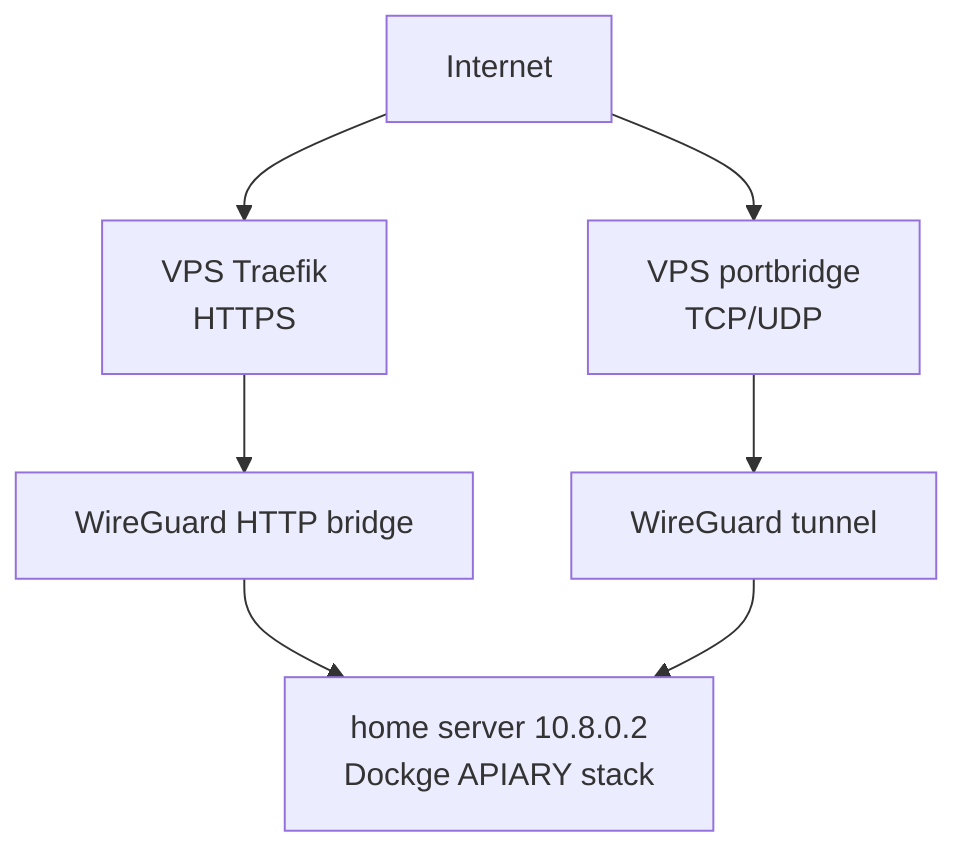
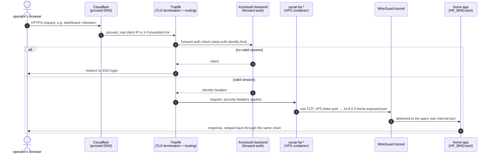

# CGNAT deployment

The deployment is deliberately split between a public VPS and a home server
behind CGNAT.



## Authoritative deployment paths

- Home server: **#258 split what used to be two stacks into one Dockge
  project per compose file** — `honeypot-init` (one-shot bootstrap: log
  paths, Elasticsearch templates, Arkime schema, persona validation),
  `honeypot-elk`, `honeypot-cowrie`, `honeypot-dionaea`, `honeypot-conpot`,
  `honeypot-dnp3`, `honeypot-http`, `honeypot-multipot`,
  `honeypot-payload-analysis`, `honeypot-tanner`, `honeypot-dashboard`,
  `honeypot-utilities`, plus the standalone honeypots
  (`docker-compose.cisco-asa-honeypot.yml`, `.citrix-honeypot.yml`,
  `.rdp-honeypot.yml`, `.dicompot.yml`, `.dns-honeypot.yml`) and
  `docker-compose.ip-enrichment-worker.yml`, each its own stack. The
  top-level `docker-compose.yml` (project `APIARY`) is now a
  deliberately empty marker (`services: {}`) kept only because
  `/opt/stacks/honeypot-stack` is still the fixed path every other stack's
  `build:` context points at as an absolute string — see that file's own
  header comment. `honeypot-init` still deploys first; every sensor stack
  waits on its completion markers at its own entrypoint rather than a
  Compose-level dependency, same reasoning as before, just across more
  projects now. See `docs/STACK-REBUILD.md` for the full current list and
  the ordering traps (Elasticsearch must be healthy before `honeypot-init`
  runs, not the other way around).
- VPS: plain Docker Compose manages `/root/vps/docker-compose.yml`.
- The repository home Compose sources are the top-level `docker-compose.*.yml`
  files, one per stack listed above; each gets symlinked or copied to its
  Dockge stack directory as `compose.yml`. `scripts/install-homeserver.sh`
  does this automatically (see below) — the per-stack directory layout
  matches what `docs/HOMESERVER-DISK-LAYOUT.md` documents as the box's
  actual live state (`/var/dockge/stacks/<name>/`, with `/opt/stacks`
  symlinked to it).
- The public gateway source is under `vps/`.

Dockge is used only on the home server. The VPS uses `docker compose` directly.

## WireGuard addressing

The examples reserve `10.8.0.1` for the VPS and `10.8.0.2` for the home server.
Change the subnet consistently if it conflicts with an existing network.
Sensors bind `HP_BIND=10.8.0.2`, never the home LAN address. The VPS gateway is
the only internet-facing component.

## Home deployment

> **Prefer the script.** [`scripts/install-homeserver.sh`](../scripts/install-homeserver.sh)
> automates Docker, GPU/NVIDIA, WireGuard, Dockge, the repo checkout,
> per-stack provisioning, secret restore, and starting every stack in the
> correct order (plus the GPU/LLM/ML worker chain and, optionally, the
> KVM/libvirt sandbox VMs) against a manually-installed base Ubuntu system
> — fill in
> [`scripts/install-homeserver.conf.example`](../scripts/install-homeserver.conf.example)
> first. Run multiple times end-to-end (including a from-genuinely-fresh
> install and a full idempotent re-run) under
> [#518](https://github.com/Xore/APIARY/issues/518), with real bugs
> found and fixed each pass — it's the current source of truth for the
> real deployment order, not the numbered steps below, which describe the
> pre-#258 two-stack model and haven't been re-verified against the current
> per-stack split. File a gap against #518 if the script and reality ever
> disagree.

1. Establish WireGuard and verify that the VPS can reach `10.8.0.2`.
2. Copy this repository to `/opt/stacks/honeypot-stack/`.
3. Copy `.env.example` to `.env` in `/opt/stacks/honeypot-stack/` and generate
   every value marked `CHANGE_ME`.
4. Create `/opt/stacks/honeypot-init/`, copy `docker-compose.init.yml` from
   the repo into it as `compose.yml`, and copy the repo's
   `honeypot-init.env.example` to `.env` there (set
   `ARKIME_ADMIN_PASSWORD`/`ARKIME_PASSWORD_SECRET` — the latter must match
   the value in `APIARY`'s `.env` exactly).
5. Before first deploying `honeypot-init`:
   `install -d -m 777 /opt/stacks/honeypot-stack/state/init-markers` — its
   jobs run as several different container UIDs, and a root-owned 755
   directory 403's the non-root ones.
6. Ensure the repository `docker-compose.yml` is also present as
   `/opt/stacks/honeypot-stack/compose.yml`.
7. In Dockge, validate and deploy **`honeypot-init` first**, then
   `APIARY`. `APIARY`'s sensors wait on `honeypot-init`'s
   completion markers at their own entrypoint rather than a Compose-level
   dependency (they can't cross a Compose project boundary) — deploying
   `APIARY` first won't fail, but nothing finishes initialising
   (log paths, Elasticsearch templates, Arkime schema) until `honeypot-init`
   has run at least once. See the root `README.md`'s "Home container
   interaction map" for why these are two stacks.
8. Run `python3 analysis/verify-stack.py` and inspect `/source-health`.

Each stack is a folder under your Dockge stacks dir (default `/opt/stacks/`).
Upload the whole home folder via SFTP — compose **and** the build
sub-folders (`cowrie/`, `multipot/`, `http-honeypot/`, `dashboard/`, …) —
since Dockge's own editor only edits the compose file. After editing Go
source or honeyfs content, rebuild from the `APIARY` stack's Dockge
**terminal**: `docker compose -f compose.yml up -d --build`.

### Boot-safe home networking and VPS log mounts

The home stack reads Suricata and portbridge logs through read-only SSHFS
mounts over `wg0`. `_netdev` only orders an fstab mount after
`network-online.target`; it does not guarantee that the WireGuard interface is
ready. Likewise, SSHFS's `reconnect` option only reconnects a session that was
successfully established once.

On the reference homeserver, the 10 GbE interface `ens9f0` is the required
uplink. `eno1` and `eno2` are optional. Install the Netplan override first:

```bash
sudo ./setup-home-network.sh
sudo netplan try
```

The first command writes and validates
`/etc/netplan/90-honeypot-uplink.yaml`, but deliberately does not change the
live network. `netplan try` applies it with an automatic rollback unless it is
confirmed. Run this from the local console or through the required interface.
To use different interface names, set `REQUIRED_INTERFACE`,
`SECONDARY_INTERFACE`, and `UNUSED_INTERFACE` for the installer.

The override makes the required uplink use the preferred DHCP route metric,
marks the other interfaces optional, and pins
`systemd-networkd-wait-online` to the required routable interface. It does not
hard-code the DHCP address.

After confirming Netplan, install the mount ordering and recovery unit:

```bash
sudo ./setup-suricata-logs-home.sh
```

This installer requires the existing Suricata and portbridge entries in
`/etc/fstab`. It adds drop-ins that make both generated mount units require and
start after `wg-quick@wg0.service`. It also enables
`honeypot-log-mounts.service`, which retries failed mounts every 15 seconds and
restarts EveBox and Filebeat after recovery so they discover `eve.json`.

Verify the installed state:

```bash
systemctl status systemd-networkd-wait-online wg-quick@wg0 \
  honeypot-log-mounts.service
findmnt /opt/stacks/honeypot-stack/logs/suricata
findmnt /opt/stacks/honeypot-stack/logs/portbridge
docker logs --since 5m hp-evebox
```

The expected boot order is required uplink, WireGuard, SSHFS mounts, then
ingestion recovery. A temporarily unavailable VPS may delay ingestion, but the
retry service prevents the mounts from remaining failed until the next manual
intervention.

## VPS deployment

1. Move real admin SSH to `2222` first, so cowrie can own `22` — confirm
   `2222` works before continuing. There is no script for this step; do it
   by hand and keep the old session open until the new port answers.
2. `sudo ufw allow 2222/tcp comment 'REAL admin SSH'` and
   `sudo ufw allow 80,443/tcp comment 'Traefik'` — outside
   `honeypot-firewall.sh`'s scope (below), so do these by hand too.
3. Copy `vps/.env.example` to `/root/vps/.env`.
4. Replace all example domains, the Suricata `HOME_NET`, authentication
   credentials, cookie secrets, and TOTP values.
5. Copy `vps/` contents to `/root/vps/`.
6. Validate with `docker compose -f /root/vps/docker-compose.yml config`.
7. Start with `docker compose -f /root/vps/docker-compose.yml up -d --build`.
8. Apply `vps/honeypot-firewall.sh` only after reviewing the exposed ports —
   it opens every raw (non-Traefik) port `portbridge` forwards, including
   `21`/`22`/`23`/`25` (Dionaea FTP, cowrie SSH/Telnet, multipot SMTP).
   Portbridge's `22` is a separate host listener from real admin SSH — it
   only binds there because step 1 already moved admin SSH to `2222` — so
   opening it does not affect step 2's rule. Run
   `vps/check-firewall-portbridge-sync.sh` after editing either
   `honeypot-firewall.sh` or portbridge's `RULES` env var; it fails loudly if
   the two fall out of sync again (#152).
9. Run `sudo vps/disable-nic-hw-gro.sh --apply` (#342). Most VPS providers
   put the public interface on `virtio-net`, whose hardware-accelerated GRO
   (`rx-gro-hw`) is a separate feature from the standard
   `generic-receive-offload` toggle and coalesces multiple physical frames
   into one oversized packet — Suricata's AF_PACKET capture then logs the
   result as a "truncated packet" decoder-event alert (SID `2200003`/
   `2200122`), which can dominate alert volume. This installs a
   `systemd-networkd` `.link` file so the fix survives reboots.

`portbridge` binds every raw port on the public interface and forwards it
over WireGuard to `10.8.0.2`; the `socat-hp-*` services put the HTTP
honeypots on the `proxy` network for Traefik. The reusable Traefik router
template is in [`vps/traefik/dynamic.yml`](../vps/traefik/dynamic.yml):
`honeypot-http` (`decoy.<domain>`) + `honeypot-web` (catch-all) → fake nginx,
`honeypot-snare` (`www-portal.<domain>` and `snare.<domain>`) → SNARE, and
six forward-auth-protected investigation routes for the dashboard, Kibana,
TANNER, EveBox, Arkime, and Rev·Deck. Each has a matching `socat-hp-*` bridge
in [`vps/docker-compose.yml`](../vps/docker-compose.yml).

Traefik is an HTTP(S) reverse proxy — it adds TLS, per-subdomain routing and
auth to the web honeypots and dashboards. The other protocols (SSH, SMB,
MySQL, Modbus, …) aren't HTTP, so Traefik can't route them; `portbridge`
forwards them raw. Both paths terminate on the VPS public IP.

### The forward-auth bridge, generically

Every investigation UI (dashboard, Kibana, TANNER, EveBox, Arkime, Rev·Deck)
reaches home through the identical chain — one pattern, six routers in
`vps/traefik/dynamic.yml`, six `socat-hp-*` bridges, not six different
mechanisms:



The socat hop is a dumb TCP relay — all the routing/auth decisions happen in
Traefik before it, which is why adding a new investigation UI (Rev·Deck was
the most recent) means one new router + one new `socat-hp-*` container, never
a change to this flow itself. `vps/traefik/dynamic.yml`'s own comment table
lists every current listen-port → home-port → app-internal-port mapping.

> **Source IP:** the HTTP honeypots recover the real client IP from
> `X-Forwarded-For` (Traefik/Cloudflare). Some raw sensor logs initially
> contain the **VPS WireGuard IP**, but the dashboard correlates those
> connections with the portbridge connection log and attributes the real
> attacker — see "Source-IP preservation" below. The HTTPS catch-all only
> catches requests with a valid SNI/`Host`; raw-IP scanners are caught by the
> direct `:8081` tunnel instead.

## DNS

Create proxied DNS records for the HTTP services you enable, normally:

- `auth`
- `dashboard` or `honeypot`
- `decoy`
- `www-portal` or `snare`
- `kibana`
- `tanner`
- `evebox`
- `arkime`
- `rev` (optional — Rev·Deck; only if the `analysis/ghidra/` stack's
  `revdeck` profile is enabled; see `docs/analysis/ghidra/revdeck/README.md`)
- `traefik` (optional — Traefik's own dashboard/API, read-only, behind
  forward-auth same as everything else here)
- `dockge` (optional — **root-equivalent host control**: Dockge has
  `/var/run/docker.sock` mounted read-write. forward-auth SSO is
  defense-in-depth here, not a substitute for treating this subdomain as
  sensitive as SSH access to the homeserver itself)

All names point to the VPS. Raw TCP/UDP sensors need no DNS record.

## Source-IP preservation

The VPS port bridge records the public source and, where supported, adds the
HAProxy PROXY protocol header. The dashboard uses bridge correlation only to
recover the real attacker IP; `portbridge` is never shown as a sensor.

## Public-repository safety

Never commit `.env`, WireGuard private keys, real VPS addresses, captured
payloads, PCAPs, GeoIP license keys, authentication databases, or sandbox
images/results. CI runs the repository leak audit for every push and pull
request.
