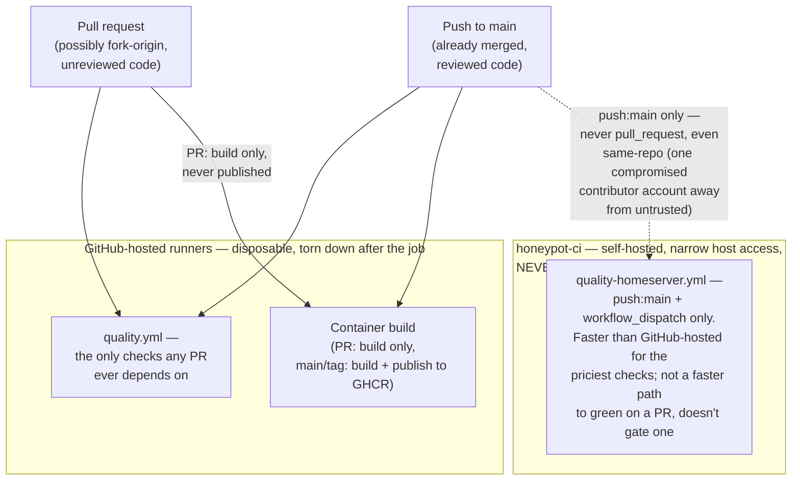
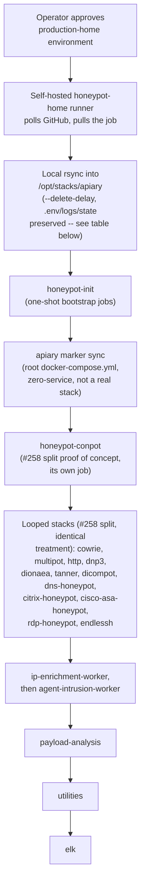
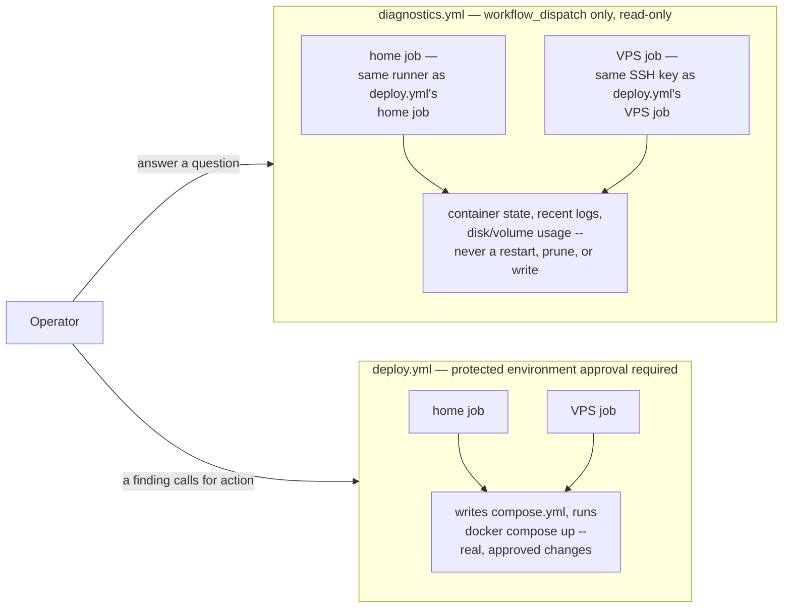

# CI/CD and repository automation

The workflows in `.github/workflows` keep public contributions safe without
placing production credentials in GitHub or in this repository.

## Checks

Every push to `main` and every pull request runs:

- the public-repository leak and forbidden-artifact scanner;
- Go formatting and tests for every Go module;
- TypeScript checks and a reproducible Tailwind frontend build;
- Python and shell syntax checks plus high-severity ShellCheck findings;
- Docker Compose validation for the home and VPS stacks;
- CodeQL for Go, JavaScript/TypeScript, and Python;
- dependency review on pull requests.

Container images are built for pull requests. A push to `main` or a version tag
publishes the custom images to the repository's GitHub Container Registry.

### Trigger, runner, and trust boundary



**`honeypot-ci` can never see `pull_request`, by design.** A GitHub-hosted
runner is a disposable, sandboxed VM torn down after the job; a self-hosted
runner's job runs as a real process on real home-network infrastructure. A
malicious test file in an unreviewed PR (`os.system(...)`, a crafted Go
`TestMain`) would execute wherever that runner has access — the same
reasoning `production-home`'s own deployment runner (below) already
applies. `quality-homeserver.yml` triggers on `push: branches: [main]` and
`workflow_dispatch` only, defense-in-depth against a compromised same-repo
contributor account, not just fork-origin PRs.

## Testing conventions

Python and shell tests live in a sibling `tests/` directory next to the code
they test (e.g. `ml-worker/tests/`, `analysis/ghidra/worker/tests/`,
`analysis/yara/tests/`), not flat alongside it. When adding a new Python or
shell test, put it under the nearest `tests/` directory for its component,
creating one if none exists yet.

Go tests stay co-located with the package they test (`foo.go` +
`foo_test.go` in the same directory), following standard Go convention
rather than the `tests/`-directory pattern above. A meaningful fraction of
this repo's Go tests are white-box: they construct unexported types
directly and call unexported methods (e.g. dashboard tests routinely build
`&store{}` by hand). A `*_test.go` file only gets that access when it
declares the same package as the code under test, which requires it living
in the same directory — moving Go tests to a separate top-level directory
would force every one of them into an external `package foo_test`, losing
that access or requiring the production code to newly export internals
just for tests to reach them. `go test` never ships in a built binary, so
`_test.go`'s own suffix already keeps tests out of production artifacts
without a directory move. Go stays co-located; only Python and shell use
`tests/`.

## Dependabot

Dependabot checks GitHub Actions, Go modules, npm dependencies, and Docker base
images every week. Patch and minor Dependabot pull requests are approved and
placed into GitHub's auto-merge queue. They still wait for branch protection
and all required checks; major upgrades always require manual review.

The repository setting **Allow auto-merge** and the Actions permission
**Allow GitHub Actions to create and approve pull requests** must remain
enabled for this workflow.

## Home deployment

Home deployment uses a dedicated self-hosted runner with these labels:

```text
self-hosted, linux, x64, honeypot-home
```

Attach the runner to the protected `production-home` environment. Its service
account needs write access to `/opt/stacks/apiary` and permission to
run Docker Compose. The workflow preserves the server's `.env` and runtime
state, synchronizes the repository, writes Arcane's authoritative
`compose.yml`, validates it, and recreates changed services.

Install or repair the runner with
[`../scripts/github-ci-runner/install-deploy-runner.sh`](../scripts/github-ci-runner/install-deploy-runner.sh)
(`sudo ... --repo Xore/APIARY`) -- registers the runner and, precisely and
idempotently, chowns exactly the directories deploy.yml itself writes into,
never anything under a `state/`, `dashboard-state/`, or `logs/` subtree
anywhere in that list (#1143: a manual, broader `chown -R` swept those
container-owned paths too, crash-looping Keycloak and Filebeat until fixed
live -- this script is the precise command that should be run instead of
reasoning through the exclusion list by hand next time).

Require a manual reviewer on `production-home`; never accept pull-request code
on this production runner.

Run [`../safe-update.sh`](../safe-update.sh) (`STACK_DIR=/opt/stacks/apiary`)
before a manual deploy to snapshot the current git commit SHA, any
uncommitted config drift, and every `.env` file -- a lightweight, read-only
"about to deploy, keep a snapshot in case this is bad" step, distinct from
[`../factory-reset.sh`](../factory-reset.sh) (docs/RECOVERY.md), which is
for an already-broken stack and can stop/wipe state.

Each #258 split adds at least one new Docker bridge network (a project's
implicit default network, or an explicit private one like `dionaea_net`).
The homeserver's own Docker daemon exhausted its built-in default address
pools (`172.16.0.0/12` and `192.168.0.0/16`) partway through this split --
every one of the ~30 pre-existing Compose projects on that host already
claimed a chunk. Fixed once, at the host level, not per-stack: `/etc/docker/
daemon.json` now sets `"default-address-pools": [{"base": "10.96.0.0/12",
"size": 24}]` (4096 possible /24 subnets, chosen not to overlap the
existing `10.8.0.0/24` WireGuard tunnel or `10.10.10.0/24` sandbox network),
applied with `systemctl restart docker`. Not something this repository's
CI can apply -- if a fresh homeserver ever exhausts its own default pools
again, the fix is the same `daemon.json` edit plus a daemon restart, not a
per-stack workaround.

### Protected homeserver deployment and split-stack order



Every step after `sync` is `docker compose -f compose.yml config --quiet`
(validate) then `up -d --build` against that one stack's own compose file —
a failure on
any step is visible in that step's own job log without the whole workflow
stopping later stacks from at least attempting to reconcile. `honeypot-init`
runs first because every other stack polls its `state/init-markers/*.done`
files at container entrypoint rather than a Compose-level `depends_on`,
which can't reach across a stack boundary — see "Home container
interaction map" in `ARCHITECTURE.md` for why. The sensor loop, both
workers, and utilities/payload-analysis/elk have no ordering dependency on
each other; they're sequenced in the workflow file for log readability, not
because stack N+1 needs stack N up first. See
["Dashboard request, state, import, and control flows"](ARCHITECTURE.md#dashboard-request-state-import-and-control-flows)
for the dashboard step's own rolling-update sequence diagram in full.

### How files reach the homeserver

The home job runs **on the homeserver itself**. GitHub does not open an inbound
SSH connection to the home network:

1. The permanently installed Actions runner polls GitHub for an approved job.
2. `actions/checkout` downloads the selected repository commit into the
   runner's temporary work directory.
3. Local `rsync` copies that checkout into `/opt/stacks/apiary`.
4. The workflow copies `docker-compose.yml` to `compose.yml`, which is the
   filename Arcane manages.
5. `docker compose config --quiet` validates the deployed configuration.
6. `docker compose up -d --build` builds local images and reconciles the
   running stack.

The runner therefore needs outbound HTTPS access to GitHub, local filesystem
access to the Arcane-managed stack, and access to the Docker socket. It does not need a
publicly reachable SSH port.

The synchronization uses `--delete-delay`, so repository-controlled files
removed from Git are removed from the destination near the end of a successful
transfer. These host-owned paths are explicitly preserved:

| Preserved path | Reason |
|---|---|
| `.env` | production addresses, credentials, and local settings |
| `logs/` | sensor and imported VPS logs |
| `state/`, `dashboard-state/` | application checkpoints and state |
| `analysis/geoip/*.mmdb` | locally downloaded licensed databases |
| `sandbox/results/` | runtime malware-analysis output |
| `.git/`, `.github/` | not needed by the deployed stack |

The runner's service account, rather than the workflow YAML, determines the
effective host permissions. Register it only on the trusted homeserver and do
not give the `production-home` environment to pull-request workflows.

### honeypot-init

`arcane/home/honeypot-init/compose.yml` runs as a second, separate Arcane-managed stack at
`/opt/stacks/honeypot-init`, not as part of `APIARY`. It holds the
one-shot bootstrap jobs (log directory ownership, persona seeding,
Elasticsearch/Kibana/Arkime first-run setup) that used to live in the main
compose file; see that file's header for the full reasoning (#111). The same
`home` job deploys it first, from the same checkout: every split stack's
dependents block on completion markers this stack writes, and deploying it
second made the very first rollout of that split hang for 29 minutes
waiting on markers that could not exist yet.

Its `.env` is created once by hand on the homeserver and is never touched by
this workflow — `ARKIME_ADMIN_PASSWORD` and `ARKIME_PASSWORD_SECRET` in it
must be kept identical to the same two values in `APIARY`'s `.env`,
and an automated sync has no safe way to verify that a value it did not set
is still correct.

### honeypot-conpot (#258 proof of concept)

`arcane/home/honeypot-conpot/compose.yml` runs as a third, separate Arcane-managed stack at
`/opt/stacks/honeypot-conpot`: the six Conpot personas (base S7-200,
S7-1200, S7-1500, IEC104, Guardian AST, Kamstrup) split out of
`APIARY`'s monolithic compose file, as a proof of concept for #258.
The same `home` job deploys it alongside `honeypot-init`, before
`APIARY`, though (unlike `honeypot-init`) it has no hard ordering
requirement -- each persona polls its own marker file rather than using a
compose `depends_on` chain, so its `docker compose up -d` returns
immediately either way. See `arcane/home/honeypot-conpot/compose.yml`'s own header for
what this proved about #258's open questions (no external networks/volumes
needed for a standalone honeypot persona; `autoheal`, which watches by Docker
label rather than by compose project, needs no changes at all).

Log directories (`logs/conpot*`) and the `state/init-markers` mount are
pre-existing host paths the "Synchronize APIARY source" rsync step already
preserves; this stack does not create or own them, and has no `.env` of its
own.

### honeypot-cowrie, honeypot-multipot, honeypot-http, honeypot-dnp3 (#258)

Four more standalone honeypots, split the same way as `honeypot-conpot` and
for the same reason: each has no `depends_on` on any other service and its
own fully private network, so no external network/volume treatment is
needed. `arcane/home/honeypot-http/compose.yml` covers two services (`http-honeypot` and
`api-honeypot`) in one stack -- they already share one build context and are
already treated as one logical unit elsewhere (`scripts/reset-logs.sh`'s
`http` target covers both). Deployed the same way as `honeypot-conpot`, in a
single looped step (`.github/workflows/deploy.yml`) since the four stacks
are otherwise identical in shape. Same log-directory/`.env` posture as
`honeypot-conpot` above.

### honeypot-dashboard (#258)

`arcane/home/honeypot-dashboard/compose.yml` runs as its own Arcane-managed stack at
`/opt/stacks/honeypot-dashboard`, bundling `dashboard` and
`services-adapter` -- kept together because they talk to each other only
over `services-adapter-socket`. Unlike the
five services above, this pair could not be split with the "own fully
private network" treatment: `dashboard` resolves `elasticsearch` and
`filebeat` by service name over the shared `honeynet` network, and reads/
writes three named Docker volumes other stacks also touch --
`dionaea-lib`/`yara-results` (`arcane/home/honeypot-dionaea/compose.yml`'s `dionaea` and
`arcane/home/honeypot-payload-analysis/compose.yml`'s `yara-scanner` write there,
`dashboard` only reads) and `dashboard-state` (genuinely shared both ways:
`payload-dedupe`/`yara-scanner`, now in `arcane/home/honeypot-payload-analysis/compose.yml`,
read/write retained script payloads under `/payloads/scripts`, the same
subtree this stack's own `SCRIPT_PAYLOAD_DIR=/state/script-payloads`
writes). All four resources are declared with an explicit shared `name:` in
every compose file that touches them, the same mechanism
`honeynet`/`es-data`/`evebox-config` already use to stay shared between
`APIARY` and `honeypot-init`.

The `home` job deploys this stack *after* `APIARY`, not before like
the standalone honeypots above -- Compose itself doesn't require the
ordering (none of the shared resources are `external: true`, so whichever
project runs first just creates them), but starting `APIARY` first
means the dashboard has real data to show immediately instead of booting
against empty indices. `services-adapter-socket` was originally left
private/unnamed to this stack (grepped every compose file at the time to
confirm nothing else referenced it); #1622 (below) added a second consumer
in a different project, so it now carries an explicit shared `name:` too,
same mechanism as the other three.

Per explicit instruction, this split did not preserve `dashboard-state`
across the cutover -- the new stack starts with a fresh volume, and any
alert/intelligence history in the old one is gone.

Everything else that was still monolithic as of the earlier revision of
this section (`dionaea`, `payload-dedupe`, `yara-scanner`, and the Tanner
group) has since split out too -- see the `honeypot-dionaea` and
`honeypot-payload-analysis` section below; only the Tanner group remains in
`APIARY`, as part of its own internal `depends_on` chain not yet
worth splitting.

#### Dashboard redeploy (single replica; #266 rolling pair retired, #1659 legacy `dashboard` removed)

The dashboard runs one replica (per Xore). The legacy Go `dashboard` service
and `scripts/deploy-dashboard-rolling.sh` that redeployed it are both gone
(#1659) -- `dashboard-next` is the only tier now, and redeploying it (like
`backend-service`, `backend-service-mounted`, and `backend-worker`) is a
plain build + recreate from each stack's own directory, no wrapper script:

```bash
cd /var/dockge/stacks/honeypot-dashboard
docker compose build dashboard-next && docker compose up -d dashboard-next
```

The brief recreate window is accepted on this single-operator deployment;
Traefik's active `/healthz` check (vps/traefik/dynamic.yml) fails fast during
it instead of hanging connections.

### honeypot-dashboard-backend (#1622)

`arcane/home/honeypot-dashboard-backend/compose.yml` runs as its own
Arcane-managed stack at `/opt/stacks/honeypot-dashboard-backend`, carrying
just the modernization-port `backend-service` (moved out of
`honeypot-dashboard` above, #1608's Rust request/response tier) so it can be
restarted/redeployed without touching `dashboard-next` or anything else in
the combined stack -- the deployment-layer counterpart to #1608's
`SERVE_MODE`/`BFF_INTERNAL_URL` cross-host application-code work.
`backend-service-mounted`, `backend-worker`, `backend-worker-importer`,
`backend-worker-enrichment`, and `dashboard-next` are unaffected and stay in
`honeypot-dashboard`'s own compose file; splitting those out is further
work, not part of #1622.

`backend-service` still resolves `dashboard-next`'s
`BACKEND_URL=http://backend-service:8081` (and vice versa) because both
stacks attach to the same explicitly-named `honeynet` bridge -- the same
cross-project DNS mechanism described above. It also still mounts
`dashboard-state`, `dionaea-lib`, and (new as of this split)
`services-adapter-socket` by explicit shared `name:`, so it reads/writes the
same underlying volumes as before the move.

The Rust crate source (`backend-service/`) was **not** moved -- only this
compose service definition -- so the new stack's `build:` context reaches
into the sibling `honeypot-dashboard` directory
(`../honeypot-dashboard/backend-service`). This is a considered choice, not
an established repo pattern (no other `arcane/home/` stack references a
build context outside its own directory): it works because Arcane's
directory-aware sync materializes every stack under the same parent
(`/var/dockge/stacks/<name>/`, see [`ARCANE-GIT-SYNC.md`](ARCANE-GIT-SYNC.md)),
so the relative path resolves correctly as long as both stacks stay synced
to the same host -- true of the current single-host topology, but it
reintroduces a build-time coupling to `honeypot-dashboard`'s own directory
that genuine cross-host deployment (the motivating case for both #1608 and
#1622) would need to resolve first, e.g. by relocating the crate source to
a path both stacks can reach independently. Flagged as a follow-up, not
resolved by this split.

`arcane/manifests/home-production.json` carries this stack's own
`honeypot-dashboard-backend` entry (`syncDirectory: true`,
`arcane/home/honeypot-dashboard-backend/compose.yml`) so both
`scripts/install-homeserver.sh`'s `step_arcane_import_stacks` and the `home`
job's manifest-driven compose-validation loop pick it up the same way as
every other stack -- see `ARCANE-GIT-SYNC.md` for what actually triggers
Arcane to sync/deploy a manifest entry (creating the sync is a manual,
operator-triggered API call; being listed in the manifest alone does not
deploy anything).

### honeypot-utilities (#258)

`arcane/home/honeypot-utilities/compose.yml` runs as its own Arcane-managed stack at
`/opt/stacks/honeypot-utilities`, bundling `log-maintenance`, `autoheal`,
and `reporter` -- the first #258 split that isn't one honeypot family. All
three watch or act across the whole host rather than belonging to a single
sensor: `log-maintenance` rotates every sensor's logs, `autoheal` restarts
any container across *any* Compose project carrying the `autoheal=true`
label (it watches Docker directly via `docker.sock` by label, daemon-wide,
so it needed no changes for this or any earlier #258 split), and `reporter`
tails every sensor's JSON log to (eventually, once explicitly authorized)
report attacker IPs to AbuseIPDB.

None of the three share a named volume or network with anything outside
this stack, so -- like the standalone honeypots -- it deploys ahead of
`APIARY` with no ordering requirement.

### honeypot-dionaea and honeypot-payload-analysis (#258)

`arcane/home/honeypot-dionaea/compose.yml` (`dionaea` and `tftp-relay`) and
`arcane/home/honeypot-payload-analysis/compose.yml` (`payload-dedupe` and `yara-scanner`)
split into two separate Arcane-managed stacks, per explicit instruction rather than
bundled together the way `dashboard`+`services-adapter` were. `dionaea` and
`tftp-relay` stay paired -- `tftp-relay` has `depends_on: dionaea` and
actually forwards TFTP traffic to it over `dionaea_net`, the one exception
#235 carved out of "one honeypot per network."

The split resource is `dionaea-lib`: `dionaea` writes captured
binaries/bistreams there, `payload-dedupe`/`yara-scanner` in the other
stack only read. Explicit shared `name:` in both compose files, same
mechanism as everywhere else in #258. `payload-dedupe`/`yara-scanner` also
still touch `dashboard-state` and `yara-results` (shared with
`arcane/home/honeypot-dashboard/compose.yml`, unchanged by this split) and cowrie's
downloads directory (a host bind mount, unaffected by which Compose
project owns the container that writes to it).

`arcane/home/honeypot-dionaea/compose.yml` deploys in the same looped step as
`honeypot-cowrie`/`multipot`/`http`/`dnp3` (`.github/workflows/deploy.yml`)
-- like them, it has no ordering requirement, since `dionaea-lib` is a
non-external shared-name volume Compose creates if absent.
`arcane/home/honeypot-payload-analysis/compose.yml` gets its own step right after, purely
for readability (the "reader" half following the "writer" half); no hard
ordering requirement here either.

`scripts/reset-logs.sh` treats `dionaea` as a `SPLIT_TARGETS` entry like
the other split honeypots. `payload-dedupe`/`yara-scanner` don't get their
own CLI target -- there wasn't one before this split either -- but the
script still stops/starts them (now via a dedicated
`payload_analysis_compose` helper pointed at their own stack directory)
whenever `cowrie` is targeted, same reasoning as before the split: they
hold reads/hardlinks into `cowrie/downloads` that would race a concurrent
wipe of that directory.

### honeypot-tanner (#258)

`arcane/home/honeypot-tanner/compose.yml` bundles the whole SNARE + TANNER web-app
honeypot group (`tanner_docker`, `tanner_redis`, `tanner_phpox`,
`tanner_api`, `tanner_web`, `tanner`, `snare`) into one stack at
`/opt/stacks/honeypot-tanner` -- all seven form a single `depends_on`
chain, so unlike every other group in this document they were never a
candidate for splitting further. `tanner_local`, the network carrying all
of it, was already wholly private to this group (confirmed by grepping
every compose file), so it moved with them unchanged.

The one resource this stack shares with anything outside itself is
`snare-pages`: written by `honeypot-init`'s `snare-clone` job, read only by
`snare` here, `external: true` in both the old monolithic file and this one
-- unaffected by the split. `autoheal` (`arcane/home/honeypot-utilities/compose.yml`)
still restarts `tanner_docker`/`tanner_redis` on unhealthy via the
`autoheal=true` label, same as always -- it needs no changes for this or
any #258 split.

Deployed in the same looped step as the other standalone honeypots
(`.github/workflows/deploy.yml`) -- no ordering requirement, since
`snare-pages` is already created by `honeypot-init`, which this workflow
deploys before this step runs. `scripts/reset-logs.sh` treats `tanner` as
a `SPLIT_TARGETS` entry, same as `dionaea`; only `tanner`, `tanner_api`,
`tanner_web`, and `snare` are stopped/started on a wipe (unchanged from
before the split) -- `tanner_docker`/`tanner_redis`/`tanner_phpox` hold no
open handles into the log directories this script wipes for this target.

### honeypot-elk (#258)

`arcane/home/honeypot-elk/compose.yml` bundles the ELK/analysis plane (`elasticsearch`,
`kibana`, `filebeat`, `evebox`, `arkime-capture`, `arkime-viewer`,
`pcap-sync`) into one stack at `/opt/stacks/honeypot-elk` -- the last group
that was still in the monolithic file. Kept together, not split further:
all seven sit on the shared `honeynet` network and either read from or
write to the one Elasticsearch instance, so splitting them apart would
turn every one of those relationships into a cross-stack shared resource
for services that only ever make sense running together.

`honeynet` and `llm-data` get the usual explicit shared `name:` treatment.
`es-data` does **not**, despite appearances: `honeypot-init`'s
`elasticsearch-setup`/`arkime-init`/`honeypot-kibana-setup` jobs all talk
to Elasticsearch purely over HTTP (`http://elasticsearch:9200` via
`honeynet`), never touching the `es-data` volume directly (confirmed by
grep -- no `es-data` reference anywhere in `arcane/home/honeypot-init/compose.yml`).
`honeynet` is the actual shared resource; `es-data`, `evebox-config`, and
`arkime-pcap` all stay private/unnamed. Per explicit instruction (same as
`dashboard-state` in the dashboard split), this means a fresh, empty
`es-data` volume on cutover -- every honeypot's indexed Elasticsearch
history is not preserved across the split.

This split also surfaced a real pre-existing ordering bug in
`.github/workflows/deploy.yml`, dating back to the original
`honeypot-conpot` proof of concept (#336): every split stack's `build:`
points at an absolute path under `/opt/stacks/apiary` (e.g.
`/opt/stacks/apiary/dionaea`), populated by the "Synchronize APIARY
source" rsync step -- but that step used to run *after* every one of those
builds, near the end of the job, in the slot where `APIARY`'s own
`docker compose up` used to live. Never a hard failure (the destination
directory already existed from prior runs), just quietly building from
whatever the *previous* deploy had rsynced -- one deploy stale rather than
this run's checkout. Fixed by moving the rsync step to run immediately
after `honeypot-init`, before any split stack's step.

With this split, `APIARY`'s own `docker-compose.yml` has no
services of its own left at all (`services: {}`) -- see that file's header
for what that means going forward. The rsync step still runs
unconditionally, since every other stack's build context depends on the
checkout landing there, but `docker compose up -d --build` against a
zero-service file fails outright (`no service selected`, confirmed
locally) rather than being a harmless no-op, so that call is gone from
this one step -- `config --quiet` alone stays as a lightweight sanity
check. Retiring this file and its deploy step entirely, once every build
context instead points somewhere that doesn't need a `docker-compose.yml`
to justify its existence, is tracked as the last step of #258.

## GitHub CI runner

A second, separate self-hosted runner from the deployment one above --
different labels, different systemd service, different (much narrower)
host access -- dedicated purely to running the priciest checks in
[Quality](#checks) faster than a GitHub-hosted runner, for pushes to `main`
an operator has already made. It is **not** a faster path to green on a
pull request: `quality.yml`'s own GitHub-hosted jobs remain the only checks
any PR depends on, unchanged by any of this.

```text
self-hosted, linux, x64, honeypot-ci
```

### Why this can never see pull_request

A public repository's pull requests can come from forks -- attacker-
controlled input a maintainer has not reviewed yet. A GitHub-hosted runner
is a disposable, sandboxed VM torn down after the job; a self-hosted
runner's job runs as a real process on real home-network infrastructure.
Wiring an untrusted `pull_request` trigger to it would mean a malicious
test file (`os.system(...)`, a crafted Go `TestMain`, anything) gets to
execute wherever that runner happens to have access -- exactly the
scenario GitHub's own self-hosted-runner security guidance warns against,
and the same reasoning the deployment runner above already applies
("never accept pull-request code" on `production-home`).

[`quality-homeserver.yml`](../.github/workflows/quality-homeserver.yml)
only triggers on `push: branches: [main]` and `workflow_dispatch` -- never
`pull_request`, regardless of whether the PR is same-repo or fork-origin.
Defense in depth: even a same-repo branch is one compromised contributor
account away from being untrusted, so the trigger boundary is push-to-
main (already merged), not "not a fork."

### Install

```bash
sudo scripts/github-ci-runner/install-ci-runner.sh --repo Xore/APIARY
```

Registers a dedicated `github-ci-runner` system user (no `docker` group,
no access to `/var/lib/honeypot-*`, `/opt/stacks`, or any sensor state --
a workflow here only ever needs a language toolchain), downloads and
checksum-verifies the pinned `actions/runner` release, registers it with
the given repository using a registration token (fetched automatically via
`gh api` if `--token` is not passed and `gh auth login` has already been
done for an account with admin on the repo), and installs it as a systemd
service via the runner's own `svc.sh`.

Re-running the script is safe: it skips the download if already extracted
and skips re-registration if `$RUNNER_HOME/.runner` already exists (remove
that file first to re-register, e.g. after moving the runner to a new
host).

`actions/setup-go`/`actions/setup-node` cache their toolchain downloads in
the runner's own persistent tool cache -- unlike an ephemeral GitHub-hosted
runner, that cache survives between job runs on this same machine, so the
second and every later run skips the download entirely. This is most of
where the actual speed win comes from, not raw CPU.

## VPS deployment

Create a protected `production-vps` environment with a required reviewer and
these environment secrets:

| Secret | Purpose |
|---|---|
| `VPS_SSH_KEY` | dedicated deployment private key |
| `VPS_HOST` | VPS hostname or address |
| `VPS_USER` | deployment user, normally `root` |
| `VPS_PORT` | SSH port, normally `2222` |
| `DOMAIN` | the real production domain (e.g. `example.com`), substituted into `traefik/dynamic.yml`'s committed `*.honeypot.example` placeholders at deploy time -- see below |

Run [`../safe-update.sh`](../safe-update.sh) with `STACK_DIR=/root/vps` before
a manual VPS deploy, same reasoning as the home-side snapshot above.

The workflow preserves `/root/vps/.env`, synchronizes `vps/`, validates
`docker-compose.yml`, and recreates changed services with plain Docker Compose.
Use a dedicated key restricted to the deployment host and rotate it if workflow
logs or repository access are ever compromised.

### Backup, sync, validate, start, and config substitution

```mermaid
flowchart TB
  approve["Operator approves<br/>production-vps environment"]
  ghRunner["Short-lived GitHub-hosted runner"]
  checkout["actions/checkout"]
  key["VPS_SSH_KEY written to a<br/>temp file, mode 0600"]
  backup[("Snapshot: /root/vps-backups/<br/>pre-deploy-&lt;timestamp&gt;.tar.gz,<br/>10 most recent kept")]
  rsync["rsync vps/ -> /root/vps/<br/>over SSH, excluding .env,<br/>traefik/certs/, traefik/dynamic.yml<br/>(VPS-owned, see table below)"]
  validate["SSH: docker compose config<br/>validates /root/vps/docker-compose.yml"]
  up["SSH: docker compose up -d --build"]
  dynGen["Separate step: substitute DOMAIN<br/>into the committed *.honeypot.example<br/>placeholders, validate as YAML,<br/>no leftover placeholders --<br/>all BEFORE touching the VPS"]
  dynWrite["Copy to a temp path on the VPS,<br/>then write in place with cat --<br/>never copy-then-rename (see below:<br/>Traefik's bind mount tracks the<br/>inode, not the path)"]
  verify["Verify step: fail the job if certs<br/>or dynamic.yml are missing, empty,<br/>unparseable, or still placeholder"]
  destroy["GitHub destroys the runner<br/>+ its temp key file"]

  approve --> ghRunner --> checkout --> key --> backup --> rsync --> validate --> up
  up --> dynGen --> dynWrite --> verify --> destroy
```



The certificates were lost once, in a single `target: both` run before the
`traefik/certs/` exclusion existed: Traefik fell back to self-signed and
every router silently stopped matching. See below for why `dynamic.yml`'s
own deploy step specifically avoids a copy-then-rename.

### How files reach the VPS

The VPS job runs on a short-lived GitHub-hosted Ubuntu runner:

1. `actions/checkout` downloads the selected repository commit.
2. The protected `VPS_SSH_KEY` secret is written to a temporary file with mode
   `0600`.
3. The job constructs SSH options from `VPS_HOST`, `VPS_USER`, and `VPS_PORT`.
   The user defaults to `root` and the port defaults to `2222`.
4. The job snapshots the environment-specific files on the VPS into
   `/root/vps-backups/pre-deploy-<timestamp>.tar.gz`, keeping the ten most
   recent archives.
5. `rsync` sends only the repository's `vps/` directory over SSH to
   `/root/vps/`, **excluding** `traefik/dynamic.yml` (see below).
6. A second SSH command runs on the VPS, validates
   `/root/vps/docker-compose.yml`, and executes
   `docker compose up -d --build`.
7. A dedicated step generates the deployable `traefik/dynamic.yml` --
   substitutes `DOMAIN` for every `*.honeypot.example` placeholder in the
   committed template -- and validates the result (parses as YAML, no
   leftover placeholders) *before* it ever touches the VPS. Only then is it
   copied to a temporary path on the VPS and written into the live file
   in place with `cat` (see below for why not a plain copy/rename).
8. A verification step fails the job if the certificates or `dynamic.yml` are
   missing, empty, unparseable, or still carry placeholder domains.
9. GitHub destroys the hosted runner, including its temporary key file, after
   the job.

### Files the VPS owns, not the repository

`--delete-delay` removes destination files that no longer exist under the
repository's `vps/` directory, and overwrites the ones that do. Three paths are
therefore excluded from the main `rsync` because the VPS copy is authoritative
(or, for `dynamic.yml`, because it needs different handling entirely):

| Path | Why it is excluded from the main sync |
|---|---|
| `.env` | Secrets and host-specific values. |
| `traefik/certs/` | Issued TLS certificates. They do not exist in the repository, so an unexcluded `--delete-delay` deletes them, and the workflow cannot reissue them. |
| `traefik/dynamic.yml` | Carries the deployment's real domain. The committed copy is a `*.honeypot.example` placeholder -- Traefik's file provider has no `${VAR}`-style substitution the way docker-compose already gives every other host-specific value in this repo, so this file can't just be templated in place the normal way. Deployed by its own dedicated step instead (step 7 above), which substitutes `DOMAIN` and writes the result separately. |

The certificates were lost once, in a single `target: both` run before that
exclusion existed: Traefik fell back to self-signed and every router silently
stopped matching. Persistent VPS data must live in named volumes, bind mounts
outside `/root/vps`, or one of the excluded paths above.

**`dynamic.yml` deploys with a plain in-place `cat`, never a copy-then-rename
(`scp`'s default, `rsync`, or `mv`).** Traefik's compose service bind-mounts
this file at a single path
(`traefik/dynamic.yml:/etc/traefik/dynamic.yml:ro`), which Docker binds to the
*specific inode* present when the container started, not the path. A
rename-based replacement repoints the host path at a new inode while the
already-running container keeps reading the orphaned old one -- silently, with
no error of any kind, and every host-side check (`cat`, `diff`) shows the new
content as correct anyway. This broke production once already, recovered only
by noticing the container's own view (`docker exec traefik cat
/etc/traefik/dynamic.yml`) disagreed with the host file. If you ever need to
edit this file by hand instead of through the workflow (a *structural* router
change, not just a domain difference -- see below), always write in place
(`cat new > /root/vps/traefik/dynamic.yml`) and never `mv`/rename a
replacement into it; `docker compose restart traefik` is the reliable recovery
if a stale-inode mismatch ever happens anyway.

Routine deploys need no manual step for this file at all now -- the workflow
regenerates and redeploys it from the committed template plus `DOMAIN` every
run. A structural change (a new router, a new middleware) still needs the
*template* (`vps/traefik/dynamic.yml` in the repository) edited, committed, and
deployed the normal way; only the domain substitution itself is automatic.
Traefik's file provider watches the live file and reloads on any change with
no restart needed, whether that change came from the workflow or a manual
edit.

The SSH key is the direct production credential in this path. Restrict it to
the intended VPS, keep it in the protected environment rather than repository
secrets where possible, and require environment approval before the job can
read it. `DOMAIN` is not itself sensitive (it is public DNS), but keep it in
the same protected environment as the other VPS secrets for consistency.

## Diagnostics

`diagnostics.yml` is the read-only counterpart to `deploy.yml`, and it is
`workflow_dispatch` only. It mirrors the deployment topology: the home job runs
on the `[self-hosted, linux, x64, honeypot-home]` runner, and the VPS job runs
on a GitHub-hosted runner over the same SSH deployment key. Neither changes
anything — they report container state, recent logs, and disk and volume usage.

It exists because the alternative to a scoped read-only workflow is an operator
opening an interactive shell on production to answer a question, and that is
how a diagnosis turns into an accidental change. Keep it read-only. It must
never gain a step that restarts a service, prunes a volume, or writes a file —
if a finding calls for action, the action goes through `deploy.yml` and its
environment approval.

The workflow reads `HP_BIND` and deliberately never prints it: it is an
internal WireGuard address, and the job's output is visible to anyone who can
read the Actions log.

### Diagnostics vs. mutating deploy



Same runners, same credentials, same deployment topology — `diagnostics.yml`
mirrors `deploy.yml`'s shape deliberately, so an operator never needs an
interactive shell on production just to answer "is this healthy," which is
exactly how a diagnosis turns into an accidental change. The only
difference that matters is that `diagnostics.yml` has no step capable of
mutating anything; a finding that calls for real action still goes through
`deploy.yml` and its environment approval, never a follow-up edit to the
diagnostics workflow itself.

## Delivery paths at a glance

```text
Home:
GitHub -> outbound-polling self-hosted runner on homeserver
       -> local rsync /opt/stacks/apiary
       -> Arcane compose.yml -> docker compose up

VPS:
GitHub-hosted runner -> rsync + SSH over VPS_PORT
                     -> /root/vps
                     -> docker compose up on VPS
```

Selecting `both` creates both jobs from the same workflow run. They share the
`honeypot-production` concurrency group, but the home and VPS jobs are
otherwise independent: one can fail while the other succeeds. Always inspect
both job results before calling a two-target deployment complete.

## Running a deployment

Open **Actions → Deploy → Run workflow**, select `home`, `vps`, or `both`, then
approve the relevant protected environment. Deployments are intentionally
manual; a push to a public repository never changes production by itself.

The workflow deploys the commit selected in the **Run workflow** dialog,
normally the current `main`. Merging a pull request starts checks and container
publishing, but does not invoke `Deploy`; an operator must dispatch it
separately.

For each target, verify the run after Compose finishes:

- the deployment job used the expected commit SHA;
- `docker compose ps` shows the intended services running and healthy;
- Dashboard, EveBox, Kibana, and Arkime respond where applicable;
- Filebeat and Elasticsearch report no output errors;
- source timestamps and indexed document counts continue advancing.

If the home runner is offline, the home job remains queued. If an environment
approval is missing, the job waits before gaining access to that environment's
secrets or runner. A VPS authentication failure stops before the remote Compose
command; a Compose validation failure stops before services are reconciled.
