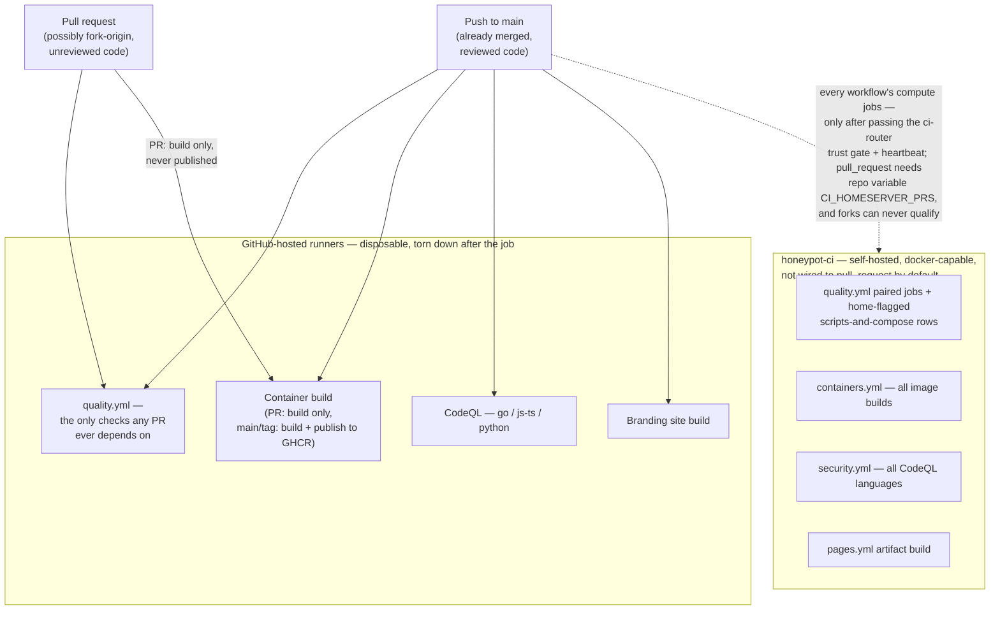
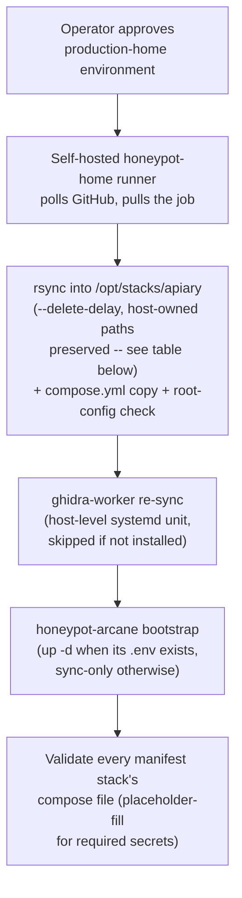
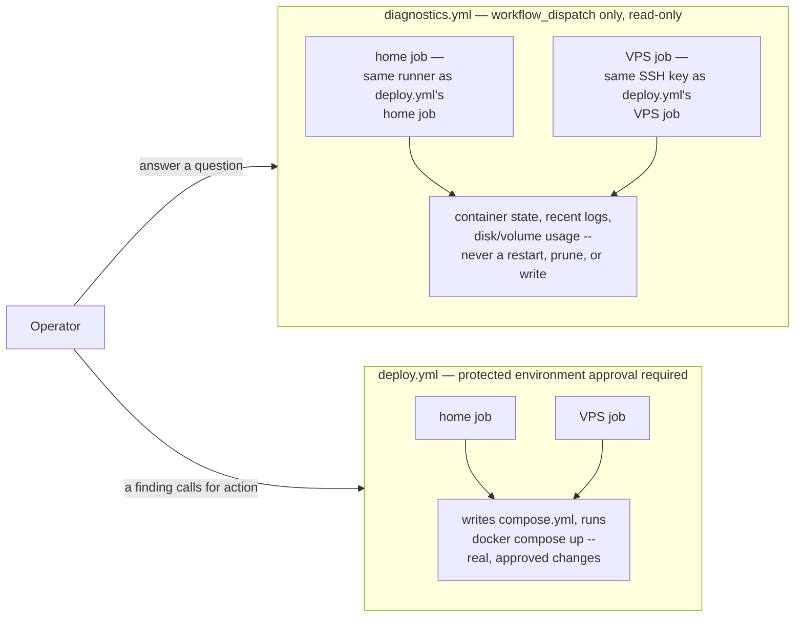

# CI/CD and repository automation

The workflows in `.github/workflows` keep public contributions safe without
placing production credentials in GitHub or in this repository.

## Checks

Every push to `main` and every pull request runs:

- the public-repository leak and forbidden-artifact scanner;
- Go formatting and tests for every Go module;
- TypeScript checks and a reproducible Tailwind frontend build;
- Python and shell syntax checks plus high-severity ShellCheck findings;
- Docker Compose validation for the home and VPS stacks;
- CodeQL for Go, JavaScript/TypeScript, and Python;
- dependency review on pull requests.

Container images are built for pull requests. A push to `main` or a version tag
publishes the custom images to the repository's GitHub Container Registry.

### Trigger, runner, and trust boundary



**`honeypot-ci` does not see `pull_request` by default, by design.** A
GitHub-hosted runner is a disposable, sandboxed VM torn down after the
job; a self-hosted runner's job runs as a real process on real
home-network infrastructure. A malicious test file in an unreviewed PR
(`os.system(...)`, a crafted Go `TestMain`) would execute wherever that
runner has access — the same reasoning `production-home`'s own deployment
runner (below) already applies. Every workflow's executor routing (each
caller's own `ci-target` job, which since #2571 always calls the shared
`.github/workflows/ci-router.yml`) trusts
push-to-main (already reviewed and merged), the `schedule` and
`workflow_dispatch` (an operator's own machinery); same-repo pull
requests need the repository variable `CI_HOMESERVER_PRS=true`, and fork
PRs are excluded regardless of that variable — defense-in-depth against a
compromised contributor account, not just fork-origin PRs.

## Testing conventions

Python and shell tests live in a sibling `tests/` directory next to the code
they test (e.g. `ml-worker/tests/`, `analysis/ghidra/worker/tests/`,
`arcane/home/honeypot-payload-analysis/analysis/yara/tests/`), not flat alongside it. When adding a new Python or
shell test, put it under the nearest `tests/` directory for its component,
creating one if none exists yet.

Go tests stay co-located with the package they test (`foo.go` +
`foo_test.go` in the same directory), following standard Go convention
rather than the `tests/`-directory pattern above. A meaningful fraction of
this repo's Go tests are white-box: they construct unexported types
directly and call unexported methods (e.g. dashboard tests routinely build
`&store{}` by hand). A `*_test.go` file only gets that access when it
declares the same package as the code under test, which requires it living
in the same directory — moving Go tests to a separate top-level directory
would force every one of them into an external `package foo_test`, losing
that access or requiring the production code to newly export internals
just for tests to reach them. `go test` never ships in a built binary, so
`_test.go`'s own suffix already keeps tests out of production artifacts
without a directory move. Go stays co-located; only Python and shell use
`tests/`.

## Dependabot

Dependabot checks GitHub Actions, Go modules, npm dependencies, and Docker base
images every week. Patch and minor Dependabot pull requests are approved and
placed into GitHub's auto-merge queue. They still wait for branch protection
and all required checks; major upgrades always require manual review.

The repository setting **Allow auto-merge** and the Actions permission
**Allow GitHub Actions to create and approve pull requests** must remain
enabled for this workflow.

## Home deployment

Home deployment uses a dedicated self-hosted runner with these labels:

```text
self-hosted, linux, x64, honeypot-home
```

Attach the runner to the protected `production-home` environment. Its service
account needs write access to `/opt/stacks/apiary` and permission to
run Docker Compose. The workflow preserves the server's `.env` and runtime
state, synchronizes the repository into `/opt/stacks/apiary`, and validates
compose files — it no longer deploys any home stack itself. What actually
deploys is described below.

Install or repair the runner with
[`../scripts/github-ci-runner/install-deploy-runner.sh`](../scripts/github-ci-runner/install-deploy-runner.sh)
(`sudo ... --repo Xore/APIARY`) -- registers the runner and, precisely and
idempotently, chowns exactly the directories deploy.yml itself writes into,
never anything under a `state/`, `dashboard-state/`, or `logs/` subtree
anywhere in that list (#1143: a manual, broader `chown -R` swept those
container-owned paths too, crash-looping Keycloak and Filebeat until fixed
live -- this script is the precise command that should be run instead of
reasoning through the exclusion list by hand next time).

Require a manual reviewer on `production-home`; never accept pull-request code
on this production runner.

**#2745: never pass an explicit `--name` that collides with the CI fleet's
name.** `install-deploy-runner.sh` defaults to `${HOSTNAME}-home` specifically
so its identity can never collide with `install-ci-runner.sh`'s
`${HOSTNAME}-ci` default. On 2026-08-31 the deploy runner's registration was
found silently clobbered: both `/opt/github-ci-runner/.runner` and
`/opt/github-deploy-runner/.runner` claimed the identical `agentName:
"supermicro"` (the bare hostname, not either script's own `-ci`/`-home`
suffixed default) -- meaning some prior run of the deploy-runner script was
given an explicit `--name` override matching the CI runner's plain hostname,
and GitHub keeps only one live registration per name. The deploy runner's
unit was left `disabled` as a result, and the Diagnostics workflow's `home`
job (and any other `honeypot-home`-targeted job, including `deploy.yml`
itself) queued forever with no online runner able to claim it. Fixed by
re-registering under the script's own unmodified default name
(`supermicro-home` on this host) rather than reusing a colliding name --
always let `--name` default unless there is a specific reason to override
it, and never reuse the bare `${HOSTNAME}` the live CI fleet's first runner
is currently registered under (an earlier `--name` override; the script's
own default is `${HOSTNAME}-ci`).

Run [`../safe-update.sh`](../safe-update.sh) (`STACK_DIR=/opt/stacks/apiary`)
before a manual deploy to snapshot the current git commit SHA, any
uncommitted config drift, and every `.env` file -- a lightweight, read-only
"about to deploy, keep a snapshot in case this is bad" step, distinct from
[`../factory-reset.sh`](../factory-reset.sh) (docs/RECOVERY.md), which is
for an already-broken stack and can stop/wipe state.

Each #258 split adds at least one new Docker bridge network (a project's
implicit default network, or an explicit private one like `dionaea_net`).
The homeserver's own Docker daemon exhausted its built-in default address
pools (`172.16.0.0/12` and `192.168.0.0/16`) partway through this split --
every one of the ~30 pre-existing Compose projects on that host already
claimed a chunk. Fixed once, at the host level, not per-stack: `/etc/docker/
daemon.json` now sets `"default-address-pools": [{"base": "10.96.0.0/12",
"size": 24}]` (4096 possible /24 subnets, chosen not to overlap the
existing `10.8.0.0/24` WireGuard tunnel or `10.10.10.0/24` sandbox network),
applied with `systemctl restart docker`. Not something this repository's
CI can apply -- if a fresh homeserver ever exhausts its own default pools
again, the fix is the same `daemon.json` edit plus a daemon restart, not a
per-stack workaround.

### What deploy.yml actually runs (since #1502)

> **Status.** The sections below this one were rewritten when the home
> stacks' deployment moved to Arcane-managed Git syncs (#1502). Anything
> still describing a deploy-loop "deploying" or "sequencing" sensor stacks
> would be pre-cutover fiction — this file should mirror `deploy.yml`'s own
> header comments, which state the same contract line by line. Where it and
> [ARCANE-GIT-SYNC.md](ARCANE-GIT-SYNC.md) disagree about deployment,
> ARCANE-GIT-SYNC.md wins; file a gap against #1502 if they diverge.



That is the complete list. What puts a changed sensor/persona/dashboard
stack on the host lives entirely in Arcane's Git-sync machinery — see
[ARCANE-GIT-SYNC.md](ARCANE-GIT-SYNC.md) for the full contract (its
non-obvious cornerstones: creating a sync *is* an initial deploy, a sync
materializes files without redeploying — live `redeploy_after_sync`
defaults to 0, though the manifest schema cannot express it — and every
synced stack runs `autoSync: false`: the #1507 tag-promotion /
`production`-pointer policy was decided but never deployed, so all syncs
track `main` and deploys are manual; ARCANE-GIT-SYNC.md's promotion
section carries the live-state evidence).
This workflow deliberately stopped touching those directories entirely:
running an rsync/build loop alongside Arcane's own sync would put two
independent writers in a race for the same on-host directory, the exact
failure class #1502's migration review flagged. What survived here is a
cheap validation gate so a broken compose file fails visibly at review
time instead of surfacing mid-sync on the host.

`honeypot-init`'s marker mechanism (`state/init-markers/*.done`, polled at
container entrypoint rather than via Compose-level `depends_on`) still
governs startup order between sensors and their bootstrap jobs — but on
today's topology that ordering plays out inside Arcane's sync/deploy flow,
not across steps of this job. See "Home container interaction map" in
`ARCHITECTURE.md` for the why; the dashboard redeploy mechanics live in
its own section below, unchanged by any of this.

### How files reach the homeserver

The home job runs **on the homeserver itself**. GitHub does not open an inbound
SSH connection to the home network:

1. The permanently installed Actions runner polls GitHub for an approved job.
2. `actions/checkout` downloads the selected repository commit into the
   runner's temporary work directory.
3. Local `rsync` copies that checkout into `/opt/stacks/apiary`.
4. The same step copies the root `docker-compose.yml` to `compose.yml`
   (the filename Arcane manages) and tightens `.env`'s mode to `0600`
   if the file exists.
5. `docker compose -f compose.yml config --quiet` validates the root
   configuration — a pure syntax gate, not a deploy: the root file has
   carried `services: {}` since the last monolith service moved out
   (#258, updated by #1502).
6. Nothing comes up here. With zero services under the root file there is
   no stack this workflow could reconcile — what actually deploys a changed
   stack is Arcane's Git-sync machinery ([ARCANE-GIT-SYNC.md](ARCANE-GIT-SYNC.md),
   "The model" above), plus this workflow's one remaining deployment-adjacent
   action: the conditional host-level nsenter re-sync of the ghidra worker's
   source tree described below.

The runner therefore needs outbound HTTPS access to GitHub, local filesystem
access to the Arcane-managed stack, and access to the Docker socket. It does not need a
publicly reachable SSH port.

The synchronization uses `--delete-delay`, so repository-controlled files
removed from Git are removed from the destination near the end of a successful
transfer. These host-owned paths are explicitly preserved:

This table mirrors the step's own `--exclude` list exactly (`deploy.yml`,
"Synchronize APIARY source"):

| Excluded path | Reason |
|---|---|
| `.env` | production addresses, credentials, and local settings |
| `logs/` | sensor and imported VPS logs, plus the dashboard's own serving-tier app logs (#1972: `dashboard-backend*/`, `dashboard-bff/`) |
| `state/`, `dashboard-state/` | application checkpoints and state |
| `sandbox/results/` | runtime malware-analysis output |
| `analysis/geoip/` | whole directory, not just `*.mmdb`: nothing under it is git-tracked, and geoipupdate (a root-owned container, #1258) writes a root-owned `.geoipupdate.lock` into its root-owned directory — the runner user cannot unlink that, so any narrower exclude broke every deploy with rsync exit 23 once the geoip-update profile ran (#1226) |
| `analysis/ghidra/revdeck/`, `sandbox/windows/packer/pxe/ipxe*` | hand-vendored or build-generated on the host, untracked in Git (`revdeck-proxyfix` doc comment; `prepare-pxe.sh`) — without excluding them, `--delete-delay` either fails outright (populated directory it can't recursively delete) or silently deletes a hand-built ipxe/webui tree on every deploy |
| `.git/`, `.github/` | not needed by the deployed stack |

The runner's service account, rather than the workflow YAML, determines the
effective host permissions. Register it only on the trusted homeserver and do
not give the `production-home` environment to pull-request workflows.

### honeypot-init

`arcane/home/honeypot-init/compose.yml` runs as a second, separate Arcane-managed stack at
`/opt/stacks/honeypot-init`, not as part of `APIARY`. It holds the
one-shot bootstrap jobs (log directory ownership, persona seeding,
Elasticsearch/Kibana/Arkime first-run setup) that used to live in the main
compose file; see that file's header for the full reasoning (#111). It
reaches the host through the same Arcane-managed sync machinery as every
manifest stack now: its one-shot jobs write the `state/init-markers/*.done`
files other stacks' dependents block on at container entrypoint, so its
initial deploy has to land before theirs — a rollout that got this backwards
once hung for 29 minutes waiting on markers that could not exist yet.

Its `.env` is created once by hand on the homeserver and is never touched by
this workflow — `ARKIME_ADMIN_PASSWORD` and `ARKIME_PASSWORD_SECRET` in it
must be kept identical to the same two values in `APIARY`'s `.env`,
and an automated sync has no safe way to verify that a value it did not set
is still correct.

### honeypot-conpot (#258 proof of concept)

`arcane/home/honeypot-conpot/compose.yml` runs as a third, separate Arcane-managed stack at
`/opt/stacks/honeypot-conpot`: the six Conpot personas (base S7-200,
S7-1200, S7-1500, IEC104, Guardian AST, Kamstrup) split out of
`APIARY`'s monolithic compose file, as a proof of concept for #258.
It has no hard ordering requirement against anything else:
each persona polls its own marker file rather than joining a compose
`depends_on` chain, so bringing the stack up through its Arcane-managed
sync never blocks on or gates another project either way. See `arcane/home/honeypot-conpot/compose.yml`'s own header for
what this proved about #258's open questions (no external networks/volumes
needed for a standalone honeypot persona; `autoheal`, which watches by Docker
label rather than by compose project, needs no changes at all).

Log directories (`logs/conpot*`) and the `state/init-markers` mount are
pre-existing host paths the "Synchronize APIARY source" rsync step already
preserves; this stack does not create or own them, and has no `.env` of its
own.

### honeypot-cowrie, honeypot-multipot, honeypot-http, honeypot-dnp3 (#258)

Four more standalone honeypots, split the same way as `honeypot-conpot` and
for the same reason: each has no `depends_on` on any other service and its
own fully private network, so no external network/volume treatment is
needed. `arcane/home/honeypot-http/compose.yml` covers two services (`http-honeypot` and
`api-honeypot`) in one stack -- they already share one build context and are
already treated as one logical unit elsewhere (`scripts/reset-logs.sh`'s
`http` target covers both). Synced through Arcane the same way as
`honeypot-conpot`; all four are otherwise identical in shape. Same
log-directory/`.env` posture as
`honeypot-conpot` above.

### honeypot-dashboard (#258)

`arcane/home/honeypot-dashboard/compose.yml` runs as its own Arcane-managed stack at
`/opt/stacks/honeypot-dashboard`; its own header lists the current service
inventory (the legacy Go `dashboard` it once led with is gone — #1659 —
and #1622 has since moved the original `backend-service` out to its own
stack below). What drove keeping this tier in one project originally was
that its members could not take the "own fully private network"
treatment: they resolve `elasticsearch` and `filebeat` by service name
over the shared `honeynet` network, and read/write named Docker volumes
other stacks also touch -- `dionaea-lib`/`yara-results`
(`arcane/home/honeypot-dionaea/compose.yml`'s `dionaea` and
`arcane/home/honeypot-payload-analysis/compose.yml`'s `yara-scanner` write there,
these services only read) and `dashboard-state` (shared both ways:
the payload-analysis workers read/write retained script payloads under
`/payloads/scripts`, the same subtree these services'
`SCRIPT_PAYLOAD_DIR=/state/script-payloads` writes). Those resources are
declared with an explicit shared `name:` in every compose file that
touches them, the same mechanism
`honeynet`/`es-data`/`evebox-config` already use to stay shared between
projects.

There is no Compose-enforced ordering in any of this — none of the shared
resources are `external: true`, so whichever project touches them first
just creates them — but standing the analysis plane up before this stack's
first start (its importer/worker tiers read the same Elasticsearch
instance) means real data to show immediately instead of booting against
empty indices. On today's topology that ordering lives in the operator's
cutover sequence ([ARCANE-GIT-SYNC.md](ARCANE-GIT-SYNC.md), "Cutover
procedure"), not in a workflow file. `services-adapter-socket` was
originally left private/unnamed to this stack (grepped every compose file
at the time to confirm nothing else referenced it); #1622 (below) added a
second consumer in a different project, so it now carries an explicit
shared `name:` too, same mechanism as the other three.

Per explicit instruction, this split did not preserve `dashboard-state`
across the cutover -- the new stack starts with a fresh volume, and any
alert/intelligence history in the old one is gone.

Everything else that was still monolithic as of the earlier revision of
this section (`dionaea`, `payload-dedupe`, `yara-scanner`, and the Tanner
group) has since split out too -- see the `honeypot-dionaea` and
`honeypot-payload-analysis` section below; only the Tanner group remains in
`APIARY`, as part of its own internal `depends_on` chain not yet
worth splitting.

#### Dashboard redeploy (single replica; #266 rolling pair retired, #1659 legacy `dashboard` removed)

The dashboard runs one replica (per Xore). The legacy Go `dashboard` service
and `scripts/deploy-dashboard-rolling.sh` that redeployed it are both gone
(#1659) -- `dashboard-next` is the only tier now, and redeploying it (like
`backend-service`, `backend-service-mounted`, and `backend-worker`) is a
plain build + recreate from each stack's own directory, no wrapper script:

```bash
cd /var/dockge/stacks/honeypot-dashboard
docker compose build dashboard-next && docker compose up -d dashboard-next
```

The brief recreate window is accepted on this single-operator deployment;
Traefik's active `/healthz` check (vps/traefik/dynamic.yml) fails fast during
it instead of hanging connections.

### honeypot-dashboard-backend (#1622)

`arcane/home/honeypot-dashboard-backend/compose.yml` runs as its own
Arcane-managed stack at `/opt/stacks/honeypot-dashboard-backend`, carrying
just the modernization-port `backend-service` (moved out of
`honeypot-dashboard` above, #1608's Rust request/response tier) so it can be
restarted/redeployed without touching `dashboard-next` or anything else in
the combined stack -- the deployment-layer counterpart to #1608's
`SERVE_MODE`/`BFF_INTERNAL_URL` cross-host application-code work.
`backend-service-mounted`, `backend-worker`, `backend-worker-importer`,
`backend-worker-enrichment`, and `dashboard-next` are unaffected and stay in
`honeypot-dashboard`'s own compose file; splitting those out is further
work, not part of #1622.

`backend-service` still resolves `dashboard-next`'s
`BACKEND_URL=http://backend-service:8081` (and vice versa) because both
stacks attach to the same explicitly-named `honeynet` bridge -- the same
cross-project DNS mechanism described above. It also still mounts
`dashboard-state`, `dionaea-lib`, and (new as of this split)
`services-adapter-socket` by explicit shared `name:`, so it reads/writes the
same underlying volumes as before the move.

The Rust crate source (`backend-service/`) was **not** moved -- only this
compose service definition -- so the new stack's `build:` context reaches
into the sibling `honeypot-dashboard` directory
(`../honeypot-dashboard/backend-service`). This is a considered choice, not
an established repo pattern (no other `arcane/home/` stack references a
build context outside its own directory): it works because Arcane's
directory-aware sync materializes every stack under the same parent
(`/var/dockge/stacks/<name>/`, see [`ARCANE-GIT-SYNC.md`](ARCANE-GIT-SYNC.md)),
so the relative path resolves correctly as long as both stacks stay synced
to the same host -- true of the current single-host topology, but it
reintroduces a build-time coupling to `honeypot-dashboard`'s own directory
that genuine cross-host deployment (the motivating case for both #1608 and
#1622) would need to resolve first, e.g. by relocating the crate source to
a path both stacks can reach independently. Flagged as a follow-up, not
resolved by this split.

`arcane/manifests/home-production.json` carries this stack's own
`honeypot-dashboard-backend` entry (`syncDirectory: true`,
`arcane/home/honeypot-dashboard-backend/compose.yml`) so both
`scripts/install-homeserver.sh`'s `step_arcane_import_stacks` and the `home`
job's manifest-driven compose-validation loop pick it up the same way as
every other stack -- see `ARCANE-GIT-SYNC.md` for what actually triggers
Arcane to sync/deploy a manifest entry (creating the sync is a manual,
operator-triggered API call; being listed in the manifest alone does not
deploy anything).

### honeypot-utilities (#258)

`arcane/home/honeypot-utilities/compose.yml` runs as its own Arcane-managed stack at
`/opt/stacks/honeypot-utilities`, bundling `log-maintenance`, `autoheal`,
and `reporter` -- the first #258 split that isn't one honeypot family. All
three watch or act across the whole host rather than belonging to a single
sensor: `log-maintenance` rotates every sensor's logs, `autoheal` restarts
any container across *any* Compose project carrying the `autoheal=true`
label (it watches Docker directly via `docker.sock` by label, daemon-wide,
so it needed no changes for this or any earlier #258 split), and `reporter`
tails every sensor's JSON log to (eventually, once explicitly authorized)
report attacker IPs to AbuseIPDB.

None of the three share a named volume or network with anything outside
this stack, so their Arcane-managed sync carries no ordering requirement
against any other stack.

### honeypot-dionaea and honeypot-payload-analysis (#258)

`arcane/home/honeypot-dionaea/compose.yml` (`dionaea` and `tftp-relay`) and
`arcane/home/honeypot-payload-analysis/compose.yml` (`payload-dedupe` and `yara-scanner`)
split into two separate Arcane-managed stacks, per explicit instruction rather than
bundled together the way `dashboard`+`services-adapter` were. `dionaea` and
`tftp-relay` stay paired -- `tftp-relay` has `depends_on: dionaea` and
actually forwards TFTP traffic to it over `dionaea_net`, the one exception
#235 carved out of "one honeypot per network."

The split resource is `dionaea-lib`: `dionaea` writes captured
binaries/bistreams there, `payload-dedupe`/`yara-scanner` in the other
stack only read. Explicit shared `name:` in both compose files, same
mechanism as everywhere else in #258. `payload-dedupe`/`yara-scanner` also
still touch `dashboard-state` and `yara-results` (shared with
`arcane/home/honeypot-dashboard/compose.yml`, unchanged by this split) and cowrie's
downloads directory (a host bind mount, unaffected by which Compose
project owns the container that writes to it).

Neither stack imposes an ordering constraint on deployment: each reaches
the host through its own Arcane-managed sync, and `dionaea-lib` is a
non-external shared-name volume Compose creates if absent — whichever
project touches it first just creates it. They have no cross-dependency;
any writer-before-reader sync order observed on the host is convention,
not mechanism.

`scripts/reset-logs.sh` treats `dionaea` as a `SPLIT_TARGETS` entry like
the other split honeypots. `payload-dedupe`/`yara-scanner` don't get their
own CLI target -- there wasn't one before this split either -- but the
script still stops/starts them (now via a dedicated
`payload_analysis_compose` helper pointed at their own stack directory)
whenever `cowrie` is targeted, same reasoning as before the split: they
hold reads/hardlinks into `cowrie/downloads` that would race a concurrent
wipe of that directory.

### honeypot-tanner (#258)

`arcane/home/honeypot-tanner/compose.yml` bundles the whole SNARE + TANNER web-app
honeypot group (`tanner_docker`, `tanner_redis`, `tanner_phpox`,
`tanner_api`, `tanner_web`, `tanner`, `snare`) into one stack at
`/opt/stacks/honeypot-tanner` -- all seven form a single `depends_on`
chain, so unlike every other group in this document they were never a
candidate for splitting further. `tanner_local`, the network carrying all
of it, was already wholly private to this group (confirmed by grepping
every compose file), so it moved with them unchanged.

The one resource this stack shares with anything outside itself is
`snare-pages`: written by `honeypot-init`'s `snare-clone` job, read only by
`snare` here, `external: true` in both the old monolithic file and this one
-- unaffected by the split. `autoheal` (`arcane/home/honeypot-utilities/compose.yml`)
still restarts `tanner_docker`/`tanner_redis` on unhealthy via the
`autoheal=true` label, same as always -- it needs no changes for this or
any #258 split.

No ordering requirement against other stacks: `snare-pages` is created by
`honeypot-init`'s `snare-clone` job as an external volume, so provided
that initial deploy landed first (the cutover sequencing in
[ARCANE-GIT-SYNC.md](ARCANE-GIT-SYNC.md)), this stack's sync never blocks
on or gates anything else. `scripts/reset-logs.sh` treats `tanner` as
a `SPLIT_TARGETS` entry, same as `dionaea`; only `tanner`, `tanner_api`,
`tanner_web`, and `snare` are stopped/started on a wipe (unchanged from
before the split) -- `tanner_docker`/`tanner_redis`/`tanner_phpox` hold no
open handles into the log directories this script wipes for this target.

### honeypot-elk (#258)

`arcane/home/honeypot-elk/compose.yml` bundles the ELK/analysis plane (`elasticsearch`,
`kibana`, `filebeat`, `evebox`, `arkime-capture`, `arkime-viewer`,
`pcap-sync`) into one stack at `/opt/stacks/honeypot-elk` -- the last group
that was still in the monolithic file. Kept together, not split further:
all seven sit on the shared `honeynet` network and either read from or
write to the one Elasticsearch instance, so splitting them apart would
turn every one of those relationships into a cross-stack shared resource
for services that only ever make sense running together.

`honeynet` and `llm-data` get the usual explicit shared `name:` treatment.
`es-data` does **not**, despite appearances: `honeypot-init`'s
`elasticsearch-setup`/`arkime-init`/`honeypot-kibana-setup` jobs all talk
to Elasticsearch purely over HTTP (`http://elasticsearch:9200` via
`honeynet`), never touching the `es-data` volume directly (confirmed by
grep -- no `es-data` reference anywhere in `arcane/home/honeypot-init/compose.yml`).
`honeynet` is the actual shared resource; `es-data`, `evebox-config`, and
`arkime-pcap` all stay private/unnamed. Per explicit instruction (same as
`dashboard-state` in the dashboard split), this means a fresh, empty
`es-data` volume on cutover -- every honeypot's indexed Elasticsearch
history is not preserved across the split.

(#1502 closed out both loose ends this split left behind. First, the
ordering bug it surfaced -- every split stack building from absolute paths
under `/opt/stacks/apiary`, fed by an rsync step that had itself run
*after* those builds for years, quietly one deploy stale (#1103, dating
back to the original #336 proof-of-concept) -- died with the
build-from-checkout model entirely: #1502 relocated every build context
into its own stack directory under `arcane/home/<name>/`, so nothing
builds from the rsync destination any more. Second, `up -d --build`
against the now-permanently-zero-service root file failed outright with
`no service selected` (confirmed locally at the time) rather than being a
harmless no-op; that call no longer exists because nothing here brings
anything up any more.)

What remains after all of that: the root `docker-compose.yml` carries
`services: {}` permanently -- see its header for what that means -- and
the `deploy.yml` rsync step survives with exactly one direct consumer, the
ghidra worker's host-level re-sync described earlier. Everything else
that used to read or build from `/opt/stacks/apiary` reads its own
Arcane-synced directory instead ([ARCANE-GIT-SYNC.md](ARCANE-GIT-SYNC.md)).

## GitHub CI runner

A second, separate self-hosted runner from the deployment one above --
different labels, different systemd service, different host access. It is
the PRIMARY executor for every workflow's compute jobs (#2565): all of
Quality (including the docker-bound rows, the frontend build and the
browser matrix), all of containers.yml, all CodeQL, and the pages build,
whenever it is online. Warm toolchain caches in its persistent HOME plus
warm Rust/Go build directories make it cheaper per run than spinning an
ephemeral GitHub-hosted VM -- and unlike raw CPU, that warmth is most of
the actual speed win.

```text
self-hosted, linux, x64, honeypot-ci
```

### Executor routing (homeserver first, GitHub-hosted fallback)

Actions has no "runs-on A else B" syntax, so each workflow decides in two
steps. Every workflow's `ci-target` job calls the shared reusable
`.github/workflows/ci-router.yml` (#2571 retired quality.yml's own inline
copy), which asks whether this run's source may reach the homeserver at
all (trust gate below), then whether a `honeypot-ci`-labelled runner is
currently registered AND reporting online -- measured, not read, by
dispatching the `ci-heartbeat.yml` canary (the runners-listing API
answers 403 to `GITHUB_TOKEN`, so the registry cannot be asked).

**The canary is shared, not per-router (#2849).** Before dispatching, a
router looks for one that already answers the question: a canary that
*succeeded* within `HEARTBEAT_FRESH_SECONDS` (300s default) is reused
outright, and one already *in flight* within that window is adopted and
waited on. Only if neither exists does it dispatch its own. The ref a
canary ran on is deliberately ignored — `ci-heartbeat.yml` is a no-op job
whose sole output is "a `honeypot-ci` runner picked this up", which is a
fact about the box rather than about a branch.

This is not an optimisation, it is a correctness fix. Each router used to
dispatch its own canary, and those canaries queue on the same executors as
the jobs they gate — so a fan-out deep enough to fill the queue made every
router time out and declare a healthy box *offline*, and the busier the
box got the more certainly it was mis-declared dead. Measured on run
33553809659: five runners online and executing, every canary in the
surrounding hour `success`, and the router still concluded
`online=false`. A 20-PR fan-out across ~4 routing workflows dispatched
roughly 80 canaries to measure one machine; it now converges on ~1.

Reuse trades a bounded staleness for that: a box dying immediately after a
successful canary keeps being vouched for until the window expires. Only a
*success* ever vouches — a failed or absent canary is never reused — so
the fail-safe direction is preserved. Quality
ships each eligible check as a PAIR of conditional jobs fed by that
single answer -- exactly one twin runs, the other reports skipped.
containers/security/pages instead give their one executor-agnostic job a
conditional `runs-on`. When the box is off, paused, unregistered, or the
runners API itself errors, everything falls back to its `(GitHub-hosted)`
twin/suffix and the workflow looks exactly like a conventional run:
degraded speed is the worst failure mode routing can produce. The
`force_github_hosted` workflow_dispatch input on Quality (passed through
to the shared router) forces the fallback direction manually (e.g. while
servicing the machine); repository variable `CI_HOMESERVER_PRS=true` is
what opts
same-repo pull requests into homeserver execution -- it IS set
deliberately (the operator's stated intent is that the homeserver carry
all CI), and undoing it is the auditable way to push PR runs back to the
cloud.

The old supplement `quality-homeserver.yml` (its own duplicate Go +
shellcheck pass over pushes to main) was removed once these pairs
superseded it: running both meant paying for the priciest checks twice on
every merge.

### Why this stays off pull_request by default

A public repository's pull requests can come from forks -- attacker-
controlled input a maintainer has not reviewed yet. A GitHub-hosted runner
is a disposable, sandboxed VM torn down after the job; a self-hosted
runner's job runs as a real process on real home-network infrastructure.
Routing untrusted `pull_request` code to it would mean a malicious test
file (`os.system(...)`, a crafted Go `TestMain`, anything) gets to
execute wherever that runner happens to have access -- exactly the
scenario GitHub's own self-hosted-runner security guidance warns against,
and the same reasoning the deployment runner above already applies
("never accept pull-request code" on `production-home`).

The router's trust gate allows push-to-main (reviewed on its own PR
before merging) and `workflow_dispatch` (an operator's own choice).
Same-repo pull_request branches are excluded even though they can only be
pushed with write access -- defense in depth against a compromised
contributor account, which no amount of repo-variable bookkeeping
detects. The `CI_HOMESERVER_PRS` escape hatch exists for a deliberate,
auditable decision to trade that margin away; fork PRs are excluded even
from that.

### Docker-group membership is an accepted trade-off, not an isolation gap (#2780)

Earlier prose in this section (and in `install-ci-runner.sh`'s own header)
described `github-ci-runner` as having "no production-directory/sensor-state
access" and "no access to `/var/lib/honeypot-*`, `/opt/stacks`, or any
sensor state." **That overstated the isolation.** #2780 measured, live on
the homeserver:

```
$ id github-ci-runner
uid=995(github-ci-runner) gid=981(github-ci-runner) groups=981(github-ci-runner),983(docker)
$ sudo -u github-ci-runner test -r /opt/stacks/apiary/scripts/isolation-audit.sh && echo READABLE
READABLE
$ sudo -u github-ci-runner test -r /opt/stacks/honeypot-dashboard/.env && echo READABLE
READABLE
```

Two separate findings, both real:

1. **Docker-group membership is host-root-equivalent.** A member can
   `docker run -v /:/host ...` and read, write, or chroot into anything on
   the host, including other stacks' volumes and host binaries -- this is
   the same grant `github-deploy-runner` (the *production* runner) carries,
   for the same reason (#2565 added it here so `containers.yml`, the
   frontend lockfile check, and the Keycloak/OIDC suites could run on this
   pool at all).
2. **`/opt/stacks/apiary` is plain world-readable throughout**, so
   `github-ci-runner` can already read e.g. `honeypot-dashboard`'s live
   `.env` directly, with no Docker involved.

**Decision: this is an accepted trade-off, not a gap to close.** Reasoning:

- The alternative considered was a scoped Docker socket proxy for exactly
  the checks that need it (`containers.yml`'s build/push, the lockfile
  check's `npm ci` inside a container, the Keycloak/OIDC suites' compose-up)
  plus tightened permissions on `/opt/stacks/apiary`. That is real,
  bounded engineering work across three separate workflow surfaces, each
  with a different Docker access shape (build-and-push vs. compose-up vs.
  read-only inspection) -- not a one-line permission change, and a partial
  version (proxying one job, leaving the group membership on the others) is
  strictly worse than doing nothing: it leaves the same actual capability in
  place while adding a second mechanism to reason about and maintain.
- The property that actually bounds this runner's blast radius was never
  "it can't reach much" -- it's **which code gets to run on it at all**.
  The ci-target router's trust gate (previous subsection) keeps
  attacker-controlled fork-PR code off this pool entirely; only
  push-to-main (already reviewed), `workflow_dispatch` (an operator's own
  choice), and `CI_HOMESERVER_PRS`-opted same-repo PRs (a deliberate,
  auditable trade against a compromised-contributor scenario) ever execute
  here. That gate is real containment. Docker-group membership was never
  a second, independent containment layer behind it -- treating it as one
  in the header comments was the actual bug.
- Net effect: **`github-ci-runner`'s practical host capability is not
  meaningfully smaller than `github-deploy-runner`'s** (the production
  runner). The two pools differ in *what triggers execute on them* and in
  `github-deploy-runner`'s additional `deploy-runner` group and its role in
  `deploy.yml`'s actual production-write jobs -- not in what a compromised
  process on either one could reach on the host. Anyone reasoning about
  compromise of one pool should reason about the other the same way.

This is a decision, not a patch: no code changed as a result of it beyond
correcting the header comments in `install-ci-runner.sh` and this doc to
stop asserting an isolation boundary that measurement shows doesn't exist.
If the trade-off is revisited later (e.g. because the socket-proxy work
above becomes worth doing), do all three routed surfaces in one pass, not
one at a time, per the reasoning above.

### Install

```bash
sudo scripts/github-ci-runner/install-ci-runner.sh --repo Xore/APIARY
```

Registers a dedicated `github-ci-runner` system user (sudo-less, with a
docker-group membership and a preinstalled host provision for the routed
checks -- redis-server, node 22, shellcheck, and playwright's chromium
library set). This user carries no group grant scoped specifically to
`/var/lib/honeypot-*`, `/opt/stacks`, or sensor state -- but see
"Docker-group membership is an accepted trade-off" below: that phrasing
used to appear here as "no access to `/opt/stacks`", which #2780 found is
not true (the checkout there is world-readable) and has been corrected.
Downloads and
checksum-verifies the pinned `actions/runner` release, registers it with
the given repository using a registration token (fetched automatically via
`gh api` if `--token` is not passed and `gh auth login` has already been
done for an account with admin on the repo), and installs it as a systemd
service via the runner's own `svc.sh`.

Re-running the script is safe: it skips the download if already extracted
and skips re-registration if `$RUNNER_HOME/.runner` already exists (remove
that file first to re-register, e.g. after moving the runner to a new
host).

### Scaling past one instance (#2572)

`--instance N` registers an independent SECOND (or third, fourth, ...)
runner instance on the same box instead of touching the primary one:

```bash
sudo scripts/github-ci-runner/install-ci-runner.sh --repo Xore/APIARY --instance 2
```

Each instance gets its own system user (`github-ci-runner-N`), its own
`_work` dir and `.runner` registration (`/opt/github-ci-runner-N`), and its
own systemd unit -- but registers under the SAME `honeypot-ci` label as the
primary instance, so GitHub schedules a queued job onto whichever instance
is idle rather than piling everything behind one executor. `--instance 1`
(the default, omitting the flag) is the original unsuffixed layout and
needs no migration.

This is a real fix for #2572 (one instance serializing the whole
homeserver-first matrix), not just a mitigation: `quality.yml`'s matrix
rows are already independent per #2389/#2565, so adding instances turns
that existing independence into actual wall-clock parallelism. The
`test_honeypot_ilm_rollover`/`geoip_pipeline`/`dionaea_incidents_index`/
`conpot_persona_pipeline` rows each pick a random host port in `19000-19899`
for their throwaway Elasticsearch container specifically so two instances
running one concurrently don't collide on a fixed port; `containers.yml`'s
buildx cache is `type=local` under `/mnt-1/buildx-cache/<image>` when the
build lands on this box (#2822, below), which is a path on shared local
disk rather than per-instance state, so a second instance is not cold
there either -- no extra work needed for that tier.

`actions/setup-go`/`actions/setup-node` cache their toolchain downloads in
the runner's own persistent tool cache -- unlike an ephemeral GitHub-hosted
runner, that cache survives between job runs on this same machine, so the
second and every later run skips the download entirely. This is most of
where the actual speed win comes from, not raw CPU.

### Buildx layer cache: `type=local` on the homeserver (#2822)

`containers.yml` used to export every image's layer cache to `type=gha`,
the GitHub Actions cache backend. That backend counts against a single
repository-wide 10 GB quota shared with every other cache entry in the
repo, and #2822 measured it over that ceiling -- so container layers were
being LRU-evicted while still in use and the builds they were meant to
accelerate ran cold anyway. #2771's per-image `type=gha` scopes stopped
the images evicting *each other*, but did nothing about the quota itself.

The `Pick cache backend` step therefore chooses per executor:

- **Homeserver runner** -- `type=local,dest=/mnt-1/buildx-cache/<image>`.
  Local disk on `/mnt-1` (see `docs/HOMESERVER-DISK-LAYOUT.md`), outside
  the GitHub quota entirely, and it survives between runs on this box.
- **GitHub-hosted fallback** -- `type=gha,scope=<image>`, unchanged. An
  ephemeral runner has no local disk worth caching to.

**The directory must be provisioned before the runner can use it.**
`/mnt-1` is `root:root 0755`, so the workflow cannot create
`/mnt-1/buildx-cache` itself: `mkdir` as `github-ci-runner` fails with
`Permission denied`. `scripts/install-homeserver.sh`'s
`provision-buildx-cache` step creates it `2775 github-ci-runner:github-ci-runner`
(setgid so per-image subdirectories stay group-owned) and then verifies
the runner can actually write it, so a rebuild replay (#1609) recreates it
rather than leaving a hand-made directory nobody records. If the step has
not run on a given box, `Pick cache backend` emits a workflow warning and
falls back to `type=gha` -- a slow build, not eighteen failed matrix rows.

**Bounding it.** `type=local` has *no* eviction: every export leaves
unreferenced blobs behind in `blobs/sha256/` forever.
`scripts/prune-buildx-cache.sh <dir>` runs after each export and deletes
blobs untouched for `PRUNE_DAYS` (14), then, if the directory is still
over `MAX_BYTES` (2 GiB per image), clears it outright. The reset is
deliberate: BuildKit skips the *entire* import when one referenced blob is
missing (it warns and builds on, exit 0), so a partially trimmed directory
is worth nothing while still occupying the disk that `/mnt-1/benchmarks`
shares.

**Reclaiming the existing `type=gha` backlog.** `.github/workflows/cache-cleanup.yml`
deletes a PR's cache entries when the PR closes. Actions scopes cache
*reads* by ref but charges every ref against the one repository quota, so
a closed PR's entries are unreadable and still billed until the 7-day GC
gets to them. Deleting on close reclaims that quota immediately.

### Docker Hub authentication and the pull-through cache (#2819)

`containers.yml` used to hold no Docker Hub credentials at all. Its single
`docker/login-action` targets `ghcr.io` and is gated
`if: github.event_name != 'pull_request'`, so on a PR every base-image pull
went out anonymous -- and Docker Hub meters anonymous pulls **per source
IP**, at roughly 100 per 6h. With `CI_HOMESERVER_PRS=true` all 18 matrix
rows leave this box through one address, and the tree carries **74
non-`scratch` Hub `FROM` lines**. One cold run spends most of the budget;
the run after it fails with `toomanyrequests` on whichever rows happen to
ask last. #2771's per-image `type=gha` scopes do not help: that cache holds
*our* layers, never the base image, so every run re-resolves every `FROM`
against the registry.

Two halves, both required.

**Authentication.** Repo secrets `DOCKERHUB_USERNAME` and `DOCKERHUB_TOKEN`
(a "Public repo read-only" personal access token), consumed by a
`docker/login-action` step that deliberately runs on `pull_request` too --
that is the event where the gap bites. The step is guarded on the secret
being non-empty so a fork `pull_request`, which by design cannot read
secrets, keeps building anonymously instead of failing on empty
credentials. Authenticated pulls meter against the account rather than the
shared IP.

**Pull-through cache.** The durable half, and the one that actually cuts
traffic rather than raising the ceiling:

```bash
sudo scripts/github-ci-runner/install-registry-mirror.sh \
    --username <hub-user> --token <hub-read-only-PAT>
gh variable set CI_REGISTRY_MIRROR --repo Xore/APIARY --body '172.16.0.1:5555'
```

A `registry:3` proxy in front of Docker Hub, run under
`ci-registry-mirror.service`, storing to `/mnt-1/ci-registry-mirror` (not
`/var`, which is the docker data root and sits near full) with a 168h
upstream TTL. Eighteen rows times N bases collapse to one upstream fetch,
and it keeps them across runs.

Two things about it are easy to get wrong:

- **It is configured on buildkit, not on the host daemon.** buildx's
  `docker-container` driver runs its own containerd and never reads
  `/etc/docker/daemon.json`, so a `registry-mirrors` entry there is
  silently ignored by every build in this repo. `containers.yml` composes a
  `buildkitd.toml` from `CI_REGISTRY_MIRROR` and passes it to
  `setup-buildx-action` as `buildkitd-config`. Installing the service
  without setting the variable changes nothing.
- **It is applied only on the self-hosted executor.** The address is bound
  to the docker0 gateway (`172.16.0.1:5555`), reachable from any container
  on the box but not from the LAN -- an unauthenticated proxy pulling with
  our Hub credentials should not be an open relay. A GitHub-hosted fallback
  runner cannot dial it, and a mirror it cannot dial turns every `FROM`
  into a timeout, so the workflow gates the config on
  `needs.ci-target.outputs.homeserver == 'true'`.

The installer authenticates the host daemon with the same credentials
before pulling `registry:3`, because the bootstrap otherwise 429s on
exactly the limit it is being installed to fix.

## VPS deployment

Create a protected `production-vps` environment with a required reviewer and
these environment secrets:

| Secret | Purpose |
|---|---|
| `VPS_SSH_KEY` | dedicated deployment private key |
| `VPS_HOST` | VPS hostname or address |
| `VPS_USER` | deployment user, normally `root` |
| `VPS_PORT` | SSH port, normally `2222` |
| `DOMAIN` | the real production domain (e.g. `example.com`), substituted into `traefik/dynamic.yml`'s committed `*.honeypot.example` placeholders at deploy time -- see below |

Run [`../safe-update.sh`](../safe-update.sh) with `STACK_DIR=/root/vps` before
a manual VPS deploy, same reasoning as the home-side snapshot above.

The workflow preserves `/root/vps/.env`, synchronizes `vps/`, validates
`docker-compose.yml`, and recreates changed services with plain Docker Compose.
Use a dedicated key restricted to the deployment host and rotate it if workflow
logs or repository access are ever compromised.

### Backup, sync, validate, start, and config substitution

```mermaid
flowchart TB
  approve["Operator approves<br/>production-vps environment"]
  ghRunner["Short-lived GitHub-hosted runner"]
  checkout["actions/checkout"]
  key["VPS_SSH_KEY written to a<br/>temp file, mode 0600"]
  backup[("Snapshot: /root/vps-backups/<br/>pre-deploy-&lt;timestamp&gt;.tar.gz,<br/>10 most recent kept")]
  rsync["rsync vps/ -> /root/vps/<br/>over SSH, excluding .env,<br/>traefik/certs/, traefik/dynamic.yml<br/>(VPS-owned, see table below)"]
  validate["SSH: docker compose config<br/>validates /root/vps/docker-compose.yml"]
  up["SSH: docker compose up -d --build"]
  dynGen["Separate step: substitute DOMAIN<br/>into the committed *.honeypot.example<br/>placeholders, validate as YAML,<br/>no leftover placeholders --<br/>all BEFORE touching the VPS"]
  dynWrite["Copy to a temp path on the VPS,<br/>then write in place with cat --<br/>never copy-then-rename (see below:<br/>Traefik's bind mount tracks the<br/>inode, not the path)"]
  verify["Verify step: fail the job if certs<br/>or dynamic.yml are missing, empty,<br/>unparseable, or still placeholder"]
  destroy["GitHub destroys the runner<br/>+ its temp key file"]

  approve --> ghRunner --> checkout --> key --> backup --> rsync --> validate --> up
  up --> dynGen --> dynWrite --> verify --> destroy
```



The certificates were lost once, in a single `target: both` run before the
`traefik/certs/` exclusion existed: Traefik fell back to self-signed and
every router silently stopped matching. See below for why `dynamic.yml`'s
own deploy step specifically avoids a copy-then-rename.

### How files reach the VPS

The VPS job runs on a short-lived GitHub-hosted Ubuntu runner:

1. `actions/checkout` downloads the selected repository commit.
2. The protected `VPS_SSH_KEY` secret is written to a temporary file with mode
   `0600`.
3. The job constructs SSH options from `VPS_HOST`, `VPS_USER`, and `VPS_PORT`.
   The user defaults to `root` and the port defaults to `2222`.
4. The job snapshots the environment-specific files on the VPS into
   `/root/vps-backups/pre-deploy-<timestamp>.tar.gz`, keeping the ten most
   recent archives.
5. `rsync` sends only the repository's `vps/` directory over SSH to
   `/root/vps/`, **excluding** `traefik/dynamic.yml` (see below).
6. A second SSH command runs on the VPS, validates
   `/root/vps/docker-compose.yml`, and executes
   `docker compose up -d --build`.
7. A dedicated step generates the deployable `traefik/dynamic.yml` --
   substitutes `DOMAIN` for every `*.honeypot.example` placeholder in the
   committed template -- and validates the result (parses as YAML, no
   leftover placeholders) *before* it ever touches the VPS. Only then is it
   copied to a temporary path on the VPS and written into the live file
   in place with `cat` (see below for why not a plain copy/rename).
8. A verification step fails the job if the certificates or `dynamic.yml` are
   missing, empty, unparseable, or still carry placeholder domains.
9. GitHub destroys the hosted runner, including its temporary key file, after
   the job.

### Files the VPS owns, not the repository

`--delete-delay` removes destination files that no longer exist under the
repository's `vps/` directory, and overwrites the ones that do. Three paths are
therefore excluded from the main `rsync` because the VPS copy is authoritative
(or, for `dynamic.yml`, because it needs different handling entirely):

| Path | Why it is excluded from the main sync |
|---|---|
| `.env` | Secrets and host-specific values. |
| `traefik/certs/` | Issued TLS certificates. They do not exist in the repository, so an unexcluded `--delete-delay` deletes them, and the workflow cannot reissue them. |
| `traefik/dynamic.yml` | Carries the deployment's real domain. The committed copy is a `*.honeypot.example` placeholder -- Traefik's file provider has no `${VAR}`-style substitution the way docker-compose already gives every other host-specific value in this repo, so this file can't just be templated in place the normal way. Deployed by its own dedicated step instead (step 7 above), which substitutes `DOMAIN` and writes the result separately. |

The certificates were lost once, in a single `target: both` run before that
exclusion existed: Traefik fell back to self-signed and every router silently
stopped matching. Persistent VPS data must live in named volumes, bind mounts
outside `/root/vps`, or one of the excluded paths above.

**`dynamic.yml` deploys with a plain in-place `cat`, never a copy-then-rename
(`scp`'s default, `rsync`, or `mv`).** Traefik's compose service bind-mounts
this file at a single path
(`traefik/dynamic.yml:/etc/traefik/dynamic.yml:ro`), which Docker binds to the
*specific inode* present when the container started, not the path. A
rename-based replacement repoints the host path at a new inode while the
already-running container keeps reading the orphaned old one -- silently, with
no error of any kind, and every host-side check (`cat`, `diff`) shows the new
content as correct anyway. This broke production once already, recovered only
by noticing the container's own view (`docker exec traefik cat
/etc/traefik/dynamic.yml`) disagreed with the host file. If you ever need to
edit this file by hand instead of through the workflow (a *structural* router
change, not just a domain difference -- see below), always write in place
(`cat new > /root/vps/traefik/dynamic.yml`) and never `mv`/rename a
replacement into it; `docker compose restart traefik` is the reliable recovery
if a stale-inode mismatch ever happens anyway.

Routine deploys need no manual step for this file at all now -- the workflow
regenerates and redeploys it from the committed template plus `DOMAIN` every
run. A structural change (a new router, a new middleware) still needs the
*template* (`vps/traefik/dynamic.yml` in the repository) edited, committed, and
deployed the normal way; only the domain substitution itself is automatic.
Traefik's file provider watches the live file and reloads on any change with
no restart needed, whether that change came from the workflow or a manual
edit.

The SSH key is the direct production credential in this path. Restrict it to
the intended VPS, keep it in the protected environment rather than repository
secrets where possible, and require environment approval before the job can
read it. `DOMAIN` is not itself sensitive (it is public DNS), but keep it in
the same protected environment as the other VPS secrets for consistency.

### Why these five are still repository secrets, and how to move them (#2027)

The section above describes the intended end state. The live state is not
that: as of 2026-09-03 all five values sit at **repository** scope and both
`production-vps` and `production-home` are empty environments.

```
$ gh secret list -R Xore/APIARY
DOCKERHUB_TOKEN  DOCKERHUB_USERNAME  DOMAIN  VPS_HOST  VPS_PORT  VPS_SSH_KEY  VPS_USER
$ gh secret list -R Xore/APIARY --env production-vps    # empty
$ gh secret list -R Xore/APIARY --env production-home   # empty
```

This is written down because the migration has now been re-derived from
scratch twice, reaching the same blocker both times.

**No workflow edit is needed.** Every `secrets.VPS_*` / `secrets.DOMAIN`
reference already sits inside a job that declares
`environment: production-vps` — `deploy.yml`'s `vps` job (`:207`, environment
at `:210`), `diagnostics.yml`'s `vps` job (`:252`/`:255`), and
`vps-start-blackhole.yml`'s `start-blackhole-profile` job (`:22`/`:24`). The
`home` jobs (`deploy.yml:21`, `diagnostics.yml:76`) read none of the five.
Environment secrets also shadow repository secrets of the same name, so
*writing* the environment copies is non-breaking on its own.

**What blocks it is that GitHub's secrets API is write-only.** There is no
read-back and no copy operation at either scope, so completing the move needs
a human to re-enter five plaintexts — one of which is the live VPS deployment
private key. Automation cannot do this half, and pulling key material through
a tool to "migrate" it would be worse than the drift it fixes.

**Migration order that keeps deploys green**, when someone does it by hand:

1. Write all five into `production-vps` (`gh secret set <NAME> --env
   production-vps`). Deploys keep working throughout — the environment copy
   shadows the repository one.
2. Run one deploy per target and confirm it is green. This is the acceptance
   criterion, and it must happen *before* step 3.
3. Only then delete the repository-scoped copies. Deleting first, or deleting
   against an unverified `DOMAIN`/`VPS_HOST`, silently breaks the next deploy —
   `DOMAIN` is substituted into `traefik/dynamic.yml` at deploy time, so a
   wrong or empty value reaches Traefik rather than failing loudly.

**Rotation is a separate decision.** If a value is re-entered from an unknown
source rather than the password manager, rotate it deliberately rather than
as a side effect of the move.

`DOCKERHUB_USERNAME` / `DOCKERHUB_TOKEN` (added 2026-09-01) are read only by
`containers.yml:157-160`, which declares **no** `environment:` at all — so
they have to stay repository-scoped until that workflow gains one, and they
are correctly out of this migration's scope rather than merely deferred. They
are still the reason the repository-secret set grew from five to seven, which
is #2027's own argument for doing the VPS half before it grows again.

## Diagnostics

`diagnostics.yml` is the read-only counterpart to `deploy.yml`, and it is
`workflow_dispatch` only. It mirrors the deployment topology: the home job runs
on the `[self-hosted, linux, x64, honeypot-home]` runner, and the VPS job runs
on a GitHub-hosted runner over the same SSH deployment key. Neither changes
anything — they report container state, recent logs, and disk and volume usage.

It exists because the alternative to a scoped read-only workflow is an operator
opening an interactive shell on production to answer a question, and that is
how a diagnosis turns into an accidental change. Keep it read-only. It must
never gain a step that restarts a service, prunes a volume, or writes a file —
if a finding calls for action, the action goes through `deploy.yml` and its
environment approval.

The workflow reads `HP_BIND` and deliberately never prints it: it is an
internal WireGuard address, and the job's output is visible to anyone who can
read the Actions log.

### Diagnostics vs. mutating deploy



Same runners, same credentials, same deployment topology — `diagnostics.yml`
mirrors `deploy.yml`'s shape deliberately, so an operator never needs an
interactive shell on production just to answer "is this healthy," which is
exactly how a diagnosis turns into an accidental change. The only
difference that matters is that `diagnostics.yml` has no step capable of
mutating anything; a finding that calls for real action still goes through
`deploy.yml` and its environment approval, never a follow-up edit to the
diagnostics workflow itself.

## Delivery paths at a glance

```text
Home:
GitHub -> outbound-polling self-hosted runner on homeserver
       -> local rsync /opt/stacks/apiary
       -> Arcane compose.yml -> docker compose up

VPS:
GitHub-hosted runner -> rsync + SSH over VPS_PORT
                     -> /root/vps
                     -> docker compose up on VPS
```

Selecting `both` creates both jobs from the same workflow run. They share the
`honeypot-production` concurrency group, but the home and VPS jobs are
otherwise independent: one can fail while the other succeeds. Always inspect
both job results before calling a two-target deployment complete.

## Running a deployment

Open **Actions → Deploy → Run workflow**, select `home`, `vps`, or `both`, then
approve the relevant protected environment. Deployments are intentionally
manual; a push to a public repository never changes production by itself.

The workflow deploys the commit selected in the **Run workflow** dialog,
normally the current `main`. Merging a pull request starts checks and container
publishing, but does not invoke `Deploy`; an operator must dispatch it
separately.

For each target, verify the run after Compose finishes:

- the deployment job used the expected commit SHA;
- `docker compose ps` shows the intended services running and healthy;
- Dashboard, EveBox, Kibana, and Arkime respond where applicable;
- Filebeat and Elasticsearch report no output errors;
- source timestamps and indexed document counts continue advancing.

If the home runner is offline, the home job remains queued. If an environment
approval is missing, the job waits before gaining access to that environment's
secrets or runner. A VPS authentication failure stops before the remote Compose
command; a Compose validation failure stops before services are reconciled.
