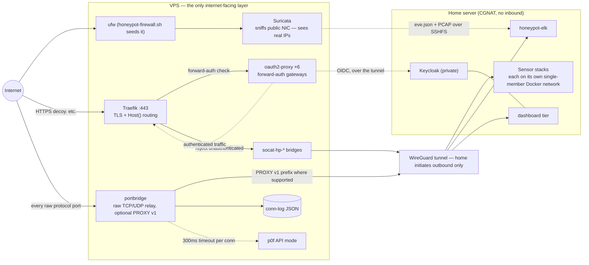
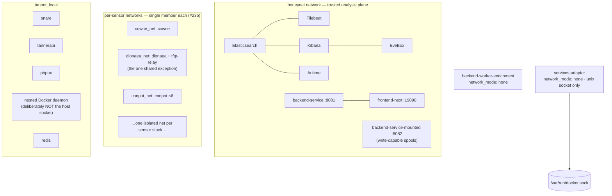

# Network design

[← back to README](../README.md) · [Architecture](ARCHITECTURE.md) · [Pipelines](PIPELINES.md) · [Storage](STORAGE.md)

The network exists to answer two questions correctly and one absolutely:

1. Which machine is talking to a sensor? (attribution)
2. What can a compromised sensor reach? (blast radius)
3. Absolutely nothing at home is directly internet-reachable. (the CGNAT pattern)

## The shape: two machines and a tunnel

There is no single honeypot host. The split *is* the primary isolation
boundary — the exposed surface and the analysis stack are different
hardware.

- **VPS firewall**: `ufw`, seeded by `vps/honeypot-firewall.sh`. Suricata
  and p0f both open raw sockets on the public interface; the kernel copies
  packets to each independently, so IDS sees everything that reaches any
  listener.
- **Home firewall**: none to reason about — the home server has no inbound
  exposure at all. Every published container port binds `${HP_BIND}`
  (normally `10.8.0.2`, the WireGuard address), never `0.0.0.0`. Verified
  repo-wide during the #1960 review: zero exceptions across all 32 stacks.

## Ingress paths

Two ways in, chosen per protocol:

| | HTTP(S) path | Raw path |
|---|---|---|
| Entry | Cloudflare → Traefik :443 → `Host()` rule | Cloudflare (port-allowlisted) or direct → portbridge |
| Auth for UIs | oauth2-proxy forward-auth (6 services), Keycloak-backed | n/a |
| Dashboard exception | native OIDC (#1026): Traefik passes straight through, PKCE exchange happens homeserver-local | n/a |
| Attribution | XFF / PROXY-aware sensors see the real IP in-band | PROXY v1 where the sensor supports it; otherwise the via_port join ([PIPELINES.md](PIPELINES.md#1a-write-path-sensor-log--index)) |
| Sensors served | http-honeypot, snare/tanner, galah (`hub.`), hellpot (catch-all), canarytokens HTTP channel, Keycloak, protected UIs (Kibana/EveBox/Arkime/TANNER/Rev·Deck/Traefik dashboard) | cowrie, dionaea, conpot ×6, dnp3, dicompot, dns, citrix, cisco-asa, rdp, multipot's ports, api-honeypot, endlessh (:202 public — not 2222, the VPS's own sshd), beelzebub, hellpot raw, elasticpot, sentrypeer (:5070), mailoney (:25), galah raw |

Port-selection rules worth keeping: public ports avoid the VPS's own
sshd (2022≠2222) and Cloudflare's non-standard-port allowlist drives which
sensors get a hostname versus a raw port (#1509/#1511/#1512).

**p0f must run on the VPS.** portbridge terminates every TCP connection
and re-establishes its own toward the sensor, so a home-side p0f would
only ever fingerprint portbridge itself. Only the OS-guess string survives
into the conn log; uptime/NAT/distance are discarded.

## Inside the home server

Isolation rules, in enforcement order:

1. **Sensor compromise has no lateral path.** Each honeypot stack runs on
   its own single-member Docker network (#235). A rootshell in cowrie can
   talk to cowrie's own network and the host paths mounted into it —
   nothing else. The single exception is documented: `tftp-relay` shares
   `dionaea_net` because it genuinely forwards traffic to dionaea.
2. **The analysis plane never touches sensor listeners.** `honeynet`
   carries Elasticsearch/Filebeat/Kibana/dashboard traffic. Sensor events
   cross to it exclusively through host bind-mounted files, not sockets.
3. **The enrichment worker has no network at all**
   (`network_mode: none`) — it reads logs and writes enriched copies from
   disk only.
4. **The dashboard's Docker control surface is a allowlisted unix-socket
   proxy**, not docker.sock. `services-adapter` holds the socket, exposes
   start/stop/restart/logs over its own private unix socket for ~40 named
   containers only, drops every capability, and never shells out.
5. **LLM isolation**: sensors never reach the model network. `galah` talks
   through `galah-llm-broker` (sole bridge onto `honeypot-llm`);
   beelzebub stays static-only rather than join it.
6. **Sandbox detonation networks are per-run**, brought up and torn down
   by the sandbox worker around a single sample (libvirt nwfilter,
   isolated-by-default with an optional allowlisted-egress mode) — see
   [sandbox/README.md](sandbox/README.md).

WireGuard specifics and the forward-auth request sequence live in
[CGNAT-DEPLOYMENT.md](CGNAT-DEPLOYMENT.md); the full per-sensor port
matrix lives in [SENSORS.md](SENSORS.md).

## Attribution summary

| Record | Source IP quality | Mechanism |
|---|---|---|
| VPS Suricata eve.json | real attacker IP | sniffs the public NIC |
| portbridge conn-log | real IP | terminates the public connection itself |
| PROXY-wrapped sensor logs | real IP | PROXY v1 header / XFF |
| Tunnel-blind sensor logs | WireGuard peer until joined | fixed ingest-time via_port join; honest-unattributed otherwise |
| Anything arriving over the tunnel | never attributed to the peer by default | the invariant behind the whole join design |

The consequence worth remembering: the only component that sees true
source addresses natively is on the VPS. Everything downstream either
carries that address in-band or reconstructs it once, at ingest, from the
connection log — and says so when it cannot.
