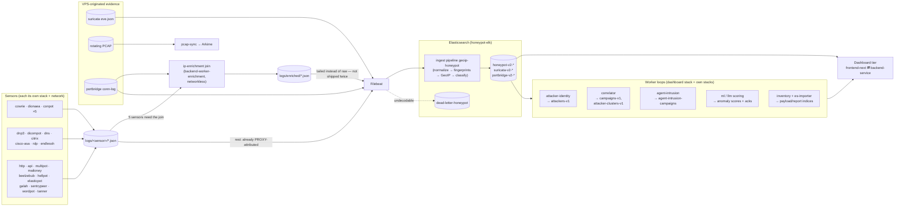
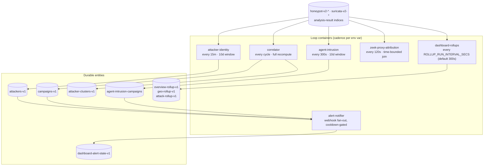
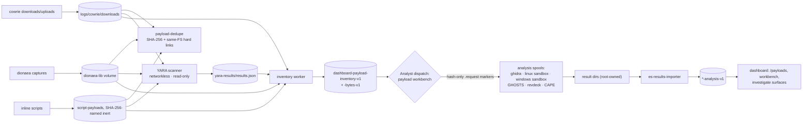

# Data pipelines

[← back to README](../README.md) · [Architecture](ARCHITECTURE.md) · [Network](NETWORK.md) · [Storage](STORAGE.md)

How a byte that arrives at the VPS becomes a row an analyst clicks on.
Four pipeline families run end to end: **event ingestion**, **derived
intelligence** (the workers), **payload analysis**, and **analysis-request
spools** (the workbench's detonation/static routes). Each section below is
the live shape as of the dashboard cutover (#1628, 2026-08-22).

The one-paragraph version:

> Sensors write append-only JSON under `/opt/stacks/apiary/logs/`. The
> ingest-time enrichment worker joins tunnel-attributed events to real
> attacker IPs via the portbridge connection log; Filebeat tails the result
> into Elasticsearch, where one shared ingest pipeline normalizes and
> enriches every document. Seven worker loops then aggregate raw events into
> durable entities (attackers, clusters, campaigns, anomaly scores,
> inventory, derived overview/map/attack rollups). The dashboard reads only
> Elasticsearch for history, keeps a
> small bounded live tail for suricata/portbridge, and serves it all through
> server functions with a 15s shared cache.

---

## 1. Event ingestion

### 1a. Write path: sensor log → index

Every sensor writes flat JSON lines to its own directory under the host
`logs/` tree (layout in [STORAGE.md](STORAGE.md#host-tree)). Two things
consume those files, never each other:

1. **Filebeat** ships everything durable into Elasticsearch with
   restart-safe registry offsets.
2. **The enrichment worker** rewrites five sensors' files into
   `logs/enriched/` before Filebeat sees them.

Which sensors need step 2 is decided by one question: **does the sensor see
the attacker's real IP?**

| Group | Sensors | Why | Fix |
|---|---|---|---|
| PROXY-aware | http, api-honeypot, multipot, tanner, dnp3, dicompot, citrix, rdp, endlessh, cisco-asa (WebVPN side), galah + wordpot (Traefik path, XFF) | portbridge/VPS speaks HAProxy PROXY v1 or Traefik sets XFF in-band | none — raw log is already correct |
| Tunnel-blind | cowrie, dionaea, every conpot persona, dns-honeypot, cisco-asa (IKE side), hellpot (raw path) | raw TCP relay; the log records the WireGuard peer | `via_port` join against the portbridge connection log |

The join runs **at ingest time, not read time** (#37/#38): the networkless
`backend-worker-enrichment` container reads both files off disk and writes
an already-correct copy to `logs/enriched/*.json`. Filebeat tails the
enriched path for exactly those sensors — nothing is shipped twice. A
portbridge dial must **precede** the flow it explains for the join to fire;
where no candidate survives that ordering test, the record honestly stays
tunnel-attributed (surfaced dashboard-wide as `unattributed_24h`, #1723).
An unattributed flow is honest; a wrong attacker is not.

### 1b. Enrichment: the `geoip-honeypot` ingest pipeline

One ES ingest pipeline (`index.default_pipeline` on all three index
families) processes every document. Each processor is
`ignore_failure: true`; enrichment failure never blocks indexing.

Order (1:1 with `analysis/elasticsearch-setup.sh`):

1. Main normalization script — promotes heterogeneous sensor fields into
   the flattened `honeypot.*` map (sensor, ips/ports, protocol, user,
   command line, url path, sha256, category, persona)
2. Fingerprint promotion (#1970) — collapses each document's correlation
   identity into one typed `fingerprint.kind` / `fingerprint.value` pair
   on all three index families: honeypot docs follow events.rs'
   `pivots_from_source` precedence exactly (canonical_fingerprint(+kind),
   hassh → HASSH, fingerprint → SSH pubkey, client → client banner,
   user_agent → User-Agent), Suricata TLS promotes JA4 over JA3.hash,
   suricata HTTP keeps the User-Agent kind alive, portbridge carries the
   p0f OS guess. Stripped/empty sources write nothing — no empty-string
   pollution — so ES-side terms aggs reproduce what the dashboard's
   read-time classification produced without the dashboard running.
3–5. GeoIP on suricata src/dst fields (`ignore_missing` no-ops elsewhere)
6–9. GeoIP on honeypot/portbridge src fields
10. Dionaea incident hash extraction (plain scan, no regex)
11. Network-type classification from ASN org (scanner/cloud/hosting)
12. Log4Shell deobfuscation flag (bounded depth/length)

No processor makes a network call — GeoIP reads local `.mmdb` files.

### 1c. Read path: how the dashboard consumes events

| Path | Used by | Contract |
|---|---|---|
| ES query (PIT + `search_after`) | every historical view | 30s timeout, ≤10k window, `_shard_doc` tie-breaker |
| Shared serviceJSON cache | all frontend server functions | 15s TTL in-process + Redis shared layer; ConcurrencyLimiter backpressure |
| SSE `/api/v1/live` | live tail pages | resume carries the full sort tuple, so same-millisecond rows are neither dropped nor duplicated (#1979 closed by #2039) |
| Bounded local-file tail | suricata + portbridge only | the two index families without a `honeypot-v2-*` mirror (#1103 Cat. 2); every other sensor is ES-only by design |

---

## 2. Derived intelligence: the worker loops

All loops share one contract: **stateless recomputation over a rolling
window, durable output via idempotent writes** (CAS `seq_no/primary_term`
or deterministic document IDs). If ES is unavailable the loop skips a
cycle; there is no local state to corrupt.

| Loop | Reads | Writes | Cadence | Notes |
|---|---|---|---|---|
| attacker-identity | `honeypot-v2-*`, `*-analysis-v1` verdicts | `attackers-v1` | 15m | union of observed behavior + analysis verdicts per source IP; standalone Go worker stack |
| correlator | raw events | `campaigns-v1`, `attacker-clusters-v1` | every cycle | pure aggregations, recomputed from scratch; groups ≥2 IPs sharing fingerprint/hash/ASN/provider-class |
| agent-intrusion | raw events | `agent-intrusion-campaigns` | 300s | deterministic criticality rules escalate; LLM never gates escalation; deterministic sha256 campaign_id ⇒ upsert not duplicate |
| zeek-proxy-attribution | zeek flows + portbridge log | flow docs | 120s | attributes relayed flows to attackers; ordering rule above applies here too |
| dashboard-rollups (#2046) | raw event indices (default pattern) | `overview-rollup-v1`, `geo-rollup-v1`, `attack-rollup-v1` | `ROLLUP_RUN_INTERVAL_SECS`, default 300s | pure-ES derived overviews the dashboard's overview/map/kill-chain reads slice cheaply instead of re-aggregating raw events per request |
| ml-worker / llm-worker | payloads + events | anomaly scores + `dashboard-ml-anomaly-ack-v1` | continuous | scoring semantics tracked in #1969/#1974 |
| payload-inventory | disk stores | `dashboard-payload-inventory-v1/-bytes-v1` | periodic scan | HEAD-exists fast path (#1221) |
| es-results-importer | root-owned result spools | `*-analysis-v1` | continuous | read-only mirror, shard-partitionable |

Operational caveat from #1980 — worker panics used to kill the whole
container on one malformed document — is fixed: every runloop carries a
`recover()` boundary now, so a poison document fails that iteration, not
the loop's uptime.

---

## 3. Payload lifecycle

Captures are content, never configuration; nothing captured is ever
executed inside the fleet.

Key invariants:

- **Hash-only handoff.** Workbench requests are empty `<sha256>.request`
  marker files. No sample bytes, paths, or commands cross a privilege
  boundary; the receiving root-owned service resolves the hash inside its
  own approved roots and recomputes SHA-256 before use.
- **Dedupe preserves every path**, hard-linking duplicates on the same
  filesystem only — source labels survive because the inventory merge keys
  on hash but keeps every contributing store.
- **Static analysis cache is content-addressed**
  (`dashboard-static-analysis-v1`): immutable per hash, so hits never need
  invalidation.
- **Verdict discipline.** Static ≠ dynamic ≠ IDS ≠ correlation evidence;
  timeouts/failures stay visibly distinct from "clean". Scores are triage
  aids wired to nothing automatic — no firewall changes, reporting, or
  execution ever fires off a score alone.

---

## 4. Index catalog

Producer → consumer summary (verified during the #1960 review; each derived
index has exactly one writer):

| Index family | Written by | Read by |
|---|---|---|
| `honeypot-v2-*`, `suricata-v2-*`, `portbridge-v2-*` | Filebeat (+ ingest pipeline) | dashboard, all workers, Kibana, EveBox (`suricata-*`) |
| `dead-letter-honeypot` | ES (rejected docs) | dead-letters page, source-health |
| `attackers-v1` | attacker-identity-worker | backend-service (attackers, overview, graphs) |
| `campaigns-v1`, `attacker-clusters-v1` | correlator-worker | backend-service (clusters, kill-chain, investigate) |
| `agent-intrusion-campaigns` | backend-service agent_intrusion loop | agent-campaigns page |
| `ghidra-analysis-v1`, `sandbox-analysis-v1`, `github-analysis-v1`, `cape-analysis-v1`, `revdeck-analysis-v1` | es-results-importer | identity worker, investigate/payload surfaces |
| `yara-analysis-v1` | YARA join via inventory | backend-service charts + investigate |
| `dashboard-payload-inventory-v1`, `-bytes-v1` | payload-inventory-worker | payloads page, charts |
| `dashboard-canarytokens-v1` | canarytokens-adapter | canarytokens page + settings pane |
| `cowrie-ttylog-v1` | Filebeat | tty-replay, recordings |
| `mailoney-mail-v1` | Filebeat | sessions/mail views |
| `reporter-metrics-v1` | reporter | settings stats pane |
| `dashboard-alert-state-v1` | alert-notifier loop | alerts page |
| `overview-rollup-v1`, `geo-rollup-v1`, `attack-rollup-v1` | dashboard-rollups loop (#2046) | overview/map/kill-chain dashboard reads |
| anomaly score + ack indices | ml/llm workers | ml-anomalies page, composite score |
| `dashboard-users-v1`, `dashboard-workbench-runs-v1`, report/problem-report indices | backend-service itself | their pages |

Retention specifics (ILM, pcap ceilings, snapshots) live in
[STORAGE.md](STORAGE.md#retention-and-lifecycle).
