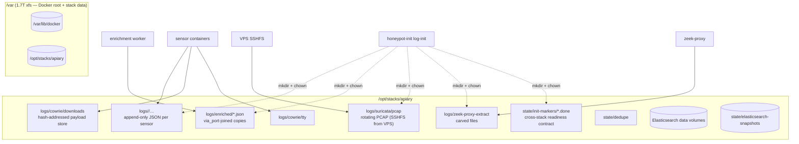
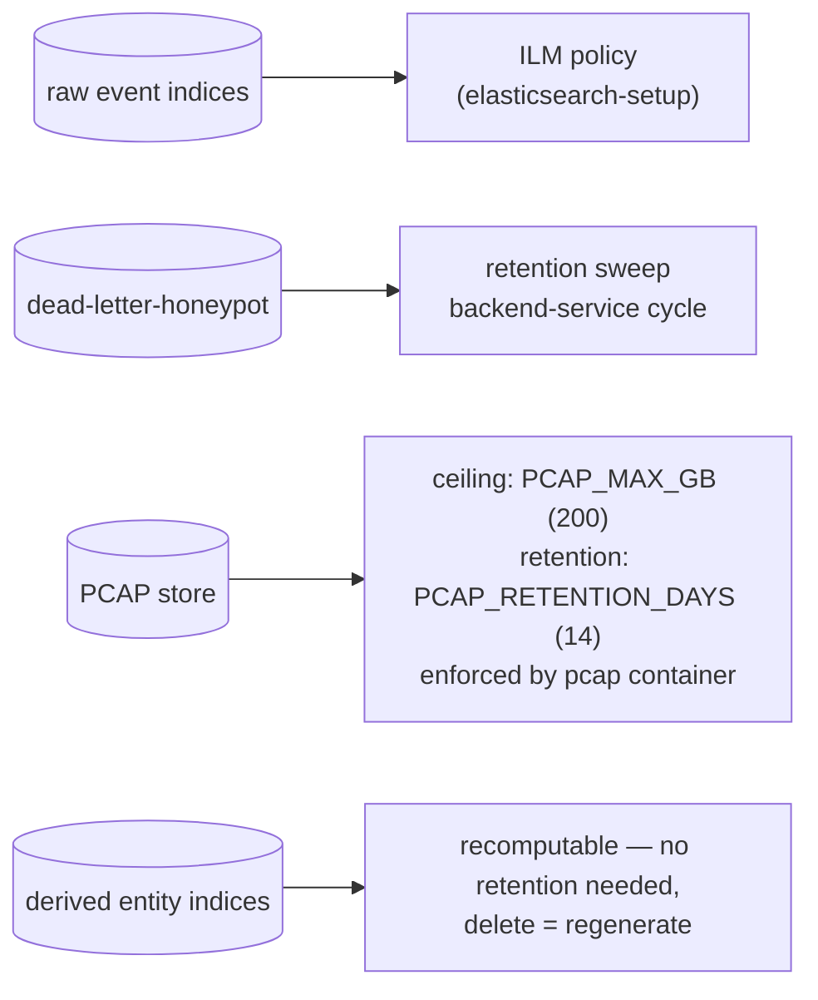

# Storage

[← back to README](../README.md) · [Architecture](ARCHITECTURE.md) · [Pipelines](PIPELINES.md) · [Network](NETWORK.md)

Where data lands, who owns it, and what bounds its growth. The physical
disk story is [HOMESERVER-DISK-LAYOUT.md](HOMESERVER-DISK-LAYOUT.md); this
page is the logical layer on top of it.

## The one rule: files are the interface

Stacks are independent deploy units that share almost nothing over the
network. Sensor events reach Elasticsearch because both sides mount the
same host directories; worker results reach the dashboard through indices;
analysis requests cross privilege boundaries as empty marker files.
Filesystem layout is therefore a *contract*, not an implementation detail.

## Host tree

| Path | Writer(s) | Reader(s) | Notes |
|---|---|---|---|
| `logs/<sensor>/*.json` | sensor containers | Filebeat; enrichment worker (5 sensors) | ownership per runtime UID, provisioned by `honeypot-init`'s mkdir/chown matrix |
| `logs/enriched/` | backend-worker-enrichment | Filebeat (tailed instead of raw for those sensors) | Arcane provisions this dir `994:979` at deploy time; consumers carry matching `group_add` |
| `logs/cowrie/downloads`, `logs/cowrie/tty` | cowrie | payload-dedupe, YARA, inventory worker, es_importer, dashboard | the shared payload handoff point; recursive chown matters here (#107's war story) |
| `logs/suricata/pcap/` | VPS suricata (over SSHFS) | pcap-sync → Arkime | sync skips the newest file; SSHFS writes don't raise inotify events, so Arkime gets local close-write instead |
| `logs/zeek-proxy(-extract)/` | zeek-proxy | extracted-file-importer (read-only) | extract dir deliberately separate so the importer never holds a writable path to payloads |
| `state/init-markers/` | honeypot-init jobs | every dependent container's entrypoint | `<job>.done` polling replaces cross-stack `depends_on`, which cannot span stacks (#258) |
| `state/dedupe/` | payload-dedupe | itself | persistent hash→path state |
| result spools (`/var/lib/honeypot-{ghidra,sandbox,…}/…`) | root host workers | backend-service-mounted (read-only) | hash-only `.request` in, bounded results out |

**Provisioning is split three ways** — documented here so a fourth
mechanism doesn't appear silently:

1. **honeypot-init** mkdir/chowns the sensor log tree before anything
   starts (entrypoints poll `log-init.done`).
2. **Arcane** provisions a few dirs at deploy time with its own
   uid/gid (`994:979`) — consumers join that group explicitly.
3. **Docker autocreate** covers root-writer-only paths (e.g.
   zeek-proxy-extract): harmless only because that writer runs as root.

## Elasticsearch

Indices follow `<source>-v<N>` naming. Producers and consumers were
verified one-to-one during the #1960 review — the catalog table lives in
[PIPELINES.md](PIPELINES.md#4-index-catalog).

- **Templates**: `honeypot-*`, `suricata-*`, `portbridge-*` set the shared
  ingest pipeline and flattened mappings so heterogeneous sensor fields
  land safely.
- **Derived entities** (`attackers-v1`, `campaigns-v1`,
  `attacker-clusters-v1`, `agent-intrusion-campaigns`) are recomputed
  idempotently by their loops — safe to delete and regenerate from raw
  events within their windows.
- **Dead letters**: documents ES rejects land in `dead-letter-honeypot`
  (distinct from Filebeat's earlier decode-failure fallback layer).
- **Writes use CAS** (`seq_no`/`primary_term`) where concurrent writers
  exist; deterministic document IDs elsewhere so replays upsert.

## Retention and lifecycle

- Raw event retention is ILM-managed; the dead-letter index has its own
  sweep so rejected-doc accumulation can't outgrow intent.
- PCAP is disk-ceilinged (`PCAP_MAX_GB`, default 200 GB) *and* aged
  (`PCAP_RETENTION_DAYS`, default 14) — the ceiling binds first under
  attack bursts, the age bound wins in quiet periods. These knobs are the
  two vars most worth setting explicitly per deployment (#1982 documents
  them in `.env.example` now).
- Payload stores are content-addressed and hard-link deduped; growth
  tracks unique samples, not capture volume.
- Snapshot target: `state/elasticsearch-snapshots`; backup runbook is
  [BACKUP-ESSENTIALS.md](BACKUP-ESSENTIALS.md), recovery in
  [RECOVERY.md](RECOVERY.md).

## Growth boundaries at a glance

| Store | Bound | Mechanism |
|---|---|---|
| ES event indices | ILM age/size | index templates + ILM |
| dead letters | bounded sweep | backend-service retention cycle |
| PCAP | 200 GB / 14 days | container-side find/delete + cap arithmetic |
| payload stores | unique-sample growth | SHA-256 addressing + hard links |
| Docker images/logs | json-file 25M×3 per container | compose logging defaults (`x-runtime-defaults`) |
| text logs humans read | copy-truncate rotation | log-maintenance (never touches Filebeat-tailed structured streams) |
