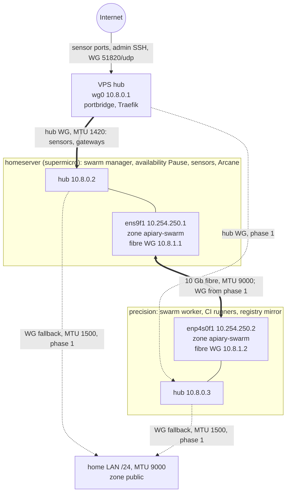

# Swarm network: tunnels, addressing and the swarm-plane firewall

[← back to README](../README.md) · [Network](NETWORK.md) · [CGNAT deployment](CGNAT-DEPLOYMENT.md) · [Architecture](ARCHITECTURE.md)

This document owns the network decisions for the three-node Docker Swarm
(epic [#3587](https://github.com/Xore/APIARY/issues/3587)): which tunnels exist,
how they are addressed, which flows cross them, and how the firewall is applied
and rolled back. [NETWORK.md](NETWORK.md) still owns the ingress paths, source
attribution and per-sensor isolation. Those do not change here.

**Status (2026-10-10).**
- **Phase 0 ([#3588](https://github.com/Xore/APIARY/issues/3588))** is live on homeserver and precision. The direct fibre is in its own default-deny `apiary-swarm` zone, and the swarm plane is closed on every LAN and public interface.
- **Phase 1 ([#3589](https://github.com/Xore/APIARY/issues/3589))** builds the WireGuard tunnels and re-joins the swarm. It is not started.

The per-service, per-port evidence behind the flow matrix is the
[#3588 live/repo port inventory](https://github.com/Xore/APIARY/issues/3588#issuecomment-6098046203),
taken on 2026-10-10. Check live state again before changing a host.

## Topology

The explorable diagram is [`diagrams/swarm-network-topology.html`](diagrams/swarm-network-topology.html).
Solid edges carry traffic today. Dashed edges are built in phase 1.



## Decisions

These are decided (Xore, 2026-10-10). They are not options. A change needs a new
decision on #3587.

1. **Hub-and-spoke on the VPS.** The VPS runs the WireGuard hub. homeserver and precision are spokes; there is no full mesh through the Internet. The VPS is already the only Internet-facing host ([NETWORK.md](NETWORK.md)), so it also terminates the only Internet tunnels.
2. **homeserver ↔ precision runs WireGuard over the raw fibre.** The direct 10 Gb link (`ens9f1` ↔ `enp4s0f1`) carries a dedicated WireGuard tunnel. The swarm does not rely on IPsec of encrypted overlays alone: VXLAN of unencrypted overlays, gossip and the manager API are plaintext.
3. **MTU 9000 on the LAN and the fibre. Everything else keeps the WireGuard default** (about 1420 on the Internet hub path). See the MTU budget below.
4. **Addressing.**
   - Hub `10.8.0.0/24`: VPS `.1`, homeserver `.2`, precision `.3` (new).
   - Fibre WireGuard `10.8.1.0/30`: homeserver `.1`, precision `.2`, over the existing `10.254.250.0/30` underlay.
5. **Every swarm node re-joins on its hub address.** `--advertise-addr` and `--data-path-addr` become the node's `10.8.0.x`, so the VPS can reach every node. homeserver ↔ precision hub traffic routes over the fibre tunnel (a host route for the peer's `10.8.0.x` via `10.8.1.x`), never through the VPS.
6. **Fibre-down fallback is a second WireGuard tunnel over the LAN** (WireGuard interface MTU 1500). It takes over automatically, using a health-probed route-metric switch from the fibre tunnel to the LAN tunnel, and it hands back when the fibre recovers. Failover and recovery are tested in #3589 before anything relies on them.
7. **Keys are host-generated and never stored in git.** Each host creates its own private key (`wg genkey`, mode 0600, under `/etc/wireguard/`). Only public keys and endpoints are templated into the repo. Rotation is the manual runbook below, run on suspicion of compromise or yearly.
8. **The flow matrix below is the firewall.** It is derived from the inventory and is default deny in both directions on every tunnel interface. It is applied with the dead-man rollback and the probes in this document, with no further design review gate.

## Addressing and MTU budget

| Link | Underlay | WireGuard interface | Addresses | Interface MTU |
|---|---|---|---|---|
| VPS hub | public Internet, UDP 51820 | `wg0` on each host | `10.8.0.1` / `.2` / `.3` | 1420 (default) |
| Fibre | `10.254.250.0/30`, MTU 9000 | fibre tunnel (named in #3589) | `10.8.1.1` / `10.8.1.2` | 8920 (9000 − 80) |
| LAN fallback | home LAN `/24`, MTU 9000 | LAN tunnel (named in #3589) | per #3589 | 1500 |
| Swarm today (phase 0) | fibre `/30`, no WireGuard | none | NodeAddr `10.254.250.1` / `.2` | 9000 |

The largest overlay MTU on a path is the WireGuard interface MTU, minus 50 for
VXLAN, minus up to 60 for ESP on `--opt encrypted` overlays. The numbers below are
derived; #3589 verifies each one with `ping -M do -s <MTU − 28>` across the overlay.

| Overlay spans | Largest overlay MTU |
|---|---|
| fibre only, and need not survive failover | 8810 |
| homeserver ↔ precision, must survive fibre failover | 1390 (LAN fallback path) |
| any path through the VPS hub | 1310 |

An overlay must be sized for the smallest path it can ever take, including the
fallback path. Otherwise a fibre failure turns into a PMTU black hole, not a
failover. ICMP stays open in the swarm zone so PMTU discovery keeps working.

## Flow matrix

Interfaces:
- `F` is the direct fibre (`ens9f1` on homeserver, `enp4s0f1` on precision).
- `H` is the VPS ↔ homeserver `wg0`.
- `L` is the LAN/uplink (`ens9f0` and `eno1` on homeserver, `enp4s0f0` on precision).

In phase 0, inbound swarm rules are bound to an interface in `apiary-swarm`, restricted to the single fibre peer source, and default deny with rate-limited logging. The SSH rule there preserves the existing Arcane fibre forward. `public` logs and drops the swarm protocols on the LAN/uplink and on `wg0` (unzoned, so it falls into the default zone). Ordinary egress and the existing unrelated publications are unchanged.

| Source → destination | Interface; protocol/port | Purpose | Owner / phase |
|---|---|---|---|
| precision `10.254.250.2` → homeserver `10.254.250.1` | F; TCP 2377, TCP/UDP 7946, UDP 4789, ESP (IP protocol 50) | Manager control, gossip, VXLAN, encrypted overlay | #3588 / live |
| homeserver `10.254.250.1` → precision `10.254.250.2` | F; TCP/UDP 7946, UDP 4789, ESP | Gossip and overlay; precision has no TCP 2377 listener while it is a worker | #3588 / live |
| precision → homeserver | F; TCP 22, then loopback TCP 13552 → H TCP 3552 | `arcane-fibre-tunnel` SSH forward to the Arcane manager; the agent listens on loopback TCP 3553 | #3588 / live, replaced in #3589 |
| homeserver ↔ precision | F and L; ICMP | PMTU discovery and health probes | #3588 / live |
| LAN admin → homeserver/precision | L; TCP 22 | Existing SSH access, kept in `public` | ops / existing |
| VPS portbridge → homeserver sensors | H; exact TCP/UDP mappings in the [inventory](https://github.com/Xore/APIARY/issues/3588#issuecomment-6098046203), including translated ports | Internet honeypot traffic; attacker `source.ip` preserved | #3573 / existing |
| VPS Traefik/socat → homeserver gateways | H; the dashboard, Arcane, Keycloak, Kibana and other published ports in the inventory | OIDC-gated tools; no new host openings | #3579 / existing |
| CI runners → precision registry mirror | local Docker bridge; TCP 5555 → 5000 | Image pulls; not LAN-published | CI / existing |
| VPS ↔ homeserver/precision | H; WireGuard UDP 51820 underlay, then peer-scoped TCP 2377, TCP/UDP 7946, UDP 4789, ESP | Three-node swarm and encrypted overlays | #3589 |
| homeserver ↔ precision | fibre WG `10.8.1.0/30` and the LAN fallback; peer-scoped swarm ports above; WG listener UDP ports per #3589 | Direct encrypted swarm path and failover. The only `public` addition is a peer-scoped accept for the LAN tunnel's UDP port | #3589 |
| BFF/backend overlay | rides the overlay (VXLAN/ESP above) | Encrypted BFF overlay; no extra host ports | #3579 |

What the phase 0 firewall does *not* cover:
- **Docker-published ports.** Do not infer that a firewalld `INPUT` rule protects a Docker-published port: DNAT sends that traffic through `FORWARD`/`DOCKER-USER`, and both chains have no site policy today. Swarm listeners and kernel VXLAN/ESP use `INPUT`, so `swarm-plane.sh` changes no `DOCKER-USER` rule and claims no protection for the unrelated published ports.
- **Host-mode sensor publication.** #3593 must add peer-scoped `DOCKER-USER` enforcement before it publishes host-mode sensor ports.
- **Forwarding.** Preserve portbridge forwarding and source attribution in both follow-ups.

The rules are code: [`ops/firewall/swarm-plane.sh`](../ops/firewall/swarm-plane.sh) with one env file per host in [`ops/firewall/hosts/`](../ops/firewall/hosts/). `apply` converges idempotently. Rules the script owns that are no longer in the env file are removed. `hosts/vps.env` is not applied in phase 0.

### Why a dedicated zone, not source-scoped rules in `public`

firewalld rich rules cannot match an input interface. The 2026-10-09 rules
accepted 2377/7946/4789 "from 10.254.250.x" in `public`, which also matched a
spoofed packet arriving on the LAN uplink. precision's uplink runs loose
`rp_filter` (multihome, `/etc/sysctl.d/90-apiary-multihome.conf`), so a LAN host
that routed `10.254.250.2` via precision's uplink and spoofed `10.254.250.1` got
a SYN-ACK from 7946. Binding the fibre interface into its own zone makes the
interface the first match. The same probe now gets no SYN-ACK and logs
`apiary-swarm-lan: IN=enp4s0f0`. homeserver's uplink runs strict `rp_filter`, so
the kernel drops the spoof there before firewalld logs it.

## LAN service ports: decision pending

These listeners are reachable on a LAN interface today and are outside the
swarm plane. Phase 0 leaves them unchanged. Whether each moves to WireGuard-only,
moves to loopback, stays on the LAN or closes is decided in
[#3604](https://github.com/Xore/APIARY/issues/3604), not here.

| Host | Listener | Service | Why it is open | Decision |
|---|---|---|---|---|
| homeserver | `ens9f0` LAN address, TCP 8888 and 8899 | Unsloth Studio (can run arbitrary code) | live `UNSLOTH_BIND` resolves to the LAN address; repo default is `10.8.0.2` | pending, #3604 |
| homeserver | `ens9f0` LAN address, TCP/UDP 53, TCP 5380 and 53443 | Technitium DNS, admin UI, DoH | live `LAN_IP` binding set outside `.env`; repo default is loopback | pending, #3604 |
| homeserver | `0.0.0.0:28012-28013` TCP | `pentagi-terminal-6` docker-proxy | not from any Compose project; DNAT can bypass `INPUT` | pending, #3604 |
| homeserver | `0.0.0.0:3020` TCP | bun `serve.ts` as user xore | allowed in `public` (every LAN interface and `wg0`) | pending, #3604 |
| homeserver | `0.0.0.0:44321`, `4330`, `5666`, `5999`, `7777` TCP | pmcd, pmlogger, SuperDoctor5 | wildcard binds; no zone allows them | pending, #3604 |
| precision | `0.0.0.0:9090` TCP | Cockpit | `public` allows the cockpit service on the uplink | pending, #3604 |
| homeserver, precision | `0.0.0.0:22` TCP | sshd | admin path | kept (ops), revisited in #3604 |
| VPS | portbridge `tcp:8543` | sonicwall honeypot | in the repo RULES, missing from live RULES (drift) | pending, #3604 |

## Failure modes

| Failure | Phase 0 (today) | Phase 1 (after #3589) |
|---|---|---|
| **VPS down** | No Internet traffic reaches the sensors (portbridge is on the VPS), so capture pauses because there is nothing to capture. The public dashboards and OIDC gateways are offline. homeserver ↔ precision swarm, Arcane and CI are unaffected (fibre). | The same for ingress. The VPS worker goes `Down`. Both managers keep quorum over the fibre tunnel, so the swarm and overlays between them are unaffected. |
| **Fibre down** | precision is unreachable on its NodeAddr and goes `Down`. Its tasks stop being managed, and the Arcane agent goes offline (its SSH forward rides the fibre). Sensors and ingest on homeserver continue. | The LAN WireGuard tunnel takes over automatically. Overlay traffic continues at the fallback MTU, which is why failover-surviving overlays are sized for 1390. When the fibre recovers, the route switches back. |
| **Fibre and LAN down** | as fibre down | The two managers lose quorum: their hub traffic never routes through the VPS (decision 5). Running tasks continue, but scheduling and updates stop until connectivity returns. precision stays reachable from the VPS. |
| **homeserver down** | The sole manager is gone, so the control plane is frozen. Running containers on precision keep running but cannot be rescheduled or updated. Sensors are down. | The two-manager quorum is lost. Running tasks continue, but scheduling and updates stop; sensors are down. |
| **precision down** | Its CI runners and registry mirror are offline. No sensor impact. | The two-manager quorum is lost. Running tasks continue, but scheduling and updates stop; sensors are unaffected. |
| **Rollback timer fires** | The firewall config from before the change is restored. SSH and established flows survive through conntrack. See Rollback. | The same mechanism for the phase 1 rules. |

**Manager quorum (accepted decision, [#3587](https://github.com/Xore-Inc/APIARY/issues/3587#issuecomment-6091107601)).** Phase 1 runs **two managers: homeserver and precision**, with the VPS as a **worker**. Raft needs both managers for a majority. If either manager fails or their fibre and LAN paths both fail, existing tasks keep running but scheduling and updates stop until quorum returns. Xore accepted this availability trade-off. Today homeserver is still the sole manager; #3589 promotes precision and joins the VPS as a worker. Verify `docker node ls` from both managers after promotion. Never promote the VPS.

## Key handling and rotation

Private keys never leave the host that generated them and never enter git,
issues or logs. The repo holds only templates, public keys and endpoints.

Rotation runbook (on suspected compromise, or yearly), one tunnel and one peer at a time:
1. Confirm a second path to the host (another tunnel, the LAN or the console) before touching its keys.
2. On the host, generate a new key pair (`umask 077; wg genkey | tee new.key | wg pubkey > new.pub`).
3. Add the new public key to the peer, alongside the old one where the tool allows it. Otherwise schedule the swap inside a dead-man window.
4. Switch the host to the new private key with `wg set <iface> private-key new.key` and update the config file.
5. Verify the handshake (`wg show`), the probes and swarm `Ready`.
6. Remove the old public key from the peer and delete the old private key.
7. Record the date (not the key) on the tracking issue.

On suspected compromise, remove the old peer key first and accept the short outage. Do not wait for the overlap.

## Apply, probe and rollback

Apply **precision first, then homeserver**, one host at a time, from a checkout
of the merged repo on each host. Before touching rules, confirm current interface
zones, swarm node state, the SSH path, sensor ingest and timer state. Do not
apply `hosts/vps.env` in phase 0. Never run concurrent firewalld changes during a
rollback window.

```bash
sudo -n firewall-cmd --get-active-zones
sudo -n systemctl list-timers --all 'fw-rollback-3588*'
ssh homeserver 'sudo -n docker node ls'  # both nodes must be Ready
cd ops/firewall
backup=$(sudo -n ./swarm-plane.sh backup hosts/HOST.env)
sudo -n ./swarm-plane.sh arm "$backup" 10min
sudo -n ./swarm-plane.sh apply hosts/HOST.env
sudo -n ./swarm-plane.sh status hosts/HOST.env
```

Use `precision.env` or `homeserver.env` for `HOST.env`. Verify the timer is
**active and scheduled** before `apply`. Then prove both sides:

- **Outside** (from a separate LAN workstation session):
  - reconnect with `ssh precision` or `ssh homeserver`;
  - scan the LAN addresses with `nmap -Pn -sT -sU -p T:2377,7946,U:7946,4789`: TCP must be `filtered`, UDP `open|filtered`;
  - spoof test: add a host route for the fibre address via the host's uplink and send SYNs with the fibre peer as source, from a fixed source port (`nping --tcp -p 7946 -g <port> --flags syn -S <peer> <fibre-addr>`). Capture on the host with `tcpdump -ni any "tcp port <port>"`. There must be **no SYN-ACK** on any interface. Remove the route afterwards.
- **Inside** (from the fibre peer):
  - TCP 2377/7946 open, both nodes `Ready`;
  - restart `arcane-fibre-tunnel` so the SSH forward reconnects under the new rules;
  - encrypted overlay test: on an attachable `--opt encrypted` test overlay, ping both ways. `ip xfrm state` must be nonempty and `tcpdump -ni <fibre> esp` must show ESP both directions. A paused manager cannot attach containers, so set supermicro `Active` only for the test, then remove the overlay and restore `Pause`.
- **Services:**
  - Arcane: precision's environment `online`, its containers listed through the manager API, and a GitOps sync returning success. A local socket or active unit alone is not proof.
  - Runners: online.
  - Ingest: the `honeypot-v2*` doc count rising over a minute, with recent events carrying a public attacker `source.ip`.

Only after the outside and inside proofs both pass, stop that host's timer with
`sudo -n ./swarm-plane.sh disarm` and confirm `fw-rollback-3588.timer` is
inactive.

**Rollback.** If any proof is missing, leave the timer armed. It restores the
saved `/etc/firewalld` and the NetworkManager interface zone, then reloads
firewalld. Check the resulting zone, SSH, swarm and sensor state.
- **Manual rollback:** `sudo -n "$backup/rollback.sh" "$backup"`. The backup directories live under `/var/lib/apiary-firewall/`, and the rollback script is copied into each, so it never depends on the checkout.
- **SSH lost:** use the host console (homeserver IPMI, precision local console) to run the saved rollback script. `systemctl stop firewalld` is the emergency access path.
- The saved nft ruleset is diagnostic evidence, not the restore source.

The rollback path was exercised for real on 2026-10-10: the first precision
apply timed out before its Arcane proof and was restored by the timer.

## Verification record

| Date (UTC) | Host | Result |
|---|---|---|
| 2026-10-10 13:40 | precision | applied; Arcane proof missing inside 5 min, timer rolled back (rollback proven) |
| 2026-10-10 13:56 / 14:00 | precision, homeserver | applied with 20 min timers; probes passed; timers disarmed |
| 2026-10-10 17:11 | precision | re-applied with a 10 min timer; all probes passed ([evidence](https://github.com/Xore/APIARY/issues/3588#issuecomment-6100122436)); timer disarmed |
| 2026-10-10 17:15 | homeserver | applied with a 10 min timer; all probes passed ([evidence](https://github.com/Xore/APIARY/issues/3588#issuecomment-6100158469)); timer disarmed |
