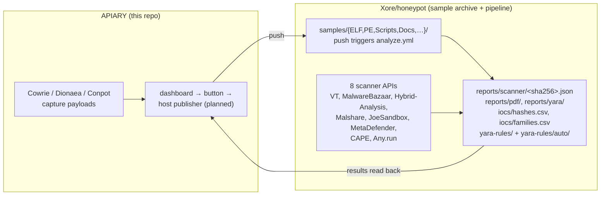

# Malware Analysis Pipeline

Captured payloads are analysed by a multi-scanner GitHub Actions pipeline that
lives in a **separate repository**, [`Xore/honeypot`](https://github.com/Xore/honeypot).
This folder holds the honeypot-side tooling that feeds it and the local analysis
scripts that run on the sensor host.

> The integration between this repository's dashboard and that pipeline is
> designed in [`docs/github-analysis-integration-roadmap.md`](../github-analysis-integration-roadmap.md)
> and tracked in [#73](https://github.com/Xore/apiary/issues/73)
> (upstream YARA corpus sync — built, see [`yara/`](../../analysis/yara/)) and
> [#74](https://github.com/Xore/apiary/issues/74) (the manual
> publisher, not built yet).
> Publication is **not** automatic — see "Publication is manual" below.

---

## Architecture



---

## Components in this folder

| Path | Purpose |
|---|---|
| `analyze.py` | Offline triage of Cowrie / http-honeypot / multipot / Dionaea JSON logs. Stdlib only |
| `collect.sh` | **Deprecated.** Cron-driven bulk copy of captures into a clone of `Xore/honeypot`. Superseded by the dashboard button; kept for a one-time manual backfill |
| `dedupe-payloads.py` | Collapses duplicate captures by SHA-256 |
| `yara/` | Networkless YARA scanner sidecar, local rules, and the vendored upstream corpus (`yara/sync-yara.sh`) |
| `ghidra/` | Headless Ghidra reverse-engineering pipeline, local-model triage, and the analysis-host installer ([`ghidra/README.md`](ghidra/README.md)) |
| `es-results-importer/` | Ships Ghidra/sandbox/GitHub-analysis/workbench-run results into Elasticsearch, read-only, alongside the raw event stream ([#378](https://github.com/Xore/apiary/issues/378)) |
| `elasticsearch-setup.sh`, `honeypot-kibana-setup.sh`, `filebeat.yml`, `evebox.yaml` | Log pipeline and search UI provisioning |
| `backup-honeypot.sh`, `verify-backup.sh`, `log-maintenance.sh`, `RECOVERY.md` | Retention and recovery |
| `verify-stack.py` | Post-deploy health check |

The GitHub Actions workflow itself lives at
[`Xore/honeypot/.github/workflows/analyze.yml`](https://github.com/Xore/honeypot/blob/main/.github/workflows/analyze.yml).
The authoritative scanner capability reference is
[`Xore/honeypot/docs/SCANNERS.md`](https://github.com/Xore/honeypot/blob/main/docs/SCANNERS.md).

---

## Publication is manual

Pushing a capture to `Xore/honeypot` publishes it to a **public repository** and
to up to eight third-party scanner APIs. That is an irreversible external
disclosure, so it is never triggered by a timer or a directory watcher.

The intended path is a per-sample, admin-only, confirm-gated button in the
dashboard, backed by a root-owned host publisher — the same spool-file pattern
the KVM sandbox already uses. `collect.sh` predates that design and should not
be installed on a cron.

---

## Upstream pipeline

### Triggers

| Trigger | Behaviour |
|---|---|
| `push` to `main` touching `samples/**` | Scans only **Added or Renamed** files (`--diff-filter=AR`). Modified files are deliberately skipped — an existing sample was already scanned when it was added |
| `pull_request` | Dry run; results are never committed |
| `schedule` — Sundays 02:00 UTC | Full rescan of `samples/`, refreshing detection scores |
| `workflow_dispatch` | Manual run with an optional `sample_path` input |

### Steps

1. Detect new sample files.
2. YARA pre-scan (`yara-rules/*.yar` + `yara-rules/auto/*.yar`) — offline
   detection before any API quota is spent.
3. Multi-scanner analysis (`analyze_samples.py`): hash lookup, upload if
   unknown, poll for results → `reports/scanner/<sha256>.json`; append
   `iocs/hashes.csv` and `iocs/families.csv`.
4. Auto YARA generation (`generate_yara.py`): reads the scanner reports, runs
   `strings -n 8` over the sample, normalises family names, scores and selects
   detection strings, emits `yara-rules/auto/<family>.yar`, validates with
   `yara --compile`. Invalid rules go to `_invalid/` for review.
5. IOC changelog update (`iocs/CHANGELOG.md`).
6. PDF report generation (`report.py` → `reports/pdf/`).
7. Artifact upload, retained 90 days.
8. Commit `reports/`, `iocs/`, and `yara-rules/auto/` with `[skip ci]`.

### Failure contract

A single scanner API failure never aborts the job, and the JSON report is always
written. The job hard-fails only when no scanner secrets are set at all, the
file list cannot be read, or every scanner errored on every file (exit 2).

### Scanners

| Scanner | Secret | Free tier |
|---|---|---|
| VirusTotal | `VT_API_KEY` | 4 req/min, 500/day — 70+ AV engines |
| MalwareBazaar | `MALWAREBAZAAR_API_KEY` | Yes — `Auth-Key` header required on every request |
| Hybrid-Analysis | `HYBRID_ANALYSIS_KEY` | Yes — `env_id=110` (Win7-64) on free tier |
| Malshare | `MALSHARE_API_KEY` | Yes |
| JoeSandbox | `JOESANDBOX_API_KEY` | Community tier, limited submissions |
| MetaDefender | `METADEFENDER_API_KEY` | Yes — 37+ engines |
| CAPE Sandbox | `CAPE_API_URL` + `CAPE_API_KEY` | Self-hosted |
| Any.run | `ANYRUN_API_KEY` | Paid only |

`GH_PAT` (repo write scope) is always required, for the pipeline's own commits.
At least one scanner secret must be present.

Secrets are configured in `Xore/honeypot` under
**Settings → Secrets and variables → Actions**. None of them belong in this
repository, in `.env`, or in any container.

---

## Local triage

```bash
# Summarise sensor logs without leaving the host
python3 analysis/analyze.py /path/to/logdir --top 15 --json summary.json
```

```bash
# Copy logs out of the Docker volume first
docker run --rm -v honeypot_honeypot-logs:/logs -v "$PWD":/out \
    alpine sh -c 'cp /logs/*.json /out/'
```
