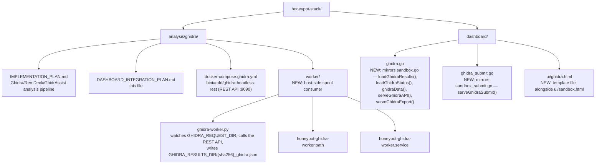

# Ghidra Dashboard Integration — Implementation Plan

> **Status: all six phases built** (2026-07-31). Host worker, dashboard API,
> UI, alerting, environment and compose wiring are in place, tested, and
> rendered in a browser against fixture results.
>
> **The REST API contract is now verified** (2026-07-31) against
> `biniamfd/ghidra-headless-rest:1.2.1` — Ghidra 11.3.2, artifact schema 2.1 —
> by running real binaries end to end. Five of the six endpoints originally
> taken from these plans were wrong. The corrected table lives in
> [`IMPLEMENTATION_PLAN.md`](IMPLEMENTATION_PLAN.md#rest-api-endpoints-used);
> `GET /openapi.json` on the service is the authority.
>
> Re-check after any image change:
>
> ```bash
> docker compose -f analysis/ghidra/docker-compose.ghidra.yml up -d ghidra
> python3 analysis/ghidra/worker/ghidra-worker.py --selftest
> ```
>
> **`ai_triage` is populated** (2026-07-31, #103). The worker runs the
> `program_triage` and `suspicious_behavior` workflows against a local
> OpenAI-compatible endpoint after collection, and refuses to send
> sample-derived text to one that is not local. Operator documentation is in
> [`AI_TRIAGE.md`](AI_TRIAGE.md) (#142).
>
> **`findcrypt` and `call_graph_svg` are populated** (2026-07-31, #102, in
> `4101e9a`). Crypto constants are scanned against the sample bytes directly
> rather than through Ghidra, and are reported as `file+0x<offset>` — file
> offsets, not virtual addresses, because mapping one to the other needs
> section headers this worker does not parse. The call graph is walked from
> neighbourhood queries and seeded by function body size; `dot` is an optional
> host package, and without it the DOT is still written and `call_graph_svg`
> stays null.
>
> **The worker is deployed** on the analysis host (2026-07-31): containers as a
> Dockge stack, `honeypot-ghidra-worker.path` active, and the dashboard writing
> requests it drains. #104 stays open for the rest — this is one host, set up
> by hand-running the installer, not a deployment story.
>
> **`fuzzy_hashes` and `lief` are populated** (2026-08-01, #85, #138). A
> fourth loopback-only container, `statictools`, runs ssdeep/tlsh and lief
> outside the worker's own stdlib-only process — see that file's module
> docstring for why. Fails soft like `ai_triage`: sidecar down or format not
> recognised both leave the field `null` rather than failing the analysis.

> **Status**: Built — see the block at the top of this file. This line said
> "nothing here is built yet" until 2026-07-31, six phases after it stopped
> being true, and it was still being read as current.
> **Tracked in**: [#76](https://github.com/Xore/honeypot-stack/issues/76)
> **Last updated**: 2026-07-31
>
> **Re-anchored 2026-07-31.** The dashboard was restructured after this plan
> was written: the monolithic `main.go` was broken up, and every route template
> moved out of Go into embedded files under `dashboard/ui/`. The file and line
> references below were all stale, and Phase 3 in particular would have told an
> implementer to put markup back into `page.go` — which a test now fails the
> build for.
> **Author**: honeypot-stack automated planning
> **Depends on**: [IMPLEMENTATION_PLAN.md](IMPLEMENTATION_PLAN.md) (Ghidra headless + Rev·Deck + GhidrAssist)

---

## Overview

[IMPLEMENTATION_PLAN.md](IMPLEMENTATION_PLAN.md) covers running Ghidra
headless analysis and produces reports committed to `Xore/Honeypot`. This
document covers the other half: making that analysis a first-class citizen
of the operations `dashboard/` — so an analyst can trigger a Ghidra run on
any captured payload with one click, and see every artifact (functions,
strings, imports, crypto hits, call graph, AI triage) inline, next to the
sandbox dynamic-analysis results the dashboard already shows.

No new trust boundary is introduced. The dashboard container stays
unprivileged and never talks to Docker, the Ghidra REST service, or the
network directly — it follows the **exact same spool-file pattern** already
used for sandbox submission (`sandbox_submit.go`, `sandbox.go`): the
dashboard writes a narrow request marker to a directory; a root-owned host
service outside the container does the actual work and writes results back
to a directory the dashboard only reads.

---

## Precedent: how sandbox integration already does this

| Concern | Sandbox (existing) | Ghidra (this plan) |
|---|---|---|
| Trigger | `POST /sandbox/submit` writes `{hash}.request` to `SANDBOX_REQUEST_DIR` | `POST /ghidra/submit` writes `{sha256}.request` to `GHIDRA_REQUEST_DIR` |
| Worker | Host-side libvirt/KVM worker (`sandbox/honeypot-sandbox-worker.path`) consumes the spool, never run by the dashboard | Host-side Ghidra worker consumes the spool, calls `biniamfd/ghidra-headless-rest` (already defined in `docker-compose.ghidra.yml`), never run by the dashboard |
| Results | Worker writes `{job}.json` to `SANDBOX_RESULTS_DIR`; dashboard only reads | Worker writes `{sha256}_ghidra.json` (+ `.dot`/`.svg` call graph, `.pdf` report) to `GHIDRA_RESULTS_DIR`; dashboard only reads |
| List page | `GET /sandbox` → `sandboxData("", q)` → `{{define "sandbox"}}` | `GET /ghidra` → `ghidraData("", q)` → `{{define "ghidra"}}` |
| Detail page | `GET /sandbox/{job}` | `GET /ghidra/{sha256}` |
| JSON API | `GET /api/sandbox`, `/api/sandbox/{job}` | `GET /api/ghidra`, `/api/ghidra/{sha256}` |
| Export | `GET /export/sandbox/{job}` (bundle download) | `GET /export/ghidra/{sha256}` (PDF from Phase 5 of IMPLEMENTATION_PLAN.md) |
| Queue/health alerting | `loadSandboxStatus()` + the `s.checkAlerts` block in `main.go` (~line 1690) watches for stalled handoff, unhealthy worker, high-risk results | Same block gets three more checks: stalled Ghidra handoff, unhealthy Ghidra worker, "interesting" Ghidra findings (crypto hit, high CAPA score, AI triage flags "malicious") |
| Payloads page action | "Submit to sandbox" button per payload row | "Run Ghidra analysis" button per payload row, next to the existing sandbox button |

Reusing this pattern means no new security review surface: the dashboard's
threat model (unprivileged, spool-file only, no direct access to analysis
infrastructure) doesn't change, it just gets a second spool.

---

## Architecture



Templates are files under `dashboard/ui/`, not `{{define}}` blocks in
`page.go`. `page.go` is 811 bytes and contains no markup at all.

---

## Phase 1 — Host-side Ghidra worker (spool consumer) ✅ Built

Implemented as [`worker/ghidra-worker.py`](../../../analysis/ghidra/worker/ghidra-worker.py) plus
`honeypot-ghidra-worker.{path,service}`, mirroring the sandbox workers: a
non-blocking `flock` so overlapping path-unit triggers collapse into one
drain, requests claimed (`.request.running`) before work starts so a crash
cannot replay a sample, hashes re-validated in the worker rather than trusted
from the spool, and results written via a temp file plus `os.replace` so the
dashboard can never read a half-written JSON.

Two behaviours worth keeping if this is ever rewritten:

* **A failed analysis still writes a result**, with `exit_status: "error"` and
  the reason. A dashboard that says "failed, because X" beats one where the
  job silently never appears.
* **An unreachable REST service leaves the queue untouched** and exits
  non-zero. Draining a spool into failures because a container was down would
  destroy the queue over an operator's `docker compose up`.

> **The REST API contract is UNVERIFIED.** `/analyze`, `/status/{job}`,
> `/functions/{job}`, `/strings/{job}` and `/imports/{job}` are taken from
> this document, not from a running `biniamfd/ghidra-headless-rest:1.2.1`.
> They are confined to the `GhidraClient` class so correcting them is a change
> in one place. Run `ghidra-worker.py --selftest` against a live container
> before trusting any result. The spool logic around them is covered by an
> end-to-end test against a stub server (15 assertions, all passing).

### Goal
A root-owned systemd path unit + oneshot service, structurally identical to
`sandbox/honeypot-sandbox-worker.path` / `honeypot-sandbox-worker.service`,
that:

1. Watches `GHIDRA_REQUEST_DIR` (default `/ghidra-requests`) for new
   `{sha256}.request` files.
2. Resolves the sample from the existing captured-payload store (same
   `s.payloadPath(hash)` lookup the dashboard already uses before it will
   even let a submit happen).
3. POSTs the binary to the `biniamfd/ghidra-headless-rest` container
   (`docker-compose.ghidra.yml`, already defined in the base plan) at
   `POST /analyze`.
4. Polls `/functions`, `/strings`, `/imports`, `/export/ghidra-zip` per
   IMPLEMENTATION_PLAN.md Phase 1, and — if Rev·Deck is configured — runs
   the `program_triage` + `suspicious_behavior` workflows from Phase 2.
   **Not how this was actually built (#78, 2026-08-01):** the worker's own
   local `triage()` (Phase 2, `ai_triage` field) runs both workflows against
   a local OpenAI-compatible endpoint, never through Rev·Deck. Rev·Deck
   automation is a separate, later addition — `revdeck_triage()` — that runs
   exactly *one* of its own autonomous workflows per analysis (default
   `program_triage`), writing a distinct `revdeck` field. See
   [`revdeck/README.md`](revdeck/README.md#automated-triage-78).
5. Writes one normalized `{sha256}_ghidra.json` to `GHIDRA_RESULTS_DIR`
   (default `/ghidra-results`), matching the `sandboxResult` struct's shape
   and conventions (`version`, `requested_at`/`started_at`/`completed_at`,
   `exit_status`) so the dashboard's existing queue/status/alert code needs
   only additive changes, not new patterns.
6. Deletes the consumed `.request` file and writes `status.json` (queued /
   running / done counts) the same way `loadSandboxStatus()` expects.

### Result JSON shape

```json
{
  "version": 2,
  "sha256": "…",
  "requested_at": "…", "started_at": "…", "completed_at": "…",
  "exit_status": "ok",
  "functions": [{"address": "0x401000", "name": "sub_401000", "signature": "…"}],
  "strings": ["…"],
  "imports": ["kernel32.dll!CreateProcessA", "…"],
  "findcrypt": [{"address": "0x402a10", "constant": "AES Te0", "algorithm": "AES"}],
  "call_graph_svg": "402a10.svg",
  "ai_triage": {
    "workflow": "program_triage",
    "family_guess": "…", "risk_level": "…",
    "behaviors": ["…"],
    "model": "qwen3:8b"
  },
  "fuzzy_hashes": {"ssdeep": "…", "ssdeep_error": null, "tlsh": "…", "tlsh_error": null},
  "lief": {"format": "ELF", "architecture": "X86_64", "entrypoint": "0x6760",
           "is_pie": true, "section_count": 30, "sections_truncated": false,
           "sections": [{"name": ".text", "size": 12345, "entropy": 6.2}],
           "libraries": ["libc.so.6"], "stripped": true},
  "revdeck": {
    "workflow": "program_triage", "status": "complete",
    "answer": "…", "steps": 4, "tool_calls": 3,
    "citations": {"valid": ["func@0x401000"], "invalid": []},
    "warnings": []
  },
  "report_pdf": "{sha256}_ghidra.pdf"
}
```

`fuzzy_hashes` and `lief` (#85, #138) come from `analysis/ghidra/statictools/`,
a loopback-only sidecar next to `ghidra`/`ollama`. Both are `null` the same way
`ai_triage` is: sidecar unreachable, or (for `lief` specifically) the sample's
format was not recognised. `stripped`/`is_dll`/`compile_timestamp` on `lief`
are format-specific and simply absent — not `false`/`0` — on a format that has
no such concept.

`revdeck` (#78, added 2026-08-01) is a second, independent AI aid, distinct
from `ai_triage` — Rev·Deck's own bounded autonomous tool-calling loop against
the Ghidra service, not the worker's own single-shot evidence-extraction
prompt. `null` when `REVDECK_API_BASE` is unset (the default), the endpoint
was refused as non-local or unreachable, or the run produced no usable
answer. `status: "max_turns"` is not a failure — it means the step budget ran
out before the model reached its own conclusion, and the partial answer is
kept rather than discarded. See
[`revdeck/README.md`](revdeck/README.md#automated-triage-78) for the full
contract.

---

## Phase 2 — Dashboard: trigger + read (`ghidra.go`, `ghidra_submit.go`) ✅ Built

`POST /ghidra/submit`, `GET /api/ghidra[/{sha256}|/status]` and
`GET /export/ghidra/{sha256}` are registered. The HTML page routes are
deliberately **not**: `{{define "ghidra"}}` is phase 3 below, and registering
`/ghidra` against a template that does not exist would give a route that 500s.
The JSON API is complete and usable without it.

Two deviations from the sketch below, both deliberate:

* **No dynamic/static gate on submit.** `serveSandboxSubmit` refuses payloads
  with no detonation path, which is right for a sandbox. Ghidra disassembles
  anything containing code — including the PE DLLs and documents the sandbox
  correctly refuses — and those are frequently the samples where static
  analysis is the *only* thing available.
* **`submitReturnURL`'s open-redirect guard was extracted, not copied**, into
  `safeReturnPath(raw, allowed)` in `sandbox_submit.go`, and both submit
  handlers now share it. Per [#80](https://github.com/Xore/honeypot-stack/issues/80)
  a bare `strings.HasPrefix(raw, "/")` lets `//evil.example` through; a guard
  that exists in two copies is one that gets fixed in one copy.

`ghidraQueueStatus` is flat rather than mirroring `sandboxQueueStatus`'s
nested `Counts`, because it has to match exactly what the phase 1 worker
writes, and one shape written in one place beats symmetry with a struct it
shares nothing with. It carries two fields the sandbox equivalent has no need
for: `Configured` (false when `GHIDRA_RESULTS_DIR` is unset, i.e. the worker
was never deployed) and `Stale` (status.json not rewritten recently) — without
which "nothing is queued" and "nothing is running" render identically.

Covered by `ghidra_test.go`: offsite-redirect rejection, the shared allowlist,
newest-first ordering, malformed results not hiding valid ones, filename
trusted over document body for identity, all four status states, `report_pdf`
traversal rejection, export 404s for bad hashes and for results with no report
yet, the four API routes, and search deliberately not matching the string
table.

### `serveGhidraSubmit` (mirrors `serveSandboxSubmit`)
- `POST /ghidra/submit`, admin-only (`requireAdmin`), same-origin only
  (`sameOriginRequest`).
- Validates `hash` against `hashName`, confirms the payload exists via
  `s.payloadPath(hash)` — the dashboard **never** touches the binary itself
  beyond this existence check.
- Writes `filepath.Join(getenv("GHIDRA_REQUEST_DIR", "/ghidra-requests"), hash+".request")`
  with `O_CREATE|O_EXCL` (idempotent — a second click while queued is a
  no-op, exactly like sandbox submission).
- Redirects to `/payloads?analysis=queued&hash=…` — same notice pattern
  `submitReturnURL` in `sandbox_submit.go` already implements, extended with
  "Ghidra analysis requested for …". Reuse that function's **allowlist** of
  permitted redirect prefixes rather than writing a fresh prefix check; see
  [#80](https://github.com/Xore/honeypot-stack/issues/80) for why
  `strings.HasPrefix(raw, "/")` is not sufficient on its own.

### `ghidra.go` (mirrors `sandbox.go`)
- `ghidraResultsDir()` / `ghidraRequestDir()` — env-var accessors.
- `loadGhidraResults() []ghidraResult` — reads every `*_ghidra.json`.
- `loadGhidraStatus() ghidraQueueStatus` — reads `status.json`, same
  queued/running/failed/handoff-age shape as `sandboxQueueStatus`.
- `ghidraData(sha256, query string) (ghidraPageData, error)` — list or
  single-result view, same signature shape as `sandboxData`.
- `serveGhidraAPI(w, r)` — `GET /api/ghidra`, `/api/ghidra/{sha256}` → JSON.
- `serveGhidraExport(w, r)` — `GET /export/ghidra/{sha256}` → streams
  `report_pdf` (Phase 5 of IMPLEMENTATION_PLAN.md) or a zip of raw
  artifacts if no PDF exists yet.

### Routes to register in `main.go` (next to the existing sandbox block; `main.go` is 446 lines and route registration is near its end)
```go
http.HandleFunc("/ghidra/submit", s.serveGhidraSubmit)
http.HandleFunc("/ghidra", func(w http.ResponseWriter, r *http.Request) {
    data, _ := ghidraData("", r.URL.Query().Get("q"))
    tmpl.ExecuteTemplate(w, "ghidra", data)
})
http.HandleFunc("/ghidra/", func(w http.ResponseWriter, r *http.Request) {
    sha, err := url.PathUnescape(strings.TrimPrefix(r.URL.Path, "/ghidra/"))
    ...
    data, err := ghidraData(sha, "")
    tmpl.ExecuteTemplate(w, "ghidra", data)
})
http.HandleFunc("/api/ghidra", serveGhidraAPI)
http.HandleFunc("/api/ghidra/", serveGhidraAPI)
http.HandleFunc("/export/ghidra/", serveGhidraExport)
```

---

## Phase 3 — UI: payloads page action + result view ✅ Built

`ui/ghidra.html` (list + detail), a **Ghidra** button on every payloads row and
on the payload detail page, a sidebar entry, and the `/ghidra` + `/ghidra/{sha}`
routes phase 2 deliberately left unregistered.

Deviations from the sketch below, all deliberate:

* **The button is on every row, not only detonatable ones.** The row reading
  "no detonation path" is exactly where static analysis is the only option, so
  gating the Ghidra button on `.Dynamic` would hide it from the payloads that
  need it most.
* **No pseudocode in the page.** Functions, imports and strings open in the
  existing `hp-evidence` overlay rather than rendering inline. Dumping
  decompiled output for every function is called out as a mistake in the
  sketch; the same argument applies to a 4000-row string table.
* **No "interesting strings" filter and no `SuspiciousImports` grouping.** Both
  were to reuse heuristics from `payload_kind.go`, which classifies file *types*
  and has no import or string scoring to borrow. Inventing a severity heuristic
  here would put an unexplainable "suspicious" label on an analyst's screen.
  Deferred to phase 4, which has to define thresholds anyway.
* ~~**No call-graph SVG.**~~ Built since, in #102: the card renders the SVG
  inline with ``, and explains the absence rather than showing a broken
  image when `dot` is not installed on the analysis host.

The AI triage card carries a standing disclaimer naming the model and telling
the reader to verify each claim against the other tabs. The sketch asked for
per-claim evidence links; the worker does not record which function or string
grounded a claim, so there is nothing to link to. A visible "unverified" banner
is honest — fabricated evidence anchors would not be.

`hp-modals.js` needed a fix: it matched `form[action="/sandbox/submit"]` only,
so the Ghidra re-analyze form's `data-hp-confirm-*` attributes did nothing. It
now also matches `/ghidra/submit`, but only when the form opts in via
`data-hp-confirm-title` — a modal on every payloads row for a read-only action
is confirmation fatigue. The default warning describes detonation, so Ghidra
forms set `data-hp-confirm-warning`; a Ghidra confirmation claiming "network,
process, and filesystem activity" would be false.

Verified in a browser against fixture results, not only by tests: list and
detail both render, tab switching updates `aria-selected` and swaps panels, the
evidence overlay opens and closes on Escape per `docs/MODALS.md`, a malformed
hash 404s, and an errored result shows its failure reason.

### Payloads list (`dashboard/ui/payloads.html`)
Add a second per-row button next to the existing sandbox-submit form:
```html
<form method="post" action="/ghidra/submit" class="inline">
  <input type="hidden" name="hash" value="{{.SHA256}}">
  <button type="submit" class="btn-sm">Run Ghidra analysis</button>
</form>
{{if .GhidraResult}}<a href="/ghidra/{{.SHA256}}" class="badge">Ghidra: {{.GhidraResult.RiskLabel}}</a>{{end}}
```

### New `dashboard/ui/ghidra.html` (mirrors `dashboard/ui/sandbox.html`)
Cards for:
- Function list (paginated, address + name + signature), link-through to
  decompiled pseudocode for flagged/suspicious functions only (avoid
  dumping every function's pseudocode into the page).
- String table with an "interesting" filter (URLs, IPs, registry paths,
  format-string patterns — reuse the honeypot's existing `payload_kind.go`
  heuristics where they overlap).
- Import table, with entries in `SuspiciousImports`-style groupings
  (reuse the naming convention from `sandboxWindows.SuspiciousImports`).
- FindCrypt hits.
- Call graph, rendered as an inline SVG (`call_graph_svg` from the result
  JSON) rather than requiring a DOT viewer.
- AI triage card (the worker's own local-model `program_triage`/
  `suspicious_behavior` output, `ai_triage`) — clearly labeled as
  AI-generated and evidence-linked back to the specific function/string/
  import that grounded each claim, per IMPLEMENTATION_PLAN.md Phase 2's "no
  hallucination on facts" design.
- Rev·Deck automated triage card (`revdeck`, #78, built 2026-08-01) — a
  second, independent AI card: Rev·Deck's own bounded autonomous
  tool-calling loop against the Ghidra service, with its citations and any
  warnings from the run, distinct from the AI triage card above.
- "Download full report" button → `/export/ghidra/{sha256}`.

### List page (`ghidra.html` list mode, same as `sandbox.html` list mode)
One row per analyzed sample: hash, family guess (from AI triage if
present), risk level, crypto/import highlights, timestamp, link to detail.

---

## Phase 4 — Queue health + alerting ✅ Built

`ghidraAlerts()` in `ghidra.go`, called from the inline check block in
`store.go` next to the sandbox checks. No new transport — same `s.alerts` sink.

The sketch below was written against fields this implementation does not have
(`HandoffOld`, `Handoff`, `WorkerState`, `AITriage.Interesting`, and a numeric
`GHIDRA_ALERT_RISK_SCORE`). The worker reports a flat queue and a **string**
risk level, so the checks are written against what is actually produced:

| Check | Fires when |
|---|---|
| `ghidra:worker` | `status.json` is stale — one alert carrying the queue depth, not separate stalled-handoff and unhealthy-worker alerts, since both describe one fault |
| `ghidra:failed` | the queue holds failed requests |
| `ghidra:error:{sha}` | a result has `exit_status: "error"`, reported with its reason |
| `ghidra:flagged:{sha}` | AI triage risk is in `GHIDRA_ALERT_RISK_LEVELS` (default `high,critical`) |

Three deliberate restraints:

* **Nothing fires when `GHIDRA_RESULTS_DIR` is unset.** Alerting about a
  subsystem the operator never deployed is pure noise.
* **Crypto constants alone do not alert**, behind `GHIDRA_ALERT_ON_CRYPTO`
  (default `false`). A stock AES table is in a great deal of benign software,
  and the analysis page already says their presence does not show malicious
  use. Paging on it would train the reader to ignore the alert. The constants
  are always *shown*; this only controls whether they notify.
* **AI-risk alerts say `UNVERIFIED` and name the model, in the message.** The
  detail page's disclaimer is not visible from a webhook, and an alert that
  launders a model's guess into an apparent finding is worse than no alert.

Covered by `ghidra_test.go`: silence when unconfigured, the stale-worker alert
including its queue depth, a failed result alerting with its reason, crypto
staying quiet by default and firing when opted in, and AI-risk alerts marking
themselves unverified and respecting the configured level set.

Extend the existing alert-check block in `dashboard/store.go` (~line 295,
right after the `sandboxStatus.HandoffOld` check) with the Ghidra equivalents.
There is no `checkAlerts` method any more; the checks live inline in `store.go`
and go through `s.alerts.observe(key, message, markOnly)`:

```go
ghidraStatus := loadGhidraStatus()
if ghidraStatus.HandoffOld {
    message := fmt.Sprintf("ghidra handoff stalled: %d dashboard request(s) waiting for the host worker", ghidraStatus.Handoff)
    ...
}
if ghidraStatus.WorkerState == "stale" || ghidraStatus.WorkerState == "error" {
    message := fmt.Sprintf("ghidra worker unhealthy: state=%s queued=%d running=%d", ...)
    ...
}
for _, result := range loadGhidraResults() {
    if len(result.FindCrypt) == 0 && !result.AITriage.Interesting {
        continue
    }
    message := fmt.Sprintf("ghidra flagged sample: sha256=%s crypto_hits=%d ai_risk=%s", result.SHA256, len(result.FindCrypt), result.AITriage.RiskLevel)
    ...
}
```

No new alert transport is introduced — this rides the same `s.alerts`
sink (webhook/notification path) already used for sandbox and Suricata
alerts.

---

## Phase 5 — Environment variables ✅ Built (commented out)

```dotenv
# ── Ghidra dashboard integration ──────────────────────────────────────
GHIDRA_REQUEST_DIR=/ghidra-requests
GHIDRA_RESULTS_DIR=/ghidra-results
GHIDRA_API_BASE=http://127.0.0.1:9090
GHIDRA_ALERT_RISK_SCORE=50
```

`GHIDRA_API_BASE` is consumed only by the host-side worker (Phase 1), never
by the dashboard container — consistent with the dashboard never talking to
the Ghidra REST service directly.

---

## Phase 6 — Compose wiring ✅ Built

**Bind mounts, not the named volumes sketched below.** The consumer is a host
systemd unit, not a compose service; a named volume would be awkward for it to
reach and would put the analysis queue inside Docker's lifecycle. This is why
the Windows sandbox spool is a bind mount too, and Ghidra follows that working
precedent rather than the sketch:

```yaml
  - /var/lib/honeypot-ghidra/results:/ghidra-results:ro   # display only
  - /var/lib/honeypot-ghidra/requests/pending:/ghidra-requests
```

Results are read-only into the dashboard: it renders them and must never be
able to forge one. The mounts are unconditional while `GHIDRA_RESULTS_DIR` and
`GHIDRA_REQUEST_DIR` default to empty, so enabling the backend is a `.env`
change rather than a Compose edit — the same arrangement the Windows backend
uses. `docker compose config` validates.

`docker-compose.yml` (main stack) gets the request/results directories
mounted read-only into the dashboard container and read-write into wherever
the Phase 1 worker runs (host or a sibling container with Docker socket
access — mirrors how the sandbox worker is deliberately kept off the
dashboard's container so a dashboard RCE can't reach libvirt):

```yaml
services:
  dashboard:
    environment:
      - GHIDRA_REQUEST_DIR=/ghidra-requests
      - GHIDRA_RESULTS_DIR=/ghidra-results
    volumes:
      - ghidra-requests:/ghidra-requests        # read-write (dashboard only creates marker files)
      - ghidra-results:/ghidra-results:ro        # read-only

volumes:
  ghidra-requests:
  ghidra-results:
```

The Phase 1 worker (host-side systemd unit, not a compose service) owns
read-write access to both volumes and is the only thing that talks to
`analysis/ghidra/docker-compose.ghidra.yml`'s REST container.

---

## Testing

Following the existing test conventions in `dashboard/` (`sandbox_test.go`,
`sandbox_submit_test.go`, `sandbox_export_test.go`):

| Test file | Covers |
|---|---|
| `ghidra_test.go` | `loadGhidraResults`, `loadGhidraStatus`, `ghidraData` against fixture JSON |
| `ghidra_submit_test.go` | `serveGhidraSubmit` — admin-only, same-origin, hash validation, idempotent spool write, redirect notice |
| `ghidra_export_test.go` | `serveGhidraExport` — PDF path, fallback zip path, missing-result 404 |

Also extend `e2e_test.go` with one flow: submit → poll `/api/ghidra/{sha256}`
→ assert eventual `exit_status: "ok"` against a fixture worker (no real
Ghidra container needed for the dashboard-side e2e test — that's covered
separately by whatever validates `docker-compose.ghidra.yml` itself).

---

## Summary of new surface

| Component | New | Reuses |
|---|---|---|
| Host worker | `ghidra-worker.py`, 2 systemd units | Same spool pattern as sandbox worker |
| Dashboard Go | `ghidra.go`, `ghidra_submit.go`, ~6 routes | `requireAdmin`, `sameOriginRequest`, `hashName`, `s.payloadPath`, `s.alerts` |
| Templates | `dashboard/ui/ghidra.html`, payloads-page button | Shared partials in `dashboard/ui/partials/`, existing card/table CSS |
| Env vars | `GHIDRA_REQUEST_DIR`, `GHIDRA_RESULTS_DIR`, `GHIDRA_API_BASE`, `GHIDRA_ALERT_RISK_SCORE` | — |
| Trust boundary | None — dashboard still never touches Docker/libvirt/the Ghidra REST API directly | Sandbox's existing spool-file security model |
