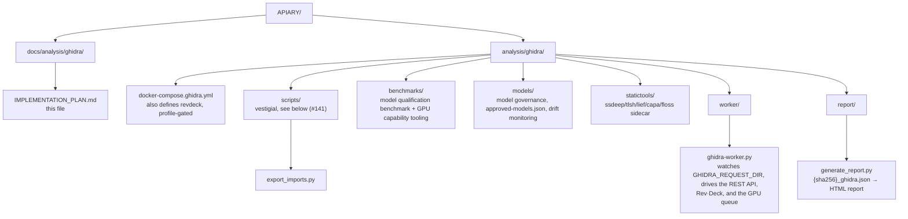

# Ghidra Payload Analysis — Implementation Plan

> **Status**: Design document. Phase 4 (plugin selection) is built as of
> 2026-08-01 — scoped down to `capa` alone; the other eight candidates from
> the original plugin list are decided out (see Phase 4 below). Phases 1, 2,
> 3, 4 and 5 are built — five of the six `scripts/` exporters exist
> (`findcrypt.py` was deleted, superseded by `scan_crypto()` in the worker),
> the `revdeck` service is deployed (profile-gated in
> `docker-compose.ghidra.yml`) and, as of 2026-08-01 (#78), the worker
> automates it too — `worker/ghidra-worker.py`'s `revdeck_triage()` drives a
> verified upload/poll/chat contract against it, off by default behind
> `REVDECK_API_BASE`, writing a `revdeck` field distinct from the worker's own
> `ai_triage` — GhidrAssist has a verified pinned-artifact install procedure
> (`ghidrassist/README.md`, see
> [#192](https://github.com/Xore/apiary/issues/192) for a caveat
> found along the way), and `report/generate_report.py` renders an HTML
> report from every automated worker result, including capa and revdeck
> sections. **The standalone Rev·Deck workbench adapter is also built**
> (2026-08-02, #78): a second, independent request/results spool
> (`REVDECK_REQUEST_DIR`/`REVDECK_RESULTS_DIR`, `drain_revdeck()` in
> `worker/ghidra-worker.py`) alongside the Ghidra one, so an operator can
> select Rev·Deck on its own in the workbench UI without also paying for a
> full, redundant Ghidra analysis — `revdeck_triage()` never actually needed
> the Ghidra REST job's own artifacts, only the sample bytes, so nothing
> about running it standalone duplicates work. Its own result page lives at
> `/revdeck/{sha256}`, and the `revdeck` entry in
> [`workbench_domain.go`](../../../dashboard/workbench_domain.go) is now
> `Available` whenever that spool is configured, closing out #78's last open
> item.  
> **Tracked in**: [#78](https://github.com/Xore/apiary/issues/78)
> (phases 3–5), [#76](https://github.com/Xore/apiary/issues/76)
> (dashboard spool and entry points),
> [#85](https://github.com/Xore/apiary/issues/85) (non-Ghidra static
> tooling)  
> **Last updated**: 2026-08-01  
> **Author**: APIARY automated planning

---

## Overview

This document describes the full implementation plan for adding automated
static reverse-engineering of honeypot payloads using Ghidra's headless mode,
AI-assisted analysis (Rev·Deck / GhidrAssist), and a curated set of
community plugins from the awesome-ghidra list.

All analysis runs in Docker and produces structured output committed to
[Xore/Honeypot](https://github.com/Xore/Honeypot) alongside VirusTotal and
JoeSandbox reports.

> **Dashboard integration**: for triggering these analyses from the
> operations dashboard and viewing every artifact inline (functions,
> strings, imports, crypto hits, call graph, AI triage), see
> [DASHBOARD_INTEGRATION_PLAN.md](DASHBOARD_INTEGRATION_PLAN.md).

---

## Architecture



This is the *target* layout. Every entry now exists. `revdeck/` and
`ghidrassist/` no longer have their own directories under
`analysis/ghidra/` — each only ever held a `README.md`, both since moved
to `docs/analysis/ghidra/{revdeck,ghidrassist}/` (#670); their code
(Rev·Deck's client, the GhidrAssist plugin config) lives with the
consumers documented in those READMEs, not as standalone trees here.

**`scripts/` is vestigial, not part of the live pipeline** ([#141](https://github.com/Xore/apiary/issues/141)):
these were written as `analyzeHeadless ... -postScript <file>` Jython scripts
for the headless-mode design this document originally described, superseded
by the REST-API-driven host worker below. `export_functions.py`,
`export_strings.py`, `call_graph.py` and `yara_scan.py` are deleted —
`worker/ghidra-worker.py` gets functions/strings/imports via
`/results/{job}/...` REST calls and walks its own call graph via
`/v1/results/{job}/graph/{addr}`, never invoking `analyzeHeadless` or a
postScript at all; `findcrypt.py` was already deleted earlier for the same
reason ([#136](https://github.com/Xore/apiary/issues/136),
superseded by `scan_crypto()` in the worker). `export_imports.py` is the one
survivor, added to match its four siblings' shape but not wired into
anything either — kept for now rather than folded into this cleanup.

Three corrections against the layout this section used to show:

- `headless_analyze.sh` is gone — deleted alongside `ghidra_analyze.py` under
  [#107](https://github.com/Xore/apiary/issues/107); see
  [Dashboard/Worker Integration](#dashboardworker-integration) below.
- `revdeck/docker-compose.revdeck.yml` was never built as a standalone file.
  The `revdeck` service was instead folded into `docker-compose.ghidra.yml`
  itself, gated behind the `revdeck` profile (commits `9244b87`, `8e828f0`,
  2026-08-01) — hardened (`read_only`, `cap_drop: ALL`, no-new-privileges),
  reachable over the WireGuard `HP_BIND` address through the same Traefik +
  forward-auth SSO path as every other investigation UI. `revdeck/` now holds
  only its `README.md`. That closes the compose gap this document used to
  list, and as of 2026-08-01 (#78) the LLM automation *contract* on top of it
  is built too — `worker/ghidra-worker.py`'s `revdeck_triage()`, verified
  against a real clone of `biniamf/ai-reverse-engineering` (see
  `revdeck/README.md`). **The standalone piece is also built** (2026-08-02,
  #78): the dashboard's `revdeck` workbench adapter
  ([`workbench_domain.go`](../../../dashboard/workbench_domain.go)) is now a
  separately orchestrated, independently selectable analyzer with its own
  submission path (`REVDECK_REQUEST_DIR`, drained by `drain_revdeck()` in
  `worker/ghidra-worker.py`, independent of the Ghidra spool) and its own
  result link (`/revdeck/{sha256}`) — a different thing from Rev·Deck running
  automatically as an enrichment embedded in the `ghidra` analyzer's own
  result, and no longer `Available: false`.
- `report/` has no `templates/` subdirectory. [`generate_report.py`](../../../analysis/ghidra/report/generate_report.py)
  follows [#56](https://github.com/Xore/apiary/issues/56)'s
  `sandbox/windows/orchestrate/generate_report.py`, which doesn't use one
  either — one Python file covering both HTML and inlined CSS isn't enough
  code to be worth splitting.

---

## Phase 1 — Headless Ghidra (Docker)

**"Goal" and "Trigger" below describe a design that was never built** —
`analyzeHeadless` invoked directly in a container, postScripts writing JSON
to a project directory, triggered from `Xore/Honeypot`'s own GitHub Actions.
None of that exists. What actually runs is `biniamfd/ghidra-headless-rest`
(below) behind a REST client (`worker/ghidra-worker.py`'s `GhidraClient`),
triggered by a host-side spool — see
[Dashboard/Worker Integration](#dashboardworker-integration) for the real
trigger, and [#141](https://github.com/Xore/apiary/issues/141) for
the `scripts/` postScripts this superseded. The **Docker Image** and
**REST API Endpoints Used** sections immediately below are accurate and
current — verified against the running service, not left over from the
abandoned design.

### Goal (superseded, see above)
Run Ghidra's `analyzeHeadless` in a container against every new sample in
`Xore/Honeypot/samples/`. Export:
- Function list (address, name, signature)
- Decompiled pseudocode for top suspicious functions
- String table
- Import table (dynamic symbols)
- Crypto constant hits (FindCrypt)
- Call graph (DOT format)

### Docker Image
Use [`biniamfd/ghidra-headless-rest:latest`](https://hub.docker.com/r/biniamfd/ghidra-headless-rest)
— the same image that powers Rev·Deck. It exposes a REST API on port 9090.

### REST API Endpoints Used

Verified 2026-07-31 against `biniamfd/ghidra-headless-rest:1.2.1`
(Ghidra 11.3.2, artifact schema 2.1). **The table this section used to carry
was wrong in five of six rows** — it was written from the upstream README, not
from the running service, and it disagreed with the one in
`DASHBOARD_INTEGRATION_PLAN.md`. The service is FastAPI; `GET /openapi.json` is
the authority if this drifts again.

| Endpoint | Purpose | Response envelope |
|---|---|---|
| `GET /v1/health` | Liveness — **not** `/readyz`, which 404s | `{"status":"ok"}` |
| `POST /analyze` | Submit a binary, multipart field `file` | `{"job_id","status"}` |
| `GET /status/{job_id}` | Poll; `queued` → `running` → `done` | object, incl. `analyzer_version` and the service's own `sha256` |
| `GET /results/{job_id}/functions` | Functions, **paged** (`offset`/`limit`, default 100) | `{"total","offset","limit","functions":[…]}` |
| `GET /results/{job_id}/strings` | Strings | `{"count","strings":[{"addr","s",…}]}` |
| `GET /results/{job_id}/imports` | Imports | **bare array** of `{"name","library",…}` |
| `GET /results/{job_id}/function/{addr}/decompile` | Pseudocode for one function | — |
| `GET /v1/jobs/{job_id}/export` | Project archive (was `/export/ghidra-zip`) | — |

Three things worth knowing before writing a client:

* The last three collection endpoints use **three different envelopes** — a
  paged object, a counted object, and a bare array. `GhidraClient` normalises
  them so the stored result has one shape.
* Functions are paged at 100 by default. `/bin/ls` alone returns 412, so a
  client that reads the first page only silently truncates almost everything.
* Field names are not what the result schema uses: functions carry `addr`, and
  strings are objects with the text under `s`. Imports become `library!name`.

### Trigger (superseded, see the note at the top of this phase)
See [Dashboard/Worker Integration](#dashboardworker-integration) for the
real trigger — a host-side spool, not GitHub Actions.

---

## Phase 2 — AI-Assisted Analysis ✅ Built (2026-07-31, #103)

> **Built, but not the way this section describes.** The two workflows below
> run against a local OpenAI-compatible endpoint from the worker itself
> (`worker/ghidra-worker.py`), not through Rev·Deck, and populate `ai_triage`
> on the result. Rev·Deck stays in the compose file behind a profile as an
> analyst-facing chat UI.
>
> Two lines below are wrong and were the reason:
>
> - *"Deploy Rev·Deck as a service"* — its build context is not vendored; the
>   operator has to clone it by hand, so there is no running contract to code
>   against. The endpoint table in this document was already wrong about five
>   of six Ghidra endpoints, which is what taking a plan for a service costs.
> - *"local Ollama or cloud LLM endpoint via `.env`"* — a cloud endpoint is
>   not an option. The prompts carry text lifted out of captured malware.
>   `endpoint_is_local()` refuses any endpoint that is not this host or its
>   network, and there is no override flag.
>
> `attack_surface_triage` and `vulnerability_hypothesis` are not run.
> Operator documentation: [`AI_TRIAGE.md`](AI_TRIAGE.md) (#142).
>
> **Update, 2026-08-01 (#78): Rev·Deck itself is now also automated**, as a
> second and independent enrichment alongside the local `triage()` above —
> not the same feature, and not a correction of the "Rev·Deck stays interactive"
> line above at the time it was written. `worker/ghidra-worker.py`'s
> `revdeck_triage()` drives a verified upload/poll/chat contract against the
> `revdeck` container itself (off by default behind `REVDECK_API_BASE`,
> local-only enforced the same way), running exactly one no-address workflow
> per analysis (`program_triage` by default; `suspicious_behavior` is the
> other candidate, swappable via `REVDECK_WORKFLOW`, not run alongside it).
> `attack_surface_triage` and `vulnerability_hypothesis` still are not run —
> both require an analyst-selected function address, so they remain
> interactive-only. See [`revdeck/README.md`](revdeck/README.md#automated-triage-78)
> for the full contract and rationale.

### Source
[biniamf/ai-reverse-engineering](https://github.com/biniamf/ai-reverse-engineering)

### What It Does
Rev·Deck pairs `biniamfd/ghidra-headless-rest` with an LLM copilot over an
OpenAI-compatible endpoint. Evidence-first: all LLM claims are grounded in
deterministic Ghidra data (functions, strings, imports, call graph). No
hallucination on facts — only bounded hypotheses.

### Integration Plan
- Deploy Rev·Deck as a service on the honeypot analysis host (local, never
  exposed to internet)
- Configure with local Ollama or cloud LLM endpoint via `.env`
- Run autonomous `program_triage` + `suspicious_behavior` workflows per sample
- Export chat transcript + conclusion cards as JSON/Markdown
- Embed AI triage summary in the Ghidra PDF report

### Supported Workflows Used
| Workflow | Output |
|----------|--------|
| `program_triage` | Binary purpose, family guess, risk level |
| `suspicious_behavior` | IOC-grounded behavior list |
| `attack_surface_triage` | Top-K dangerous functions, scored |
| `vulnerability_hypothesis` | CVE-style write-up for interesting payloads |

### Environment Variables
```dotenv
API_BASE=http://127.0.0.1:11434/v1   # Ollama local
API_KEY=not-used
MODEL_NAME=qwen3:8b
GHIDRA_API_BASE=http://127.0.0.1:9090
MAX_UPLOAD_BYTES=104857600
```

---

## Phase 3 — GhidrAssist Plugin ✅ Built (2026-08-01, #78)

### Source
[symgraph/GhidrAssist](https://github.com/symgraph/GhidrAssist)

### What It Does
GhidrAssist is a Ghidra extension (Java plugin) providing:
- In-GUI LLM chat panel
- One-click function explanation
- Auto-renaming of functions and variables
- Protocol detection and YARA rule generation
- Right-click "Ask AI" on any code location

### Integration Plan
GhidrAssist runs inside an analyst's own local Ghidra GUI — there is no GUI
Ghidra container in this stack to install it into (`ghidra` in
`docker-compose.ghidra.yml` is `biniamfd/ghidra-headless-rest`, headless
only). Same as Rev·Deck, it is:
- **Interactive only** — analyst-facing, run by hand against a local install
- Not part of the automated worker pipeline
- Configured with the same LLM endpoint as Rev·Deck

### Install

[`ghidrassist/README.md`](ghidrassist/README.md) has the full procedure.
**Updated 2026-08-01 (#225)**: building from a pinned source commit
(`gradle buildExtension` against `2.2.0`, commit
`c436fcb55d2b43f4341c7aa76c90d9be8c147da1`) is now the recommended path, not
the rejected one this section originally argued against — the earlier
reasoning ("no unverified upstream code executes locally") had it backwards:
a *pinned commit* is exactly as verified as a pinned release asset, and
sidesteps the leak below entirely rather than requiring every future
install to remember to strip three specific paths by hand. Verified for
real, not just argued for: built cleanly against a real Ghidra 12.1 install,
output inspected file-by-file, no leaked paths present. The pinned-zip path
(below) remains documented as a faster alternative for anyone who doesn't
want to set up a local Gradle/Ghidra-SDK build.

**Found while verifying the from-source build**: `2.2.0` does not build
against Ghidra **11.3.2** — this repo's own pinned
`biniamfd/ghidra-headless-rest` version — at all (`ghidra.program.model.
listing.CommentType` does not exist in that API). Confirmed independently:
`2.2.0`'s own release only ships prebuilt zips for Ghidra `12.0`/`12.1`, no
`11.3.2` asset exists either. Not a regression from this phase — GhidrAssist
was never runnable against the headless container in the first place, it
only ever ran in an analyst's own local Ghidra GUI (a separate install,
likely already 12.x) — but worth recording precisely rather than leaving an
implicit assumption unverified.

**The release zip needs one manual step before installing.** Checked the
2.0.0, 2.1.0 and 2.2.0 release assets: all three bundle the maintainer's own
runtime state — real RE chat-session transcripts, a stale Lucene search
index, and a `.claude/settings.local.json` leaking their home directory path
— none of which are in GhidrAssist's tracked source tree. Tracked as
[#192](https://github.com/Xore/apiary/issues/192); the README's
install steps strip the three leaked paths from the extracted zip before
pointing Ghidra's extension installer at it. The from-source build above
does not need this step at all — the leak only exists in the packaged
release asset, never in the source tree it's built from.

---

## Phase 4 — Awesome-Ghidra Plugin Selection ✅ Built (2026-08-01, #78)

### Source
[AllsafeCyberSecurity/awesome-ghidra](https://github.com/AllsafeCyberSecurity/awesome-ghidra)

Nine candidates were originally listed here with no decision behind any of
them, same problem [#85](https://github.com/Xore/apiary/issues/85)
found in the "Additional Static Analysis Tooling" list below. Applying the
same standard — burden of proof on inclusion, since each addition is
third-party code pinned/updated/trusted on the analysis host — exactly one
of the nine survives: `capa`.

### Decided in

| Plugin | Purpose | Why |
|--------|---------|-----|
| `capa` | MITRE ATT&CK/MBC behavior tagging | Built as a `/v1/capa` endpoint on the existing `statictools` sidecar (`analysis/ghidra/statictools/`), **not** via `CapaExplorer`/Ghidra annotations — capa's own CLI runs against the raw sample directly, independent of and parallel to ssdeep/tlsh/lief. `worker/ghidra-worker.py`'s `capa_scan()` calls it fail-soft; `report/generate_report.py` and the dashboard's `ghidraCapa` card both render the result. **Known gap**: capa's default (vivisect) backend covers only x86/amd64/arm64 — no MIPS or ARM32, both common in this honeypot's IoT catch — so a real share of samples will show "not observed" for a reason unrelated to whether they have taggable behavior at all. Tracked in [#195](https://github.com/Xore/apiary/issues/195). |

### Decided out — each duplicates something already in the pipeline, is out of scope, or needs an analyst that isn't in this automated pipeline

| Plugin | Would have added | Why it's out |
|--------|-------------------|---------------|
| `CapaExplorer` | Import capa results into Ghidra as annotations | Superseded by the direct integration above: capa runs standalone against the raw sample in the statictools sidecar and its output reaches the analyst through the report/dashboard, not a Ghidra GUI session. Nothing needs importing back into Ghidra when no analyst is sitting in one. |
| `py-findcrypt-ghidra` | Crypto constant detection | Already replaced before Phase 4 was ever scoped: `findcrypt.py` was deleted in [#136](https://github.com/Xore/apiary/issues/136), superseded by `scan_crypto()` in `worker/ghidra-worker.py`. Re-adding it here would reintroduce the three bugs that deletion's commit message records. |
| `ghidra_scripts` (Allsafe) | Malware-specific scripts (MIPS, ARM, packing detection) | No capability named here beyond "malware scripts" — capa's behavior tags (packing detection is a capa rule category) and `scan_crypto()` already cover the concrete overlap. Nothing distinct enough to justify a third-party headless script bundle with no test coverage. |
| `ghidra_scripts` (0x6d696368) | RC4 decrypter, YARA search, stack string decoder | The YARA search here duplicates the dedicated, hardened YARA pipeline (`analysis/yara/`) for the same reason #85 decided `yara-python` out. RC4 decryption and stack strings are real capabilities, but narrow enough to belong with `floss` (#85, still pending its own sandboxing decision) rather than a second, less-maintained script bundle. |
| `ghidra_scripts` (0xdea) | Vuln research: memcpy pattern, format string, ROP gadgets | Out of scope, not just low priority: this pipeline triages what a sample *does*, not whether it has exploitable bugs. |
| `ghidra_bridge` | Python 3 bridge for external orchestration scripts | Nothing here needs live Python-to-Ghidra orchestration — the REST backend (`biniamfd/ghidra-headless-rest`, phase 1) already is the orchestration boundary; `ghidra_bridge` would be a second, overlapping one. |
| `GhidraAAS` (Cisco Talos) | REST API wrapper for Ghidra | Duplicates the REST backend already deployed and verified against a live container (`biniamfd/ghidra-headless-rest:1.2.1`, phase 1). Swapping backends now means re-verifying the entire contract this worker was built and tested against, for no new capability. |
| `gotools` | Go binary support | Real gap — this honeypot's catch includes Go-based botnets — but Ghidra's own Go loader plus capa's Go-aware rules already cover meaningful ground, and no sample analysed so far has hit a case Ghidra's built-in support couldn't handle. Revisit if a specific sample demonstrates a concrete gap. |
| `VTgrepGHIDRA` | Search VirusTotal for similar code blocks from Ghidra | Interactive-only by design (a GUI code-search workflow), and this pipeline has no analyst sitting in a live Ghidra session — same reasoning that keeps GhidrAssist and Rev·Deck's GUI modes out of the automated path. |

### Also excluded (unchanged from the original plan)
- `Ghidra-evm` — no Ethereum payloads in honeypot context
- `JNI Helper` — no Android APK analysis currently
- `OOAnalyzer` — C++ OOP recovery, overkill for ELF botnet binaries
- `ret-sync` — debugger sync, interactive only, not automated

---

## Phase 5 — Report Generation ✅ Built (2026-08-01, #78)

Built as [`report/generate_report.py`](../../../analysis/ghidra/report/generate_report.py), reusing the
shape of [`sandbox/windows/orchestrate/generate_report.py`](../../../sandbox/windows/orchestrate/generate_report.py)
(#56) rather than inventing a second reporting style: offline, one escaping
chokepoint (`esc()`), missing artifacts degrade to "not observed" instead of
raising. `worker/ghidra-worker.py`'s `generate_report()` wrapper calls it
(fail-soft, like `triage()`/`fuzzy_hash()`) as the last step of
`analyse_one()`, writing `{sha256}_ghidra_report.html` beside the result JSON
and recording its bare filename in the existing `report_pdf` field — the
dashboard's `attachGhidraDownload` already serves it correctly, since
`http.ServeContent` infers content-type from the filename extension rather
than the field name.

The original plan below described a single combined PDF pulling in VT,
JoeSandbox, and CAPA data. That data doesn't exist in this pipeline — there is
no Phase 0 VT/JoeSandbox stage — so the report actually built is scoped to
what `worker/ghidra-worker.py` produces today:

```mermaid
flowchart TD
    Report["{ghidra-results}/{sha256}_ghidra_report.html"]
    Report --> Meta["Sample metadata<br/>hash, exit status, timing, analyzer/schema versions,<br/>service_sha256 integrity check"]
    Report --> Funcs["Functions<br/>address, name, signature, size"]
    Report --> Strings["Strings"]
    Report --> Imports["Imports (library!name)"]
    Report --> Crypto["Cryptographic constants<br/>from scan_crypto()"]
    Report --> CallGraph["Call graph<br/>inlined SVG, if build_call_graph() produced one"]
    Report --> Struct["Structural info<br/>lief: format, architecture, entry point, sections"]
    Report --> Fuzzy["Fuzzy hashes (ssdeep/tlsh)"]
    Report --> Capa["Capabilities<br/>capa: ATT&CK/MBC tags, added 2026-08-01 #78"]
    Report --> AITriage["AI triage<br/>the worker's own local-model output, if configured, #103"]
    Report --> Revdeck["Rev·Deck automated triage<br/>a second, independent AI aid, if configured, added 2026-08-01 #78"]
```



A PDF is optional, not the default: `generate_report.py --pdf` renders one via
WeasyPrint if it's installed, but the worker only ever produces the HTML file.
YARA rule suggestions are not a section here — this pipeline does not generate
those at all.

---

## Dashboard/Worker Integration

Superseded by [#107](https://github.com/Xore/apiary/issues/107): this
section used to describe extending a `.github/workflows/analyze.yml` in a
different repo (`Xore/Honeypot`) to invoke `ghidra_analyze.py` against a REST
contract that issue #101 disproved against the real
`biniamfd/ghidra-headless-rest:1.2.1` image. That script and its bash sibling
`headless_analyze.sh` are deleted; there is no GitHub Actions integration.

The actual, deployed architecture is a host-based spool, not CI: the
dashboard (unprivileged, no credentials, no outbound calls) writes a
`.request` marker file into `GHIDRA_REQUEST_DIR`, and
[`worker/ghidra-worker.py`](../../../analysis/ghidra/worker/ghidra-worker.py) — running under the
`honeypot-ghidra-worker.path`/`.service` systemd units on the homeserver —
drains the spool and talks to the real Ghidra REST service. See
`DASHBOARD_INTEGRATION_PLAN.md` for the dashboard side and
`worker/ghidra-worker.py`'s module docstring for the verified REST contract.

---

## Tooling Summary

The ✅/⬜ column this table used to carry meant "which phase," not "is it
built," and it read as the latter. Phase is what it says now; nothing in this
table is deployed.

| Tool | Role | Mode | Phase |
|------|------|------|-------|
| `biniamfd/ghidra-headless-rest` | Ghidra REST backend | Automated (Docker) | 1 |
| `biniamf/ai-reverse-engineering` (Rev·Deck) | AI triage | Automated + Interactive | 2 |
| `symgraph/GhidrAssist` | In-GUI AI chat | Interactive only | 3 — [#78](https://github.com/Xore/apiary/issues/78) |
| `capa` | Behavior tagging (MITRE ATT&CK/MBC) | Automated (statictools sidecar) | 4 — ✅ built, [#78](https://github.com/Xore/apiary/issues/78) |
| `AllsafeCyberSecurity/ghidra_scripts` | Malware scripts | Headless | 4 — decided out, 2026-08-01 |
| `py-findcrypt-ghidra` | Crypto detection | Headless | 4 — decided out, 2026-08-01 (superseded by `scan_crypto()`) |
| `0x6d696368/ghidra_scripts` | RC4/YARA/stack strings | Headless | 4 — decided out, 2026-08-01 |
| `0xdea/ghidra-scripts` | Vuln research | Headless | 4 — decided out, 2026-08-01 |
| `CapaExplorer` | CAPA import | Post-process | 4 — decided out, 2026-08-01 (superseded by the direct `capa` integration above) |
| `ghidra_bridge` | Python 3 bridge | Library | 4 — decided out, 2026-08-01 |
| `GhidraAAS` (Cisco Talos) | REST API wrapper | Service | 4 — decided out, 2026-08-01 |
| `gotools` | Go binary support | Headless plugin | 4 — decided out, 2026-08-01 |
| `VTgrepGHIDRA` | VT code search | Interactive | 4 — decided out, 2026-08-01 |

See Phase 4 above for the reasoning behind each decision.

---

## Additional Static Analysis Tooling

> **`ssdeep`/`tlsh`, `lief` and `capa` are built** (`capa` 2026-08-01, #78; the
> other two 2026-08-01, [#138](https://github.com/Xore/apiary/issues/138)):
> the same loopback-only sidecar, `analysis/ghidra/statictools/`, run alongside
> `ghidra`/`ollama` by `docker-compose.ghidra.yml`. The worker calls it after
> collection via `fuzzy_hash()`/`lief_parse()`/`capa_scan()` and writes
> `fuzzy_hashes`/`lief`/`capa` onto the result, fail-soft like `ai_triage`.
> `floss` is not built — its risk profile (code emulation) needs its own
> sandboxing decision, tracked separately in #138.

Beyond Ghidra, nine tools were once listed as *considered* for the pipeline,
with no decision behind any of them. [#85](https://github.com/Xore/apiary/issues/85)
asked for a short list with reasons instead of a wish list; this is that
decision, made 2026-08-01. Each one added is third-party code that runs
against live malware on the analysis host and has to be pinned, updated and
trusted, so the burden of proof was on inclusion, not exclusion.

**Decided in:**

| Tool | Purpose | Why |
|------|---------|-----|
| `capa` | Behavior tagging (MITRE ATT&CK) | Strongest case: the tag vocabulary is what the LLM worker ([#66](https://github.com/Xore/apiary/issues/66)) and the dashboard already speak. Built 2026-08-01 as part of [#78](https://github.com/Xore/apiary/issues/78) phase 4 — see that section for the integration shape and the arch-coverage gap it left open. |
| `ssdeep` / `tlsh` | Fuzzy hashing for family clustering | Cheap, offline, never executes the sample. Gives family clustering exact SHA-256 dedup cannot — a real capability, not a duplicate of anything else in the pipeline. |
| `lief` | ELF/PE/Mach-O parsing | One library covers every format `pefile` would have been added for, so it replaces that entry rather than sitting beside it. |
| `floss` | Obfuscated string extraction | Genuinely useful on packed/obfuscated binaries, but it *emulates* code to unpack strings — a different risk class from the three above. Needs the sandbox boundary decided as part of integrating it, not a plain `pip install`. Replaces the `strings2` line below outright: `strings2` is the tool `floss` superseded, not a second option. |

**Decided out — each duplicates something already in the pipeline, not just something Ghidra could do:**

| Tool | Would have added | Why it's out |
|------|-------------------|---------------|
| `yara-python` | YARA rule matching | The stack already runs a dedicated, hardened YARA pipeline: `analysis/yara/` + `dashboard/yara.go` + the `hp-yara-scanner` service, vendored/pinned corpus ([#73](https://github.com/Xore/apiary/issues/73)/[#106](https://github.com/Xore/apiary/issues/106)), `network_mode: none`, `read_only: true`, rules baked in at build. Wrapping `yara-python` inside a Ghidra script would be a second, less-hardened YARA execution path with no scanning capability the existing one lacks. Not merely redundant with Ghidra — redundant with a more hardened system that already ships. |
| `pefile` | PE parsing | Fully subsumed by `lief` above; two PE parsers to pin and trust is worse than one. |
| `binwalk` | Firmware/packed binary unpacking | Ghidra's own loaders plus `lief` already cover the formats this pipeline is in scope for; no sample so far has needed firmware unpacking. |
| `radare2` | Cross-check disassembly, scripting | Duplicates the disassembler this whole pipeline is built on. A second disassembler to pin and trust, with no capability Ghidra lacks. |
| `exiftool` | File metadata extraction | Ghidra and `lief` already surface what matters for triage; standalone metadata extraction earns its keep on document-format malware, which is not this pipeline's samples today. |
| `strings2` | Advanced string extraction | Superseded by `floss` (see above); listing both was the original table conflating an old tool with the one that replaced it. |

Earlier revisions of this file ended with "See `analysis/ghidra/scripts/` for
implementations integrating these." There are none. That directory now holds
only `export_imports.py`, unused by anything (see the "Architecture" section
above); the other four postScripts it once held (`call_graph.py`,
`export_functions.py`, `export_strings.py`, `yara_scan.py`) were deleted in
[#141](https://github.com/Xore/apiary/issues/141), same reasoning as
`findcrypt.py`'s deletion in
[#136](https://github.com/Xore/apiary/issues/136): superseded by
`scan_crypto()` in `worker/ghidra-worker.py`, whose comment records the
three bugs the old script had.
