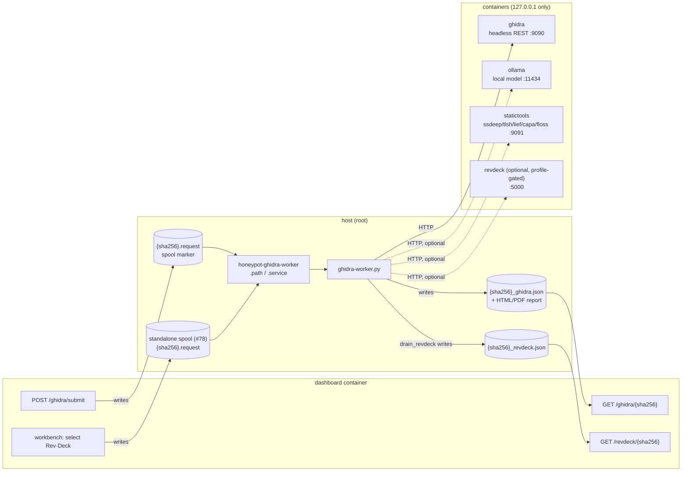
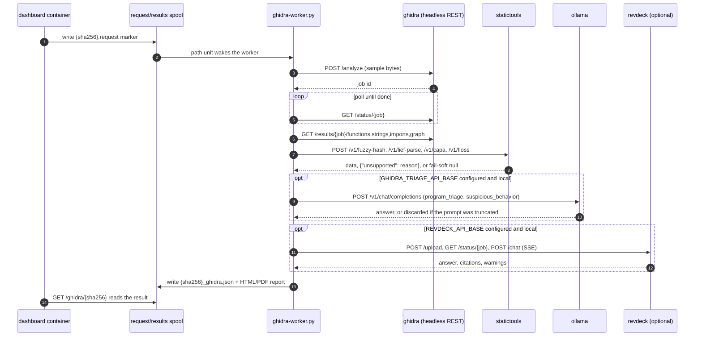

# Ghidra analysis host

Static reverse engineering for captured payloads: headless Ghidra behind a REST
service, a host-side worker that drains a spool, and a local language model that
produces a first-pass triage opinion.

Design and phase history live in
[`IMPLEMENTATION_PLAN.md`](IMPLEMENTATION_PLAN.md) (the Ghidra pipeline) and
[`DASHBOARD_INTEGRATION_PLAN.md`](DASHBOARD_INTEGRATION_PLAN.md) (how it reaches
the dashboard). This file is the operator's copy: how to install it, how to
configure it, and how to read what it produces. The AI-triage workflow itself
— local-only enforcement, the context-window pitfall, prompt injection — is
split out into [`AI_TRIAGE.md`](AI_TRIAGE.md) (#142).

## Contents

- [What runs where](#what-runs-where)
- [The statictools sidecar contract](#the-statictools-sidecar-contract)
- [Install](#install)
- [Configuration](#configuration)
- [AI triage](#ai-triage) (moved to [`AI_TRIAGE.md`](AI_TRIAGE.md))
- [Reading the result](#reading-the-result)
- [Operations](#operations)
- [Tests](#tests)

---

## What runs where



The same `.path`/`.service` pair also drains a second, independent spool for
a standalone Rev·Deck request (#78) — one submission path that never touches
the Ghidra REST service at all, distinct from the `revdeck` field the
embedded call above writes onto a full Ghidra analysis. See
[Rev·Deck](#revdeck) further down.

The dashboard never talks to any of the four containers, or to Docker. It
writes a `{sha256}.request` marker into one directory and reads
`{sha256}_ghidra.json` out of another — the same spool pattern the KVM
sandbox already uses. Every container port is published on `127.0.0.1` only:
between them they hold captured malware and every string, fuzzy hash and
structural fact extracted from it.

The worker is **stdlib-only Python 3** on purpose. A worker that needs
`pip install` before it can drain a queue is a worker that will be broken after
the next OS upgrade.

### The full request lifecycle

The diagram above is what exists; this is what happens, in order, for one
sample (#145 — the previous version of this diagram showed only which
containers exist, not the request path through them):



Every sidecar call in that diagram is independently fail-soft: a down or
disabled statictools, model, or Rev·Deck leaves its own field null and never
fails the analysis (see [Reading the result](#reading-the-result)).

---

## The statictools sidecar contract

`analysis/ghidra/statictools/` is the worker's only path to ssdeep/tlsh/lief/
capa/floss — see [`server.py`](../../../analysis/ghidra/statictools/server.py)'s own module docstring
for why they're a sidecar and not a host `pip install`. One caller (the
worker), so raw bytes in, JSON out — no multipart:

| Endpoint | Request | 200 response | 422 response |
|---|---|---|---|
| `GET /v1/health` | — | `{"status": "ok"}` | — |
| `POST /v1/fuzzy-hash` | raw sample bytes | `{"ssdeep": ..., "ssdeep_error": ..., "tlsh": ..., "tlsh_error": ...}` (per-algorithm null+error, never a 422) | — |
| `POST /v1/lief-parse` | raw sample bytes | structural metadata (format, entrypoint, sections, ...) | `{"error": "..."}` if lief did not recognise the format |
| `POST /v1/capa` | raw sample bytes | capability/ATT&CK/MBC tags | `{"error": "...", "unsupported": "..."}` if capa's default (vivisect) backend can't handle this architecture/format/OS (#195) |
| `POST /v1/floss` | raw sample bytes | decoded/stack/tight/static strings | `{"error": "...", "unsupported": "..."}` if floss's decoding/stack-string analysis doesn't cover this format — PE and raw shellcode only (#207) |

The worker treats every non-`unsupported` failure (connection refused,
timeout, malformed JSON) identically to the sidecar being switched off: the
corresponding result field is left `null` and the rest of the analysis
proceeds.

---

## Install

```bash
git clone https://github.com/Xore/APIARY.git
sudo APIARY/analysis/ghidra/install-analysis-host.sh
```

That does both halves. They can be run separately, which is what a host where
only the operator is in the `docker` group needs:

```bash
analysis/ghidra/install-analysis-host.sh --containers-only   # no root needed
sudo analysis/ghidra/install-analysis-host.sh                # the worker half
```

| Flag | Effect |
|---|---|
| `--containers-only` | Bring up/refresh the containers and stop |
| `--model NAME` | Model to pull. Defaults to `GHIDRA_TRIAGE_MODEL` from `/etc/default/honeypot-ghidra` if that file exists, else `qwen3:8b` |
| `--no-gpu` | Run the model on CPU even if an NVIDIA runtime is present |
| `--skip-pull` | Do not pull the model |
| `--stack-dir PATH` | Where to deploy the compose file. `""` runs it in place |

The script is idempotent — safe to re-run after an image bump, a model change,
or a reboot — and an existing `/etc/default/honeypot-ghidra` is never
overwritten.

One optional host package, deliberately not installed by the script because
package managers are the one thing that differs on every host:

```bash
sudo apt install graphviz
```

Without `dot` the call graph is still recovered and written as DOT; only the
rendered SVG is missing, and the worker says so (`[.] graphviz 'dot' not
installed`) rather than failing.

### Where the stack lives

On a host running Dockge (`/opt/stacks` exists) the compose file is deployed to
`/opt/stacks/ghidra/compose.yml`, which is what makes Dockge treat it as a stack
it owns rather than containers it can see but not start, stop, or read logs
from. **That copy is a deployment artifact**: edit
`docker-compose.ghidra.yml` here and re-run the script, because the next run
overwrites it.

The directory name is the compose project name and therefore the prefix on the
volumes — `ghidra_ollama_models` holds several GB of weights. Renaming it pulls
the model again into a new volume and orphans the old one.

GPU settings arrive as `compose.override.yml`, the one extra file `docker
compose` loads without being told to, because Dockge runs compose with no `-f`
of its own.

Containers created from somewhere else keep the compose labels they were born
with, and `up -d` leaves them alone because nothing about the service changed.
Once, after moving an already-running stack:

```bash
cd /opt/stacks/ghidra && docker compose up -d --force-recreate
```

Named volumes are keyed on the project name, so the weights survive that.

**The containers half** pulls both images, brings up `ghidra` and `ollama`,
polls until each actually answers (`up -d` returns when a container has
started, not when the service inside it is serving; Ghidra unpacks its own
installation on first boot and takes minutes), then pulls the model.

**The worker half** installs `ghidra-worker.py` to `/opt/honeypot-ghidra/`,
creates the spools `0700 root:root`, installs and enables
`honeypot-ghidra-worker.path`, and finishes by running `--selftest` against the
services it just started — a real binary through `/analyze`, plus a report on
whether the model endpoint is reachable, local, and serving the configured
model.

### GPU

Auto-detected from `docker info` and opted into with a compose overlay:

```bash
docker compose -f analysis/ghidra/docker-compose.ghidra.yml \
  -f analysis/ghidra/docker-compose.ghidra.gpu.yml up -d ollama
```

The overlay is separate because a device reservation the host cannot satisfy is
a hard `could not select device driver` on `up`. The base file works everywhere;
on CPU the model is slower and the worker cannot tell the difference.

### The dashboard side

`deploy.yml` excludes `.env` by design, so this part is yours:

```
GHIDRA_REQUEST_DIR=/ghidra-requests
GHIDRA_RESULTS_DIR=/ghidra-results
```

Those are the in-container paths; `docker-compose.yml` mounts the host spools
onto them. Without both, the dashboard hides the Ghidra queue entirely.

---

## Configuration

Everything lives in `/etc/default/honeypot-ghidra`, installed from
[`worker/honeypot-ghidra.default.example`](../../../analysis/ghidra/worker/honeypot-ghidra.default.example),
which documents each setting inline. The ones worth knowing:

| Variable | Default | Notes |
|---|---|---|
| `GHIDRA_API_BASE` | `http://127.0.0.1:9090` | The headless REST service |
| `GHIDRA_ANALYSIS_TIMEOUT` | `4200` | Per binary. Deliberately longer than the container's own `ANALYSIS_TIMEOUT` |
| `GHIDRA_TRIAGE_API_BASE` | `http://127.0.0.1:11434/v1` | Empty switches triage off |
| `GHIDRA_TRIAGE_MODEL` | `qwen3:8b` | Recorded in every result |
| `GHIDRA_TRIAGE_TIMEOUT` | `300` | Per workflow call; two calls run per sample |
| `GHIDRA_TRIAGE_MAX_STRINGS` / `_IMPORTS` / `_FUNCTIONS` | `200` / `150` / `100` | How much of the binary the model is shown. Around 8000 tokens together — see [the context window](AI_TRIAGE.md#the-context-window-is-part-of-the-configuration) before raising them |
| `STATICTOOLS_API_BASE` | `http://127.0.0.1:9091` | ssdeep/tlsh/lief/capa/floss sidecar, see [its contract above](#the-statictools-sidecar-contract). Empty switches it off |
| `REVDECK_API_BASE` | *(empty)* | Empty switches Rev·Deck automation off (default). Same `endpoint_is_local()` rule as `GHIDRA_TRIAGE_API_BASE`. Gates both the embedded call inside a Ghidra analysis and the standalone spool below |
| `REVDECK_WORKFLOW` | `program_triage` | Which Rev·Deck workflow the worker drives; `suspicious_behavior` is swappable, not run alongside it |
| `REVDECK_REQUEST_DIR` / `REVDECK_RESULTS_DIR` | *(unset)* | A second, independent spool (#78) so a dashboard operator can ask for just Rev·Deck's opinion without paying for a full Ghidra analysis alongside it — see [Rev·Deck](#revdeck) below. `REVDECK_API_BASE` above still gates whether a request here can succeed |

Spool paths are also set here, and must agree with `ReadWritePaths=` in
`honeypot-ghidra-worker.service`: systemd cannot expand these values, so moving
a spool means editing both files.

Alerting is configured on the **dashboard** side, not here:
`GHIDRA_ALERT_RISK_LEVELS` (default `high,critical`) and
`GHIDRA_ALERT_ON_CRYPTO` (default `false`).

---

## AI triage

After collection the worker runs two workflows against the local model —
`program_triage` and `suspicious_behavior` — and writes the answer to
`ai_triage` on the result. It fails soft in every direction: no endpoint
configured, one that's refused or unreachable, a model error, an unparseable
answer, or a truncated prompt all leave `ai_triage` null with the rest of the
analysis complete.

**Local only, enforced in code, no override flag** — the prompt carries
strings/imports/function names lifted straight out of a captured sample, so a
hosted endpoint would be a data-exfiltration path, not a smaller version of
the feature. See [`AI_TRIAGE.md`](AI_TRIAGE.md) for the local-only rule's
exact syntactic test, the context-window truncation pitfall (measured, not
theoretical — a too-small window silently changes the answer rather than
erroring), the full data-flow diagram, and the prompt-injection posture.

---

## Reading the result

Every result is `{sha256}_ghidra.json`. The fields below the always-present
core (`sha256`, `exit_status`, `functions`, `strings`, `imports`, ...) come
from optional sidecars, and each one distinguishes three states — this table
is the single place that distinction lived only in prose and per-file
docstrings before (#142):

| Field | `null` means | `{"unsupported": reason}` means | present means |
|---|---|---|---|
| `fuzzy_hashes` | statictools unreachable or switched off | *(no unsupported state — ssdeep/tlsh each report their own `_error` instead)* | `{ssdeep, ssdeep_error, tlsh, tlsh_error}`, each hash independently nullable |
| `lief` | statictools unreachable/off, **or** lief did not recognise the format | *(collapses to `null` — lief has no distinct decline signal, unlike capa/floss below)* | structural metadata: format, entrypoint, sections, libraries, ... |
| `capa` | statictools unreachable/off | capa's default (vivisect) backend can't handle this architecture/format/OS — a real decline, not an outage ([#195](https://github.com/Xore/APIARY/issues/195)) | capability/ATT&CK/MBC tags |
| `floss` | statictools unreachable/off | floss's decoding/stack-string analysis only covers PE/raw shellcode — this honeypot's dominant ELF catch lands here on every run ([#207](https://github.com/Xore/APIARY/issues/207)) | decoded/stack/tight/static strings |
| `revdeck` | `REVDECK_API_BASE` unset, endpoint refused/unreachable, or no usable answer | *(no unsupported state)* | workflow/status/answer/tool_calls/citations |
| `ai_triage` | no endpoint configured, refused, unreachable, model error, unparseable answer, or the prompt was truncated | *(no unsupported state)* | family_guess/risk_level/behaviors/model/evidence_shown — see [`AI_TRIAGE.md`](AI_TRIAGE.md) |

The `null`-vs-`unsupported` distinction matters operationally: an operator
reading "not observed" for capa/floss on an ELF/MIPS sample would otherwise
have to wonder whether the sidecar was even up. `lief` and `fuzzy_hashes`
predate that pattern and still collapse every failure to one state — nothing
today depends on separating them further.

`findcrypt` results are deliberately kept out of every model prompt. Crypto
constants carry their own caveat — presence does not show malicious use — and
feeding them to a model invites exactly the over-reading the dashboard warns
about.

---

## Operations

```bash
# Is any of this working?
python3 /opt/honeypot-ghidra/worker/ghidra-worker.py --selftest
```

It prints the endpoints, whether the spools exist, a `TRIAGE` line (disabled /
refused / unreachable / model not pulled / OK), and runs a real binary through
`/analyze` end to end:

```
API_BASE      : http://127.0.0.1:9090
/v1/health    : OK
REQUEST_DIR   : /var/lib/honeypot-ghidra/requests/pending (exists=True)
RESULTS_DIR   : /var/lib/honeypot-ghidra/results (exists=True)
SAMPLES_DIR   : /var/lib/honeypot-sandbox/inbox/samples (exists=True)
TRIAGE        : http://127.0.0.1:11434/v1 OK, model qwen3:8b available, context fits a full evidence block (7972 tokens read)
STATICTOOLS   : http://127.0.0.1:9091 OK
REVDECK       : disabled (REVDECK_API_BASE is empty)

round trip on /bin/true ...
  job            : 4761e1f6b74841db9f744c552cc94240
  analyzer       : ghidra-11.3.2 (artifacts 2.1)
  functions      : 96
  strings        : 180
  imports        : 38
  fuzzy_hashes   : {'ssdeep': '3:...', 'ssdeep_error': None, 'tlsh': None, 'tlsh_error': 'input too small or too uniform to hash (TNULL)'}
  lief           : ok, format=ELF
  capa           : ok, capabilities=2
  floss          : declined - unsupported format for string decoding -- floss's decoding/stack-string analysis covers PE and raw shellcode only

contract OK
```

```bash
# Worker logs
journalctl -u honeypot-ghidra-worker.service -f
```

```bash
# Swap the model
analysis/ghidra/install-analysis-host.sh --containers-only --model qwen3:14b
```

Then set `GHIDRA_TRIAGE_MODEL` to match and
`systemctl restart honeypot-ghidra-worker.path`. Pulling a model the worker is
not configured for leaves several GB on disk and triage still not working.

```bash
# What is loaded, what is on disk
docker compose -f /opt/stacks/ghidra/compose.yml exec ollama ollama ps
docker compose -f /opt/stacks/ghidra/compose.yml exec ollama ollama list
```

`ollama ps` has a `CONTEXT` column and a `PROCESSOR` column. Those are the two
that decide whether triage works and how long it takes:

```
NAME      ID            SIZE     PROCESSOR    CONTEXT
qwen3:8b  500a1f067a9f  7.8 GB   12%/88% CPU/GPU  16384
```

`4096` there means the window setting is not reaching the container. A mixed
CPU/GPU value is expected and allowed on this host; use measured latency and
system-RAM capacity to operate it, not `100% GPU` as a correctness gate.

### Rev·Deck

The `revdeck` service is behind a `revdeck` profile and is not started by
default. Its build context is not vendored. Set `REVDECK_API_BASE` (subject to
the same `endpoint_is_local()` rule as `GHIDRA_TRIAGE_API_BASE`) and the
worker automates it too — `revdeck_triage()` drives a verified
upload/poll/chat contract, writing a `revdeck` field distinct from the
worker's own `ai_triage`, a second and independent AI aid rather than a
replacement for it. Off by default. See
[`revdeck/README.md`](revdeck/README.md).

Two ways to get that automation, both gated by `REVDECK_API_BASE`:

- **Embedded** — every Ghidra analysis runs it automatically as one more
  enrichment, the `revdeck` field on `{sha256}_ghidra.json`.
- **Standalone** (#78) — set `REVDECK_REQUEST_DIR`/`REVDECK_RESULTS_DIR` and
  select "Rev·Deck / GhidrAssist" on its own in the dashboard's analysis
  workbench, without also running a full Ghidra analysis. `drain_revdeck()`
  drains this second spool independently: `revdeck_triage()` only ever needed
  the sample bytes, never the Ghidra REST job's own artifacts, so nothing
  about running it alone duplicates work. Writes `{sha256}_revdeck.json`,
  read back at `/revdeck/{sha256}`. Because Rev·Deck's answer *is* the whole
  point of a standalone request, a null answer here is written as this
  result's own `exit_status: "error"` (with a reason — endpoint not
  configured, refused, unreachable, or an empty answer) rather than the quiet
  `"revdeck": null` the embedded path leaves among many other fields.

---

## Tests

```bash
python3 analysis/ghidra/worker/tests/test_ghidra_worker.py
```

Stdlib only, both sides stubbed, runs in seconds, and runs in CI on every
change. It covers spool discipline, the endpoint contract, risk normalisation,
the evidence budget, explicit non-thinking mode, defensive `<think>` stripping
— and that a non-local endpoint is refused, which is a rule worth only as much
as the thing that checks it.
