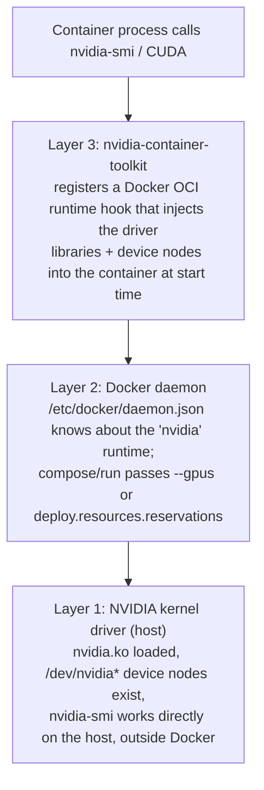

# GPU Passthrough to Docker Containers — Manual Setup Guide

> **Audience:** an operator setting up, debugging, or tearing down NVIDIA
> GPU passthrough by hand — on this homeserver or a similar box.
> **Not the automation:** `scripts/install-homeserver.sh` already does all
> of this (`step_gpu_driver`, `step_gpu_container_toolkit`,
> `step_gpu_verify_or_note_reboot`). Run this repo's install script if
> you're standing up the homeserver from scratch. This guide exists for
> when you need to understand, debug, or repeat one piece of that by hand
> — e.g. adding GPU access to a container this repo doesn't already wire
> up, or diagnosing why an existing one lost access to the card.
> **Verified live** on the actual homeserver (`supermicro`, NVIDIA RTX 4000
> Ada Generation, 20475 MiB VRAM) during the [#518](https://github.com/Xore/APIARY/issues/518)
> true from-scratch reinstall, including a real fresh driver install and
> reboot cycle. Every command and error message below was seen live, not
> copied from NVIDIA's docs.
> **See also:** [`gpu-llm-analysis-worker.md`](gpu-llm-analysis-worker.md)
> and [`gpu-ml-worker-acceleration.md`](gpu-ml-worker-acceleration.md) for
> how this repo actually *uses* the GPU once passthrough works — model
> selection, VRAM budget, and the GPU-sharing contract between Ollama and
> ml-worker.

---

## Table of Contents

1. [How the pieces fit together](#1-how-the-pieces-fit-together)
2. [Step 1 — Install the NVIDIA driver](#2-step-1--install-the-nvidia-driver)
3. [Step 2 — Verify the driver (reboot if needed)](#3-step-2--verify-the-driver-reboot-if-needed)
4. [Step 3 — Install the NVIDIA Container Toolkit](#4-step-3--install-the-nvidia-container-toolkit)
5. [Step 4 — Configure the Docker runtime](#5-step-4--configure-the-docker-runtime)
6. [Step 5 — Verify a container can see the GPU](#6-step-5--verify-a-container-can-see-the-gpu)
7. [Giving a specific container the GPU](#7-giving-a-specific-container-the-gpu)
8. [Sharing one GPU across multiple containers](#8-sharing-one-gpu-across-multiple-containers)
9. [Troubleshooting (real errors seen on this box)](#9-troubleshooting-real-errors-seen-on-this-box)
10. [Clean teardown](#10-clean-teardown)

---

## 1. How the pieces fit together

Three independent layers all have to work before a container can see the
GPU. Each has its own failure mode, and the error you see rarely tells you
which layer is actually broken:



If `nvidia-smi` fails on the bare host, nothing above it can possibly work
— always start troubleshooting at Layer 1, not inside a container.

---

## 2. Step 1 — Install the NVIDIA driver

```bash
apt-get install -y ubuntu-drivers-common
ubuntu-drivers install
```

`ubuntu-drivers install` auto-detects the card and installs the recommended
driver package (open or proprietary, whichever Ubuntu's driver database
recommends for that GPU). On Ubuntu 26.04 this installed driver `595.84`
for the RTX 4000 Ada Generation card here.

> Older `ubuntu-drivers-common` versions use `ubuntu-drivers autoinstall`
> instead — `autoinstall` was removed as of `1:0.10.9` (confirmed via
> `ubuntu-drivers -h` on this box). If `install` doesn't exist on your
> version, fall back to `autoinstall`.

This installs a kernel module (`nvidia.ko`) alongside the driver. **A
kernel module can't be loaded into an already-running kernel by apt** — see
Step 2.

---

## 3. Step 2 — Verify the driver (reboot if needed)

```bash
nvidia-smi
```

On a **fresh driver install, this will fail** even though the install
itself reported success:

```
NVIDIA-SMI has failed because it couldn't communicate with the NVIDIA driver.
Make sure that the latest NVIDIA driver is installed and running.
```

Check whether the kernel module is actually loaded:

```bash
lsmod | grep '^nvidia '
```

If it's absent, this isn't a broken install — it's expected. **Reboot the
box**, then re-run `nvidia-smi`. It should now report the card:

```
+-----------------------------------------------------------------------------------------+
| NVIDIA-SMI 595.84                 Driver Version: 595.84         CUDA Version: 13.2     |
+-----------------------------------------+------------------------+----------------------+
| GPU  Name                 Persistence-M | Bus-Id          Disp.A | Volatile Uncorr. ECC |
|   0  NVIDIA RTX 4000 Ada Gene...    Off |   00000000:65:00.0 Off |                  Off |
| 30%   42C    P8              9W /  130W |       2MiB /  20475MiB |      0%      Default |
+-----------------------------------------+------------------------+----------------------+
```

Don't skip this step and move on to Step 3 hoping it'll sort itself out —
the container toolkit's own postinst hooks (next step) can fail in
confusing ways if they run before the driver is actually live (see
[Troubleshooting](#9-troubleshooting-real-errors-seen-on-this-box)).

---

## 4. Step 3 — Install the NVIDIA Container Toolkit

This is the piece that lets Docker's runtime hand a container access to
the driver. It's a separate package from the driver itself.

```bash
curl -fsSL https://nvidia.github.io/libnvidia-container/gpgkey \
  | gpg --dearmor -o /usr/share/keyrings/nvidia-container-toolkit-keyring.gpg

curl -s -L https://nvidia.github.io/libnvidia-container/stable/deb/nvidia-container-toolkit.list \
  | sed 's#deb https://#deb [signed-by=/usr/share/keyrings/nvidia-container-toolkit-keyring.gpg] https://#g' \
  > /etc/apt/sources.list.d/nvidia-container-toolkit.list

apt-get update
apt-get install -y nvidia-container-toolkit
```

---

## 5. Step 4 — Configure the Docker runtime

```bash
nvidia-ctk runtime configure --runtime=docker
systemctl restart docker
```

`nvidia-ctk` edits `/etc/docker/daemon.json`, adding an `nvidia` entry
under `"runtimes"` so Docker knows how to launch a container with GPU
access. Restarting Docker is required — it only reads that file at
startup.

---

## 6. Step 5 — Verify a container can see the GPU

```bash
docker run --rm --gpus all nvidia/cuda:12.4.0-base-ubuntu22.04 nvidia-smi -L
```

If this prints the GPU's name and UUID, all three layers work. This is
also exactly what `install-homeserver.sh`'s `gpu-verify` step runs.

---

## 7. Giving a specific container the GPU

Two equivalent ways to request GPU access, depending on whether you're
using `docker run` or Compose.

**`docker run`:**

```bash
docker run --rm --gpus all my-image                 # every GPU on the host
docker run --rm --gpus '"device=0"' my-image         # GPU index 0 only
docker run --rm --gpus '"device=GPU-<uuid>"' my-image # by UUID (nvidia-smi -L)
```

**Compose (`deploy.resources.reservations.devices`)** — this is the form
this repo actually uses, in `analysis/ghidra/docker-compose.ghidra.gpu.yml`:

```yaml
services:
  ollama:
    deploy:
      resources:
        reservations:
          devices:
            - driver: nvidia
              count: all
              capabilities: [gpu]
```

Note this repo keeps the GPU reservation in a **separate overlay file**,
applied only when a GPU is actually present:

```bash
docker compose -f docker-compose.ghidra.yml -f docker-compose.ghidra.gpu.yml \
  up -d ghidra ollama
```

The reason: a `deploy.resources.reservations.devices` block that the host
can't satisfy makes `docker compose up` fail outright for the whole stack,
not just degrade gracefully. Keeping it as an overlay means a host without
a GPU still gets a working (just CPU-only / slower) deployment instead of
a broken one. `install-analysis-host.sh` decides whether to include the
overlay by checking `docker info` for an nvidia runtime.

**Environment variables**, if you're not starting from an `nvidia/cuda`
base image (which sets sane defaults itself):

```yaml
environment:
  - NVIDIA_VISIBLE_DEVICES=all
  - NVIDIA_DRIVER_CAPABILITIES=compute,utility
```

---

## 8. Sharing one GPU across multiple containers

Docker's `--gpus all` / `count: all` doesn't partition VRAM — every
container that requests the GPU gets the whole card, and it's up to each
process to behave. Nothing stops two containers from both trying to
allocate more VRAM than the card has, at which point the second allocator
gets a CUDA out-of-memory error, not a scheduling wait.

This repo's own answer to that (see
[`gpu-ml-worker-acceleration.md` §5, "GPU Sharing Contract with the LLM
Worker"](gpu-ml-worker-acceleration.md#5-gpu-sharing-contract-with-the-llm-worker))
is architectural, not a Docker feature: only **one** container
(`ollama`, in the `ghidra` stack) is ever given the GPU reservation.
`ml-worker` and `llm-worker` are deliberately CPU-only — they talk to
Ollama over HTTP instead of touching the GPU directly. If you're adding a
second GPU-bound container to this stack, read that section before doing
it; the scheduling offset between ml-worker's retrain window and Ollama's
daily report window exists specifically to avoid two GPU-hungry processes
running at once.

Check available headroom before adding a second consumer:

```bash
nvidia-smi --query-gpu=memory.total,memory.used,memory.free --format=csv
```

---

## 9. Troubleshooting (real errors seen on this box)

**`NVIDIA-SMI has failed because it couldn't communicate with the NVIDIA driver`**
— on the bare host, right after a driver install: the kernel module isn't
loaded yet. Reboot (see [Step 2](#3-step-2--verify-the-driver-reboot-if-needed)).

**`nvidia-container-cli: initialization error: nvml error: driver not loaded`**
— the same root cause, one layer up: a container tried to start with
`--gpus`/`deploy.resources.reservations.devices` before the host driver
was actually loaded (e.g. scripted right after a fresh driver install,
before reboot). Fix is the same — reboot the host first. Any container
that failed to start this way needs to be recreated (`docker compose up
-d`), not just restarted — the OCI runtime hook that injects the driver
only runs at container creation.

**`Job for nvidia-cdi-refresh.service failed because the control process
exited with error code`** (seen during `nvidia-container-toolkit`
installation) — this is the toolkit's postinst trying to (re)generate a
CDI (Container Device Interface) spec at install time, before the driver
is loaded. It's a warning, not a fatal error for the install itself —
`apt-get install` still completes. It resolves itself once the driver is
actually loaded (post-reboot) and something re-triggers the refresh (e.g.
`systemctl restart docker`, or simply the next container start).

**`Auto-detected mode as 'legacy'`** (in a container's stderr on start) —
informational, not an error: the toolkit is telling you it's using the
older OCI-hook-based injection mechanism rather than CDI. Both work; CDI
is the newer path and requires `/etc/cdi` specs to exist, which in turn
requires the driver to have been loaded at least once since install (see
the `nvidia-cdi-refresh.service` note above).

---

## 10. Clean teardown

For fully removing GPU passthrough (e.g. before a from-scratch
reinstall) — this is exactly what was authorized and run for the #518
verification:

```bash
systemctl stop docker
apt-get purge -y 'nvidia-*' 'libnvidia-*' nvidia-container-toolkit \
  nvidia-container-toolkit-base libnvidia-container1 libnvidia-container-tools
apt-get autoremove -y
rm -f /etc/apt/sources.list.d/nvidia-container-toolkit.list
rm -f /usr/share/keyrings/nvidia-container-toolkit-keyring.gpg
systemctl start docker
```

Verify the kernel module is actually gone before reinstalling:

```bash
lsmod | grep nvidia   # should print nothing
```

If it still shows up, something (usually a container still running, or an
X session) is holding a reference — a reboot clears it unconditionally.
