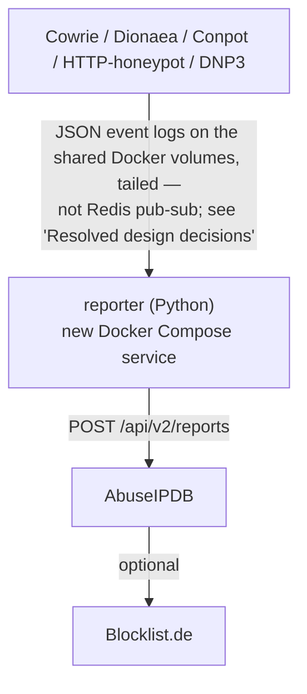
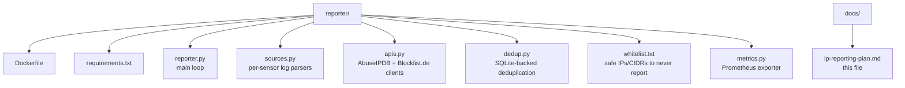

# IP Blocklist Reporting Plan

Report attacker IPs observed by the honeypot stack to public threat-intel
blocklists via their APIs.

> **Status:** built. `reporter/` (Go, not the Python layout sketched below --
> that part of this plan is superseded) is a real service in
> `docker-compose.utilities.yml`. Phase 1
> ([#68](https://github.com/Xore/apiary/issues/68)) and Phase 2
> ([#69](https://github.com/Xore/apiary/issues/69)) are both closed.
> Phase 3-4 (reputation validation, operator observability) is
> [#153](https://github.com/Xore/apiary/issues/153), still open.
>
> **Reporting is outbound and irreversible.** An abuse report cannot be
> unsent, and it names a third party's address from this stack. The reporter
> ships dry-run by default (`REPORTER_LIVE`/`ABUSEIPDB_API_KEY` both unset)
> and stays that way until live reporting is separately approved — a
> standing constraint on this feature, not a Phase 1 convenience.
>
> This is *defensive* reporting (get an attacker's IP blocked elsewhere) --
> deliberately kept separate from *offensive/research* community threat-intel
> sharing (contributing this stack's observations to a shared corpus other
> researchers draw from), which was evaluated and declined; see
> [`community-threat-intel-sharing.md`](community-threat-intel-sharing.md).

---

## Goals

- Report every IP that touches a honeypot sensor to one or more blocklist feeds
- Deduplicate: never report the same IP twice within a cooldown window
- Respect rate limits of each upstream API
- Run as a lightweight sidecar container (`reporter`), tailing sensor logs from
  the volumes the stack already writes
- After keys are set in `.env` and dry-run output has been reviewed, no
  per-report human step

---

## Target Blocklist APIs

| Service | API | Free tier | Best for |
|---|---|---|---|
| **AbuseIPDB** | `POST /api/v2/reports` | 1 000 reports/day | General abuse, SSH, HTTP scans |
| **Blocklist.de** | `POST https://api.blocklist.de/api` | Unlimited | Traditional fail2ban-style reporting |
| **GreyNoise RIOT** | Read-only free tier | — | Cross-check before reporting (avoid FP) |

Primary target: **AbuseIPDB** — widely used, has a public confidence score, and feeds back into many firewall blocklists automatically.

---

## Architecture



The `reporter` container:
- Watches the same log/event volume already mounted by the `analysis` and `ml-worker` containers
- Maintains a local SQLite DB (`/data/reported.db`) to deduplicate IPs per service per 24 h
- Exposes a `/metrics` endpoint (Prometheus) so Grafana can graph reports-per-hour

---

## Log Sources per Sensor

| Sensor | Log path (inside container) | Event format |
|---|---|---|
| cowrie | `/cowrie/var/log/cowrie/cowrie.json` | JSON lines |
| dionaea | `/opt/dionaea/var/log/dionaea/` | JSON / SQLite |
| conpot | `/var/log/conpot/` | JSON lines |
| http-honeypot | stdout JSON | JSON lines |
| dnp3-honeypot | stdout JSON | JSON lines |
| snare/tanner | tanner REST API | JSON |

All sensors already write structured JSON. The reporter will tail these files (or consume Redis events if the stack is extended to pub-sub).

---

## AbuseIPDB Report Categories

Map honeypot events to [AbuseIPDB category codes](https://www.abuseipdb.com/categories):

| Honeypot event | Category codes |
|---|---|
| SSH brute-force (cowrie) | `18` (Brute-Force), `22` (SSH) |
| Telnet login attempt (cowrie) | `18`, `23` (IoT Targeted) |
| HTTP scan / exploit attempt | `21` (Web App Attack) |
| Port scan (multipot/conpot) | `14` (Port Scan) |
| Malware download (dionaea) | `20` (Malware) |
| ICS/SCADA probe (conpot/dnp3) | `14`, `15` (Hacking) |
| DNS abuse | `11` (DNS Compromise) |

---

## Implementation Plan

### Phase 1 — Reporter Container (week 1)

1. Create `reporter/` directory with:
   - `reporter.py` — main event loop
   - `Dockerfile` — slim Python 3.12 image
   - `requirements.txt` — `requests`, `watchdog`, `prometheus-client`
2. Logic:
   ```python
   # Pseudocode
   for event in tail_logs(SENSOR_PATHS):
       ip = event["src_ip"]
       if not recently_reported(ip, service="abuseipdb", window_hours=24):
           categories = map_to_categories(event["type"])
           abuseipdb_report(ip, categories, comment=build_comment(event))
           mark_reported(ip, "abuseipdb")
   ```
3. SQLite schema:
   ```sql
   CREATE TABLE reports (
     ip TEXT NOT NULL,
     service TEXT NOT NULL,
     reported_at INTEGER NOT NULL,  -- Unix timestamp
     event_type TEXT,
     PRIMARY KEY (ip, service, reported_at / 86400)  -- 1 report per IP per day
   );
   ```

### Phase 2 — Blocklist.de Integration (week 2)

- Add secondary reporter for Blocklist.de using the same dedup logic
- Blocklist.de uses a simple HTTP POST with `server`, `ip`, `logs` fields
- Useful for SSH/FTP/SIP — feeds European ISP blocklists

### Phase 3 — Pre-report Validation (week 3)

Before reporting, cross-check against:
- **GreyNoise RIOT** (`GET /v3/riot/{ip}`) — skip known benign scanners (Shodan, Censys, security researchers)
- Local whitelist file `reporter/whitelist.txt` — your own IPs, Tor exits you want to skip
- RFC 1918 / loopback / link-local guard (never report private IPs)

### Phase 4 — Observability (week 4)

- Prometheus metrics from `reporter`:
  - `honeypot_reports_total{service, category}` counter
  - `honeypot_report_errors_total{service, error}` counter
  - `honeypot_dedup_skips_total` counter
- Add Grafana panel to existing dashboard: "Reports sent this week" bar chart
- Alert webhook (existing `HONEYPOT_ALERT_WEBHOOK_URL`) if AbuseIPDB rate limit is approaching

---

## Docker Compose Addition

Add to `docker-compose.yml`:

```yaml
  reporter:
    build: ./reporter
    restart: unless-stopped
    environment:
      ABUSEIPDB_API_KEY: ${ABUSEIPDB_API_KEY}
      BLOCKLIST_DE_EMAIL: ${BLOCKLIST_DE_EMAIL}
      BLOCKLIST_DE_PASSWORD: ${BLOCKLIST_DE_PASSWORD}
      GREYNOISE_API_KEY: ${GREYNOISE_API_KEY:-}   # optional
      REPORTER_COOLDOWN_HOURS: ${REPORTER_COOLDOWN_HOURS:-24}
      REPORTER_WHITELIST: /config/whitelist.txt
    volumes:
      - cowrie_logs:/logs/cowrie:ro
      - dionaea_logs:/logs/dionaea:ro
      - conpot_logs:/logs/conpot:ro
      - reporter_data:/data
      - ./reporter/whitelist.txt:/config/whitelist.txt:ro
    ports:
      - "127.0.0.1:9101:9101"   # Prometheus metrics
    networks:
      - honeypot_internal
```

Add to `.env.example`:

```dotenv
# IP Blocklist Reporting
ABUSEIPDB_API_KEY=
BLOCKLIST_DE_EMAIL=
BLOCKLIST_DE_PASSWORD=
GREYNOISE_API_KEY=
REPORTER_COOLDOWN_HOURS=24
```

---

## Rate Limits & Throttling

| Service | Limit | Mitigation |
|---|---|---|
| AbuseIPDB free | 1 000 reports/day | Dedup per 24 h; batch high-volume periods |
| AbuseIPDB paid | 10 000/day | Upgrade if volume exceeds free tier |
| Blocklist.de | No hard limit; fair use | 1 report per IP per 24 h |
| GreyNoise free | 1 000 lookups/day | Cache RIOT lookups for 6 h in SQLite |

The reporter will track a daily counter and pause with exponential back-off on `429` responses.

---

## False Positive Mitigation

- **GreyNoise RIOT check**: if `riot=true` → skip (known benign scanner)
- **Minimum event threshold**: only report after ≥ 3 events from same IP within 10 min (configurable)
- **Whitelist**: `reporter/whitelist.txt` — CIDR and single IP entries, one per line
- **ASN filter**: optionally skip reports for IPs belonging to major cloud providers unless event severity is high

---

## Files To Create



---

## Resolved design decisions

These were open when the plan was written. They are settled; the implementation
work they govern is tracked in
[#68](https://github.com/Xore/apiary/issues/68) and
[#69](https://github.com/Xore/apiary/issues/69).

- **Ingest via file tailing, not a message bus.** A Redis pub-sub channel has
  lower latency but adds a service to Compose for a reporter whose cooldown
  windows are measured in hours. Tail the logs; revisit only if `ml-worker`
  brings pubsub in for its own reasons.
- **Suricata IDS alerts are in scope**, alongside honeypot hits, from Phase 2
  ([#69](https://github.com/Xore/apiary/issues/69)).
- **No auto-banning.** The reporter stays stateless and reporting-only.
  Firewall enforcement is a different trust boundary and a different failure
  mode: a false positive that costs an abuse report is recoverable, one that
  installs an nftables rule is not.
