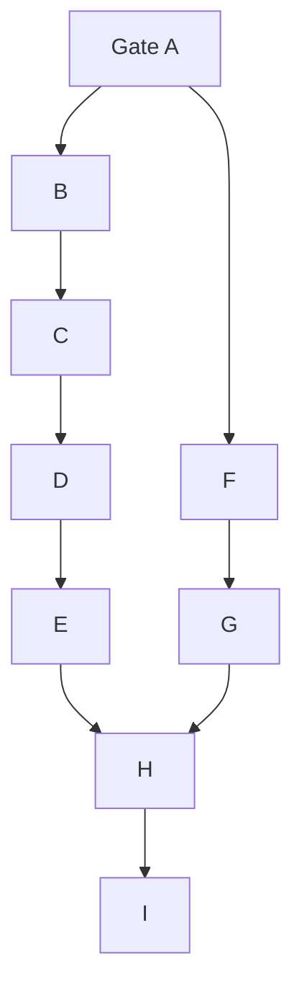

# Coordinated ML and GPU Analysis Roadmap

> **Status:** Proposed implementation sequence
>
> **Scope:** `ml-worker`, GPU acceleration, local LLM analysis, and dashboard delivery
>
> **Source plans:** [`ml-worker-plan.md`](ml-worker-plan.md),
> [`gpu-ml-worker-acceleration.md`](gpu-ml-worker-acceleration.md), and
> [`gpu-llm-analysis-worker.md`](gpu-llm-analysis-worker.md)

This roadmap reconciles the three source plans with the repository as it
exists on 2026-07-29. It establishes a correct CPU ML pipeline and stable data
contracts before adding dashboard, LLM, or GPU complexity.

**Nothing below is built.** This document is the sequencing — what order, and
why. The work is claimed and reviewed in issues:

| Gate / Milestone | Issue |
|---|---|
| A — runtime and hardware truth | [#82](https://github.com/Xore/honeypot-stack/issues/82) |
| B, C — ML foundation and reliable ES pipeline | [#61](https://github.com/Xore/honeypot-stack/issues/61), [#62](https://github.com/Xore/honeypot-stack/issues/62) |
| D — temporal/composite quality and lifecycle | [#63](https://github.com/Xore/honeypot-stack/issues/63), [#65](https://github.com/Xore/honeypot-stack/issues/65) |
| E — dashboard ML delivery | [#64](https://github.com/Xore/honeypot-stack/issues/64) |
| F — guarded LLM worker, dry-run only | [#66](https://github.com/Xore/honeypot-stack/issues/66) |
| G — local Ollama canary | [#83](https://github.com/Xore/honeypot-stack/issues/83) |
| H — ML GPU acceleration | [#67](https://github.com/Xore/honeypot-stack/issues/67) |
| I — shared GPU operations and rollout | [#84](https://github.com/Xore/honeypot-stack/issues/84) |

If a deliverable here has no issue, that is the gap: open one. Do not track
progress by editing this file.

## 1. Baseline and required corrections

The existing `ml-worker/` is a scaffold, not a working v0.1 release:

- it is absent from the root Compose file and has no tests or fixtures;
- timestamp-only checkpoints can skip equal-timestamp events, duplicate
  findings after partial failures, and advance after failed event writes;
- neutral pre-training scores cannot reach the default alert threshold;
- LSTM scoring slices point-model features instead of using the documented
  temporal vector, while sequence and rolling state disappear on restart;
- malformed payloads, invalid IPs, Redis outages, and model-file permissions
  are not isolated from the processing loop;
- retraining lacks metrics, atomic promotion, a model manifest, and rollback;
- proposed package, CUDA, image, and model pins still require clean-build and
  live-host verification.

The three plans are coordinated with these decisions:

1. Elasticsearch is the initial dashboard transport. Redis/SSE is optional
   until polling cost and latency show it is needed.
2. Derived document IDs are deterministic from source identity and
   model/analysis version.
3. Ingestion uses a total-order checkpoint (PIT plus `search_after` with the
   complete sort tuple), committed only after derived writes succeed.
4. Isolation Forest and HBOS stay on CPU. Only LSTM and embeddings may use
   CUDA.
5. The ML worker alone owns the 384-dimensional `ml-embeddings` index. The LLM
   worker does not add a second embedding runtime in v1.
6. LLM output is advisory and never changes scores, sensors, firewalls, or raw
   events.
7. Explicit UTC slots replace restart-relative retraining intervals so GPU
   workloads can actually be separated.

## 2. Component ownership

| Component | Responsibility | Compute | Required dependencies |
|---|---|---|---|
| ML ingestion | Normalize events, ordering, checkpoints, rolling state | CPU | Elasticsearch |
| Point models | Isolation Forest and HBOS | CPU | Versioned feature schema |
| Temporal model | Per-source sequence scoring | CPU first, CUDA later | Durable sequences |
| ML embeddings | Similarity and novelty annotations | CUDA with CPU fallback | Stable anomaly contract |
| `llm-worker` | Sanitized summaries and daily reports | CPU HTTP client | Elasticsearch, Ollama |
| `ollama` | Local quantized inference | GPU | Pinned image/model digests |
| Dashboard | Read-only ML/LLM APIs and labelled UI | CPU | Stable ES mappings |
| Redis/SSE | Best-effort wake-up notifications | CPU | Optional; ES is authoritative |

Both workers write only new derived indices and never mutate source events.

## 3. Contracts to freeze first

Add versioned schemas and fixtures for:

- canonical events and source adapters;
- `feature_schema_version`, `model_version`, and `analysis_version`;
- deterministic document IDs, retries, and idempotency;
- `ml-anomalies`, `ml-worker-state`, `ml-worker-metrics`, `ml-embeddings`,
  `llm-analysis`, and `llm-worker-state`;
- checkpoint state containing the complete last sort tuple;
- health, error, and degraded-mode records;
- retention/ILM and redaction for every derived index.

Contract tests run without Elasticsearch or a GPU. Integration tests use
synthetic TEST-NET data only.

## 4. Implementation sequence

### Gate A — Runtime and hardware truth

**Depends on:** Gate 0 in [`ROADMAP.md`](ROADMAP.md)

1. Restore and verify the Elasticsearch ingestion path.
2. Record source index names and representative field shapes using redacted
   metadata, not captured content.
3. Re-run GPU, driver, container runtime, Docker network, RAM, and disk checks.
4. Verify exact Python, ES client, PyTorch CPU/CUDA, Ollama image, chat model,
   and embedding model pins.

**Exit:** a compatibility record contains commands, versions, dates, and
pass/fail results. Previously observed plan values are not accepted as proof.

### Milestone B — ML foundation (CPU and offline-testable)

1. Split configuration, ES access, normalization, features, models,
   persistence, and orchestration into testable modules.
2. Add deterministic Cowrie, Dionaea, network, Conpot, and HTTP fixtures,
   including malformed and missing fields.
3. Correct temporal features and event-time ordering.
4. Test normalization, entropy, invalid payloads, score bounds, explanations,
   and model save/load.
5. Make Redis absent by default and best-effort when configured.

**Exit:** the CPU image builds; tests pass; every source yields the expected
canonical event and feature dimensions; bad events cannot stop a batch.

### Milestone C — Reliable ES pipeline and CPU baseline

**Depends on:** B

1. Implement PIT/`search_after` and a complete checkpoint tuple.
2. Use deterministic IDs and bulk writes so replay is idempotent.
3. Commit checkpoints after successful writes; define retry and poison-event
   behavior.
4. Bootstrap a CPU model before enabling alerts.
5. Add bounded batches, backpressure, graceful shutdown, health, and metrics.
6. Add a least-privilege Compose service with persistent models, resource
   limits, and no published ports.

**Exit:** restart, replay, equal-timestamp, ES outage, Redis outage, and partial
bulk-failure tests pass. A synthetic anomaly creates exactly one finding.
Record a 24-hour CPU throughput and latency baseline.

### Milestone D — Temporal/composite quality and lifecycle

**Depends on:** C

1. Build durable, bounded 15-event source windows.
2. Evaluate LSTM on held-out chronological fixtures.
3. Calibrate model scores before weighting; clipped raw scores are not treated
   as probabilities.
4. Produce structured reasons and readable explanations.
5. Add manifests, atomic promotion, last-known-good rollback, retention,
   training metrics, drift signals, and explicit UTC retrain slots.
6. Run a shadow period without user-facing severity.

**Exit:** promoted models survive restart; rollback passes; score distributions
and false-positive samples are reviewed; thresholds are evidence-based rather
than assumed to be `0.75`.

### Milestone E — Dashboard ML delivery

**Depends on:** D schema and dashboard platform readiness

1. Add authenticated, bounded ES-backed list, detail, stats, and health APIs.
2. Add pagination, timeouts, validation, and degraded-state responses.
3. Escape explanations and link to immutable source identity.
4. Measure query cost and freshness.
5. Add Redis/SSE only if polling is inadequate. Notifications contain an ID;
   the dashboard re-reads the authoritative ES document.

**Exit:** API/UI tests pass; missing indices and downtime are clear; dashboard
resource use stays within its existing budget.

### Milestone F — Guarded LLM worker in dry-run mode

**Can start after:** C freezes shared contracts

1. Implement aggregation, payload selection, deterministic job IDs,
   checkpoints, and schema validation without a real model.
2. Add delimiter neutralization, content caps, injection fixtures, one bounded
   retry, and error documents.
3. Test against a fake Ollama HTTP server and synthetic events.
4. Keep Redis optional, ports unpublished, filesystem read-only, capabilities
   dropped, and output advisory.

**Exit:** injection, timeout, invalid JSON, missing model, replay, and restart
tests pass. No captured data leaves the stack.

### Milestone G — Local Ollama canary

**Depends on:** A, F, pinned artifacts, and stable Elasticsearch

**Status (2026-08-01):** complete for synthetic and bounded production U1.
U2 and daily reports stay disabled for their later milestones.

1. Pull one approved chat model in an explicit setup job.
2. Record Ollama image and model digests.
3. Enable synthetic U1 summaries, then a small production canary; keep U2 and
   daily reports disabled initially.
4. Review factuality, compliance, latency, injection behavior, and retention.
5. Later UI output is escaped, labelled “AI-generated”, and shows confidence
   and evidence links.

**Exit:** LLM acceptance tests and idle unload pass; disabling Ollama has no
effect on ingestion or ML scoring.

### Milestone H — ML GPU acceleration

**Depends on:** measured C/D CPU baseline and G's real GPU footprint

1. Add `ML_DEVICE=auto|cpu|cuda` and log selection.
2. Verify CUDA/sm_75 and retain a tested CPU path in the same release.
3. Move only LSTM and embeddings to CUDA; bound batches and fall back to CPU
   for a cycle on CUDA OOM.
4. Add the ML-owned 384-dimensional embedding index and novelty query.
5. Run CPU/GPU equivalence and performance tests before defaulting to CUDA.

**Exit:** GPU-guide tests and forced CPU fallback pass; acceleration has a
recorded benefit; missing embeddings never stop anomaly detection.

### Milestone I — Shared GPU operations and rollout

**Depends on:** G and H

Initial explicit UTC slots, adjusted after measurement:

| Window | Default workload | Collision behavior |
|---|---|---|
| 01:00, 07:00, 13:00, 19:00 | ML retrain | Defer while Ollama is loaded; CPU after bounded wait |
| 06:00 | LLM daily report | Queue one job; do not overlap planned retrain |
| Continuous | ML inference | Small batches; CPU fallback on OOM |
| On demand | LLM U1/U2 | Serialized with worker backpressure |

Monitor GPU memory/utilization, queue depth, latency, fallback count,
model-loaded state, and repeated OOM/validation failures.

**Exit:** a deliberate collision causes no crash, loss, or ingestion impact; a
72-hour soak stays within measured VRAM/RAM limits; CPU-ML and disabled-LLM
rollback drills pass.

## 5. Dependencies and parallel work



- B precedes production ML work.
- F can run beside D/E after C freezes contracts.
- E needs neither Redis nor GPU.
- G precedes H so its measured Ollama footprint informs coexistence.
- H is an optimization, not a prerequisite for useful anomaly detection.

## 6. Release and rollback rules

Every milestone is separately reviewable and has tests, schema notes, resource
measurements where applicable, and a disable path. Recommended flags:

```text
ML_ENABLED
ML_TEMPORAL_ENABLED
ML_EMBEDDINGS_ENABLED
ML_DEVICE
LLM_ENABLED
LLM_SESSION_ENABLED
LLM_PAYLOAD_ENABLED
LLM_DAILY_REPORT_ENABLED
EVENT_NOTIFICATIONS_ENABLED
```

Roll back in reverse dependency order: dashboard, GPU mode, LLM jobs, temporal
model, then base ML. Preserve derived indices for audit unless normal retention
removes them.

## 7. Program definition of done

- Source ingestion remains independent of both workers.
- Replay and restart are idempotent and checkpoint-safe.
- CPU ML is a supported production mode.
- GPU use is measured, optional, and OOM-safe.
- The LLM is local, pinned, injection-tested, advisory, and disableable.
- Dashboard output is authenticated, bounded, escaped, and clear about
  degraded or AI-generated data.
- Model/schema versions and evidence links make findings reproducible.
- The 72-hour shared-GPU soak and both rollback drills pass.
