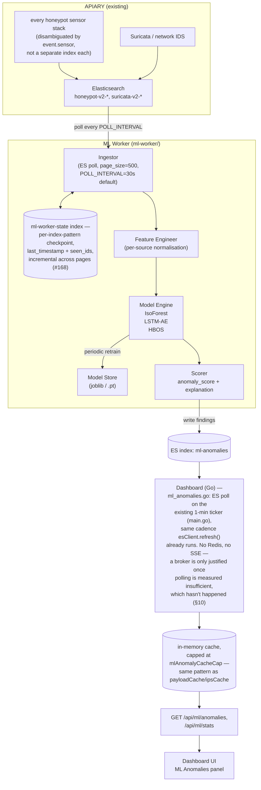

# ML Worker — Implementation Plan

> **Status:** `ml-worker/` has its own Dockge stack
> ([`docker-compose.yml`](../ml-worker/docker-compose.yml) +
> [`docker-compose.ml-worker.gpu.yml`](../ml-worker/docker-compose.ml-worker.gpu.yml),
> mirroring `analysis/ghidra/`), builds, connects to Elasticsearch, and polls
> without crashing (#62). `extract_features()`/`featurise_temporal()` read
> the real per-sensor schema (#62 task 33, #63). The dashboard delivers
> scores via `/api/ml/anomalies`+`/api/ml/stats`+`/ml-anomalies`,
> Elasticsearch-polled, no Redis (#64). Retraining acceptance, versioning,
> rollback, drift detection, and operator threshold controls are #65 —
> see §11.
> **Worker location:** [`ml-worker/`](../ml-worker/)  
> **Tracked in:** [#61](https://github.com/Xore/APIARY/issues/61)–[#65](https://github.com/Xore/APIARY/issues/65)
> — see the roadmap table in §12.
>
> **v0.1 audit verdict (#61, 2026-07-31): not runnable, evidenced.**
> `docker build ./ml-worker` failed outright (`pyod`'s `numba` dependency had
> no version compatible with the pinned `numpy==2.5.1` on Python 3.12 —
> reproduced twice, locally and in-container; fixed in #62 by pinning
> `numpy==2.4.6`/`numba==0.66.0`/`llvmlite==0.48.0`). `worker.py`'s
> `SOURCE_INDICES` (`cowrie-*`, `dionaea-*`, `honeypot-network-*`, `conpot-*`,
> `http-honeypot-*`) still match zero indices on the live homeserver: the real
> shape is a unified `honeypot-v2-*` stream (all sensors, disambiguated by
> `event.sensor`) plus `suricata-v2-<type>-*`. And `extract_features()` still
> reads flat top-level fields that don't exist in a real document — sensor
> data is nested under `honeypot.*`/`source.*`/`network.*`, and even those
> aren't uniform across sensors (§5.3). Six more defects (three already
> flagged in `ml-gpu-coordinated-roadmap.md` §1, three new) are proven
> executably in `ml-worker/tests/test_worker_audit.py`. Full writeup:
> [issue #61](https://github.com/Xore/APIARY/issues/61). This is a
> Milestone B rewrite, not a v0.1 polish pass.

---

## Table of Contents

1. [Goal & Scope](#1-goal--scope)
2. [Data Sources](#2-data-sources)
3. [Architecture Overview](#3-architecture-overview)
4. [ML Models Selected](#4-ml-models-selected)
5. [Feature Engineering](#5-feature-engineering)
6. [Worker Pipeline](#6-worker-pipeline)
7. [Elasticsearch Index Design](#7-elasticsearch-index-design)
8. [Dashboard API Contract](#8-dashboard-api-contract)
9. [Dashboard UI Integration](#9-dashboard-ui-integration)
10. [Docker Compose Integration](#10-docker-compose-integration)
11. [Model Lifecycle & Retraining](#11-model-lifecycle--retraining)
12. [Roadmap](#12-roadmap)

---

## 1. Goal & Scope

The **ML Worker** is an autonomous Python service that continuously reads all
events produced by APIARY and detects:

- **Novel attack patterns** — behaviours that have never appeared before and
  don't match any known signature (zero-day surface).
- **Strange/anomalous events** — statistical outliers in attacker behaviour,
  unusual port/protocol combinations, abnormal session lengths, rare payloads,
  unexpected geographic sources.
- **Temporal attack campaigns** — bursts, coordinated scans, staged sequences
  that only become visible as time-series patterns.

The worker writes scored findings to a dedicated Elasticsearch index
(`ml-anomalies`) and the dashboard Go server exposes them via a new API
endpoint, rendering them as a live panel.

**Out of scope for v1:** Supervised classification (requires labelled data).
All v1 models are **unsupervised** — they learn from the live stream with no
ground-truth labels. [web:275][web:283]

---

## 2. Data Sources

> The five per-sensor index patterns this section originally named
> (`cowrie-*`, `dionaea-*`, `honeypot-network-*`, `conpot-*`,
> `http-honeypot-*`) never matched anything on the live homeserver — see
> the "v0.1 audit verdict" callout above. `worker.py`'s real,
> currently-deployed `SOURCE_INDICES` are the two rows below.

The worker ingests from two unified, versioned index patterns
(`ml-worker/worker.py`'s `SOURCE_INDICES`):

| Index pattern | Source | Key fields |
|---------------|--------|------------|
| `honeypot-v2-*` | every honeypot sensor (Cowrie, Dionaea, Conpot, HTTP-honeypot, and every other sensor stack — disambiguated by `event.sensor`, not a separate index per sensor) | `event.sensor`, `source.ip`, `honeypot.*` (per-sensor nested fields, not uniform across sensors — see §5.3) |
| `suricata-v2-*` | Suricata network/IDS events (Filebeat) | `suricata.eve.*`, `network.*`, `alert.signature` |

Both index patterns share a common `@timestamp` field used for temporal
ordering. A third index, `ml-worker-state`, is not a data source — it's the
worker's own per-index-pattern checkpoint store (`load_checkpoint`/
`save_checkpoint` in `worker.py`): a `last_timestamp` plus the set of
already-seen event IDs at that exact timestamp, so a restart resumes
without re-scoring or skipping events at a checkpoint boundary (#168).
Fetches are paginated (`page_size` default 500) and checkpoint
incrementally across pages, not only at the end of a full scroll, so a
crash mid-backlog loses at most one page of progress, not the whole run.

---

## 3. Architecture Overview



`worker.py` does still `import redis` and can publish a best-effort
notification if `REDIS_URL` is explicitly set — but the base
`ml-worker/docker-compose.yml` no longer runs a Redis service at all
(#62), `REDIS_URL` is empty by default, and the dashboard has no
subscriber for it anywhere. Elasticsearch polling is not a fallback path
here; it's the only transport the dashboard actually implements.

---

## 4. ML Models Selected

Three complementary unsupervised models run in parallel — each catches
different anomaly types: [web:275][web:276][web:283][web:292]

### 4.1 Isolation Forest (IsoForest)

- **What it detects:** Point anomalies — single events that are statistically
  isolated from the mass of observed events.
- **Why:** Low computational cost, no distribution assumptions, works well with
  mixed numerical+categorical features after encoding. Proven on network
  logs. [web:276][web:290]
- **Implementation:** `scikit-learn` `IsolationForest` with `contamination=0.01`
  (assume 1% of events are anomalous). Retrained every 6 hours on a 24h
  rolling window.
- **Output:** `anomaly_score` ∈ [-1, 0] where values closer to -1 = more anomalous.

### 4.2 LSTM Autoencoder (LSTM-AE)

- **What it detects:** Temporal/sequential anomalies — sequences of events
  that deviate from learned normal attack patterns over time windows.
- **Why:** Captures time-varying behaviour that point models miss, e.g. a
  slow-scan campaign spread over hours, or a multi-stage attack sequence.
  CNN-BiLSTM-AE achieves 98.1% accuracy on network intrusion detection. [web:292]
- **Implementation:** PyTorch bidirectional LSTM autoencoder. Input: 15-event
  rolling windows per source IP. Anomaly = reconstruction loss above threshold.
- **Output:** `reconstruction_loss` — normalised to [0, 1] anomaly score.

### 4.3 HBOS (Histogram-Based Outlier Score)

- **What it detects:** Per-feature distribution anomalies — e.g. a port
  that receives traffic only once in 10,000 sessions, or a country seen
  for the first time.
- **Why:** Extremely fast, interpretable (identifies which feature caused
  the anomaly), no training convergence required. [web:291]
- **Implementation:** `pyod` library `HBOS`. Run per-index as a lightweight
  first-pass filter before the heavier LSTM-AE.
- **Output:** `hbos_score` — higher = more anomalous (normalised to [0, 1]).

### 4.4 Ensemble Scoring

Final `composite_score` = weighted combination:

```
composite_score = 0.4 × norm(IsoForest) + 0.4 × LSTM_AE + 0.2 × HBOS
```

Only events with `composite_score ≥ 0.75` are written to `ml-anomalies` and
shown on the dashboard (tunable via `ML_ALERT_THRESHOLD` env var).

`worker.py`'s `compute_composite()` is the single source of truth for this
formula (#63) — previously duplicated verbatim at both call sites (the main
loop's threshold gate and `write_anomaly()`'s own recomputation), a silent
drift risk on any future weight tuning.

---

## 5. Feature Engineering

### 5.1 Per-Event Features (IsoForest / HBOS)

| Feature | Source | Encoding |
|---------|--------|----------|
| `hour_of_day` | `@timestamp` | int 0–23 |
| `day_of_week` | `@timestamp` | int 0–6 |
| `src_country_enc` | GeoIP → country code | label encode |
| `dst_port` | Zeek / Dionaea | int |
| `proto_enc` | `tcp/udp/icmp` | one-hot |
| `session_duration_s` | Cowrie `duration` | float |
| `cmd_count` | Cowrie commands per session | int |
| `payload_entropy` | Shannon entropy of payload bytes | float 0–8 |
| `payload_len` | bytes | int |
| `username_len` | Cowrie login attempt | int |
| `password_entropy` | Shannon entropy of password chars | float |
| `failed_logins_1h` | rolling count per src_ip | int |
| `unique_ports_1h` | distinct ports per src_ip last hour | int |
| `is_tor_exit` | static Tor exit node list | bool |
| `is_known_scanner` | Shodan/Censys/ZoomEye ASN list | bool |

### 5.2 Temporal Sequence Features (LSTM-AE)

For each `src_ip`, build a sliding window of the last 15 events:

```python
# Each timestep t in the window:
[
  hour_of_day,         # periodicity
  dst_port_norm,       # port / 65535
  proto_enc,           # 0=tcp, 1=udp, 2=icmp
  payload_entropy,     # 0-8 normalised
  inter_arrival_log,   # log(seconds since prev event from same IP)
  cmd_count_norm,      # commands / max_observed
]
# Shape: (batch, 15, 6)
```

**Implementation status (#63):** `models/lstm_autoencoder.py`'s
`featurise_temporal(src, inter_arrival_s)` builds this vector against the
real schema in §5.3 (reusing `models/isolation_forest.py`'s field readers),
not a flat schema. `payload_entropy` and `cmd_count_norm` stay at documented
neutral defaults for the same reason §5.1's `extract_features()` leaves them
unwired — no sensor emits a consistent raw-payload field or a real
per-session command counter. `inter_arrival_log` is real: `LSTMAEModel`
tracks last-seen-per-`src_ip` state (`_last_seen`) both online (`score()`)
and during batch retraining (`retrain()`, sorted by `@timestamp` per IP so
the computed deltas match what online scoring would have seen).

`LSTMAEModel.score(src)` takes the raw ES `_source` dict directly (the same
contract as `IsoForestModel.extract_features()`) — it previously received a
slice of the unrelated 15-dim IsoForest vector, a positional mismatch that
meant no anomaly was ever actually explained by real temporal behavior. It
returns `0.0` before a src_ip's window has `SEQ_LEN` events (real "not
enough history yet") and a bounded-CPU-fallback `0.5` — this codebase's
established neutral-default convention — if inference itself raises, so a
scoring failure can never silently read as "confirmed normal".

`retrain()` is bounded by `MAX_TRAIN_WINDOWS` (4,000) — mirrors
`MAX_TRAIN_SAMPLES`'s rationale in §5.1: building every overlapping
length-15 window per `src_ip` with no other cap means one IP dominating the
`MAX_TRAIN_SAMPLES`-capped fetch could otherwise produce up to ~20,000
overlapping windows in a single CPU fine-tune cycle. Capping states the
worst case instead of leaving it to emerge from whatever the busiest
attacker happened to send that day.

### 5.3 Real Document Schema Contract (#62 task 32)

The table above describes intended features; it does not describe where
those values actually live in a real Elasticsearch document. `extract_features()`
currently reads none of it correctly (§1's audit verdict) — every source
nests its data under `honeypot.*`/`source.*`/`network.*`/`event.*`, not at
the top level, and the raw field names differ per sensor.

Ground truth for all 5 sources — real sensor logging source read directly
(not assumed), ingest pipeline (`analysis/elasticsearch-setup.sh`'s
`geoip-honeypot`) read directly for what actually gets ECS-promoted — is in
[`ml-worker/tests/fixtures.py`](../ml-worker/tests/fixtures.py), exercised by
[`ml-worker/tests/test_schema_contract.py`](../ml-worker/tests/test_schema_contract.py).
Summary:

| Source | Index | `event.sensor` | Raw fields live under | ECS-promoted |
|---|---|---|---|---|
| Cowrie | `honeypot-v2-*` | `cowrie` (from `eventid` prefix) | `honeypot.*` (Cowrie's own JSONlog: `src_ip`, `dst_port`, `username`, `password`, `input`, `protocol`, ...) | `source.ip`, `destination.port`, `user.name` — **not** `network.protocol` (Cowrie writes `protocol`, pipeline reads `proto`) |
| Dionaea (connection log) | `honeypot-v2-*` | **unset** — `dionaea.json` has no `sensor`/`eventid` field and the pipeline has no further fallback | `honeypot.*` (`log_json.py`: `src_ip`, `dst_port`, `connection.protocol`, ...) | `source.ip`, `destination.port` — but **unfilterable by `event.sensor:dionaea`** |
| Dionaea (incidents) | `honeypot-v2-*` | `dionaea` (static filebeat field on that input) | `honeypot.message` as an **opaque JSON string** — deliberately not field-parsed (`log_incident.py`'s heterogeneous per-origin shape) | none — no structured fields at all |
| Conpot | `honeypot-v2-*` | `conpot-<variant>` (from the log **file path**, not any field) | `honeypot.*` (`json_log.py`: `src_ip`, `dst_port`, `data_type`, `request`, `response`; no `sensor`, no `proto`) | `source.ip`, `destination.port`, `ot.persona` — **not** `network.protocol` (protocol info is in `data_type`) |
| HTTP honeypot | `honeypot-v2-*` | `http-honeypot` (`honeypot.sensor` set directly, this repo's own `main.go`) | `honeypot.*` (flat: `src_ip`, `username`, `password`, `path`, ...) | `source.ip`, `user.name`, `url.path` — the most complete promotion of the 5 |
| Suricata / network | `suricata-v2-<event_type>-*` | `suricata` | `suricata.eve.*` (standard EVE JSON), **not** `honeypot.*` at all | `source.ip`, `destination.ip`, `destination.port`, `network.transport`, `event.category` |

The Dionaea and Conpot `event.sensor` gaps are ingest-pipeline issues, not
`extract_features()` bugs — `extract_features()` can't fix them, but does
need to read `honeypot.*` directly for these two sources rather than relying
on `event.sensor` filtering to even find them. Filed separately as
[#132](https://github.com/Xore/APIARY/issues/132).

---

## 6. Worker Pipeline

```
loop every POLL_INTERVAL seconds (default: 30s):

  1. Scroll new events from all source indices since last checkpoint
     (checkpoint stored in ES index: ml-worker-state)

  2. Normalise & feature-engineer each event
     → DataFrame of shape (N_events, N_features)

  3. HBOS fast filter:
     → Compute hbos_score for all events
     → Pass only events with hbos_score > 0.5 to next stage
     (reduces LSTM-AE workload by ~80%)

  4. IsoForest score remaining events
     → anomaly_score per event

  5. LSTM-AE temporal scoring:
     → Group filtered events by src_ip
     → Build sliding windows of length 15
     → Compute reconstruction_loss per window

  6. Compute composite_score per event

  7. Write events with composite_score ≥ ML_ALERT_THRESHOLD
     to ES index: ml-anomalies
     with fields: source_event_id, source_index, composite_score,
                  model_scores{}, explanation, src_ip, @timestamp, severity

  8. Best-effort Redis publish to 'ml-anomaly-events' IF REDIS_URL is set
     (#62: absent by default, ES write is the authoritative action and never
     depends on this succeeding). The dashboard (#64) does not consume this
     channel -- it polls ml-anomalies directly (§8/§9), so this step has no
     required consumer today.

  9. Update checkpoint in ml-worker-state

  10. Sleep POLL_INTERVAL

Every 6 hours (RETRAIN_INTERVAL):
  - Retrain IsoForest + HBOS on last 24h of all events
  - Fine-tune LSTM-AE on last 24h (5 epochs, low LR)
  - Save new model checkpoint to /models/
  - Log retraining metrics to ES index: ml-worker-metrics
```

---

## 7. Elasticsearch Index Design

### `ml-anomalies` index mapping

```json
{
  "mappings": {
    "properties": {
      "@timestamp":            { "type": "date" },
      "source_event_id":       { "type": "keyword" },
      "source_index":          { "type": "keyword" },
      "src_ip":                { "type": "ip" },
      "src_country":           { "type": "keyword" },
      "composite_score":       { "type": "float" },
      "severity":              { "type": "keyword" },
      "model_scores": {
        "properties": {
          "isolation_forest":   { "type": "float" },
          "lstm_ae":            { "type": "float" },
          "hbos":               { "type": "float" }
        }
      },
      "feature_contributions": { "type": "object", "enabled": false },
      "explanation":           { "type": "text" },
      "event_type":            { "type": "keyword" },
      "dst_port":              { "type": "integer" },
      "proto":                 { "type": "keyword" }
    }
  }
}
```

**Severity mapping:**

| composite_score | severity |
|-----------------|----------|
| 0.75 – 0.85 | `medium` |
| 0.85 – 0.95 | `high` |
| ≥ 0.95 | `critical` |

### `ml-worker-state` index

Stores per-index checkpoints so the worker resumes cleanly after a restart
without reprocessing old events. **Implemented (#168):** each checkpoint is
`{last_timestamp, seen_ids}`, not a bare timestamp -- `seen_ids` are the
document IDs already processed exactly AT `last_timestamp`.
`fetch_new_events()` requeries inclusively (`gte`, not the original
exclusive `gt`) and filters out only those specific IDs, so a sibling
document sharing the checkpointed timestamp but not yet processed is still
seen on the next poll rather than silently and permanently skipped (the
"timestamp-only checkpoints can skip equal-timestamp events" bug
`ml-gpu-coordinated-roadmap.md` §1 names explicitly). `seen_ids` stays
bounded by however many documents share one exact timestamp, not by total
history -- it's replaced, not appended to, every time the checkpoint
advances to a new timestamp.

`ml-anomalies` writes are also idempotent as of #168:
`write_anomaly()`'s document ID is `anomaly_doc_id(source_index,
source_event_id)`, deterministic from the source event's own identity
rather than an ES-assigned random one, so a replayed event (checkpoint
reset, crash-retry, or the equal-timestamp requery above) overwrites the
same finding instead of duplicating it.

---

## 8. Dashboard API Contract

**Implemented (#64):** `dashboard/ml_anomalies.go`.

```
GET  /api/ml/anomalies
     Query params: limit (default 50, capped at mlAnomalyCacheCap=200),
     severity, since (RFC3339 timestamp)
     Response: JSON array of ml-anomaly documents, newest @timestamp first

GET  /api/ml/stats
     Response: { total_anomalies_24h, by_severity, top_src_ips }
```

No `/api/ml/anomalies/stream` SSE endpoint and no Redis pub/sub -- #64's own
rule ("do not add Redis until file or Elasticsearch polling has been
measured and shown to be insufficient") and
`ml-gpu-coordinated-roadmap.md` §1 decision 1 both rule it out, and neither
has happened. The transport is Elasticsearch polling on the dashboard's
existing 1-minute ES ticker (the same cadence `esClient.refresh()` already
runs), landing in a capped in-memory cache -- the same pattern every other
cheap, read-mostly dashboard dataset (`payloadCache`, `ipsCache`) already
uses. `model_last_retrained` and `events_processed_total` from the original
draft aren't served: neither is written anywhere by `ml-worker/worker.py`
today, so exposing them would be fabricated, not delivered.

Response document format (unchanged from the original draft except
`feature_contributions`, which `write_anomaly()` in `worker.py` has never
populated -- HBOS's per-feature histogram scores exist internally but were
never wired into the written document, so it's omitted here rather than
documented as present):

```json
{
  "@timestamp": "2026-07-26T14:00:00Z",
  "source_event_id": "abc123",
  "source_index": "honeypot-v2-2026.07.26",
  "src_ip": "1.2.3.4",
  "src_country": "CN",
  "composite_score": 0.91,
  "severity": "high",
  "model_scores": {
    "isolation_forest": 0.88,
    "lstm_ae": 0.94,
    "hbos": 0.82
  },
  "explanation": "Unusual port scan pattern: 47 unique ports in 60s from new ASN.",
  "event_type": "conn",
  "dst_port": 8545,
  "proto": "tcp"
}
```

---

## 9. Dashboard UI Integration

**Implemented (#64)** as its own route, `/ml-anomalies` (sidebar: Monitor
group, next to Alerts), not an overview-page panel -- at the time, alerts had
their own acknowledge/reopen workflow that didn't apply to anomaly scores,
and mixing the two on one page risked implying scores could be acted on the
same way. That gap has since been closed: `dashboard/ml_anomaly_ack.go`
(#918, closing #913) adds an acknowledge/dismiss workflow for ml-anomalies
too, backed by a `dashboard-ml-anomaly-ack-v1` ES index, modeled directly on
`alertManager`'s pattern. Follows the existing read-only diagnostics pages (`/source-health`,
`/dead-letters`): server-rendered from the in-memory cache on each request,
refreshed on page load, no client-side polling and no changes to
`stream.go`'s SSE contract.

`dashboard/ml_anomalies.go`:
- `refreshMLAnomalies()` polls `ml-anomalies`, called from the dashboard's
  existing 1-minute Elasticsearch ticker (`main.go`, the same one
  `esClient.refresh()` already runs on).
- `mlAnomalyStore` is the capped (`mlAnomalyCacheCap`=200) in-memory cache,
  same pattern as `payloadCache`/`ipsCache`.
- Serves `/api/ml/anomalies`, `/api/ml/stats`, and `/ml-anomalies` (via the
  shared `renderPage()` / CSP nonce path, #58) from that cache -- the
  request path never calls Elasticsearch directly, so response cost is
  bounded by the cache size regardless of query params.

The KPI-tile-plus-table layout below replaces the original sparkline/emoji
mockup -- the 24h trend sparkline was cosmetic and out of scope for "deliver
scores to the dashboard":

**ML anomaly detection** — generated `<timestamp>`

| 24h | critical | high | medium |
|---|---|---|---|
| 12 | 2 | 5 | 5 |

| time | severity | score | source ip | model scores | explanation |
|---|---|---|---|---|---|
| ... | critical | 0.96 | 45.33.x.x | iso .9 lstm .95 hbos .8 | … |

---

## 10. Docker Compose Integration

**Rewritten 2026-07-31 (#62).** ml-worker is its own Dockge stack now, not a
service folded into the root `docker-compose.yml`, and the file this section
used to show (`ml-worker/docker-compose.override.yml`, built against a
network named `analysis-net` that never existed anywhere in this
repository — [#61](https://github.com/Xore/APIARY/issues/61)) has
been deleted, not patched. The real files:

- [`ml-worker/docker-compose.yml`](../ml-worker/docker-compose.yml) — the
  CPU-safe base. Joins `honeynet` as an **external** network (the same
  pattern `arcane/home/honeypot-init/compose.yml` uses, `external: true`, since
  `docker-compose.yml` creates `honeynet` with a fixed, non-project-prefixed
  name precisely so a second stack can attach to it) — ml-worker has to read
  Elasticsearch continuously, unlike `analysis/ghidra/`'s stack, which is
  deliberately loopback-only with no honeynet access because it only ever
  receives samples over a file spool.
- [`ml-worker/docker-compose.ml-worker.gpu.yml`](../ml-worker/docker-compose.ml-worker.gpu.yml) —
  an inert GPU overlay in the same shape as
  `analysis/ghidra/docker-compose.ghidra.gpu.yml` (device reservation only).
  Isolation Forest and HBOS stay CPU-only regardless; nothing in the
  worker's code path uses CUDA until Milestone H
  ([#67](https://github.com/Xore/APIARY/issues/67)), which itself
  requires a measured CPU baseline from this milestone first. Whether that
  phase shares the ghidra stack's `ollama` instance for embeddings or gets
  its own is #67's decision, not assumed here.

No Redis in the base stack. `ml-gpu-coordinated-roadmap.md` §1 decision 1:
Elasticsearch is the initial dashboard transport, and Redis/SSE is added only
if polling cost and latency are measured and shown to be insufficient — see
[#64](https://github.com/Xore/APIARY/issues/64). Do not copy a
network name or a Redis dependency out of this document into a compose file;
read the actual files above.

---

## 11. Model Lifecycle & Retraining (#65)

**Cold start** (synthetic baseline pre-training from public datasets) is
*not* in #65's scope and is not implemented — `IsoForestModel`/`LSTMAEModel`
return the documented neutral default (`0.5`) until the first real retrain,
per `models/isolation_forest.py`'s own class docstring. This is a pre-
existing, accepted limitation (`test_worker_audit.py::TestNeutralScoreCannotAlert`),
not something #65 asks to change.

### 11.1 The acceptance bar (defined first, per #65's own instruction)

Retraining here is **unsupervised** — there is no labeled "this event was
actually malicious" ground truth to score a new model's precision/recall
against, and manufacturing one would be dishonest. That rules out the usual
"beat the baseline on a held-out labeled set" gate. What's still checkable
without labels, and what a genuinely broken retrain would actually break:

1. **The new model scores without error.** A fit that produces `NaN`/`Inf`
   scores or throws on a held-out batch is rejected outright — this alone
   would have caught, for instance, the Kamstrup default-register float bug
   (#132-adjacent) if it had reached a model boundary instead of a parser.
2. **The new model's anomaly rate doesn't blow up relative to the model
   it would replace**, measured on the *same* held-out slice so the
   comparison isn't confounded by traffic changing between measurements.
   Concretely: `retrain()` reserves the newest slice of its input batch
   (`HOLDOUT_FRACTION`, default 10%, floor `HOLDOUT_MIN` events) as holdout,
   fits on the rest, then scores the holdout with *both* the outgoing model
   (if one exists) and the new candidate. The candidate is accepted only if
   `new_anomaly_rate <= max(previous_anomaly_rate, CONTAMINATION) * ACCEPT_TOLERANCE`
   (`ACCEPT_TOLERANCE` default `3.0`). A model that suddenly calls 40% of
   recent traffic anomalous when the outgoing one called 1% is almost
   certainly reacting to a data/feature bug, not a real shift in attacker
   behavior — and a real, gradual shift is exactly what re-running this gate
   every `RETRAIN_INTERVAL` is supposed to keep up with, so rejecting one
   cycle costs nothing but the wait for the next.
3. **No prior model exists yet** (first-ever retrain): the gate degrades to
   check 1 only — there is nothing to compare against, and refusing the
   first model forever would defeat the point.

A rejected candidate is discarded (not saved, not promoted); the currently
active model keeps serving. Both outcomes are recorded as evidence — see
§11.4 — so "why didn't the model update" is answerable from `ml-worker-metrics`
without re-deriving it from logs.

This is a coarse gate, not a quality benchmark — it catches "something is
clearly broken," not "this model is meaningfully better." A finer
(precision-oriented, e.g. against manually curated known-bad indicators) bar
is future work, out of #65's scope, and should be proposed as its own issue
if wanted.

### 11.2 Online learning (unchanged from the original draft, still accurate)

```
  → HBOS/IsoForest: full retrain every RETRAIN_INTERVAL (default 6h) on the
    rolling 24h window, gated by §11.1
  → LSTM-AE: fine-tune on the same cycle (5 epochs, LR=1e-5), gated the same
    way (§11.1's anomaly-rate check applies to its reconstruction-loss-based
    score, not a second, different metric)
```

### 11.3 Model versioning & rollback

- Each accepted retrain still writes `/models/{isoforest,hbos}_{ts}.joblib`
  and `/models/lstm_ae_{ts}.pt`, with `current_*` symlinks repointed to the
  new version — this part of the original draft was already implemented.
  What was missing: **nothing pruned old versions**, so `/models/` grew two
  new files per model per `RETRAIN_INTERVAL` forever (roughly 8/day at the
  6h default, unbounded over the container's lifetime).
- `models/lifecycle.py` (new) adds `prune_old_versions(model_dir, prefix,
  keep=MAX_RETAINED_VERSIONS)` — `MAX_RETAINED_VERSIONS=3`, matching the
  original draft's "last 3 versions retained for rollback." Runs after every
  accepted promotion, never on rejection (a rejected candidate was never
  saved, so there's nothing of its own to prune).
- Each accepted version also gets a `{name}_{ts}.meta.json` sidecar
  (`lifecycle.write_version_metadata`) recording `timestamp`,
  `train_samples`, `holdout_samples`, `anomaly_rate`, and
  `previous_anomaly_rate` — the same evidence written to `ml-worker-metrics`
  (§11.4), kept alongside the model file itself so it survives independent
  of Elasticsearch retention.
- **Rollback**: ml-worker has no HTTP control surface (a pure background
  poller, deliberately — adding one is out of scope here and not requested).
  `ml-worker/rollback.py` is a standalone script an operator runs inside the
  container (`docker exec ... python3 rollback.py isoforest <timestamp>`):
  it repoints `current_{name}.joblib`/`.pt` to the requested still-retained
  version. Takes effect on the worker's next restart (`_load_latest()` runs
  once, at process start) — the same "staged, requires an operator restart"
  contract already established for `honeypotConfig` fields on the dashboard
  side (§11.5), not a new pattern.

### 11.4 Drift detection

`worker.py`'s main loop already computes a `composite_score` for every
event it processes; drift detection adds a rolling counter (deque of the
last `DRIFT_WINDOW` — default 500 — composite scores) alongside it. If the
fraction `>= THRESHOLD` exceeds `DRIFT_ANOMALY_RATE` (default `0.15`,
matching the original draft's "15%"):

- an early retrain is triggered (the next poll cycle retrains regardless of
  how much of `RETRAIN_INTERVAL` remains), and
- a `ml-worker-metrics` document is written flagging the drift event
  (`kind: "drift"`, the observed rate, window size) so the dashboard's
  `/ml-anomalies` page (#64) — or a future panel reading this index directly
  — has something to show; #65 does not add a dashboard UI for this, only
  the evidence.

A sustained high rate can mean either a real attack campaign or a stale
model failing to generalize — this mechanism can't tell which, which is why
it triggers *retraining* (gated by §11.1, so a bad retrain still can't make
things worse) rather than any automatic response to the traffic itself.

### 11.5 Operator-facing threshold controls

`ML_ALERT_THRESHOLD` becomes a Tier-2 staged field in the dashboard's
`honeypotConfig` (`dashboard/settings_domain.go`), following the exact
existing pattern every other field there already uses (`AlertCooldown`,
`YaraScanIntervalSeconds`, ...): a default, an environment-variable pin
(`ML_ALERT_THRESHOLD` — the same variable name `worker.py` itself reads, so
a dashboard-staged value and the deployment environment can never mean two
different things), and an explicit "staged only, apply with an operator
restart" contract — this is not a new capability for the dashboard to grow,
it is the same one it already has for six other fields.

### 11.6 New/changed constants (`ml-worker/models/isolation_forest.py`,
`ml-worker/models/lstm_autoencoder.py`, `ml-worker/models/lifecycle.py`)

| Constant | Default | Meaning |
|---|---|---|
| `HOLDOUT_FRACTION` | 0.1 | Fraction of each retrain batch reserved for the acceptance check, never trained on |
| `HOLDOUT_MIN` | 50 | Floor on holdout size regardless of fraction, so a small batch still gets a meaningful check |
| `ACCEPT_TOLERANCE` | 3.0 | A candidate's holdout anomaly rate may be at most this many times the outgoing model's (or `CONTAMINATION`, if none exists) before rejection |
| `MAX_RETAINED_VERSIONS` | 3 | Versions kept on disk per model after pruning |
| `DRIFT_WINDOW` | 500 | Rolling window size (events) for drift's anomaly-rate counter |
| `DRIFT_ANOMALY_RATE` | 0.15 | Fraction of `DRIFT_WINDOW` scoring `>= THRESHOLD` that triggers early retrain + a metrics doc |

---

## 12. Roadmap

| Phase | Milestone | Issue |
|-------|-----------|-------|
| **v0.1** | Scaffold: Dockerfile, worker.py, IsoForest, ES write | [#61](https://github.com/Xore/APIARY/issues/61) |
| **v0.2** | HBOS fast filter + feature engineering for all 5 sources | [#62](https://github.com/Xore/APIARY/issues/62) |
| **v0.3** | LSTM-AE temporal model + sequence windowing | [#63](https://github.com/Xore/APIARY/issues/63) |
| **v0.4** | Composite scoring + explanation generation | [#63](https://github.com/Xore/APIARY/issues/63) |
| **v0.5–v0.7** | Elasticsearch-polled delivery to the dashboard: `dashboard/ml_anomalies.go`, `/api/ml/anomalies`+`/api/ml/stats`, and the `/ml-anomalies` page — no Redis, per #64's own rule | Done ([#64](https://github.com/Xore/APIARY/issues/64), closed) |
| **v0.8** | Retraining scheduler + model versioning | [#65](https://github.com/Xore/APIARY/issues/65) |
| **v1.0** | Drift detection + alert threshold tuning UI | [#65](https://github.com/Xore/APIARY/issues/65) |

v0.1 is listed as an issue rather than as done on purpose. `ml-worker/` holds a
Dockerfile, `worker.py`, and a `docker-compose.override.yml`, but it is not a
service in the root Compose file, it has no tests or fixtures, and nothing here
has been observed running against live data. #61 is the audit that decides
whether the scaffold is a v0.1 or a starting point.

**The audit is done, and the answer is starting point.** `ml-worker/` does not
build, would not see any real data if it did (wrong index patterns, wrong
document schema), and its temporal model trains on one feature vector and
scores on a different, incompatible one. See the status callout at the top of
this document and issue #61 for the evidence. `ml-worker/tests/` now exists
and every finding is an executable test, which is the fixture/test deliverable
Milestone B step 2 asks for — but the modularization Milestone B actually
requires (splitting config/ES-access/normalization/features/models/
persistence/orchestration into testable units, fixtures for all five sources,
corrected temporal features) has not been done. That is real, separate work
from this audit.

Read [`ml-gpu-coordinated-roadmap.md`](ml-gpu-coordinated-roadmap.md) before
starting any of these. It supersedes this plan's sequencing and records
corrections to the design below — that timestamp-only checkpoints are not
safe is now fixed (#168, §7 above); clipped model scores must still not be
treated as probabilities, and the `0.75` threshold in §4.4 is still an
assumption rather than a measurement ([#174](https://github.com/Xore/APIARY/issues/174),
open, blocked on live data from [#167](https://github.com/Xore/APIARY/issues/167)).

---

## References

- Isolation Forest for network anomaly detection: [siForest (arXiv 2024)](https://arxiv.org/pdf/2412.06015.pdf) [web:276]
- LSTM Autoencoder IDS: [CNN-BiLSTM-AE, MDPI 2025, 98.1% F1](https://www.mdpi.com/2079-9692/14/14/2779) [web:292]
- Fusion model (IsoForest + deep learning): [arXiv 2024](https://arxiv.org/pdf/2407.05639.pdf) [web:275]
- HBOS in log anomaly detection: [Comparative study 2025](https://www.scitepress.org/Papers/2025/133670/133670.pdf) [web:291]
- Isolation Forest for web traffic: [MDPI Informatics 2024](https://www.mdpi.com/2227-9709/11/4/83) [web:290]
- See also: [`docs/kvm-network-traffic-analysis.md`](kvm-network-traffic-analysis.md)
