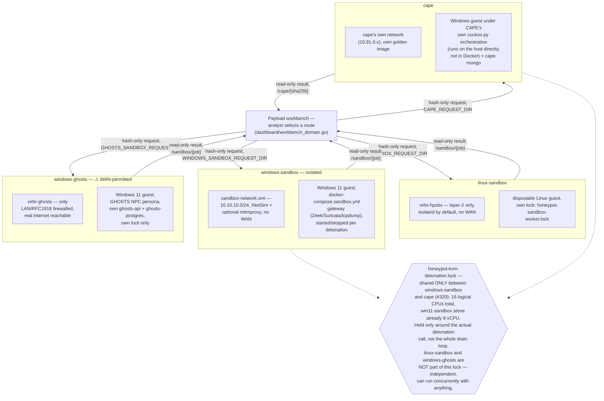
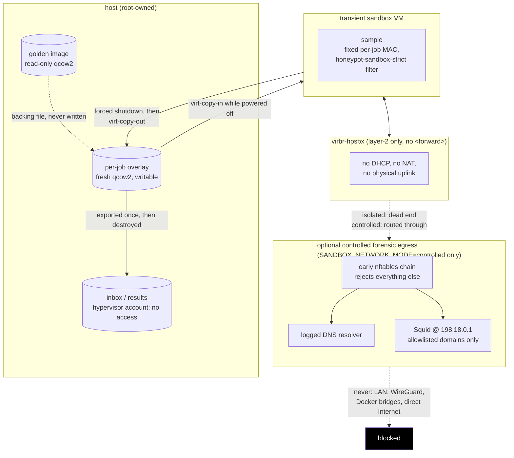

# Hard-isolated malware sandbox plan

The homeserver supports this design: Intel VT-x is enabled, `/dev/kvm` is
available, KVM is loaded, and the host exposes 84 IOMMU groups. The foundation
installer provisions system libvirt and the dedicated isolated network.

## Route selection and evidence return across four dynamic-detonation routes

The workbench's registry (`dashboard/workbench_domain.go`) offers four
routes to dynamic detonation, not one sandbox with options. Each is its own
guest, network, spool, and result format — this section is the canonical
side-by-side comparison; each route's own internal detail lives in its own
section below (Linux) or its own directory (`sandbox/windows/`,
`sandbox/ghosts/`, `sandbox/cape/`).



**The dashboard never calls libvirt, Docker, CAPE, or systemd directly for
any of the four routes.** Every route follows the same shared trust
boundary the workbench's own trust-boundary section describes: the browser
supplies a captured SHA-256 and an analyzer ID, the server writes an empty
`{sha256}.request` marker into that route's own spool directory, and a
separate host-owned worker (a systemd path-unit-triggered script for
Linux/Windows-isolated/GHOSTS, CAPE's own host-resident `cuckoo.py` process
for CAPE) claims the marker, drives the actual hypervisor, and writes a
read-only result back. No sample bytes, path, command, VM definition, or
credential ever crosses the dashboard/host boundary for any of the four.

**Only `windows-sandbox` and `cape` ever wait on each other; the other two
never wait on anything.** `sandbox/windows/run_pending.sh` and
`sandbox/cape/worker/cape-worker.py` share one host-wide
`honeypot-kvm-detonation.lock` (#320) — a real capacity constraint, not a
correctness one: both are KVM/QEMU domains on the same 16-logical-CPU host,
and `windows-sandbox`'s own guest is already configured for 8 vCPU. The
lock is held only around the actual detonation call, never the whole drain
loop, so an idle worker on either side never blocks the other. `linux-sandbox`
and `windows-ghosts` each hold only their own independent per-worker lock
(collapsing overlapping systemd path-unit triggers into one drain) and are
not part of the shared lock at all — either can run fully concurrently with
any of the other three.

**`windows-ghosts` is the one route that deliberately does not air-gap the
guest.** Every other route's guest reaches only a fake internet (INetSim,
or nothing at all in the fully isolated Linux/Windows default) — a sample's
C2 checkins and second-stage downloads go nowhere real. `windows-ghosts`'s
`virbr-ghosts` network firewalls off only LAN/RFC1918 ranges and leaves the
real internet reachable, specifically so a GHOSTS-driven persona's
real-infrastructure interactions are observable. This is a deliberate,
loud exception — see `docs/payload-analysis-workbench.md`'s own registry
table entry for the analyst-facing ⚠ warning this route carries — not an
isolation gap in the other three routes.

## Isolation boundary

Use KVM/QEMU virtual machines, never Docker containers, for dynamic execution.
Every analysis uses a fresh QCOW2 overlay backed by a read-only golden image.
The guest has no shared folders, clipboard, USB passthrough, host filesystem,
Docker socket, guest agent, or physical NIC. Secure Boot/TPM may be enabled for
Windows realism, but host secrets must never be enrolled into the guest.

`network.xml` defines a layer-2-only libvirt bridge with no `<forward>`, DHCP,
NAT, or physical uplink. The default `SANDBOX_NETWORK_MODE=isolated` therefore
cannot reach the host, LAN, WireGuard, Docker bridges, or Internet. Optional
controlled forensic egress adds only a DNS endpoint and an allowlisted
HTTP/HTTPS proxy at `198.18.0.1`; an early nftables chain rejects every other
host or forwarded packet. It never enables IP forwarding or libvirt NAT.

Samples are injected only while the analysis VM is powered off using
`virt-copy-in`/libguestfs. Results and PCAP are extracted only after forced
shutdown using `virt-copy-out`. The overlay is then destroyed. This avoids a
host-to-guest management service and prevents a compromised guest from pushing
data back to the host.



Isolated mode (the default) never routes past the bridge at all — the egress
subgraph above doesn't exist on the wire until an operator explicitly runs
`install-forensic-egress.sh` and switches to controlled mode, and even then
the nftables chain accepts only DNS and the allowlisted proxy, nothing else.

## Provisioning sequence

1. Run `sudo ./install-host.sh` interactively. This installs KVM, libvirt,
   virt-install, OVMF, swtpm, libguestfs, qemu-img, and nftables; creates
   `/var/lib/honeypot-sandbox`; defines the isolated network; and disables the
   default libvirt NAT network.
   On an existing installation, `sudo bash ./repair-permissions.sh` applies the
   narrow QEMU ACLs: golden images are read-only, disposable overlays are
   writable, and inbox/results remain inaccessible to the hypervisor account.
2. Prepare the signed Ubuntu 24.04 LTS base with
   `sudo bash ./prepare-linux-base.sh`. The script verifies Canonical's signed
   checksum with Ubuntu's packaged cloud-image keyring, creates a 20 GiB qcow2
   target, expands the actual guest root filesystem with `virt-resize`,
   customizes the image offline, disables SSH, and installs the observation
   tools. Merely enlarging the qcow2 container does not enlarge the filesystem
   and causes guest APT to report that `/var/cache/apt/archives` is full.
3. Validate that a test guest cannot reach the host's LAN, WireGuard addresses,
   Docker bridges, DNS resolvers, or Internet. Capture these tests as release
   gates before permitting malware execution.
4. Start a job with `sudo bash ./run-linux-sample.sh
   --i-understand-this-executes-untrusted-code /absolute/path/to/sample`. The
   runner injects one sample offline, boots with fixed CPU/RAM/time limits, and
   destroys the VM and overlay after offline result extraction.
5. The installed queue worker consumes only hashes and copies bounded JSON
   results to the dashboard. It never accepts arbitrary paths, libvirt XML, or
   shell arguments.
6. Optional: run `sudo bash ./install-forensic-egress.sh`. This installs
   host-side logged DNS and a Squid retrieval proxy outside Docker, switches
   `SANDBOX_NETWORK_MODE` to `controlled`, and permits only the domains in
   `forensic-egress-allowed-domains.txt`. DNS answers are real; both queries and
   responses are retained in the per-job capture. Direct guest connections,
   private destinations, arbitrary domains, and non-HTTP protocols stay blocked.

For a new or existing foundation, the complete Wine-enabled installation can
instead be run in the safe order with one command. It pauses an idle worker,
rebuilds the signed golden image, repairs permissions, installs controlled
egress, runs both smoke tests, and re-enables the queue only after success:

```bash
sudo bash /opt/stacks/apiary/sandbox/install-windows-forensics.sh
```

## Required operating controls

- Reserve at most 4 vCPU and 8 GiB RAM per analysis VM; run one job initially.
- Enforce a 10-minute hard timeout and kill QEMU if graceful shutdown fails.
- Store golden images on root-owned storage and verify SHA-256 before every job.
- Sign/validate result JSON and treat all guest-produced text as untrusted.
- Keep packet capture on the isolated bridge; never bridge `eno*`, `ens*`, or
  `wg0` into a sandbox domain.
- Patch QEMU/libvirt regularly and stop analysis during host upgrades.
- Back up golden images separately; never back up disposable overlays.

## Linux and Windows analysis results

Each job writes a root-only directory below
`/var/lib/honeypot-sandbox/results/`. It contains the SHA-256 and file type,
exit status, stdout/stderr, timestamped `trace/strace.*` logs, process/socket snapshots,
a before/after filesystem inventory, root-only host `network.pcap`, guest
`guest-network.pcap` (including resolver traffic), and a small
`report.json`. Guest-generated
content is untrusted and must never be rendered as HTML without escaping.

PE32/PE32+ samples also receive bounded `pefile`, `objdump`, ExifTool,
Authenticode, import/export, section-entropy, imphash, ASCII, and UTF-16LE
inspection. This provides deterministic headless binary triage without the
large Java/runtime cost of automatically launching Ghidra for every capture.
With the default `SANDBOX_WINDOWS_MODE=wine`, non-DLL PE files additionally execute through
headless Wine under the same unprivileged UID, strace, 120-second guest timeout,
and disposable-VM lifecycle. Wine is behavioral emulation and may differ from
native Windows; drivers and kernel-mode payloads remain static-analysis only.

The runner classifies content rather than trusting a filename (captures are
stored by SHA-256). PE executables route to Wine, PE DLLs remain static-only,
VBS/JScript/batch/PowerShell route through their Wine interpreters, shell,
Python, PHP, and Node.js scripts route through the matching Linux interpreter,
and ELF executables run natively under strace. Archives, documents, shared
libraries, plain text, and unknown binaries receive static collection without
being blindly executed. Rebuild the golden image after adding or changing
guest interpreters:

```bash
sudo bash sandbox/prepare-linux-base.sh
```

Before submitting any real capture, validate the complete lifecycle with the
repository's harmless fixture:

```bash
sudo bash sandbox/verify-linux-sandbox.sh
```

If a report says `host-timeout` or `guest-no-result`, the payload was not
successfully analyzed. Empty evidence in that report is an infrastructure
failure, not proof that the payload was inactive. The runner records the guest
serial console, QEMU log, domain state, and last host phase in the root-only
result and includes bounded diagnostics in the dashboard export. Rebuild the
base, reinstall the worker, and pass the harmless smoke test before accepting
new submissions:

```bash
sudo bash sandbox/prepare-linux-base.sh
sudo bash sandbox/repair-permissions.sh
sudo bash sandbox/install-worker.sh
sudo bash sandbox/verify-linux-sandbox.sh
```

Prepared cloud images have cloud-init and network-online waits disabled. The
sample guest uses offline injection and a fixed sandbox interface, so those
boot-time services are unnecessary and can otherwise prevent the one-shot
analysis service from starting before the host deadline.

After rebuilding the Wine-enabled base, validate Windows PE parsing, headless
Wine, both PCAPs, export, and overlay destruction with Wine's harmless Notepad
fixture:

```bash
sudo bash sandbox/verify-windows-sandbox.sh
```

## Captured-payload queue and dashboard export

After the smoke test passes, install the root-owned worker copies and systemd
path/timer units:

```bash
sudo bash sandbox/install-worker.sh
```

Queue only an existing hash-addressed Dionaea, Cowrie, or retained-script
capture. The resolver searches fixed stack-owned roots, recomputes SHA-256, and
never accepts a caller-provided filesystem path:

```bash
sudo honeypot-sandbox-submit <capture-hash-or-sha256>
```

An authenticated administrator can also select **Analyze** beside a capture on
the dashboard's `/payloads` or static-analysis page. The dashboard writes only
the validated hash into `/var/lib/honeypot-sandbox/requests/pending`; the
root-owned `honeypot-sandbox-web-requests.path` service resolves the capture and
submits it through the same deduplicating hash-only workflow. The container has
no Docker socket, libvirt, systemd, raw-result, or guest access.

Only one job runs at a time. Duplicate SHA-256 submissions are ignored. The
worker copies a payload into a root-only staging directory, uses a fresh qcow2
overlay, exports a size-bounded JSON summary, deletes the staging copy, and
retains raw guest output separately. The dashboard mounts only
`/var/lib/honeypot-sandbox/export` read-only and exposes it at `/sandbox`. Its
only write mount is the dedicated hash-request spool; it cannot access raw
traces or directly control the worker.

Both handoff and worker scripts drain their queue until it is empty. The
handoff explicitly starts the worker after a request burst, avoiding a
systemd-path race where the first job could start while later files were still
being written. Re-run `install-worker.sh` after updating these scripts; the
installer also starts both services so pre-existing queued work is resumed.

The dashboard shows worker state, queued/running/failed counts, searchable
completed reports, duration and timeout reasons, dynamic risk, static YARA
versus observed behavior, ATT&CK mappings, system calls, file changes, and
bounded packet summaries. Windows reports add PE identity, sections, imports,
categorized suspicious APIs, signature output, and extracted strings. DNS names
and bounded query/response summaries are visible. The worker copies raw host
and guest PCAPs up to 64 MiB into the read-only export directory; authenticated
administrators can download them from a result page for Wireshark/tshark.
Oversize PCAPs and complete syscall/raw-result directories remain root-only.

Every transient VM receives a fixed per-job MAC and the host-enforced
`honeypot-sandbox-strict` libvirt filter. It allows ordinary IPv4, IPv6, and ARP
analysis traffic on the isolated bridge while preventing source-MAC spoofing
and dropping other layer-2 protocols. `tcpdump` captures only that job's MAC on
`virbr-hpsbx`; a second guest-side capture includes loopback and resolver
traffic. The unprivileged sample cannot stop either root-owned capture. In
controlled mode the host endpoint exposes only DNS and the allowlisted proxy;
the bridge still has no forwarding path.

`/etc/default/honeypot-sandbox` configures raw-result (30 days) and sanitized
export (180 days) retention. `honeypot-sandbox-cleanup.timer` applies retention
daily. Failed requests remain root-only for 30 days; orphaned staged samples
expire after seven days.

The guest has 2 vCPUs and 3 GiB RAM by default. Samples execute as a locked,
unprivileged UID with `no_new_privs`, a 120-second guest timeout, and a separate
240-second host deadline. There are no shared folders, guest agent, graphical
console, clipboard, sound device, or host block devices. Every job creates a
new overlay and transient domain, then destroys and undefines both after
powered-off extraction. The default network has no working DNS, gateway, NAT,
or physical uplink; controlled mode provides only the restricted services
described above.

This substantially reduces risk but cannot eliminate hypervisor or kernel
escape risk. Keep QEMU/libvirt and firmware patched, never attach
`virbr-hpsbx` to a physical interface, and use a physically separate analysis
host for threats that exceed this boundary. Wine does not add a Windows image
or license to this repository and is not a substitute for a separately licensed
native-Windows malware lab.
