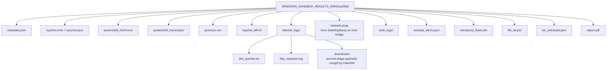
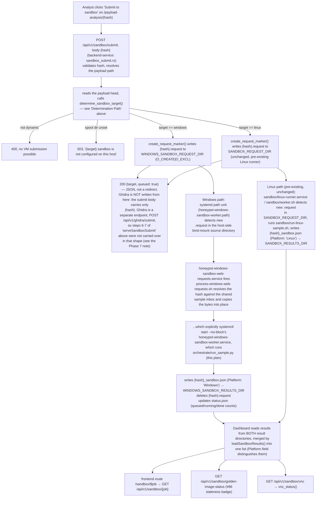

# Windows 11 Malware Sandbox — Golden Image Implementation Plan

> **Design record, not current-behaviour documentation.** Every
> `dashboard/*.go` reference below, the Go code blocks, and the route column
> of the "Wiring Pattern" table describe the Go dashboard deleted at #1628.
> Phase 7's decisions were re-implemented in the Rust `backend-service`
> (`arcane/home/honeypot-dashboard/backend-service/src/`) and the
> `frontend-next` routes; the route table is `main.rs` (`POST
> /api/v1/sandbox/submit`, `GET /api/v1/sandbox/{job}`, `GET
> /api/v1/sandbox/golden-image-status`, `GET /api/v1/sandbox/vnc`, `POST
> /api/v1/ghidra/submit`, `GET /api/v1/ghidra/{sha}`), and the host-half
> operator notes live in [`runner/README.md`](runner/README.md). The plan's
> binding content — the spool-file trust boundary, the Windows/Linux
> determination path, the #358 golden-image-over-snapshot decision, the
> in-guest detonation chain — carried over and still holds. Read the Go
> paths as history, not as somewhere to write code. The host-side
> systemd/spool specifics in §7.2 and §7.3 have drifted further than that
> and are corrected inline.
>
> **Status**: Shipped. Phase 7's dashboard half is implemented, and the
> host half now has its orchestrator, spool worker, and systemd units. Every
> build artifact Phases 1–4 describe is present in the tree, and the live-host
> step this file used to leave open is now closed: `win11-analysis.qcow2` has
> been built on this host and rebuilt several times — #1128 fixed a rebuild
> breaker and verified the fix against a real rebuild ("the VM now boots and
> reaches the WinRM-wait stage"), and #957's screen-resolution fix was
> confirmed live in a running guest. The `win11-sandbox` domain therefore
> exists and the worker's `revert` works, rather than revert-failing on every
> request. There is no `GOLDEN_READY` snapshot — see the revised Golden Image
> vs Snapshots decision below and #358 for why.  
> **Last updated**: 2026-09-27  
> **Host platform**: KVM + QEMU + libvirt + docker-compose (NO VMware)  
> **Phase 1 tracking**: [#47](https://github.com/Xore/APIARY/issues/47)
> — one issue per remaining step, each with its own verification and failure
> modes. Start there rather than from this document if you are picking the
> work up cold.
>
> **Decide [#94](https://github.com/Xore/APIARY/issues/94) before
> building the image.** Every WinRM and SMB step below assumes a credentialed
> management channel into a running infected guest, and the credentials and the
> share are baked into the golden image — which makes this cheap to settle now
> and expensive to settle later. [#91](https://github.com/Xore/APIARY/issues/91)
> covers the image-side defects the same channel depends on.

---

## Host Constraints

The analysis host runs **KVM/QEMU/libvirt** and **docker-compose** only.
- No VMware Workstation, no VirtualBox, no Hyper-V
- No GitHub Actions — the sandbox is triggered **from the dashboard**, not CI
- All VM lifecycle (create, revert, start, stop, status) via `virsh` / `qemu-img`.
  There is no snapshot path — see the Golden Image vs Snapshots decision below
  and `setup/kvm_manage.sh`'s own header for why.
- Gateway services run as **Docker Compose services** (INetSim, Zeek, Suricata, mitmproxy)
- Golden image built automatically with **Packer + QEMU builder**
- Orchestrator drives VM lifecycle through `virsh` / `qemu-img` subprocesses
  (see Phase 5). It does **not** use the `libvirt` Python API — an earlier
  revision of this constraint said `libvirt-python`, which contradicted
  Phase 5 and was never true. In this repository `import libvirt` appears
  exactly once, in CAPE's own vendored `sandbox/cape/capev2-overrides/modules/machinery/capekvm.py`.
- Results written to a spool directory the dashboard reads — **no outbound network, no git push**

---

## Architecture Overview

```mermaid
flowchart TD
    Host["KVM Host (Linux)"]

    Host --> Net["libvirt isolated network: virbr-sandbox (10.10.10.0/24)<br/>NO internet routing — host firewall drops all forward to WAN"]

    Host --> Guest["Windows 11 KVM Guest (10.10.10.2)"]
    Guest --> Sysmon["Sysmon (SwiftOnSecurity config)"]
    Guest --> FakeNet["FakeNet-NG (intercepts all outbound traffic on the guest)"]
    Guest --> PSLog["PowerShell ScriptBlock logging (Event 4104)"]
    Guest --> ETW["ETW / ProcMon / Regshot"]
    Guest --> WinRM["WinRM (port 5985) — remote orchestration from host (see #94)"]

    Host --> DockerNet["Docker network: `sandbox` (macvlan, internal: true, 10.10.10.0/24)"]
    DockerNet --> Inetsim["inetsim (10.10.10.1) — fake DNS/HTTP/SMTP/FTP/IRC"]
    DockerNet --> Mitmproxy["mitmproxy (10.10.10.1:8080) — SSL intercept, HTTP/S MITM"]
    DockerNet --> Zeek["zeek — reads tap/mirror of virbr-sandbox"]
    DockerNet --> Suricata["suricata — IDS on virbr-sandbox"]

    Host --> Worker["Host-side sandbox worker (systemd path unit)"]
    Worker --> Watch["Watches WINDOWS_SANDBOX_REQUEST_DIR for {hash}.request files<br/>written by the dashboard (sandbox_submit.rs) — routed here only<br/>after the dashboard's determination path (see below) classifies<br/>the payload as Windows; everything else goes to the pre-existing<br/>Linux runner (sandbox/linux-runner.service, sandbox/worker.sh)<br/>watching the original SANDBOX_REQUEST_DIR"]
    Worker --> Revert["destroy + fresh CoW clone from golden image + start<br/>(kvm_manage.sh revert / run_sample.py revert_to_golden() —<br/>not a virsh snapshot, see #358)"]
    Worker --> Detonate["WinRM → copy sample, start tools, detonate"]
    Worker --> Wait["Wait observation window"]
    Worker --> Collect["Collect artifacts via SMB / virsh guest-agent"]
    Worker --> Write["Write {hash}_sandbox.json → WINDOWS_SANDBOX_RESULTS_DIR<br/>(dashboard reads this; no git push, no outbound connection)"]
```



---

## Wiring Pattern — mirrors Ghidra dashboard integration

The sandbox follows the **exact same spool-file pattern** as the Ghidra
integration (`docs/analysis/ghidra/DASHBOARD_INTEGRATION_PLAN.md`):

| Concern | Sandbox (this plan) | Ghidra (reference) |
|---|---|---|
| Trigger | `POST /sandbox/submit` → determines Windows vs Linux (see below), writes `{hash}.request` to `WINDOWS_SANDBOX_REQUEST_DIR` or `SANDBOX_REQUEST_DIR` accordingly, plus optionally to `GHIDRA_REQUEST_DIR` if the submit form's Ghidra checkbox was set | `POST /ghidra/submit` → writes `{sha256}.request` to `GHIDRA_REQUEST_DIR` |
| Worker | Host-side systemd path unit (`honeypot-windows-sandbox-worker.path`), never run by the dashboard | Host-side systemd path unit (`honeypot-ghidra-worker.path`) |
| Results | Worker writes `{hash}_sandbox.json` to `SANDBOX_RESULTS_DIR`; dashboard only reads | Worker writes `{sha256}_ghidra.json` to `GHIDRA_RESULTS_DIR`; dashboard only reads |
| Trust boundary | Dashboard never touches Docker, libvirt, or the VM directly | Same |
| List page | *none* — the Go `GET /sandbox` list page and its `{{define "sandbox"}}` template were not re-landed; `frontend-next` has `/sandbox/$job` and `/sandbox/vnc` only | *none* — `frontend-next` has `/ghidra/$sha` only |
| Detail page | `GET /sandbox/{job}` | `GET /ghidra/{sha256}` |
| JSON API | `GET /api/sandbox`, `/api/sandbox/{job}` | `GET /api/ghidra`, `/api/ghidra/{sha256}` |
| Export | `GET /export/sandbox/{job}` (bundle download) | `GET /export/ghidra/{sha256}` |

Current forms of the routes that do exist are the `/api/v1/…` ones listed
in the banner above. The three right-hand columns were re-checked on
2026-09-27: the list page, the `/api/…` JSON tier and the `/export/…`
bundle routes have **no** Rust counterpart — `main.rs` exposes no
`/api/v1/export/sandbox` or `/api/v1/export/ghidra` route, and the only
`/api/v1/export/*` handlers are the six CSV/JSON event, command, IP,
campaign, cluster and history exports plus `/api/v1/ip-block-export`.

No new trust boundary is introduced. The dashboard container stays
unprivileged and **never** calls `virsh`, `docker`, or WinRM directly.

---

## Determination Path — Windows VM vs Linux VM

Today `/sandbox/submit` writes one request to one spool directory and
assumes a single backend. With two VM backends (this Windows plan, and the
pre-existing Linux runner at `sandbox/linux-runner.service` /
`sandbox/run-linux-sample.sh`), the dashboard needs to pick the right one
**per submission**, using content the dashboard already computes for every
captured payload today.

### Signal: reuse `classifyPayload` — no new classifier

`classifyPayload(data []byte) payloadClassification` — now
[`payload_kind.rs`](../../../arcane/home/honeypot-dashboard/backend-service/src/payload_kind.rs)'s
`classify_payload` — already sniffs magic bytes (`MZ` → `debug/pe`,
`\x7fELF` → `debug/elf`, script shebangs/headers) and returns a `Platform`
of `"Windows"`, `"Linux"`, or `"Cross-platform"` for every kind of payload
the dashboard already stores — this is the exact same classification
already shown on the payload detail page ("Windows PE forensics" card,
etc). Routing needs no new detection logic, only a decision on top of the
existing field.

| `classifyPayload(...).Code` | `.Platform` | Routed to |
|---|---|---|
| `pe-exe` (Windows PE executable) | `Windows` | **Windows VM** (this plan) |
| `pe-dll` (Windows DLL) | `Windows` | **Windows VM** — DLL is loaded via `rundll32`/a loader stub in the guest, not double-clicked |
| `vbscript`, `batch`, `powershell`, `jscript` | `Windows` | **Windows VM** — these need `cscript.exe`/`cmd.exe`/PowerShell/Wine-equivalents that only exist in the Windows golden image |
| `elf-exe` (Linux ELF executable) | `Linux` | **Linux VM** (pre-existing `sandbox/run-linux-sample.sh` path) |
| `elf-library` (Linux `.so`) | `Linux` | **Linux VM** — static analysis only, `Dynamic: false`, no detonation either way |
| `shell`, `python`, `javascript`, `php` | `Linux` / `Cross-platform` | **Linux VM** — the existing Linux runner already detonates these under `strace`; Windows adds nothing to `bash`/CPython/Node.js analysis |
| anything with `Dynamic: false` (documents, static-only libraries) | — | **No VM at all** — static analysis only, matches existing `classifyPayload` behavior (`pdf`, `ole`, `pe-dll`, `elf-library`) |

### Determination function (`dashboard/sandbox_submit.go`)

Now `determine_sandbox_target()` in
[`sandbox_submit.rs`](../../../arcane/home/honeypot-dashboard/backend-service/src/sandbox_submit.rs).
It returns `Option<&'static str>` rather than a `(target, dynamic)` pair —
`None` is the "not dynamic, no VM submission possible" answer, which is the
Go function's `dynamic == false` return folded into one. It still returns
only `"windows"` or `"linux"`: a `"ghosts"` arm exists, but in the sibling
`sandbox_request_dir()` rather than here, because the GHOSTS route is
WAN-permitted and opt-in only through the Workbench, so classification must
never select it.

```go
type sandboxTarget string

const (
	targetWindows sandboxTarget = "windows"
	targetLinux   sandboxTarget = "linux"
)

// determineSandboxTarget classifies the payload the same way the payload
// detail page already does, and picks a VM backend. Only Windows-native
// executables/DLLs/scripts need the Windows golden image; everything else
// — including cross-platform scripts — already detonates correctly on the
// existing Linux runner.
func determineSandboxTarget(data []byte) (target sandboxTarget, dynamic bool) {
	c := classifyPayload(data)
	if !c.Dynamic {
		return "", false // static-only payload — no VM submission possible
	}
	if c.Platform == "Windows" {
		return targetWindows, true
	}
	return targetLinux, true // Linux and Cross-platform both run on the Linux VM
}
```

### Updated `serveSandboxSubmit` flow

1. Validate `hash`, confirm the payload exists via `s.payloadPath(hash)` —
   unchanged.
2. Read the payload (already required to classify it for the payloads
   page), call `determineSandboxTarget(data)`.
3. If `dynamic == false`: reject with `400` ("this payload has no dynamic
   detonation path — see its static analysis instead") rather than queuing
   a VM run that would never do anything.
4. If `target == targetWindows`: write `{hash}.request` to
   `WINDOWS_SANDBOX_REQUEST_DIR` (this plan's worker, Phase 7).
5. If `target == targetLinux`: write `{hash}.request` to the existing
   `SANDBOX_REQUEST_DIR` (unchanged — the pre-existing Linux runner already
   watches this directory; no changes needed on that side at all).
6. If the submit form's new **Ghidra** field (below) was checked, also
   write `{hash}.request` (well, `{sha256}.request`) to `GHIDRA_REQUEST_DIR`
   per `docs/analysis/ghidra/DASHBOARD_INTEGRATION_PLAN.md` — independent of
   which VM was chosen, since Ghidra is static analysis and applies to any
   binary/DLL regardless of which detonation backend runs it.
7. Redirect to `/payloads?analysis=queued&hash=…&target={target}` so the
   payloads-page notice can say e.g. "Sandbox analysis (Windows VM)
   requested for …" instead of a generic message.

### New field + dedicated button: Ghidra selection on the payloads page

Each payload row gets **two** independent ways to queue Ghidra, covering
both the "detonate and reverse-engineer together" case and the "static
analysis only, no VM at all" case:

1. A **checkbox on the sandbox submit form** — queues Ghidra alongside
   whichever VM the determination path picked.
2. A **dedicated "Send to Ghidra" button** — queues Ghidra on its own,
   with no VM submission at all (e.g. for the `Dynamic: false` payloads
   the determination path rejects from VM submission — DLLs, documents,
   static libraries — Ghidra is often the *only* applicable analysis).

This is the same standalone button described in
`docs/analysis/ghidra/DASHBOARD_INTEGRATION_PLAN.md` Phase 3 — shown here
alongside the sandbox form so the two entry points are visibly distinct
on the page rather than one being buried inside the other:

```html
<div class="payload-actions">
  <form method="post" action="/sandbox/submit" class="inline">
    <input type="hidden" name="hash" value="{{.SHA256}}">
    <label class="checkbox">
      <input type="checkbox" name="ghidra" value="1">
      Also run Ghidra static analysis
    </label>
    <button type="submit" class="btn-sm">Submit to sandbox</button>
  </form>

  <form method="post" action="/ghidra/submit" class="inline">
    <input type="hidden" name="hash" value="{{.SHA256}}">
    <button type="submit" class="btn-sm btn-secondary">Send to Ghidra</button>
  </form>
  {{if .GhidraResult}}<a href="/ghidra/{{.SHA256}}" class="badge">Ghidra: {{.GhidraResult.RiskLabel}}</a>{{end}}
</div>
```

Both paths converge on the same spool and worker — there is exactly one
way Ghidra analysis gets queued under the hood
(`GHIDRA_REQUEST_DIR`/`serveGhidraSubmit` from
`docs/analysis/ghidra/DASHBOARD_INTEGRATION_PLAN.md` Phase 2), just two UI
entry points into it:

- `serveSandboxSubmit` reads `r.FormValue("ghidra") == "1"` and, if set,
  writes the Ghidra spool entry itself as one extra step alongside the VM
  request (step 6 above).
- The dedicated button posts directly to the existing `/ghidra/submit`
  route (`serveGhidraSubmit`) — no changes needed there at all.

No new permission check is needed for either — both are gated by the same
`requireAdmin` + `sameOriginRequest` checks already guarding their
respective handlers, and both write with the same idempotent
`O_CREATE|O_EXCL` pattern, so clicking both the checkbox and the button
(or double-clicking either) never queues a duplicate run.

The dashboard never decides *which* VM Ghidra needs — Ghidra's headless
container analyzes the binary directly and doesn't care which detonation
backend (if any) also ran it, so Ghidra submission (via either entry
point) is entirely independent of the Windows/Linux determination above.

---

## Research: Golden Image vs Snapshots

See full comparison:
[`docs/kvm-snapshot-vs-golden-image.md`](../../kvm-snapshot-vs-golden-image.md)

### TL;DR for this project

| | Golden Image (qcow2 base) | KVM Snapshot (internal) |
|---|---|---|
| **Reset time** | ~1-2min (fresh CoW clone + cold boot) | ~5-10s (virsh snapshot-revert) |
| **Reproducibility** | 100% — always byte-identical | 99% — depends on snapshot age |
| **Storage** | 1× full image + thin clones | 1 image + delta chains |
| **Rebuild** | Packer re-runs from scratch | Manual or scripted |
| **Our approach** | Packer builds base qcow2, fresh clone every reset | Not usable here — see below |

**Decision, revised (#358)**: the original plan was `virsh` snapshot-revert
on top of the Packer-built base for fast (5-10s) reverts. That turned out
not to be usable on this host: this domain's `<cpu migratable='off'/>`
(deliberate, for anti-VM-detection CPU fidelity) blocks memory-state
snapshots outright, and disk-only snapshots hit a separate, reproducible
QEMU/libvirt bug on the resulting multi-layer backing chain — a freshly
spawned qemu process fails to open the golden image even though file
permissions are provably fine. Actual approach: every reset destroys the
domain, deletes the per-run CoW clone, and creates a fresh one from the
golden image (`kvm_manage.sh revert` / `run_sample.py`'s
`revert_to_golden()`). Cold boot every run (~1-2min) instead of a
memory-state resume, but with no snapshot-machinery failure mode.

---

## Phase 0 — Host Prerequisites

```bash
# KVM / QEMU / libvirt
apt install -y qemu-kvm libvirt-daemon-system libvirt-clients virtinst \
    qemu-utils virt-manager bridge-utils genisoimage

# Packer (HashiCorp)
curl -fsSL https://apt.releases.hashicorp.com/gpg | gpg --dearmor \
    -o /usr/share/keyrings/hashicorp.gpg
echo "deb [signed-by=/usr/share/keyrings/hashicorp.gpg] \
https://apt.releases.hashicorp.com $(lsb_release -cs) main" \
    > /etc/apt/sources.list.d/hashicorp.list
apt update && apt install -y packer
packer plugins install github.com/hashicorp/qemu

# PXE boot staging (packer/pxe/prepare-pxe.sh, #288/#406) -- builds and
# signs the custom ipxe.efi this template's install-time boot depends on.
# Confirmed missing on a from-scratch host during the 2026-08-05 rebuild:
# packer/pxe/prepare-pxe.sh fails partway through without these.
apt install -y p7zip-full python3-virt-firmware sbsigntool

# Python deps for orchestrator
pip install pywinrm python-evtx lxml requests smbprotocol

# Docker Compose (for gateway services)
apt install -y docker-compose-plugin

# User permissions -- kvm specifically is required to run `packer build`
# (or any direct qemu-system-x86_64 invocation) as a non-root user; its
# absence fails late and unhelpfully ("qemu-system-x86_64: Could not access
# KVM kernel module: Permission denied"), confirmed live 2026-08-05.
usermod -aG kvm,libvirt,docker $USER
```

### Isolated libvirt Network

The network is defined by [`setup/sandbox-network.xml`](../../../sandbox/windows/setup/sandbox-network.xml)
— read it there rather than from a copy here. The sketch this section used to
carry had neither the DHCP reservation nor the DNS option, and a network
defined from it would come up without the pinned `10.10.10.2` lease that
`VM_HOST` depends on.

The three things that file gets right, and that any replacement must too:

| | Why |
|---|---|
| No `<forward>` element | Its absence *is* the isolation — no NAT, no route to WAN. Never add it "temporarily". |
| One-address DHCP pool, pinned to the guest MAC | `VM_HOST=10.10.10.2` is always correct, so the orchestrator never discovers a lease. A second guest failing to get an address is the desired outcome: two samples on one bridge contaminate each other's network evidence. |
| `dhcp-option=6,10.10.10.1` — not `<dns><forwarder/></dns>` | The guest must query INetSim *directly*. A forwarder would route DNS through libvirt's dnsmasq, a host process, which cannot reach a macvlan container — every lookup would SERVFAIL and every sample would go quiet. |

```bash
virsh net-define /etc/libvirt/qemu/networks/sandbox.xml
virsh net-autostart sandbox
virsh net-start sandbox

# Block all forwarding from sandbox bridge to WAN (belt + suspenders)
iptables -I FORWARD -i virbr-sandbox -o eth0 -j DROP
iptables -I FORWARD -i eth0 -o virbr-sandbox -j DROP
```

---

## Phase 1 — Automated Golden Image with Packer + QEMU

See: [`packer/win11-analysis.pkr.hcl`](../../../sandbox/windows/packer/win11-analysis.pkr.hcl)

Packer automates the full Windows 11 install + hardening + logging config
into a single reproducible `qcow2` image.

### Build
```bash
cd sandbox/windows/packer

# Download Windows 11 evaluation ISO first
# https://www.microsoft.com/en-us/evalcenter/evaluate-windows-11-enterprise
# Place at: /isos/Win11_Eval.iso

packer init win11-analysis.pkr.hcl
packer build win11-analysis.pkr.hcl
# Output: /golden-images/win11-analysis.qcow2  (~25-35 GB)
# Build time: a few hours (Windows install/OOBE + the provisioner chain below
# and its settle-restart; no multi-hour FLARE-VM install anymore)
```

### What Packer Does
The chain below mirrors the provisioner list in `win11-analysis.pkr.hcl`
exactly — add/remove there first, then update this enumeration.

1. Boot Windows 11 ISO with `autounattend.xml` (fully unattended install)
2. WinRM auto-enabled via `SetupComplete.cmd` in autounattend
3. Stage config into the guest (`provisioner "file"`):
   `config/fakenet.ini` → `C:/Windows/Temp/honeypot_fakenet.ini`, plus
   `config/defaultFiles/` — run_sample.py points FakeNet's `-c` at these, so
   they must be baked in before detonations
4. `sandbox/windows/packer/scripts/01-hardening.ps1` — network config, disable Defender/WU/
   telemetry/UAC/firewall, install Chocolatey (phases 1–7)
5. windows-restart to settle pending reboots before tooling installs
6. `sandbox/windows/packer/scripts/04-tools.ps1` — runtime dependencies via Chocolatey (phase 8);
   Sysmon + SwiftOnSecurity config pinned by commit **and** SHA-256 (phase
   9); PS ScriptBlock/Module/Transcription logging, process-creation
   auditing, event-log sizing (phase 10); FakeNet-NG install and the staged
   ini/defaultFiles moved into place (phase 11); Regshot (11b); QEMU guest
   agent (phase 12); analysis directories
7. `sandbox/windows/packer/scripts/09-vcredist.ps1` — standalone VC++ redistributables (#368)
8. `sandbox/windows/packer/scripts/12-display-resolution.ps1` — real desktop resolution at 1080p
9. `sandbox/windows/packer/scripts/10-loldrivers.ps1` — BYOVD bait drivers + blocklist disabled
10. `sandbox/windows/packer/scripts/05-decoy-content.ps1` — decoy documents, SMB share, Recent-files
    entries (anti-evasion cosmetics only)
11. `sandbox/windows/packer/scripts/06-chrome-history.ps1` — aged Chrome browsing history seeded
    into the History SQLite DB (#292)
12. `sandbox/windows/packer/scripts/07-living-persona.ps1` — mouse/persona daemon simulating a
    user at the keyboard (#290)
13. `sandbox/windows/packer/scripts/08-traffic-noise.ps1` — taggable background browsing traffic
    generator (#291)
14. `sandbox/windows/packer/scripts/11-detonation-orchestrator.ps1` — in-guest detonation staging
    consumed by run_sample.py over WinRM (#490)
15. Final inline cleanup — EnablePrefetcher=3, DNS pinned to INetSim at
    10.10.10.1, event logs and temp dirs cleared, build timestamp written
16. Sysprep + shutdown → Packer exports `win11-analysis.qcow2`

(FLARE-VM was part of this chain through 2026-08-02 and is deliberately
gone — see the removal note in `win11-analysis.pkr.hcl` itself.)

### Rebuilding
```bash
# Rebuild from scratch
packer build -force win11-analysis.pkr.hcl

# There is deliberately no "update just the logging config without a rebuild"
# virt-customize step here. An earlier revision of this plan had one, uploading
# a sysmon_config.xml that does not exist in the repo: 04-tools.ps1 fetches the
# config at build time from raw.githubusercontent.com, pinned to a commit SHA and
# verified against a recorded sha256 (#86). To change it, re-pin both values in
# 04-tools.ps1 and rebuild.
```

---

## Phase 2 — VM Lifecycle with virsh

See: [`setup/kvm_manage.sh`](../../../sandbox/windows/setup/kvm_manage.sh)

```bash
# Import golden image as a new VM (thin clone — fast, uses CoW)
qemu-img create -f qcow2 -F qcow2 \
    -b /golden-images/win11-analysis.qcow2 \
    /vms/win11-sandbox.qcow2

# Define VM from template XML
virsh define sandbox/windows/packer/win11-kvm.xml

# First boot → verify it boots and WinRM answers
virsh start win11-sandbox
# ... wait for boot, WinRM ready ...

# Reset before each detonation run: destroy + fresh CoW clone from the
# golden image + start. Not a virsh snapshot revert -- this domain's
# <cpu migratable='off'/> (deliberate, for anti-VM-detection fidelity)
# blocks memory-state snapshots outright, and disk-only snapshots hit a
# separate, reproducible QEMU/libvirt bug on the resulting multi-layer
# backing chain (#358). The golden image is never written to, so there's
# nothing to snapshot -- every reset just makes a fresh clone.
sandbox/windows/setup/kvm_manage.sh revert
# Cold boot, ~1-2 minutes
```

Before trusting a freshly-reset guest as an acceptance point, run the pafish/
al-khaser verification pass (#298) against the freshly-booted guest — see
[`docs/vm-detection-verification.md`](vm-detection-verification.md).
Everything upstream of this (SMBIOS/CPUID spoofing, Defender/telemetry
disables) is reasoned-through hardening against *known* checks; this is the
only step that empirically confirms it holds up in a real booted guest.

---

## Phase 3 — Windows 11 Hardening for Malware Analysis

Implemented in
[`packer/scripts/`](../../../sandbox/windows/packer/scripts/) — ten provisioner
scripts (`01-hardening`, `04-tools`, `05-decoy-content`, `06-chrome-history`,
`07-living-persona`, `08-traffic-noise`, `09-vcredist`, `10-loldrivers`,
`11-detonation-orchestrator`, `12-display-resolution`; the numbering has
gaps because it tracks the Packer phase each one serves), the hardening and
anti-evasion phases run at image-build time, not as a separate script.
(Earlier revisions of this plan named a `setup/harden_analysis_vm.ps1`
that was never written.)

### 3.1 Disable Noise Sources
```
✓ Windows Defender real-time + cloud + MAPS disabled
✓ Windows Update disabled (service + registry + GPO)
✓ Windows Error Reporting disabled
✓ Cortana / Search indexing disabled
✓ All telemetry disabled (DiagTrack service + registry)
✓ Windows Firewall disabled (FakeNet-NG handles traffic)
✓ UAC disabled
✓ SmartScreen disabled
✓ Action Center / notifications disabled
✓ OneDrive removed
✓ Memory integrity (HVCI) disabled
```

### 3.2 Enable Maximum Telemetry (Analyst Side)
```
✓ Sysmon 64 with SwiftOnSecurity config (fetched at build time, pinned to a
    commit SHA and verified against a recorded sha256 — 04-tools.ps1, #86)
✓ PowerShell ScriptBlock logging (Event 4104)
✓ PowerShell Module logging (Event 4103)
✓ PowerShell Transcription to C:\PSTranscripts\
✓ Process creation auditing (Event 4688 + full cmdline) — `auditpol /set
    /subcategory:'Process Creation'` plus ProcessCreationIncludeCmdLine_Enabled
✗ Object access auditing (Event 4663) — not implemented
✗ Registry auditing (Event 4657) — not implemented
✓ All event log sizes expanded to 500 MB (Sysmon/Operational,
    PowerShell/Operational, Security, System, Application)
✓ FakeNet-NG intercepting all outbound traffic
✓ QEMU guest agent (for host-side artifact collection)
```

`Process Creation` is the **only** audit subcategory this build touches;
`04-tools.ps1` has exactly one `auditpol` call. The two `✗` lines were
carried here as done and are not — nothing in `sandbox/windows/packer/`
enables either subcategory.

### 3.3 Anti-Evasion (Make VM Look Real)
```
✓ Hostname: ACP-FIN0142, a business-shaped decoy, not a DESKTOP-* pattern
    (autounattend.xml; it was DESKTOP-AN4LY5T, then DESKTOP-JK3PLQ2, before
    #293 — that shape is exactly what the guest is meant to stop looking like)
✓ Username: a single `analyst` account, matching the WinRM/autologon account
    the provisioners and run_sample.py all use — not a rotating persona set
✓ Populate: Documents with decoy PDFs/RTF/CSV (05-decoy-content.ps1)
✓ Install: Chrome (06-chrome-history.ps1, which also seeds its history) and
    Sysinternals/Regshot/FakeNet/QEMU guest agent. Phase 8's "common software"
    is runtimes, not desktop apps: vcredist-all, dotnetfx, dotnet-6.0/8.0
    desktopruntime, javaruntime, silverlight
✓ Browser history: inject fake history entries (06-chrome-history.ps1)
✓ Recent files: real .lnk shortcuts (WScript.Shell), back-dated 1-60 days
✓ Disk: 90 GB (disk_size = "90000" — malware checks disk size)
✓ RAM: 16 GB at build (memory = "16384"); the detonation domain runs
    16 GB with 8 GB current
✓ CPU: 12 vCPU at build (cpus = "12"); the detonation domain runs 8 vCPU
✓ Screen: 1920x1080 (win11-kvm.xml <video><resolution>, plus #957's
    GraphicsDrivers registry fix — the resolution hint alone was never enough)
✓ QEMU CPU model: host-passthrough (exposes real CPU, not QEMU)
✓ DMI/SMBIOS: win11-kvm.xml's <sysinfo> block, not a -cpu vendor= mask —
    the template passes no vendor override
✓ No QEMU-specific devices visible
✓ Disk serial: WD-WX31A74K3593 (matches win11-kvm.xml)
✓ MAC address: 00:1a:a0:3c:4d:5e — the Intel OUI, and the same address
    sandbox-network.xml pins the DHCP lease to
✓ BIOS: OVMF with patched vendor strings (SMBIOS vendor is
    "American Megatrends Inc.")
✗ Uptime: > 3 days before analysis — not implemented; nothing in the
    provisioner chain ages the image
✗ > 50 processes running at analysis time — not implemented as a
    build-time step either
```

The two `✗` lines, like the audit lines in 3.2, were carried here as done.
Nothing in `sandbox/windows/packer/` provisions either. Both are measurable
after the fact rather than buildable, and
[`vm-detection-verification.md`](vm-detection-verification.md) plus the
`vm-detection-results/` runs are how this repo actually checks them.

### 3.4 KVM-Specific Anti-Detection
```xml
<!-- In VM XML — mask QEMU/KVM from guest. Source of truth is
     sandbox/windows/packer/win11-kvm.xml; the values below are its own. -->
<cpu mode='host-passthrough'>
  <feature policy='disable' name='hypervisor'/>
</cpu>
<features>
  <acpi/><apic/>
  <kvm><hidden state='on'/></kvm>   <!-- hides KVM CPUID leaf -->
  <vmport state='off'/>              <!-- disables VMware port -->
</features>

<!-- Disk: AHCI with a custom serial. NOT virtio-blk — the golden image
     installs on a virtio disk only with a driver the answer file does not
     carry, and a virtio controller is itself a loud "you are in a VM" tell.
     The guest enumerates it as sata0-0-0 even though the bus is ide. -->
<disk type='file' device='disk'>
  <driver name='qemu' type='qcow2' cache='none' io='native' discard='unmap'/>
  <serial>WD-WX31A74K3593</serial>
</disk>

<!-- NIC: e1000e with the Intel OUI MAC that sandbox-network.xml also pins -->
<interface type='network'>
  <mac address='00:1a:a0:3c:4d:5e'/>
  <model type='e1000e'/>
</interface>
```

---

## Phase 4 — Docker Compose Gateway Services

See: [`docker-compose.sandbox.yml`](../../../docker-compose.sandbox.yml)

All gateway services run as Docker containers on the same host, connected
to the `virbr-sandbox` bridge. No container has outbound internet access.

```yaml
# Key services (all on the "sandbox" macvlan network, no WAN routing):
inetsim:    # fake DNS/HTTP/HTTPS/SMTP/FTP/IRC — responds to everything
mitmproxy:  # SSL intercept of HTTP/S, logs full request/response + bodies
zeek:       # protocol analysis (conn.log, dns.log, http.log, files.log)
suricata:   # IDS alerts, ET rules
```

**#510**: only `zeek`/`suricata`/`tcpdump` are actually started per detonation
(`start_gateway_services`/`stop_gateway_services` in `orchestrate/run_sample.py`,
called from `detonate_inguest()`), pointed at that sample's own result
directory via `SANDBOX_RESULTS_DIR` so pcap/logs land where
`generate_report.py` already reads them instead of colliding in the compose
file's static `./sandbox/results/current` default. `inetsim` is not started
automatically — in-guest FakeNet-NG already supersedes its job — and
`mitmproxy` stays manual/opt-in (`--profile mitm`) as before.

---

## Phase 5 — Orchestration (KVM / libvirt)

See: [`orchestrate/run_sample.py`](../../../sandbox/windows/orchestrate/run_sample.py)

The orchestrator is invoked by the **host-side systemd worker** (Phase 7),
never directly by the dashboard. It shells out to `virsh` (see `virsh()` in
`orchestrate/run_sample.py` — not `libvirt-python`):

```python
# Reset to golden: destroy, delete the per-run CoW clone, make a fresh one
# from the golden image, start. Not a snapshot revert -- see #358 for why.
subprocess.run([VIRSH_PATH, '--connect', LIBVIRT_URI, 'destroy', VM_DOMAIN], ...)
VM_DISK.unlink()
subprocess.run(['qemu-img', 'create', '-f', 'qcow2', '-F', 'qcow2',
                 '-b', str(GOLDEN_IMAGE), str(VM_DISK)], check=True, ...)
virsh(['start', VM_DOMAIN])
```

### Full Run Cycle
```
1.  kvm_manage.sh revert: destroy + fresh CoW clone + start (~5-10s to spawn)
2.  Wait for WinRM on 10.10.10.2:5985                  (~1-2min cold boot)
3.  docker compose -f docker-compose.sandbox.yml up -d  (start capture)
4.  WinRM: Start-FakeNet, Start-ProcMon, Regshot snap1
5.  WinRM: Copy sample → C:\Inbox\<sha>.exe
6.  WinRM: Start-Process C:\Inbox\<sha>.exe
7.  Sleep observation window (default: 300s)
8.  WinRM: Stop-ProcMon, export CSV; Regshot snap2+diff
9.  WinRM: wevtutil export Sysmon + PowerShell EVTX
10. virsh qemu-agent-command → copy artifacts from guest
    OR mount via SMB share on guest
11. docker compose stop → collect Zeek/Suricata/mitmproxy logs
12. extract_iocs.py → ioc_extracted.json
13. generate_report.py → report.pdf
14. Write {hash}_sandbox.json → WINDOWS_SANDBOX_RESULTS_DIR   ← dashboard reads this
15. kvm_manage.sh revert / revert_to_golden()  (cleanup, always runs)
    NO git push. NO outbound connection.
```

---

## Phase 6 — Artifact Collection



Plus the top-level result summary the dashboard reads:
`WINDOWS_SANDBOX_RESULTS_DIR/{sha256}_sandbox.json`

---

## Phase 7 — Dashboard Integration (spool-file pattern)

> **Implemented 2026-07-30** (dashboard side only):
> `determineSandboxTarget`, per-target spools via `sandboxRequestDir`, the
> `Dynamic: false` rejection, `&target=` on the return URL and the payloads
> notice, merged results/status/exports across both result directories, and
> the `WINDOWS_SANDBOX_REQUEST_DIR` / `WINDOWS_SANDBOX_RESULTS_DIR` wiring in
> `.env.example` and `docker-compose.yml`. Both variables are empty by
> default: until an operator sets them, Windows submissions are refused with
> a message naming the missing backend rather than misrouted into the Linux
> spool. Tests lived in `dashboard/sandbox_target_test.go` and
> `dashboard/sandbox_test.go`; in the Rust tier they are in-module `#[cfg(test)]`
> arms in `sandbox_submit.rs` and `workbench_domain.rs`.
>
> **Step 6 and the Ghidra field landed after this was written** (the "do #76
> first" note below is done). `POST /api/v1/ghidra/submit` exists as
> [`ghidra_submit.rs`](../../../arcane/home/honeypot-dashboard/backend-service/src/ghidra_submit.rs),
> and `GHIDRA_REQUEST_DIR` is wired in
> `arcane/home/honeypot-dashboard/compose.yml` alongside the
> `/var/lib/honeypot-ghidra/requests/pending` bind-mount. It keeps the shape
> this plan specified: no dynamic/static classification, since Ghidra is
> static analysis and applies to any binary regardless of which detonation
> backend runs, and the same "not configured on this host" refusal when the
> spool directory is unset. It is a separate endpoint rather than a field
> on the sandbox submit body, which is the split §7.1's "Ghidra" node
> describes.
>
> **Host half — implemented 2026-07-30.** `/windows-sandbox-requests` now has
> a consumer: `run_pending.sh` drains the spool and
> `honeypot-windows-sandbox-worker.{path,service}` drive it, with
> `honeypot-windows-sandbox.default.example` as the host configuration
> template. The worker takes a non-blocking lock so overlapping path-unit
> triggers collapse into one drain, claims each request before detonating so a
> crash cannot replay it, and preserves a request as `.request.failed` when the
> orchestrator exits non-zero rather than retiring it as complete.
>
> The trigger chain gained a hop after that date: the `.path` unit now points
> at `honeypot-windows-sandbox-web-requests.service` rather than the
> detonation worker, because the dashboard writes a marker with no sample
> bytes. See §7.2.
>
> `orchestrate/run_sample.py` was written against VMware — `vmrun`, a `.vmx`
> path, and snapshot `SNAPSHOT_3_GOLDEN` — which contradicted this plan's own
> "No VMware Workstation" constraint and would never have run on this host. It
> now drives libvirt via `virsh --connect $LIBVIRT_URI` (destroy + fresh CoW
> clone + start, per #358 — not `snapshot-revert`, which turned out not to
> be usable on this host's CPU config), takes `--results-dir`, and returns a
> non-zero exit on a failed detonation so the worker can tell a real report
> from a broken run.
>
> **Phases 1–4 are complete.** The Packer build definition, the ten
> provisioner scripts, the libvirt network XML, the domain template, the
> `virsh` helper and the gateway Compose (`docker-compose.sandbox.yml` at
> the repo root) all exist, and the build has been run on the analysis host
> — see the Status block at the top. The one thing the repository still
> cannot answer on its own is the image's *current* freshness: the staleness
> report at `sandbox/windows/golden-image-status.sh` (#86) exists precisely
> for that, is surfaced through `GET /api/v1/sandbox/golden-image-status`,
> and treats a missing golden image as a normal reported state rather than
> an error. The cadence it checks against is the one in
> [`packer-golden-image-guide.md`](packer-golden-image-guide.md) Step 12.

The sandbox is triggered **from the dashboard's payload-analysis page**
(`/payload-analysis/{hash}`; the retired Go payloads list page carried the
form) — the same one-click pattern used by Ghidra
(`docs/analysis/ghidra/DASHBOARD_INTEGRATION_PLAN.md`). There is no CI/CD
involvement and no outbound network connection.

### 7.1 Trigger flow



### 7.2 Systemd worker units

Named and pathed distinctly from the pre-existing Linux worker
(`sandbox/linux-runner.service`) so both can run on the same host without
colliding. The snippets below are the shape, abridged — read the real units
at `sandbox/windows/honeypot-windows-sandbox-worker.{path,service}` and
`sandbox/windows/honeypot-windows-sandbox-web-requests.service` rather than
from here, and note the two corrections flagged under each.

```ini
# /etc/systemd/system/honeypot-windows-sandbox-worker.path
[Unit]
Description=Watch for dashboard Windows sandbox-analysis requests
After=libvirtd.service docker.service

[Path]
# Host path, NOT the dashboard container's mount point. This unit runs on
# the bare host, where "/windows-sandbox-requests" does not exist. The real
# value is the dashboard compose's bind-mount *source*.
PathChanged=/var/lib/honeypot-windows-sandbox/requests/pending
Unit=honeypot-windows-sandbox-web-requests.service

[Install]
WantedBy=multi-user.target
```

Two things changed here and both matter:

- **`PathChanged` is the host-side source directory**, not the container
  mount point. An earlier revision of this plan carried
  `PathChanged=/windows-sandbox-requests`, which on the bare host is a
  directory that never exists, so the unit never fired.
- **`Unit=` points at the web-requests service, not the detonation
  worker.** The dashboard writes a bare `{sha256}.request` with no sample
  bytes, so handing that straight to `run_pending.sh` made it look for
  `$WINDOWS_SANDBOX_SAMPLES_DIR/$sha`, find nothing, and drop the request
  every time. `honeypot-windows-sandbox-web-requests.service` resolves the
  hash against the shared sample inbox first and only then
  `systemctl start --no-block`s the worker. This mirrors the Linux sandbox's
  own `honeypot-sandbox-web-requests.path`/`.service` pair, and it is the
  same missing hop documented in
  [`runner/README.md`](runner/README.md). Two independent path units on the
  same directory would race — systemd fires them roughly concurrently and
  nothing guarantees resolution finishes before the worker looks for
  sample bytes that are not there yet.

```ini
# /etc/systemd/system/honeypot-windows-sandbox-worker.service
[Unit]
Description=Detonate queued honeypot payloads in the isolated Windows 11 guest
After=libvirtd.service virtnetworkd.socket docker.service
Requires=libvirtd.service

[Service]
Type=oneshot
# Host-specific values (VM_HOST, VM_PASS, LIBVIRT_URI, OBSERVATION_SECS, the
# spool paths) live outside the repository, in this file -- not inline
# Environment= lines, which is what an earlier revision of this plan showed.
EnvironmentFile=-/etc/default/honeypot-windows-sandbox
ExecStart=/usr/local/libexec/honeypot-sandbox/windows/run_pending.sh
UMask=0077
TimeoutStartSec=6h

# No [Install] section, deliberately. This unit is only ever started by the
# .path unit's Unit= trigger or an explicit `systemctl start`.
```

`/etc/default/honeypot-windows-sandbox` is templated by
[`honeypot-windows-sandbox.default.example`](../../../sandbox/windows/honeypot-windows-sandbox.default.example),
which is the authority for the variable set. It carries
`WINDOWS_SANDBOX_REQUEST_DIR`, `WINDOWS_SANDBOX_RESULTS_DIR`,
`WINDOWS_SANDBOX_SAMPLES_DIR`, `LIBVIRT_URI`, `VM_DOMAIN`, `GOLDEN_IMAGE`,
`VM_DISK`, `SANDBOX_GATEWAY_COMPOSE`, `VM_HOST`, `VM_USER`, `VM_PASS`,
`VNC_BRIDGE_BIND`, `VNC_BRIDGE_PORT` and `OBSERVATION_SECS` (1800 — #297
moved the default from 300s). The template in §7.4 below predates several
of those and is a subset, not the whole set.

### 7.3 Docker Compose wiring

```yaml
# arcane/home/honeypot-dashboard/compose.yml (dashboard service)
services:
  dashboard:
    environment:
      - SANDBOX_REQUEST_DIR=/sandbox-requests               # Linux (unchanged)
      - SANDBOX_RESULTS_DIR=/sandbox-results                # Linux (unchanged)
      - WINDOWS_SANDBOX_REQUEST_DIR=${WINDOWS_SANDBOX_REQUEST_DIR:-}
      - WINDOWS_SANDBOX_RESULTS_DIR=${WINDOWS_SANDBOX_RESULTS_DIR:-}
    volumes:
      - /var/lib/honeypot-windows-sandbox/requests/pending:/windows-sandbox-requests
      - /var/lib/honeypot-windows-sandbox/export:/windows-sandbox-results:ro
```

These are **host bind-mounts, not the named Docker volumes** an earlier
revision of this plan specified. That matters for more than tidiness: the
`.path` unit above runs on the host and watches the bind-mount *source*
(`/var/lib/honeypot-windows-sandbox/requests/pending`), so a named volume
would put the spool somewhere the host-side trigger cannot see at all.
The source directory is also what `WINDOWS_SANDBOX_REQUEST_DIR` in
`/etc/default/honeypot-windows-sandbox` has to match.

Each host-side systemd worker owns read-write access to its own spool only —
the Windows worker never sees the Linux spool and vice versa. The
dashboard container **never** calls `virsh`, `docker`, or WinRM.

### 7.4 Environment variables (add to `.env.example`)

```dotenv
# ── Linux sandbox (pre-existing, unchanged) ───────────────────────────
SANDBOX_REQUEST_DIR=/sandbox-requests
SANDBOX_RESULTS_DIR=/sandbox-results
SANDBOX_ALERT_RISK_SCORE=50

# ── Windows sandbox dashboard integration (this plan) ─────────────────
WINDOWS_SANDBOX_REQUEST_DIR=/windows-sandbox-requests
WINDOWS_SANDBOX_RESULTS_DIR=/windows-sandbox-results
VM_DOMAIN=win11-sandbox
GOLDEN_IMAGE=/var/dockge/sandbox/golden-images/win11-analysis.qcow2
VM_DISK=/var/dockge/sandbox/vms/win11-sandbox.qcow2
VM_HOST=10.10.10.2
VM_USER=analyst
OBSERVATION_SECS=1800
```

Two clarifications, because the split above is easy to get wrong:

- The two `WINDOWS_SANDBOX_*` entries are the **container-side** values
  only. `arcane/home/honeypot-dashboard/compose.yml` reads them as
  `${WINDOWS_SANDBOX_REQUEST_DIR:-}` / `${WINDOWS_SANDBOX_RESULTS_DIR:-}`
  and mounts the host directories itself (§7.3), so what the container sees
  is `/windows-sandbox-requests` and `/windows-sandbox-results` regardless
  of what is set here. Empty by default is deliberate.
- Everything from `VM_DOMAIN` down belongs to the **host**, not the
  dashboard container, and lives in
  [`honeypot-windows-sandbox.default.example`](../../../sandbox/windows/honeypot-windows-sandbox.default.example)
  as `/etc/default/honeypot-windows-sandbox`. The dashboard container never
  reads any of them. That example file — not this block — is the authority
  for the host-side set.

### 7.5 Queue health + alerting

Extend the existing alert-check block in `main.go` (~line 1690) with
sandbox-worker health checks — same pattern as Ghidra:

```go
sandboxStatus := loadSandboxStatus()
if sandboxStatus.HandoffOld {
    s.checkAlerts(fmt.Sprintf(
        "sandbox handoff stalled: %d request(s) waiting for host worker",
        sandboxStatus.Handoff))
}
if sandboxStatus.WorkerState == "stale" || sandboxStatus.WorkerState == "error" {
    s.checkAlerts(fmt.Sprintf(
        "sandbox worker unhealthy: state=%s queued=%d running=%d",
        sandboxStatus.WorkerState, sandboxStatus.Queued, sandboxStatus.Running))
}
for _, result := range loadSandboxResults() {
    if result.RiskScore < sandboxAlertThreshold() {
        continue
    }
    s.checkAlerts(fmt.Sprintf(
        "sandbox high-risk result: sha256=%s score=%d verdict=%s",
        result.SHA256, result.RiskScore, result.Verdict))
}
```

**Shipped**, as `sandbox_alerts()` in the backend-service's
[`worker.rs`](../../../arcane/home/honeypot-dashboard/backend-service/src/worker.rs)
— a direct port of the two checks above, keyed on the same
`sandbox:handoff` / `sandbox:worker` / `sandbox:failed` observations. The
per-result high-risk loop did not carry over: there is no
`sandbox_alert_threshold` equivalent in the Rust tier, and `worker.rs`'s
`sandbox_alerts()` has no result-scanning arm.

---

## Tool Summary

| Tool | Purpose | Host/Guest |
|------|---------|------------|
| Packer + QEMU builder | Automated golden image build | Host |
| virsh / qemu-img subprocesses | VM lifecycle (create, revert, start, stop, status) | Host |
| Sysmon + SwiftOnSecurity config | Process/network/registry telemetry | Guest |
| PowerShell 4104/4103/Transcription | PS downloader capture | Guest |
| FakeNet-NG (mandiant) | Intercept ALL outbound traffic | Guest |
| ProcMon / Regshot | Process + registry diff | Guest |
| INetSim (Docker) | Fake internet (DNS/HTTP/SMTP/IRC) | Host |
| mitmproxy (Docker) | SSL intercept, payload capture | Host |
| Zeek (Docker) | Protocol-level PCAP analysis | Host |
| Suricata (Docker) | IDS alerts | Host |
| WinRM | Remote orchestration | Host→Guest |
| QEMU guest agent | File copy without network | Host→Guest |
| python-evtx | Parse EVTX to JSON | Host |
| systemd path unit | Spool-file trigger (no CI/CD) | Host |

---

## File Structure

```mermaid
flowchart TD
    DocsRoot["docs/sandbox/windows/"] --> PlanMd["IMPLEMENTATION_PLAN.md<br/>this file"]
    DocsRoot --> RunnerReadme["runner/README.md<br/>host-side runner notes"]
    DocsRoot --> GuideMd["packer-golden-image-guide.md"]

    Root["sandbox/windows/"] --> Packer["packer/"]
    Packer --> PkrHcl["win11-analysis.pkr.hcl<br/>Packer build definition"]
    Packer --> KvmXml["win11-kvm.xml<br/>libvirt domain XML template"]
    Packer --> Autounattend["autounattend.xml<br/>Windows unattended install answer file"]
    Packer --> PackerScripts["scripts/"]
    PackerScripts --> Hardening["01-hardening, 04-tools … 12-display-resolution<br/>run inside VM during build"]

    Root --> Setup["setup/"]
    Setup --> KvmManage["kvm_manage.sh<br/>virsh helper: create/revert/start/stop/status<br/>(no snapshot subcommand — see #358)"]
    Setup --> SandboxNetwork["sandbox-network.xml<br/>the libvirt network; no &lt;forward&gt; is the point"]

    Root --> Config["config/"]
    Config --> FakenetIni["fakenet.ini<br/>FakeNet-NG config"]
    Config --> InetsimConf["inetsim.conf<br/>INetSim config (used by the gateway service)"]

    Root --> Gateway["gateway/inetsim/<br/>gateway container build context"]

    Root --> Orchestrate["orchestrate/"]
    Orchestrate --> RunSample["run_sample.py<br/>KVM detonation orchestrator"]
    Orchestrate --> ExtractIocs["extract_iocs.py<br/>IOC extraction from EVTX + logs"]
    Orchestrate --> GenerateReport["generate_report.py<br/>PDF report generator"]

    Root --> RunPending["run_pending.sh<br/>called by systemd, drains the spool under flock"]
    Root --> WorkerPath["honeypot-windows-sandbox-worker.path<br/>systemd path unit"]
    Root --> WebRequests["honeypot-windows-sandbox-web-requests.service<br/>+ process-windows-web-requests.sh<br/>resolve hash to sample bytes, then start the worker"]
    Root --> WorkerService["honeypot-windows-sandbox-worker.service<br/>systemd oneshot service"]
    Root --> GoldenStatus["golden-image-status.sh<br/>+ honeypot-windows-golden-image-status.{service,timer}<br/>#86 staleness report for the dashboard"]
    Root --> VncBridge["vnc-bridge/<br/>read-only live-view bridge (server.py)"]
    Root --> DefaultExample["honeypot-windows-sandbox.default.example<br/>/etc/default template"]
```



A sketch, not a complete listing — the tree also carries
`orchestrate/{export_result,verify_vm_detection}.py`, `tools/filter-pcap.sh`,
`install-worker.sh`, `packer/pxe/` (the iPXE boot chain, #288/#406) and the
Packer build supervisors under `packer/`.

The worker files are at the top of `sandbox/windows/`, not under a `worker/`
subdirectory — the systemd units reference the real paths. `sysmon_config.xml`
is not vendored; it is fetched from SwiftOnSecurity during the Packer build.
The documentation for this tree (this file, `runner/README.md`, and
`packer-golden-image-guide.md`) lives separately under `docs/sandbox/windows/`
(#670), not co-located with the code it describes.
