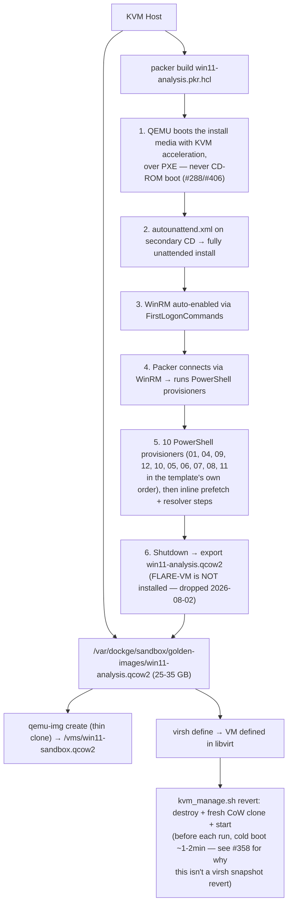

# Automating Golden Image Creation with Packer and QEMU
## Implementation Guide for KVM Host (APIARY)

> **Host**: KVM + QEMU + libvirt + docker-compose (no VMware, no Hyper-V)  
> **Goal**: Fully automated, reproducible Windows 11 golden image as a `qcow2` file  
> **Reference**: [proactivelabs/packer-windows](https://github.com/proactivelabs/packer-windows), [actuated.com Packer+QEMU guide](https://actuated.com/blog/automate-packer-qemu-image-builds)

> **Status (2026-09-27):** the templates in `sandbox/windows/packer/` are
> written, `packer validate` passes, **and `win11-analysis.qcow2` has been
> built on this host and rebuilt several times since** — #1128 fixed a
> rebuild breaker and verified the fix against a real rebuild ("the VM now
> boots and reaches the WinRM-wait stage"), and #957's screen-resolution fix
> was confirmed live in a running guest. The steps below are therefore
> procedure-of-record rather than a to-do list, though each issue's own
> open/closed state is a question for the tracker, not this tree. Treat
> every duration and size as an estimate still: none has been re-measured
> against a current build, and FLARE-VM — which used to dominate the
> timeline — is no longer installed at all (see Step 4). The chain is
> tracked under [#47](https://github.com/Xore/APIARY/issues/47):
> [#49](https://github.com/Xore/APIARY/issues/49) (obtain the ISO),
> [#51](https://github.com/Xore/APIARY/issues/51) (run the build),
> [#52](https://github.com/Xore/APIARY/issues/52) (define the domain).
> Lifecycle gaps are
> [#86](https://github.com/Xore/APIARY/issues/86).

---

## Why Packer + QEMU?

Manually building a Windows analysis VM is a multi-hour, error-prone process:
you click through installers, run scripts, reboot several times, and end up
with a VM you can never exactly reproduce. If it gets corrupted or drift
occurs over months, you start over from scratch.

**Packer** solves this by codifying the entire build as version-controlled HCL.
Every golden image build is:
- Identical (same tools, same config, same registry state)
- Auditable (git history shows every change)
- Automatable (CI can rebuild on schedule or when tooling changes)
- Shareable (qcow2 can be moved to any KVM host)

On a KVM host, Packer uses the **QEMU builder** with `accelerator = "kvm"`,
which gives near-native performance via hardware virtualisation.

---

## Architecture: How Packer Builds the Image



---

## Step 0: Host Prerequisites

### 0.1 Verify KVM is available

```bash
# Check hardware virtualisation support
egrep -c '(vmx|svm)' /proc/cpuinfo
# Must return > 0. If 0: enable VT-x/AMD-V in BIOS.

# Check KVM module loaded
lsmod | grep kvm
# Expected: kvm_intel (or kvm_amd) + kvm

# Quick sanity check
kvm-ok
# Should print: INFO: /dev/kvm exists  KVM acceleration can be used
```

### 0.2 Install required packages

```bash
sudo apt update
sudo apt install -y \
    qemu-kvm \
    qemu-utils \
    libvirt-daemon-system \
    libvirt-clients \
    virtinst \
    bridge-utils \
    genisoimage \
    ovmf \
    python3-libvirt

# Add your user to kvm + libvirt groups (requires logout/login)
sudo usermod -aG kvm,libvirt $USER

# Verify
virsh --version   # should print e.g. 8.0.0
qemu-img --version
```

### 0.3 Install Packer

```bash
# HashiCorp apt repo
curl -fsSL https://apt.releases.hashicorp.com/gpg \
  | gpg --dearmor -o /usr/share/keyrings/hashicorp.gpg

echo "deb [signed-by=/usr/share/keyrings/hashicorp.gpg] \
https://apt.releases.hashicorp.com $(lsb_release -cs) main" \
  | sudo tee /etc/apt/sources.list.d/hashicorp.list

sudo apt update && sudo apt install -y packer

# Verify
packer version   # should print 1.10.x or later

# Install QEMU plugin
packer plugins install github.com/hashicorp/qemu
```

### 0.4 Install OVMF (UEFI firmware for Windows 11)

Windows 11 requires UEFI + TPM. The build gives it both for real: OVMF
UEFI firmware (the **non-Secure-Boot** pair — Secure Boot is deliberately
OFF for now, see Step 2) and a software TPM from `swtpm`. The `LabConfig`
registry keys in `autounattend.xml` are a fallback, not the mechanism — see
Step 3.

```bash
sudo apt install -y ovmf swtpm swtpm-tools

# Verify firmware files exist
ls /usr/share/OVMF/
# Should include: OVMF_CODE_4M.fd, OVMF_VARS_4M.fd
# (the .secboot.fd/.ms.fd pair is NOT what this template loads — see Step 2)
# If not found, try: /usr/share/qemu/OVMF.fd (path varies by distro)
```

### 0.5 Prepare image directories

Everything lives under `/var/dockge/sandbox` — deliberately on the 1.5 TB `/var`
spindle rather than the 233 GB root NVMe. The ISO is 6.5 GB and the golden image
adds 25-35 GB on top; filling the OS disk to build a sandbox image is not a
trade worth making.

```bash
sudo mkdir -p /var/dockge/sandbox/{golden-images,vms,isos}
sudo chown -R $USER:$USER /var/dockge/sandbox
```

The paths are defaults in three places that cannot read each other:
`iso_path` / `output_dir` in `win11-analysis.pkr.hcl`, `SANDBOX_ROOT` in
`setup/kvm_manage.sh` (overridable by environment), and the `<source file>`
element in `packer/win11-kvm.xml` (hardcoded). Change one and you must change
all three. The shorthand `/golden-images`, `/vms` and `/isos` used in the
commands below is for readability — substitute the real prefix.

---

## Step 1: Get the Windows 11 ISO

### Option A: Windows 11 Enterprise Evaluation (recommended, free 90 days)

```
https://www.microsoft.com/en-us/evalcenter/evaluate-windows-11-enterprise
```

Download the **ISO** (not the VHD). Place at:
```bash
mv ~/Downloads/WIN11_ENT_EVAL*.ISO /isos/Win11_Eval_x64.iso
```

### Option B: Windows 11 Consumer ISO via Media Creation Tool

Run on a Windows machine, create ISO. No product key needed for 30-day trial.

### Get the ISO checksum

```bash
sha256sum /isos/Win11_Eval_x64.iso
# Copy output hash — put it in win11-analysis.pkr.hcl as iso_checksum
```

---

## Step 2: Understand the Packer Build File

File: [`sandbox/windows/packer/win11-analysis.pkr.hcl`](../../../sandbox/windows/packer/win11-analysis.pkr.hcl)

### Key sections explained

#### QEMU source block

```hcl
source "qemu" "win11" {
  accelerator      = "kvm"          # Hardware acceleration via KVM
  machine_type     = "q35"          # Modern PCIe chipset (required for UEFI)
  efi_boot         = true           # UEFI required for Windows 11
  efi_firmware_code = "/usr/share/OVMF/OVMF_CODE_4M.fd"
  efi_firmware_vars = "/usr/share/OVMF/OVMF_VARS_4M.fd"
  vtpm             = true           # starts swtpm; without it setup refuses
  tpm_device_type  = "tpm-tis"      # model only — not a substitute for vtpm
  cpu_model        = "host"         # Pass-through real CPU — anti-sandbox-detection
  disk_interface   = "ide"          # ICH9 AHCI on q35 — see below
  net_device       = "e1000e"       # Intel NIC model — looks like real hardware
  cd_files         = ["autounattend.xml"]  # secondary CD, not a floppy
  cd_label         = "cidata"
  communicator     = "winrm"        # Packer connects via WinRM after install
  winrm_timeout    = "45m"          # wait for WinRM to *first* answer
  headless         = true           # No GUI window on KVM host
}
```

The file itself carries the full reasoning for each of these in comments; what
follows is the short version of the four that are counter-intuitive.

#### Why `disk_interface = "ide"` and not `virtio`?

Windows 11 setup has no virtio-blk driver, so a virtio disk is invisible to the
installer and the unattended install stops at "no drives found". A virtio
controller is also one of the loudest "you are in a VM" signals a sample can
read. The value is `"ide"` rather than `"sata"` because QEMU's `-drive if=`
knows no sata bus and refuses to start; on q35 the `ide` bus *is* the ICH9 AHCI
controller, so the guest sees a SATA disk regardless of the option's name.

#### Why `cd_files` and not `floppy_files`?

The q35 machine type has no floppy controller. `floppy_files` is silently
accepted and produces an installer that sits on the language prompt forever.

#### Why both `vtpm` and `tpm_device_type`?

`vtpm = true` is the switch that makes the plugin start `swtpm` and pass
`-tpmdev`/`-device` to QEMU. `tpm_device_type` only chooses the model. Setting
the model alone passes `packer validate` and produces a QEMU command line with
no TPM at all. `/usr/bin/swtpm` must exist on the build host.

#### What `winrm_timeout` actually bounds

It is the wait for WinRM to answer for the first time — not the provisioning
budget, which is each provisioner's own `timeout` (the longest in the template
today is `04-tools.ps1`'s `"60m"`). It was `6h` back when FLARE-VM ran
*after* this connects and was thought to take 2-4 hours; the only thing that
bought was that a guest which never brings WinRM up burns a whole working day
before saying so. FLARE-VM is gone, so the case for a long value went with it.
Install plus OOBE is well under 45 minutes here.

#### Why `machine_type = "q35"`?

Q35 is a modern Intel PCIe chipset emulation. It supports:
- PCIe bus (required for NVME/virtio-blk)
- AHCI (SATA, more realistic than IDE)
- IOMMU
- UEFI SecureBoot

Windows 11 checks for a modern chipset. Q35 passes this check; the old
`pc` (i440fx) does not.

#### Why `cpu_model = "host"`?

With `cpu_model = "host"` (pass-through), the guest Windows VM sees the
exact CPU model of the physical host (e.g. Intel Core i9-13900K). Without
this, QEMU presents a generic `qemu64` CPU — easily detected by malware
that checks CPUID. This is critical for anti-sandbox-detection.

#### Why `net_device = "e1000e"`?

`e1000e` emulates an Intel 82574L Gigabit NIC — one of the most common
NICs in real desktop hardware. The alternative (`virtio-net`) has QEMU
strings in its driver and is easily detected by sandbox-aware malware.

---

## Step 3: Understand the autounattend.xml

File: [`sandbox/windows/packer/autounattend.xml`](../../../sandbox/windows/packer/autounattend.xml)

This XML file is the Windows unattended installation answer file. Packer
passes it on a secondary CD labelled `cidata`; Windows Setup scans removable
media for it automatically on boot.

### Key elements

#### TPM/SecureBoot bypass (critical for KVM)

```xml
<RunSynchronousCommand>
  <Path>reg add HKLM\SYSTEM\Setup\LabConfig /v BypassTPMCheck /t REG_DWORD /d 1 /f</Path>
</RunSynchronousCommand>
<RunSynchronousCommand>
  <Path>reg add HKLM\SYSTEM\Setup\LabConfig /v BypassSecureBootCheck /t REG_DWORD /d 1 /f</Path>
</RunSynchronousCommand>
<RunSynchronousCommand>
  <Path>reg add HKLM\SYSTEM\Setup\LabConfig /v BypassRAMCheck /t REG_DWORD /d 1 /f</Path>
</RunSynchronousCommand>
```

Windows 11 requires TPM 2.0, SecureBoot and a RAM floor. The build satisfies
TPM for real — `vtpm = true` starts `swtpm` — and satisfies UEFI for real via
OVMF, but with **Secure Boot off** (`efi_firmware_code`/`_vars` are the plain
`OVMF_CODE_4M.fd`/`OVMF_VARS_4M.fd` pair, deliberately, per #288/#419) — so
these `LabConfig` keys are not purely redundant. They are cheap to keep: they
cost nothing when the hardware is present and they turn a hang at "This PC
can't run Windows 11" into a completed install on a host that is missing
either. The build VM is sized at 16 GB (`memory` default `16384`), so
`BypassRAMCheck` is inert at the default value and only matters if someone
shrinks it.

#### UEFI partition layout

```xml
<CreatePartition>
  <Type>EFI</Type><Size>260</Size>    <!-- EFI System Partition -->
</CreatePartition>
<CreatePartition>
  <Type>MSR</Type><Size>16</Size>     <!-- Microsoft Reserved -->
</CreatePartition>
<CreatePartition>
  <Type>Primary</Type><Extend>true</Extend>  <!-- Windows -->
</CreatePartition>
```

This creates the standard Windows 11 GPT partition layout. BIOS/MBR will
not work with Windows 11.

#### WinRM enablement (how Packer connects)

There are **nine** `FirstLogonCommands`, not the four this section used to
show, and WinRM is not order 1. The WinRM-specific ones are 3–8; 1, 2 and 9
are Defender/BitLocker work that has to land either side of them. Re-checked
against `autounattend.xml` on 2026-09-27:

| Order | What |
|---|---|
| 1 | `PreventDeviceEncryption` under BitLocker (install-time; the answer file is discarded afterwards) |
| 2 | Defender **exclusions** — the paths Packer uploads into, `ps1`/`exe`/`dll`, `powershell.exe`, MAPS off. First on purpose: the instant WinRM answers, Packer starts streaming `01-hardening.ps1` up, and Defender inspecting that stream rejects the upload mid-transfer |
| 3 | Force the connection profile to Private, then `Enable-PSRemoting -Force -SkipNetworkProfileCheck` |
| 4 | `winrm set winrm/config/service @{AllowUnencrypted="true"}` |
| 5 | `winrm set winrm/config/service/auth @{Basic="true"}` |
| 6 | `netsh advfirewall firewall add rule` for tcp/5985 |
| 7 | Add `analyst` to "Remote Management Users" |
| 8 | `Set-Service WinRM -StartupType Automatic; Start-Service WinRM`, then write `C:\winrm-ready.txt` |
| 9 | Turn Defender's real-time/script/behavior monitoring off for real, and record the result in `C:\defender-off.txt` |

Order 9 is not redundant with Phase 2 of `01-hardening.ps1`, and the reason
is worth keeping in mind: Tamper Protection is on by default in Windows 11
and guards its own registry key against SYSTEM as well as Administrators.
Measured on a booted build, every policy key written during specialize was
absent or reverted and a direct write returned "Requested registry access is
not allowed". specialize is simply too early — Defender is already
protecting itself by then. This is also why order 2 grants *exclusions*
rather than trying to switch Defender off up front.

The two commands worth reading in full:

```xml
<SynchronousCommand><Order>3</Order>
  <CommandLine>powershell -NoProfile -ExecutionPolicy Bypass -Command "Get-NetConnectionProfile | Set-NetConnectionProfile -NetworkCategory Private -ErrorAction SilentlyContinue; Enable-PSRemoting -Force -SkipNetworkProfileCheck"</CommandLine>
</SynchronousCommand>
<SynchronousCommand><Order>8</Order>
  <CommandLine>powershell -NoProfile -Command "Set-Service WinRM -StartupType Automatic; Start-Service WinRM; Set-Content -Path C:\winrm-ready.txt -Value (Get-Date -Format o)"</CommandLine>
</SynchronousCommand>
```

Packer connects to the Windows VM via WinRM (Windows Remote Management)
over port 5985. `FirstLogonCommands` enable WinRM before the first
login completes, so Packer can start running provisioners immediately.

#### Why not `winrm quickconfig -q`?

That was the original order 1 (it is order 3 now) and it cost a six-hour
build. `winrm quickconfig`
refuses to create its firewall exception while any connection profile is Public
— which is exactly what a fresh guest on QEMU user-mode networking has — and
exits non-zero. The remaining commands then went on to configure a service that
had never been enabled, so the guest looked healthy from inside and never
answered from outside. Forcing the profile to Private first and using
`Enable-PSRemoting -Force -SkipNetworkProfileCheck` is what actually brings it
up.

`C:\winrm-ready.txt` exists to separate two failure modes that otherwise look
identical from the host: OOBE never reached first logon, versus first logon ran
and WinRM still did not come up. Mount the qcow2 (or take a screenshot with
`headless=false`) and check for the file.

---

## Step 4: The Provisioner Script

File: [`sandbox/windows/packer/scripts/`](../../../sandbox/windows/packer/scripts/) — ten provisioners, `01-hardening.ps1` through `12-display-resolution.ps1`

These run inside the Windows VM via WinRM during the Packer build. The old
`02-flarevm-start` / `03-flarevm-wait` pair is **gone**: FLARE-VM is no longer
installed at all (2026-08-02), and with it the reason the build was split
across more scripts than it needs. Nothing `run_sample.py` depends on
(Procmon, Regshot, FakeNet, Sysmon) ever came from FLARE-VM. The numbers in
`sandbox/windows/packer/scripts/` therefore have gaps, and the template's
provisioner order is not numeric — it runs `01`, `04`, `09`, `12`, `10`, `05`,
`06`, `07`, `08`, `11`, in that order, because the order is a dependency
order, not a reading order.

`[Phase n]` output is the other split: phases 1–7 are in `01-hardening.ps1`,
phases 8–12 (plus the lettered 11b/11c) are in `04-tools.ps1`. Combined, that
is the 14 numbered phases this step used to describe as one script's:

| Phase | Script | Action | Notes |
|-------|--------|--------|-------|
| 1 | 01 | Network configuration | Deliberately a no-op — DHCP only. The old static `10.10.10.2` assignment killed the build (it removed the very network Packer talks over) |
| 2 | 01 | Disable Defender | Real-time, cloud, MAPS, sample submission |
| 3 | 01 | Disable Windows Update | Service + GPO |
| 4 | 01 | Disable telemetry | `DiagTrack`, `dmwappushservice`, registry |
| 5 | 01 | Disable UAC | Required for unattended tool installs |
| 6 | 01 | Disable Firewall | FakeNet-NG handles all traffic; SmartScreen is disabled in this phase too |
| 7 | 01 | Install Chocolatey | Package manager for the tooling step. **Not** for FLARE-VM — that is gone |
| 8 | 04 | Install common runtime dependencies | Was "Install FLARE-VM (100+ tools, 2-4 h)"; now just runtimes |
| 9 | 04 | Install Sysmon | From Chocolatey; config downloaded at build time and pinned to both a commit SHA and its sha256 (#86), verified before use |
| 10 | 04 | PowerShell logging | ScriptBlock (4104), Module (4103), Transcription; also process auditing (4688) |
| 11 | 04 | Install FakeNet-NG | Network interception on guest |
| 11b | 04 | Install Regshot | Registry before/after capture |
| 11c | 04 | Generate persona HTTPS CA | The cert FakeNet's in-guest HTTPS interception presents |
| 12 | 04 | Install QEMU Guest Agent | Enables host-side file copy via guest agent |

Two phases the old single-script table listed no longer exist as phases.
"Decoy environment" is now its own provisioner (`05-decoy-content.ps1`, plus
`06-chrome-history.ps1`), and "Set DNS to INetSim" is an inline step in
`win11-analysis.pkr.hcl` rather than a trailing phase in `04-tools.ps1` —
moved in #432, because that script stopped being the last provisioner once
`06-chrome-history.ps1` landed and needed real internet for its own Chrome
download. The inline placement makes it last by construction, whatever gets
added to the chain later.

### Important: Internet Access During Build

During the Packer build, the QEMU VM needs **real internet access** to
download Chocolatey, Sysmon, the Sysmon config, FakeNet-NG, etc. This is
handled by:

1. Both NICs are user-mode networking (SLIRP), which provides NAT internet
   access through the host. There are two because of the PXE work in Step 10
   (#288/#406), and they need separate subnets — QEMU gives two `-netdev
   user` instances the same 10.0.2.0/24 by default and they silently
   collide. `win11-analysis.pkr.hcl` pins them: `pxenet0` on
   `10.0.2.0/24` (PXE only, tftp/bootfile) and `user.0` on `10.0.3.0/24`
   (the WinRM communicator, with the hostfwd to 5985). They are declared
   under `qemuargs`, which *replaces* Packer's own generated args rather
   than appending, so `user.0` has to be re-stated explicitly — leave it
   out and the communicator's NIC disappears from the qemu command line.
2. DNS is left alone. Phase 1 configures nothing: the guest stays on DHCP, and
   QEMU's NAT provides the right answers during the build. An earlier version
   pinned `8.8.8.8` and then a static `10.10.10.2`; both are gone.
3. At the very last step, DNS is set to `10.10.10.1` (INetSim) for analysis —
   now an inline step in `win11-analysis.pkr.hcl`, not a `04-tools.ps1` phase.

The final golden image has no internet access once deployed onto the
isolated `virbr-sandbox` network.

---

## Step 5: Run the Packer Build

Do not `sed` the HCL. `iso_path` and `iso_checksum` are declared variables with
defaults; pass them on the command line so the file stays clean and the build is
reproducible from the shell history.

```bash
cd sandbox/windows/packer

# 1. Compute the ISO checksum
ISO=/var/dockge/sandbox/isos/Win11_Eval_x64.iso
SHA=$(sha256sum "$ISO" | cut -d' ' -f1)

# 2. (variables are passed to `packer build` in step 5)

# 3. Initialise Packer plugins
packer init win11-analysis.pkr.hcl

# 4. Validate the template
packer validate win11-analysis.pkr.hcl

# 5. Build (was 3-5 hours with FLARE-VM; materially less now, and
#    unmeasured since FLARE-VM left — see the timeline table below)
# /dev/kvm must be accessible
sudo chmod o+rw /dev/kvm   # or add user to kvm group and re-login

packer build \
  -var "iso_path=$ISO" \
  -var "iso_checksum=sha256:${SHA}" \
  win11-analysis.pkr.hcl

# Output:
#   /var/dockge/sandbox/golden-images/win11-analysis.qcow2   (25-35 GB)
```

Leaving `iso_checksum` at its `"none"` default skips verification entirely. That
is acceptable only for a hand-placed ISO whose provenance you already trust: a
tampered installer would be baked into every subsequent detonation guest.

### Build with debug output (for troubleshooting)

```bash
# See all WinRM output and Packer steps
PACKER_LOG=1 packer build win11-analysis.pkr.hcl 2>&1 | tee /tmp/packer_build.log

# Run with GUI window visible (disable headless for debugging)
packer build -var='headless=false' win11-analysis.pkr.hcl
# Note: requires a display or X11 forwarding on the KVM host
```

### Expected build timeline

Every row below except the first two was sized against a build that installed
FLARE-VM. It no longer does, so the FLARE-VM row is gone and **the total is
now substantially shorter** — but the remaining rows have not been
re-measured since, so treat them as order-of-magnitude only.

| Stage | Duration |
|-------|----------|
| Windows 11 installation | ~30-45 min |
| First boot + WinRM ready | ~10 min |
| Chocolatey install | ~5 min |
| Sysmon + logging config | ~5 min |
| FakeNet-NG + Regshot + guest agent + cleanup | ~5 min |
| **Total** | **was ~3-5 h with FLARE-VM; materially less without it — unmeasured** |

---

## Step 6: Create the VM from the Golden Image

```bash
# Thin-clone from golden image using Copy-on-Write
# The clone disk starts at ~0 bytes extra, grows only as changes are written
qemu-img create -f qcow2 -F qcow2 \
    -b /golden-images/win11-analysis.qcow2 \
    /vms/win11-sandbox.qcow2

# Verify
qemu-img info /vms/win11-sandbox.qcow2
# Should show: backing file: /golden-images/win11-analysis.qcow2
```

### Define the VM in libvirt

Use the helper script:
```bash
chmod +x sandbox/windows/setup/kvm_manage.sh
sandbox/windows/setup/kvm_manage.sh create
```

The helper is the supported path: it reads `packer/win11-kvm.xml`, which carries
the anti-detection settings in Step 9. `virt-install` produces a domain without
them, so use it only for a throwaway boot test:
```bash
virt-install \
  --name win11-sandbox \
  --memory 16384 \
  --vcpus 8 \
  --cpu host \
  --disk path=/var/dockge/sandbox/vms/win11-sandbox.qcow2,bus=sata,cache=none \
  --network network=sandbox,model=e1000e \
  --os-variant win11 \
  --boot uefi \
  --graphics none \
  --import \
  --noautoconsole
```

Memory and vCPU there match `packer/win11-kvm.xml`'s `<memory unit='MiB'>16384`
with `<currentMemory unit='MiB'>8192</currentMemory>`, and `<vcpu>8</vcpu>`.
Note that the XML comment above those values still claims the HCL uses
`8192`/`4`; the HCL's own defaults are `memory = "16384"` and `cpus = "12"`,
and this domain is deliberately its own thing.

### Verify the domain boots

```bash
# Start VM once to verify it boots
virsh start win11-sandbox
# Wait ~60s for boot

# Verify WinRM is responsive
python3 -c "
import winrm, os
s = winrm.Session('10.10.10.2', auth=('analyst', 'malware123!'), transport='ntlm')
print(s.run_ps('Write-Output ready').std_out)
"
```

There is no `virsh snapshot-create-as GOLDEN_READY` step. It looks like it
should work here — the guest is running, WinRM is up — but this domain's
`<cpu mode='host-passthrough' migratable='off'/>` (deliberate, for anti-VM-
detection CPU fidelity) blocks memory-state snapshots outright, and
disk-only snapshots hit a separate, reproducible QEMU/libvirt bug on the
resulting multi-layer backing chain (see #358 for the full investigation —
a freshly spawned qemu process fails to open the golden image even though
file permissions are provably fine). The golden image is already never
written to, so there's nothing to snapshot: every reset just throws away
the per-run CoW clone and makes a fresh one.

---

## Step 7: Reset Workflow for Analysis Runs

### Before every detonation run

```bash
# Reset to a fresh clone of the golden image (cold boot, ~1-2 min)
sandbox/windows/setup/kvm_manage.sh revert

# Wait for WinRM, then run your sample
python3 sandbox/windows/orchestrate/run_sample.py --sample samples/PE/evil.exe
```

`run_sample.py` calls the equivalent of this itself before and after every
detonation (`revert_to_golden()`) — the above is for manual/ad-hoc runs.

### After every run (handled automatically by run_sample.py)

Same reset, always run in the `finally` block regardless of success/failure
— the guest has run untrusted code and must never survive into the next
sample.

---

## Step 8: Rebuilding and Updating the Golden Image

### Full rebuild (e.g. a Windows Eval refresh, quarterly refresh)

```bash
# Remove old VM first
virsh destroy win11-sandbox 2>/dev/null || true
virsh undefine win11-sandbox --nvram
rm /vms/win11-sandbox.qcow2

# Rebuild golden image from scratch
packer build -force sandbox/windows/packer/win11-analysis.pkr.hcl

# Recreate VM
sandbox/windows/setup/kvm_manage.sh create
sandbox/windows/setup/kvm_manage.sh start
```

### Quick config patch (no full rebuild needed)

Use `virt-customize` from `libguestfs-tools` to patch the qcow2 offline:

```bash
sudo apt install libguestfs-tools

# Update FakeNet config. sandbox/windows/config/fakenet.ini is a real tracked
# file and this is the offline patch that applies it.
virt-customize -a /golden-images/win11-analysis.qcow2 \
    --upload sandbox/windows/config/fakenet.ini:/Tools/FakeNet/configs/honeypot_fakenet.ini

# There is deliberately NO equivalent for the Sysmon config, and this used to
# suggest one. sandbox/windows/config/sysmon_config.xml does not exist and
# never did: the build downloads the config at Phase 9 from
# raw.githubusercontent.com, pinned to a commit SHA and verified against a
# recorded sha256 (04-tools.ps1's $sysmonConfigCommit / $sysmonConfigSha256,
# #86). Two consequences. (a) To change it you re-pin both values in
# 04-tools.ps1 and rebuild — a full rebuild is the supported path, and
# re-pinning "just the hash" is called out in that file as the wrong move.
# (b) A rebuild does NOT pick up a newer Sysmon config on its own, because
# the pin is what makes the image reproducible.

# After patching qcow2, recreate the thin-clone
rm /vms/win11-sandbox.qcow2
sandbox/windows/setup/kvm_manage.sh create
sandbox/windows/setup/kvm_manage.sh start
```

---

## Step 9: KVM-Specific Anti-Detection Settings

Applied in the VM XML (`packer/win11-kvm.xml`). These make the guest look
like real hardware, not a QEMU VM:

```xml
<!-- Hide KVM from guest CPUID — most important -->
<features>
  <kvm><hidden state='on'/></kvm>
  <vmport state='off'/>   <!-- disable VMware I/O port check (some malware checks both) -->
</features>

<!-- CPU: host pass-through, guest sees real CPU model -->
<cpu mode='host-passthrough'>
  <feature policy='disable' name='hypervisor'/>  <!-- hide hypervisor CPUID bit -->
</cpu>

<!-- Disk: AHCI with custom serial number resembling a real HDD. Not
     virtio-blk, for the reason Step 2 gives. -->
<disk type='file' device='disk'>
  <driver name='qemu' type='qcow2' cache='none' io='native' discard='unmap'/>
  <serial>WD-WX31A74K3593</serial>
</disk>

<!-- NIC: Intel e1000e with real Intel OUI MAC prefix -->
<interface type='network'>
  <mac address='00:1a:a0:3c:4d:5e'/>
  <model type='e1000e'/>
</interface>
```

### Why each setting matters

| Setting | What malware checks | Without it |
|---------|---------------------|------------|
| `kvm hidden` | CPUID leaf 0x40000000 for KVM signature | Malware detects KVM via CPUID |
| `vmport off` | VMware backdoor I/O port 0x5658 | Some malware checks both VMware AND KVM |
| `host-passthrough` | CPUID vendor, model, features | QEMU presents `TCGTCGTCGTCG` / `qemu64` |
| `hypervisor` disabled | CPUID bit 31 in ECX (hypervisor present flag) | Windows sets this; malware reads it |
| Custom disk serial | WMI `Win32_DiskDrive.SerialNumber` | Default is `QEMU HARDDISK QM00001` |
| Intel MAC OUI | NIC vendor via `GetAdaptersInfo` | `52:54:00` is QEMU's default OUI, widely flagged |

---

## Step 10: Troubleshooting

### Packer fails to connect via WinRM

```bash
# Check if VM booted and WinRM is listening
virsh domstate win11-sandbox   # should be "running" during build

# WinRM port 5985 should be reachable from host
# During Packer build, QEMU uses port forwarding:
# host:5985 -> guest:5985 (Packer handles this automatically)

# If WinRM times out: autounattend.xml FirstLogonCommands may have failed
# Run build with headless=false to see the VM screen:
packer build -var='headless=false' win11-analysis.pkr.hcl
```

Do **not** raise `winrm_timeout` in response to this. It bounds the wait for
WinRM to answer once, not the provisioning budget, so a longer value cannot
rescue a guest that is never going to answer — it only delays the report. 45
minutes is already generous for install plus OOBE on this host. Diagnose
instead: check for `C:\winrm-ready.txt` in the guest. Present means first
logon ran and the failure is networking or the firewall rule; absent means the
guest never reached first logon, and the cause is upstream — media, the PXE
boot path, or the installer stopping on a hardware check.

### Build ends at "No bootable option or device was found"

**This used to be a CD-ROM keypress race, and that section is now obsolete.**
The build boots over **PXE**, never from the ISO as a bootable CD-ROM
(#288/#406) — the ISO is still attached because Windows Setup needs its
install files from somewhere, but the firmware never boots it, so there is no
"Press any key to boot from CD or DVD" prompt to lose the race against. The
template has no `boot_wait` or `boot_command` at all.

What the same symptom means now is a PXE problem: OVMF fell through its NVRAM
boot order because PXE had nothing to serve, and there is no error anywhere in
the packer log to say so. `pxe/prepare-pxe.sh` is the first thing to check —
#1128 records this exact silent fall-through happening on a fresh checkout or a
fresh host because that one step was never run, and fixed `build-with-retry.sh`
to run it (plus the reset-unplug watcher) automatically rather than relying on
an operator having done it.

### Windows 11 installer says "This PC doesn't meet requirements"

```bash
# This means the LabConfig TPM/SecureBoot bypass didn't apply
# Check autounattend.xml RunSynchronous commands are correct
# Also ensure UEFI boot is enabled (efi_boot = true in HCL)
```

### A provisioner hangs or fails

FLARE-VM used to have its own troubleshooting entry here and no longer needs
one — it is not installed, so there is no 4-hour Boxstarter run to wait out.
The equivalent knob now is the provisioner's own `timeout` in the build block
(longest today: `04-tools.ps1`'s `"60m"`), not `winrm_timeout`, which has
already been satisfied by the time any provisioner starts.

```bash
# Check Chocolatey log inside VM: C:\ProgramData\chocolatey\logs\chocolatey.log
# Connect with WinRM while build is running:
python3 -c "
import winrm
s = winrm.Session('localhost', auth=('analyst','malware123!'), transport='ntlm')
print(s.run_ps('Get-Process | Select-Object Name | Sort-Object Name').std_out)
"
```

A provisioner that *succeeds* can still fail the build, and this bites
repeatedly enough that both `04-tools.ps1` and `win11-analysis.pkr.hcl` carry
a long comment about it: Packer reads the provisioner's `exit $LastExitCode`,
and on PowerShell `$LASTEXITCODE` is only ever set by a *native* command. A
`choco install` that fails leaves a non-zero value behind that survives to the
end of the script and is read as the script's overall result — a phantom
failure that deleted a multi-hour build over tooling nothing downstream
depends on. `04-tools.ps1`'s `Invoke-OptionalChoco` wrapper is the fix: it
consumes and clears `$LASTEXITCODE` so a failed optional package is visible in
the log but can never again poison the script's exit status.

### `/dev/kvm` permission denied

```bash
sudo chmod o+rw /dev/kvm
# OR add user to kvm group (requires re-login):
sudo usermod -aG kvm $USER
newgrp kvm
```

### qemu-img: backing file not found after move

```bash
# If you move the golden image, update the backing file reference:
qemu-img rebase -b /new/path/win11-analysis.qcow2 /vms/win11-sandbox.qcow2
```

---

## Step 11: Storage Layout

```
/var/dockge/sandbox/isos/
  Win11_Eval_x64.iso           # source ISO, 6.5 GB (can delete after build)

/var/dockge/sandbox/golden-images/
  win11-analysis.qcow2         # Packer output, 25-35 GB, read-only source-of-truth
  win11-analysis.qcow2.sha256  # written by build-with-retry.sh after a successful
                               #   build (#86); kvm_manage.sh verifies it before
                               #   every clone and refuses on mismatch
  win11-analysis.qcow2.sha256.verified
                               #   sentinel caching mtime+size, so revert does not
                               #   re-hash a 25-35 GB file on every detonation

/var/dockge/sandbox/vms/
  win11-sandbox.qcow2          # thin-clone (CoW), starts ~200 KB, grows per run
                               # rebased from golden-images/win11-analysis.qcow2
```

The qcow2 is sparse: `disk_size = 90000` gives the guest a 90 GB disk because
malware checks disk size, but the file on the host only grows to what is
actually written.

### Storage efficiency

- The golden image is 25-35 GB (full install + the tooling `04-tools.ps1`
  installs; FLARE-VM no longer contributes to this)
- The thin-clone starts at ~200 KB and grows only with per-session changes
- Each `kvm_manage.sh revert` deletes the clone and recreates it fresh from the golden image
- Multiple thin-clones can share one golden image for parallel runs

---

## Step 12: Keeping the Golden Image Fresh

| Schedule | Action |
|----------|--------|
| **Monthly** | `packer build -force` full rebuild. It does **not** pick up a newer Sysmon config: the config is pinned to a commit SHA + sha256 in `04-tools.ps1` (#86), which is what makes the image reproducible. Re-pin both deliberately if you want a new one |
| **On Sysmon config update** | Re-pin `$sysmonConfigCommit` **and** `$sysmonConfigSha256` in `04-tools.ps1`, then full rebuild. There is no in-repo `sysmon_config.xml` to `virt-customize` in — the config is fetched at build time |
| **On FakeNet config update** | `virt-customize` patch against `sandbox/windows/config/fakenet.ini` (no rebuild needed) |
| **On Windows Eval expiry (90d)** | Download new ISO, full rebuild |
| **On FLARE-VM major release** | Nothing — FLARE-VM is not installed |

This cadence is currently manual. Automating the *rebuild* is
**[#86](https://github.com/Xore/APIARY/issues/86)**, which is not the
one-line cron entry it looks like: a multi-hour build cannot share
`/dev/kvm` with a detonation run, `-force` would destroy the working image
before the replacement is known good, and a rebuild against an expired
evaluation ISO produces an already-expired guest.

The *staleness* half of #86 has landed, which is the alternative the issue
itself proposes: `sandbox/windows/golden-image-status.sh`, driven by
`honeypot-windows-golden-image-status.{service,timer}`, stats the image and
writes `golden-image-status.json` into `WINDOWS_SANDBOX_RESULTS_DIR` (already
mounted read-only into the dashboard container, so no new mount or env var
is needed). It flags `MONTHLY_DAYS=30` and `ISO_EVAL_DAYS=90` — the two
cadence rows above — and the dashboard surfaces it through
`GET /api/v1/sandbox/golden-image-status`. It only ever stats files: it never
touches the VM or the image, and a missing golden image is a normal reported
state rather than an error.

---

## Summary: Full First-Time Setup Sequence

```bash
# 1. Install host dependencies
sudo apt install -y qemu-kvm qemu-utils libvirt-daemon-system \
    libvirt-clients ovmf swtpm swtpm-tools packer genisoimage libguestfs-tools
packer plugins install github.com/hashicorp/qemu
which swtpm   # must exist, or vtpm = true starts no TPM and setup refuses

# 2. Set up isolated libvirt network
virsh net-define sandbox/windows/setup/sandbox-network.xml
virsh net-autostart sandbox && virsh net-start sandbox

# 3. Place Windows 11 ISO
ISO=/var/dockge/sandbox/isos/Win11_Eval_x64.iso
cp Win11_Eval_x64.iso "$ISO"

# 4. Compute the checksum
SHA=$(sha256sum "$ISO" | cut -d' ' -f1)

# 5. Build golden image (was 3-5 hours with FLARE-VM; materially less now)
sudo chmod o+rw /dev/kvm
packer build -var "iso_path=$ISO" -var "iso_checksum=sha256:${SHA}" \
    sandbox/windows/packer/win11-analysis.pkr.hcl

# 6. Create VM from golden image
sandbox/windows/setup/kvm_manage.sh create

# 7. Verify it boots
sandbox/windows/setup/kvm_manage.sh start
sleep 90   # wait for boot

# 8. Test reset (destroy + fresh CoW clone + start)
sandbox/windows/setup/kvm_manage.sh revert

# Golden image pipeline is then operational.
# Each detonation run starts with: kvm_manage.sh revert
# (the clone is recreated in seconds; the cold boot it triggers is the ~1-2 min
#  quoted in Step 7 — the revert command itself is not the slow part)
```
